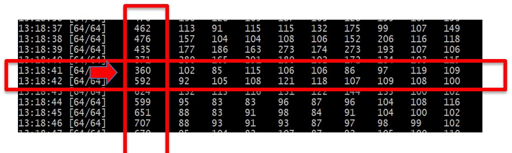
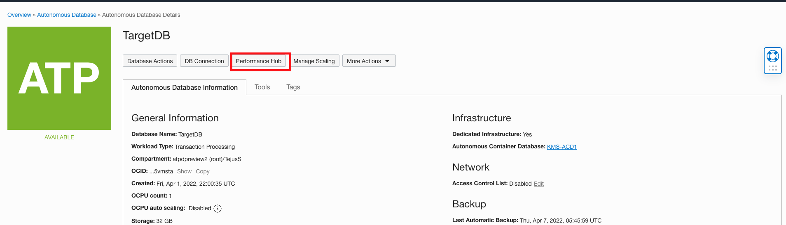
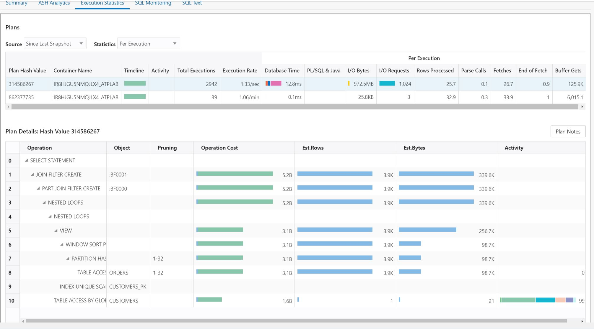
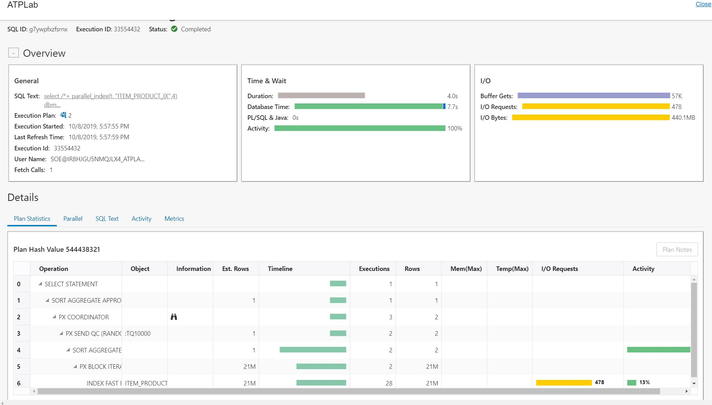
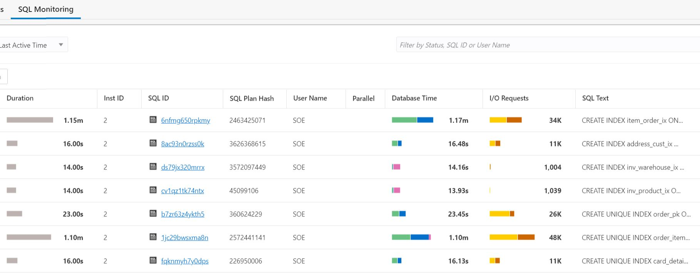

# Manage database performance with Performance Hub


## Introduction
In this lab we will simulate a production workload using Swingbench tool and monitor performance using the OCI native Performance Hub console.

Estimated Time: 20 minutes

### Objectives

As an adminstrator:
1. Simulate a production workload using Swingbench load generator.
2. Monitor and manage your autonomous database performance using Performance Hub.


### Required Artifacts

- An Oracle Cloud Infrastructure account.
- A pre-provisioned instance of Oracle Developer Client image configured with Swingbench in an application subnet. Refer to the previous lab, **Build Always On Applications**.
- A pre-provisioned Autonomous Transaction Processing instance. Refer to the earlier lab, **Provisioning Databases**.
- Successful completion of the earlier labs, **Configure a Development System** and **Build Always On Applications**.

## Task 1: Log in to the Oracle Cloud Developer image and start the order entry workload

To complete this lab it is mandatory that you have a developer client image configured with Swingbench, and an autonomous dedicated database instance with the wallet uploaded to the dev client. Follow instructions in the labs, **Configure a Development System** and **Build Always On Applications**.

*The remainder of this lab assumes you are connected to the image through VNC Viewer and are operating from the image itself and not your local machine.*

- SSH into your developer client machine and navigate to the folder /home/opc/swingbench/bin.

- Start the order entry workload.

- You can now generate loads on your database by running the charbench utility.  Use the command below. There are 2 parameters you can change to modify the amount of load and users being generated.

  ``The –uc flag specifies the number of users that will be ramped up, in the case below 64. The –rt flag specifies the total running time which is set to 30 seconds by default.``  

  You can stop running charbench at any time with *Ctrl C.*

    ```
    <copy>
    /home/opc/swingbench/bin/charbench -c /home/opc/swingbench/configs/SOE_Server_Side_V2.xml \
                -cf ~/Downloads/your_wallet.zip \
                -cs yourdb_tp \
                -u soe \
                -p yourpassword \
                -v users,tpm,tps,vresp \
                -intermin 0 \
                -intermax 0 \
                -min 0 \
                -max 0 \
                -uc 64
    </copy>
    ```

- Once swingbench starts running your will see results similar to the screen below. The first column is a time stamp, the second column indicates how many users of the total users requested with the *-uc* parameter are active, and of interest is the 3rd column which indicates transactions per second. If you see any intermittent connect or other error messages, ignore those.

    

## Task 2: Analyzing workloads with Performance Hub

- As you continue to run your Swingbench workload, you can analyze the transactions that are running on the database with the cloud based Performance Analyzer. From the main ATP console, select **Performance Hub**.

    

The main Performance Hub page should display. This page has 3 sections.
1. The top section is a timeline of activity from which you can select a specific time period to analyze.
2. The middle section contains ASH Analytics and SQL Monitoring that allows analysis by different parameters.
3. The bottom section contains information that can be analyzed by either **SQL ID** or **User Session**.

    

- In the picture above, we can see a specific time period of activity in the **time range** section, and in the **ASH Analytics** section, the Swingbench activity for users connected through the **\_medium** service, as the information is filtered by **Consumer Group**.

- To anaylyze information by a different filter, select the appropriate filter from the drop down list next to the **Average Active Sessions** header in the **ASH Analytics** section as shown below.

    

- On the bottom section of the **Performance Hub** page is displayed active **SQL** and **User Sessions**.

    

- By clicking on a specific **SQL ID**, the **SQL Detail** page is displayed which contains much  more detailed information about the specific SQL execution, as shown below. Navigate around to discover all the information available.

    

- For example, below we selected **Execution Statistics** for a specific SQL and the execution plan is displayed.

    

    

- **SQL Monitoring** displays the top 100 SQL's by the filters selected, in the case below by **Last Active Time**.

    

- **SQL Monitoring** also allows administrators to kill specific sessions if necessary. Highlight the session and a **Kill Session** button appears on top. If you click this button, the session will be terminated.

    

You may now **proceed to the next lab**.


## Acknowledgements
*Congratulations! You successfully completed setting up the swingbench workload generator for use in subsequent labs.*

- **Author** - Tejus S. & Kris Bhanushali
- **Adapted by** -  Yaisah Granillo, Cloud Solution Engineer
- **Last Updated By/Date** - Kris Bhanushali, March 2022

## See an issue or have feedback?  
Please submit feedback [here](https://apexapps.oracle.com/pls/apex/f?p=133:1:::::P1_FEEDBACK:1).   Select 'Autonomous DB on Dedicated Exadata' as workshop name, include Lab name and issue / feedback details. Thank you!
