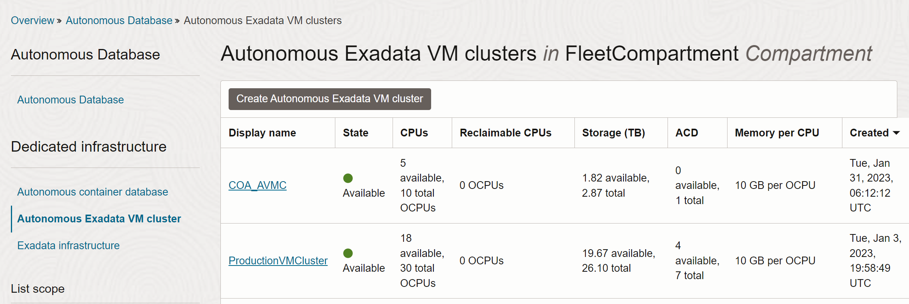

# Provisioning a Cloud Autonomous Exadata VM Cluster for Autonomous Database on Dedicated Infrastructure

## Introduction

An Autonomous Exadata VM Cluster is a set of symmetrical VMs across all Compute nodes. Autonomous Container Database and Autonomous Databases run all the VMs across all nodes enabling high availability. It consumes all the resources of the underlying Exadata Infrastructure.

**This lab provides steps to set up an Autonomous VM Cluster on your Exadata Infrastructure.**

Estimated Time: 20 minutes

### Objectives

- Create an Autonomous VM Cluster on a pre-provisioned Exadata Infrastructure.

### Required Artifacts
- An Oracle Cloud Infrastructure account with a pre-provisioned instance of Exadata Infrastructure

Watch the video below for step by step directions on creating an Autonomous VM Cluster on your Exadata Infrastructure.

## Create an Autonomous VM Cluster on your Exadata Infrastructure

*Log in to your OCI account as a fleet administrator.*

- Navigate to the **Oracle Database** option in the top left hamburger menu from your OCI home screen and select **Autonomous Database or Autonomous Dedicated Infrastructure**.

    

- Select **Autonomous Exadata VM Cluster** from the menu on the left and click the **Create Autonomous Exadata VM Cluster** button.

    

- Perform the following tasks on the **Create Autonomous Exadata VM Cluster** page.

    

    1. **Choose a compartment** to deploy the Autonomous VM Cluster and provide a display name.

    2. **Select the Exadata Infrastructure.** Change the compartment if your Exadata Infrastructure was created in a different compartment than shown in the title.

    3. **Configure network settings.** Select the VCN and subnet in which your VM Cluster will be deployed.

    4. **Configure the Autonomous VM Cluster Resources:**
    
            - Select compute model: Default model is ECPU. This is based on the number of cores elastically allocated from the shared pool of Exadata database servers and storage servers. Click Change compute model if you wish to select OCPU. OCPU compute model is based on the physical core of a processor with hyper-threading enabled. 

            - Node Count: Denotes the number of database servers in the Exadata Infrastructure.

            - Maximum number of Autonomous Container Databases: The number of ACDs specified represents the upper limit on ACDs. These ACDs must be created separately as needed. ACD creation also requires 2 available OCPUs per node.

            - OCPU count per VM: Specify the OCPU count for each individual VM. The minimum value is 5 OCPUs per VM.

            - Database memory per OCPU (GB): The memory per OCPU allocated for the Autonomous Databases in the Autonomous VM CLuster.
            
            - Database storage(TB): Data storage allocated for Autonomous Database creation in the Autonomous VM Cluster

    5. **Configure Automatic Maintenance:** Optionally, configure the automatic maintenance schedule by clicking Modify Schedule.

    6. **Choose the license type** you wish to use.
            - Bring your own license: If you choose this option, make sure you have proper entitlements to use for new service instances that you create.
            - License included: With this choice, the cost of the cloud service includes a license for the Database service
    
    7. In the advanced options, you may pick a different timezone than the default UTC

- Click **Create Autonomous Exadata VM Cluster**.

Once created, your Autonomous Exadata VM Cluster is ready to deploy Autonomous Container Databases.

*All Done! You have successfully setup your Autonomous VM Cluster on Exadata Cloud @ Customer environment. It is now ready to deploy Autonomous Container Databases*

You may now **proceed to the next lab**.

## Acknowledgements

- **Author** - Ranganath, S R, Simon Law & Kris Bhanushali
- **Last Updated By/Date** - Ranganath S R, Feb 2023

