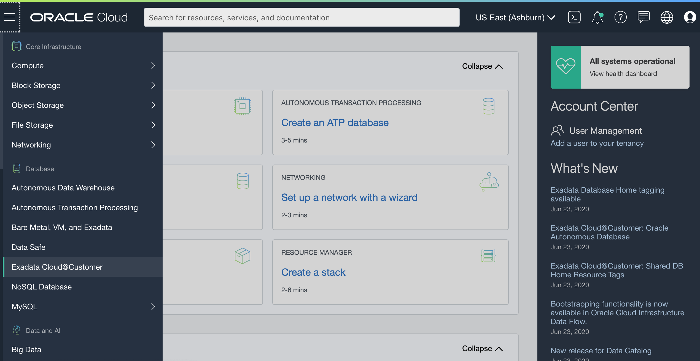
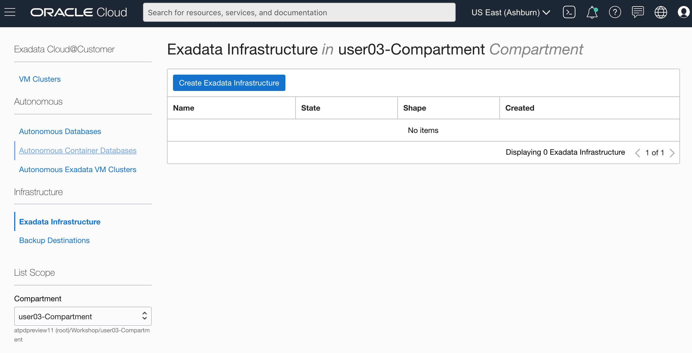
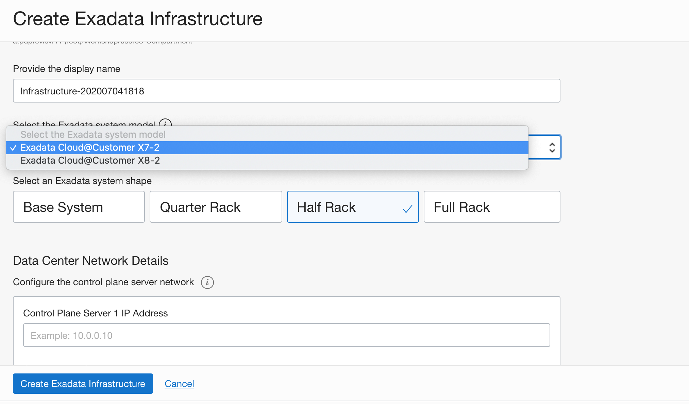
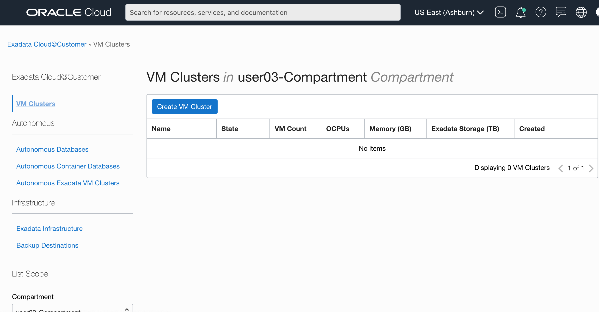
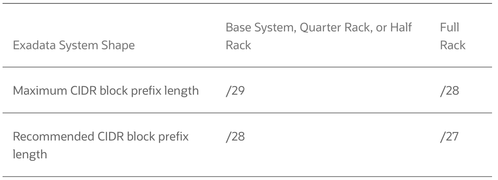
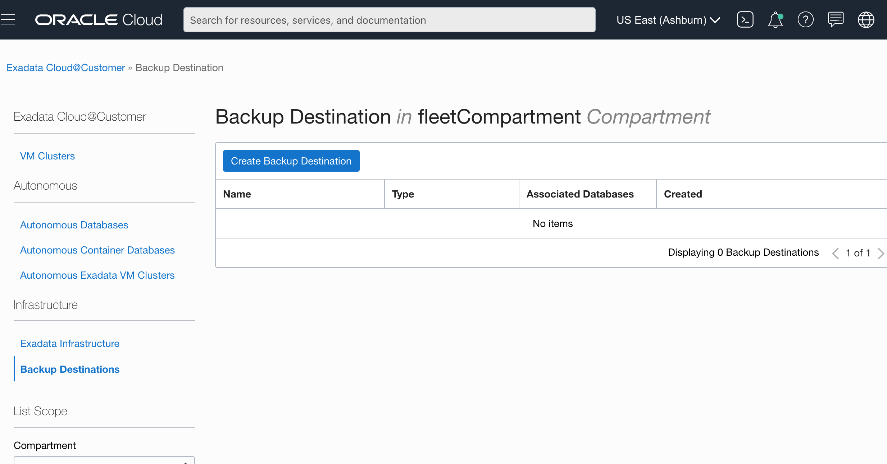
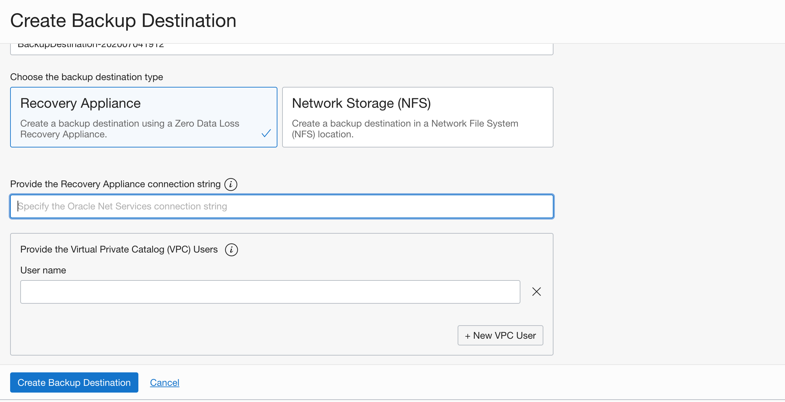
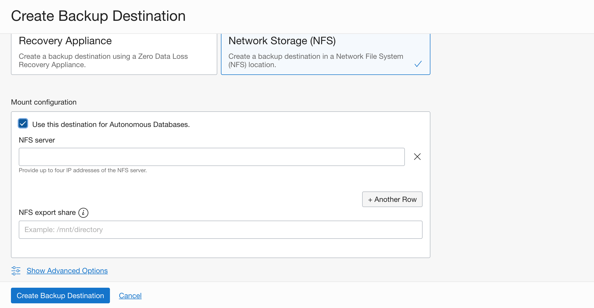

# Provisioning Exadata Infrastructure for Autonomous database on Exadata Cloud@Customer

## Introduction
Oracle Autonomous Database on Oracle Exadata Cloud@Customer provides the benefits of a self-driving, self-securing, and self-repairing database management system, bringing it closer to your applications on-premises while deployed securely behind your firewall. Setting up and using Autonomous databases on your Exadata Cloud@Customer consists of two steps

1. **Provision an Exadata Infrastructure**

    This step is common regardless wether you chose to deploy the Autonomous service using database 19c and above or co-managed Exadata Cloud @ Customer service using database 11g and above. To provision an Oracle Exadata Cloud@Customer system, you must work with Oracle to set up and configure the system.
2. **Provision an Autonomous VM Cluster on your Exadata Infrastructure**

    The type of VM Cluster you deploy on your Exadata Infrastrucure determines if its Autonomous  or co-managed. Once your Exadata Infrastruture is deployed and active, you may then create and Autonomous VM Cluster which runs your Autonomous Container Databases

**This lab guide explains steps to setup Exadata Infrastructure on your on-premises Exadata Cloud@Customer**

Estimated Time: 20 minutes

### Objectives

1. Create the Oracle Exadata Cloud@Customer infrastructure.
2. You generate a file containing the infrastructure configuration details, and provide it to Oracle.
3. The Oracle Exadata Cloud@Customer system is physically installed in your data center.
4. Oracle uses the infrastructure configuration file to perform initial system configuration. At the end of this task, Oracle supplies you with an activation file.
5. You activate the Exadata Cloud@Customer infrastructure by using the supplied activation file.

**When the provisioning process is complete, the Oracle Exadata Cloud@Customer system is ready for you to use. You may then proceed to create an Autonomous VM Cluster as explained in the next lab guide.**

### Required Artifacts
- An Oracle Cloud Infrastructure account with service limits to deploy at least one base rack of Exadata Infrastructure in any one region or Availability Domain.
- You also need privileges to create  Exadata Infrastructure and a container database in a pre-provisioned compartment and network.

Watch the video below for step by step directions on creating an Autonomous Exadata Infrastructure in your Oracle Cloud Infrastructure tenancy

## Task 1: Create the Oracle Exadata Cloud@Customer infrastructure.

*Login to your OCI account as a fleet administrator*

Navigate to the 'Exadata Cloud@Customer' option in the top left hamburger menu from your OCI home screen.
    

Select 'Exadata Infrastructure' and Click the blue 'Create  Exadata Infrastructure' button as shown below
    

Choose a compartment to deploy, provide a display name, select the Exadata System model and shape.

In the network section, provide,

1. **Two Control Plane Server IP Addresses:**These IP addresses are for the network interfaces that connect the two control plane servers to your corporate network using the control plane network
2. **Netmask:** Specify the IP netmask for the control plane network.
3. **Gateway:** Specify the IP address of the control plane network gateway.
4. **HTTPS Proxy:** (Optional) You can choose to use this field to specify your corporate HTTPS proxy

In the Section **Configure the Oracle Exadata system networks**

1. **Administration Network CIDR Block:** Specifies the IP address range for the administration network using CIDR notation. The administration network provides connectivity that enables Oracle to administer the Exadata system components, such as the Exadata compute servers, storage servers, network switches, and power distribution units. You can accept the suggested default, or specify a custom value

The smallest CIDR range required is /23, while the maximum number of IP addresses may be reserved with a CIDR rage of /16

2. **InfiniBand Network CIDR Block:** Specifies the IP address range for the Exadata InfiniBand network
The Exadata InfiniBand network provides the high-speed low-latency interconnect used by Exadata software for internal communications between various system components. You can accept the suggested default, or specify a custom value.

The smallest CIDR range required for the Infiniband network is /22 while the largest is /19

In the Section **Configure DNS and NTP services**

1. **DNS Servers:** Provide the IP address of a DNS server that is accessible using the control plane network. You may specify up to three DNS servers.

2. **NTP Servers:** Provide the IP address of an NTP server that is accessible using the control plane network. You may specify up to three NTP servers.

3. **Time Zone:** The default time zone for the Exadata Infrastructure is UTC, but you can specify a different time zone.

**Click Create Exadata Infrastructure.**
If all of your inputs are valid, then the Infrastructure Details page appears. The page outlines the next steps in the provisioning process. Initially after creation, the state of the Oracle Exadata infrastructure is Requires-Activation.

You may now proceed to setup a VM Cluster Network to deployment your Autonomous VM Cluster later.

## Task 2: Create a VM Cluster Network

Navigate back to the Exadata Cloud@Customer console, select 'VM Cluster' from the left menu and click the blue 'Create VM Cluster' button

After providing the compartment, display name (need not be unique) and the Exadata Cloud@Customer Infrastructure you provisioned above, you can proceed to configure the client and backup network for your VM Cluster as follows.

In the **Provide client network details** section

1. **VLAN ID:** Provide a virtual LAN identifier (VLAN ID) for the client network between 1 and 4094, inclusive.

2. **CIDR Block:** Using CIDR notation, provide the IP address range for the client network.

The client network is the primary channel for application connectivity to Exadata Cloud@Customer resources.

3. **Netmask:** Specify the IP netmask for the client network.

4. **Gateway:** Specify the IP address of the client network gateway.

5. **Hostname Prefix:** Specify the prefix that is used to generate the hostnames in the client network.

6. **Domain Name:** Specify the domain name for the client network.

In the **Provide backup network details** section

1. **VLAN ID:** Provide a virtual LAN identifier (VLAN ID) for the backup network between 1 and 4094, inclusive.

The backup network is the secondary channel for connectivity to Exadata Cloud@Customer resources. It is typically used to segregate application connections on the client network from other network traffic.

2. **CIDR Block:** Using CIDR notation, provide the IP address range for the backup network.

The minimum and maximum IP addresses required for the backup network depend on the shape of your Exadata Infrastructure and are specified in the table below.

3. **Netmask:** Specify the IP netmask for the backup network.

4. **Gateway:** Specify the IP address of the backup network gateway.

5. **Hostname Prefix:** Specify the prefix that is used to generate the hostnames in the backup network.

6. **Domain Name:** Specify the domain name for the backup network.

In the **Provide DNS and NTP server details** section

1. **DNS Servers:** Provide the IP address of a DNS server that is accessible using the client network. You may specify up to three DNS servers.

2. **NTP Servers:** Provide the IP address of an NTP server that is accessible using the client network. You may specify up to three NTP servers.

Click **Review Configuration**
The Review Configuration page displays detailed information about the VM cluster network, including the hostname and IP address allocations. You may chose to edit the configuration and save changes or proceed to creating the network by clicking **Create VM Cluster Network**

The VM Cluster Network Details page is now displayed. Initially after creation, the state of the VM cluster network is **Requires Validation**

Next, you may proceed to select a backup destination for your Autonomous Database backups

## Task 3: Create a Backup Destination
When you create autonomous  databases on  Exadata Cloud@Customer, you can specify a backup destination and enable automatic backups. You may chose to backup your databases to one of the following destinations

1. OCI Object store
2. On-premise Oracle ZDLRA
3. Your own NFS storage device

Step 3 is required if you plan to use ZDLRA or NFS as a backup destination. If you plan to backup to OCI object store, you may skip this step

Navigate back to the Exadata Cloud@Customer console, select 'Backup Destinations' from the left menu and click the blue 'Create Backup Destination' button

Once you select a compartment and provide a display name, you may pick one of the two backup destination types

1. **Recovery Appliance**

If you choose to backup your autonomous databases on an on-premise Oracle Recovery Appliance,

Provide the Recovery Appliance connect string and VPC username. Contact your ZDLRA backup admin for these details.

Click **Create Backup Destination** at the bottom of the page.

2. **NFS**

If you choose to backup your autonomous databases on an on-premise NFS Storage device,

Provide the IP Address (up to 4) of your NFS Server and one or more NFS Export Shares. Contact your network / backup admin for details

Click **Create Backup Destination** at the bottom of the page.

You are now ready to download your configuration and send it to Oracle for validation and activation.

## Task 4: Download Configuration Information

Navigate back to the Exadata Cloud@Customer console, select 'Exadata Infrastructure' from the left menu and select the Exadata Infrastructure your deployed above

Click **Download Configuration** button on the top
Your browser downloads a file containing the infrastructure configuration details. In the next step, you will need to provide this file to Oracle to activate your Exadata Infrastructure. When you provide the generated infrastructure configuration file to Oracle, ensure that it has not been altered in any way. Also, ensure that you do not edit the Oracle Exadata infrastructure after you download the configuration file and provide it to Oracle.

## Task 5: Activate Exadata Infrastructure

1. On the same console screen as Step 4, Click the **Activate** button at the top

The Activate button is only available if the Oracle Exadata infrastructure requires activation. You cannot activate Oracle Exadata infrastructure multiple times.

2. Use the Activate dialog to upload the activation file, and then click **Activate Now**

After activation, the state of the Oracle Exadata infrastructure changes to **Active**

You may now **proceed to the next lab**.

## Acknowledgements

*All Done! You have successfully setup your Autonomous Database on Exadata Cloud @ Customer environment. It is now ready to deploy Autonomous VM Clusters*

- **Author** - Simon Law & Kris Bhanushali
- **Last Updated By/Date** - Kris Bhanushali, July 2020

## See an issue or have feedback?
Please submit feedback [here](https://apexapps.oracle.com/pls/apex/f?p=133:1:::::P1_FEEDBACK:1).   Select 'Autonomous DB on Dedicated Exadata' as workshop name, include Lab name and issue / feedback details. Thank you!