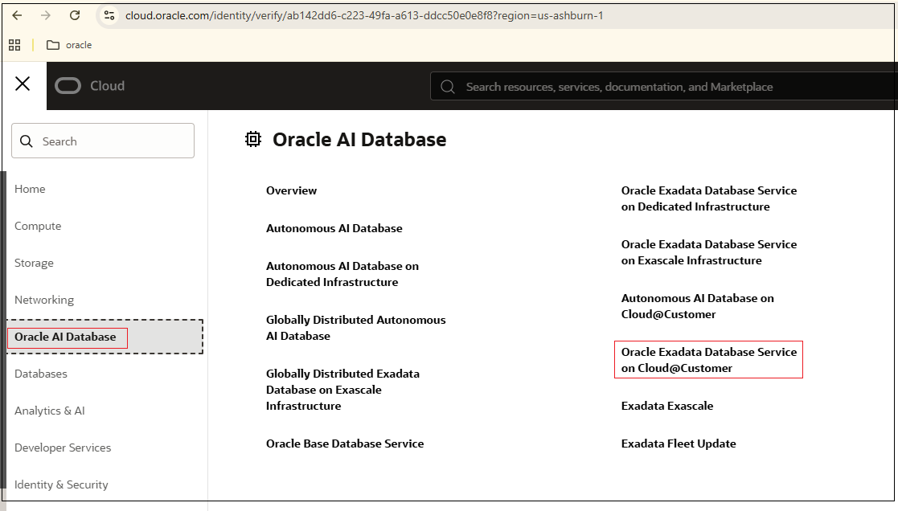
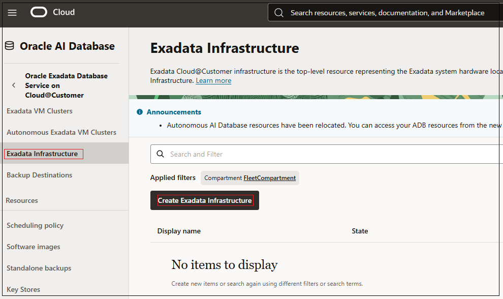
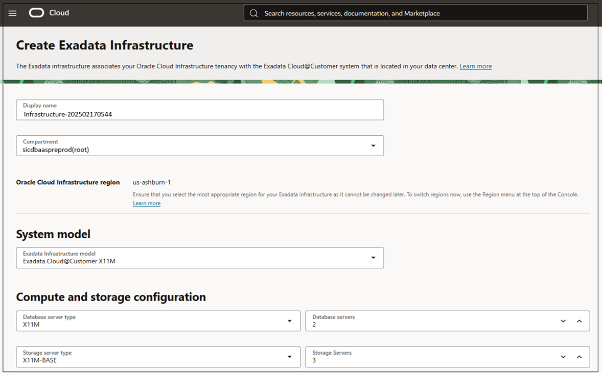
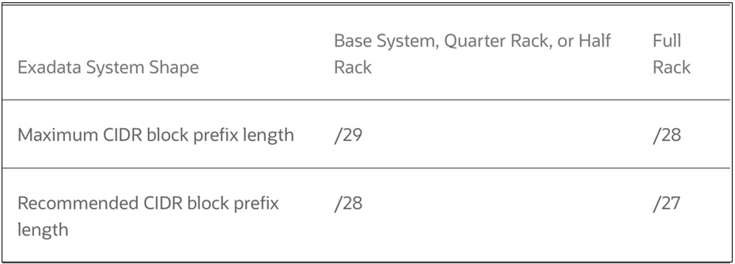
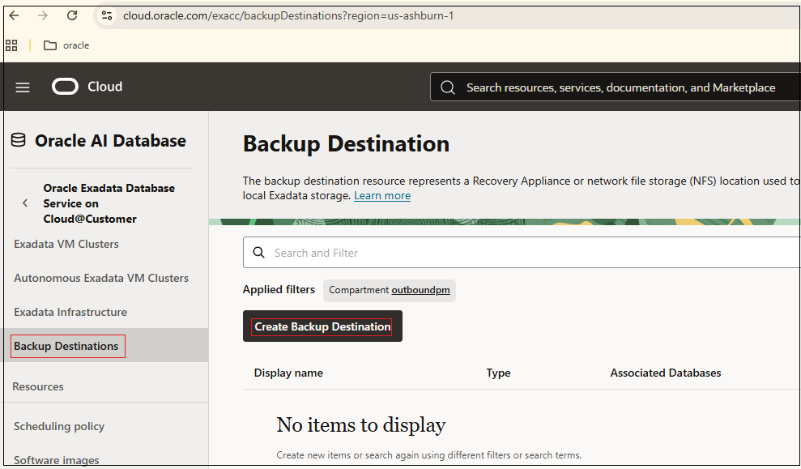
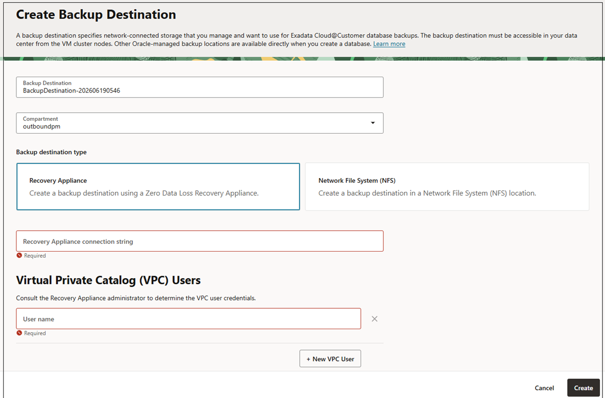
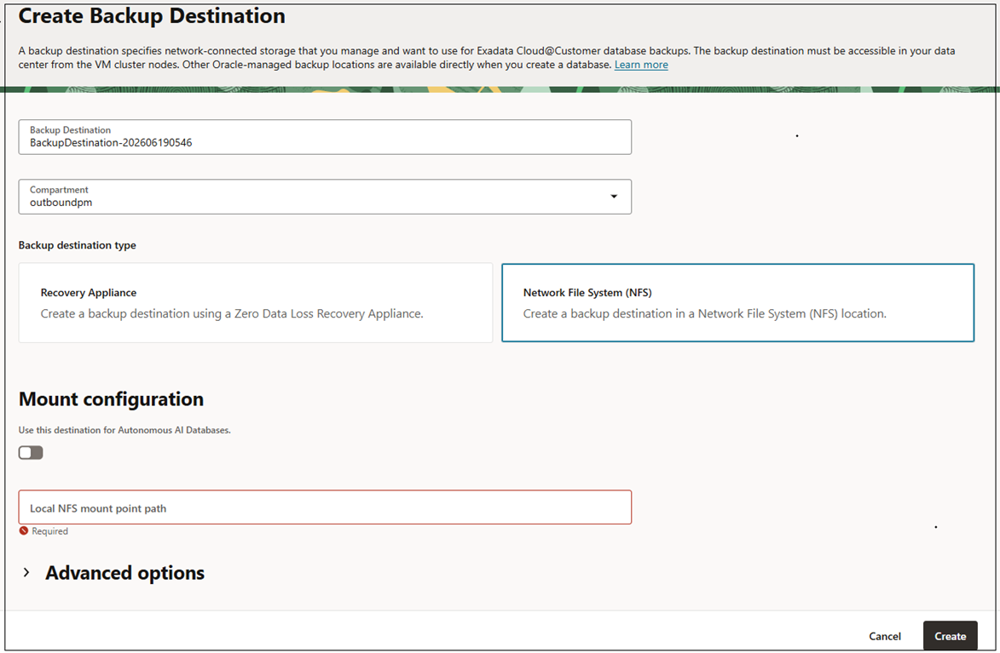

# Provision Exadata Infrastructure for Autonomous AI Database on Exadata Cloud@Customer

## Introduction

Oracle Autonomous AI Database on Exadata Cloud@Customer combines the automation capabilities of Autonomous AI Database with the security, data residency, and control of an on-premises deployment. The service runs within your data center while being managed through Oracle Cloud Infrastructure (OCI).

Provisioning Autonomous AI Database on Exadata Cloud@Customer consists of two phases:

1. **Provision the Exadata Infrastructure**
2. **Provision an Autonomous VM Cluster**

This lab focuses on provisioning and activating the Exadata Infrastructure and preparing the environment for Autonomous VM Cluster deployment.

Estimated Time: 45 Minutes

### Objectives

By the end of this lab, you will be able to:

- Create an Exadata Cloud@Customer Infrastructure resource.
- Configure the required Exadata system networks.
- Create a VM Cluster Network.
- Configure an optional backup destination.
- Download the infrastructure configuration package.
- Submit the configuration package to Oracle.
- Activate the Exadata Infrastructure using the Oracle-provided activation file.
- Validate that the environment is ready for Autonomous VM Cluster deployment.

### Prerequisites

Before starting this lab, ensure that:

- You have access to an OCI tenancy with sufficient Exadata Cloud@Customer service limits.
- You have permissions to create Exadata Infrastructure resources.
- You have permissions to create VM Cluster Networks.
- You have collected all required networking information from your network team.
- DNS and NTP servers are available and reachable.
- Oracle has installed or is scheduled to install the Exadata Cloud@Customer hardware.

## Task 1: Create the Exadata Cloud@Customer Infrastructure

1. Sign in to the OCI Console and Open the Navigation Menu.
2. Select **Oracle AI Database**. Click **Oracle Exadata Database Service at Cloud@Customer**.

   

3. Select **Exadata Infrastructure**. and  Click **Create Exadata Infrastructure**.

   

4. Enter the basic information:
    - Compartment
    - Display Name
    - Exadata System Model
    - Shape

   Verify the selected model and shape match the installed rack configuration. The Oracle Exadata system model and system shape combine to define the amount of CPU, memory, and storage resources that are available in the Exadata infrastructure.

   

5. Configure Control Plane Networking:

   Provide the following details:
    - Two Control Plane Server IP Addresses: These IP addresses are for the network interfaces that connect the two control plane servers to your corporate network using the control plane network
    - Netmask: Specify the IP netmask for the control plane network.
    - Gateway: Specify the IP address of the control plane network gateway.
    - HTTPS Proxy (Optional): You can choose to use this field to specify your corporate HTTPS proxy.

   Confirm if IPs are reserved, Gateway is reachable and Network team has approved the values.

6. Configure Exadata Internal Networks:

    - Administration Network CIDR Block: Specifies the IP address range for the administration network using CIDR notation. The administration network provides connectivity that enables Oracle to administer the Exadata system components, such as the Exadata compute servers, storage servers, network switches, and power distribution units. You can accept the suggested default, or specify a custom value. The smallest CIDR range required is /23, while the maximum number of IP addresses may be reserved with a CIDR range of /16.
    - InfiniBand Network CIDR Block: Specifies the IP address range for the Exadata InfiniBand network The Exadata InfiniBand network provides the high-speed low-latency interconnect used by Exadata software for internal communications between various system components. You can accept the suggested default, or specify a custom value. The smallest CIDR range required for the Infiniband network is /22 while the largest is /19.

    In the Section Configure DNS and NTP services

    - DNS Servers: Provide the IP address of a DNS server that is accessible using the control plane network. You may specify up to three DNS servers.

    - NTP Servers: Provide the IP address of an NTP server that is accessible using the control plane network. You may specify up to three NTP servers.

    - Time Zone: The default time zone for the Exadata Infrastructure is UTC, but you can specify a different time zone.

7. Click **Create Exadata Infrastructure**. If all of your inputs are valid, then the Infrastructure Details page appears. The page outlines the next steps in the provisioning process. Initially after creation, the state of the Oracle Exadata infrastructure is Requires-Activation.

## Task 2: Create a VM Cluster Network

1. Sign in to the OCI Console and open the Navigation Menu.
2. Select **Oracle AI Database**. Click **Oracle Exadata Database Service at Cloud@Customer**.
3. Click **Exadata Infrastructure**. Click the name of the Exadata infrastructure for which you want to create a VM cluster network.
4. Click **Create VM Cluster Network**.
5. Provide General Information like Compartment, Display Name.
6. Assign IPs to DB servers. By default, all DB servers are assigned IP addresses to enable easy addition and removal of VMs to the cluster in the future. Note that while DB Servers can be added to or removed from the VM Cluster Network, addresses cannot be changed in the future.
7. Configure Client Network: Provide the following information:

    - VLAN ID: Provide a virtual LAN identifier (VLAN ID) for the client network between 1 and 4094, inclusive.
    - CIDR Block: Using CIDR notation, provide the IP address range for the client network. The client network is the primary channel for application connectivity to Exadata Cloud@Customer resources.
    - Netmask: Specify the IP netmask for the client network.
    - Gateway: Specify the IP address of the client network gateway.
    - Hostname Prefix: Specify the prefix that is used to generate the hostnames in the client network.
    - Domain Name:Specify the domain name for the client network.

   Verify VLAN is available, CIDR range does not overlap existing networks and Gateway is reachable.

   

8. Configure Backup Network: Provide the following information:

    - VLAN ID: Provide a virtual LAN identifier (VLAN ID) for the backup network between 1 and 4094, inclusive. The backup network is the secondary channel for connectivity to Exadata Cloud@Customer resources. It is typically used to segregate application connections on the client network from other network traffic.
    - CIDR Block: Using CIDR notation, provide the IP address range for the backup network. 
    - Netmask: Specify the IP netmask for the backup network.
    - Gateway: Specify the IP address of the backup network gateway.
    - Hostname Prefix: Specify the prefix that is used to generate the hostnames in the backup network.
    - Domain Name: Specify the domain name for the backup network.

9. The VM cluster network requires access to Domain Names System (DNS) and Network Time Protocol (NTP) services. The following settings specify the servers that provide these services:

    - DNS Servers: Provide the IP address of a DNS server that is accessible using the client network. You may specify up to three DNS servers.

    - NTP Servers: Provide the IP address of an NTP server that is accessible using the client network. You may specify up to three NTP servers.

   Verify that Backup network does not overlap client network and Sufficient IP addresses exist.

10. Click **Review Configuration**. Review generated hostnames and IP allocations. Click **Create VM Cluster Network**.

   The VM Cluster Network Details page is now displayed. Initially after creation, the state of the VM cluster network is **Requires Validation**.

## Task 3: Configure a Backup Destination (Optional)

When you create Autonomous AI Databases on Exadata Cloud@Customer, you can specify a backup destination and enable automatic backups. You may chose to backup your databases to one of the following destinations

- OCI Object store
- On-premise Oracle ZDLRA
- Your own NFS storage device

If you plan to use OCI Object Storage, this task can be skipped.

1. Navigate back to Exadata Cloud@Customer. Select **Backup Destinations** and Click **Create Backup Destination**.

   

2. Choose one of the following options for backup destination:

    - Option A - Recovery Appliance: Provide Recovery Appliance Connect String and VPC Username. Contact your ZDLRA backup admin for these details. Confirm connectivity and credentials with the backup administrator.

      

    - Option B - NFS : Provide the IP Address (up to 4) of your NFS Server and one or more NFS Export Shares. Contact your network / backup admin for details. Confirm that NFS exports are accessible and firewall rules permit connectivity.

      

Click **Create** at the bottom of the page.

You are now ready to download your configuration and send it to Oracle for validation and activation.

## Task 4: Download the Infrastructure Configuration Package

1. Navigate back to Exadata Cloud@Customer console and select **Exadata Infrastructure**. Select the infrastructure created in **Task 1**.

2. Click **Download Configuration**. Save the generated file securely.

   **Important** :

   After downloading:
    - Do not modify the file.
    - Do not modify the infrastructure configuration.
    - Submit the file to Oracle exactly as generated.

## Task 5: Activate the Exadata Infrastructure

Activate the Exadata Infrastructure after Oracle completes validation and provides an activation file.

Verify:

- Oracle completed validation.
- Activation file has been received.
- Infrastructure state is Requires Activation.

1. Open Infrastructure Details and Click **Activate**. The Activate button is only available if the Oracle Exadata infrastructure requires activation. You cannot activate Oracle Exadata infrastructure multiple times.
2. Use the ****Activate** dialog to upload the activation file, and then click **Activate Now**. After activation, the state of the Oracle Exadata infrastructure changes to **Active**.

### Troubleshooting

#### Infrastructure Creation Fails

Verify:

- Service limits are available.
- Required IAM permissions exist.
- Selected compartment is correct.

#### VM Cluster Network Validation Fails

Verify:

- VLAN assignments are correct.
- CIDR ranges do not overlap.
- DNS and NTP servers are reachable.

#### Activation Fails

Verify:

- Correct activation file was uploaded.
- Infrastructure remains in Requires Activation state.
- Oracle validation has been completed.

### Next Steps

You may now proceed to the next lab: **Create an Autonomous VM Cluster**

## Acknowledgements

- **Author** - Tejus S. & Kris Bhanushali
- **Adapted by** - Vandana Rajamani, Consulting UA Developer, June 2026
- **Last Updated By/Date** - Vandana Rajamani, Consulting UA Developer, July 2026
