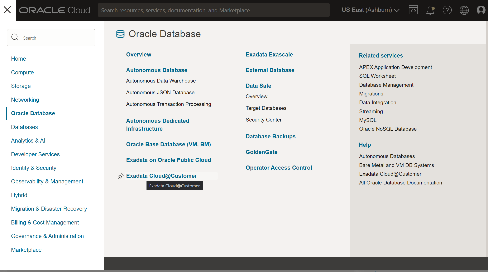
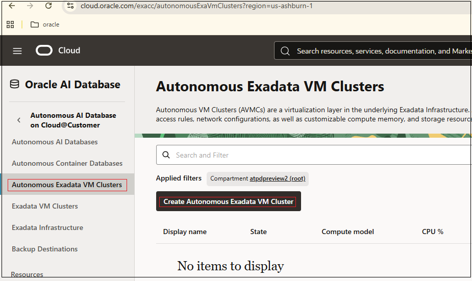
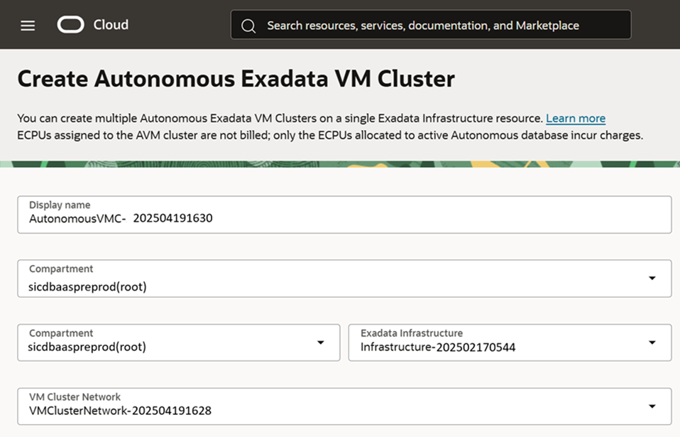
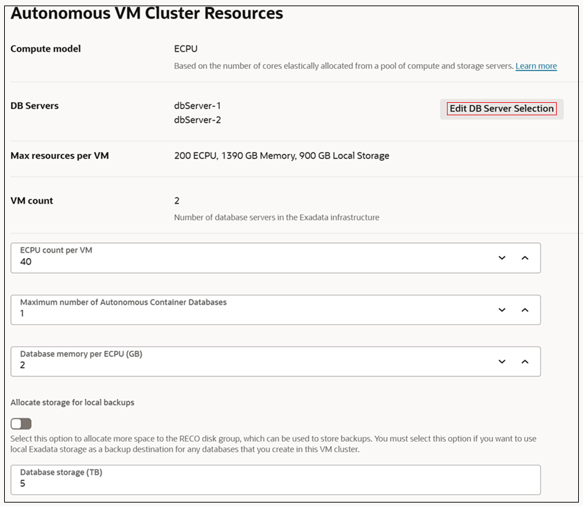
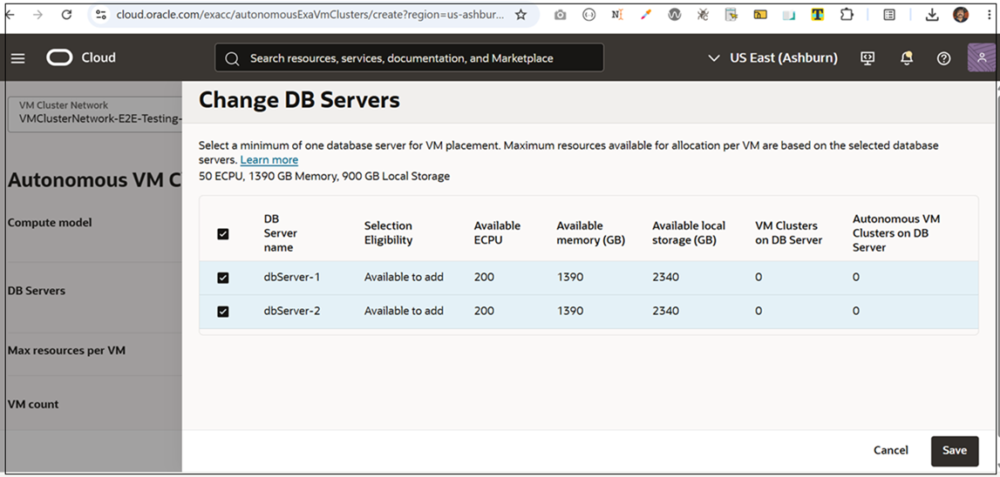
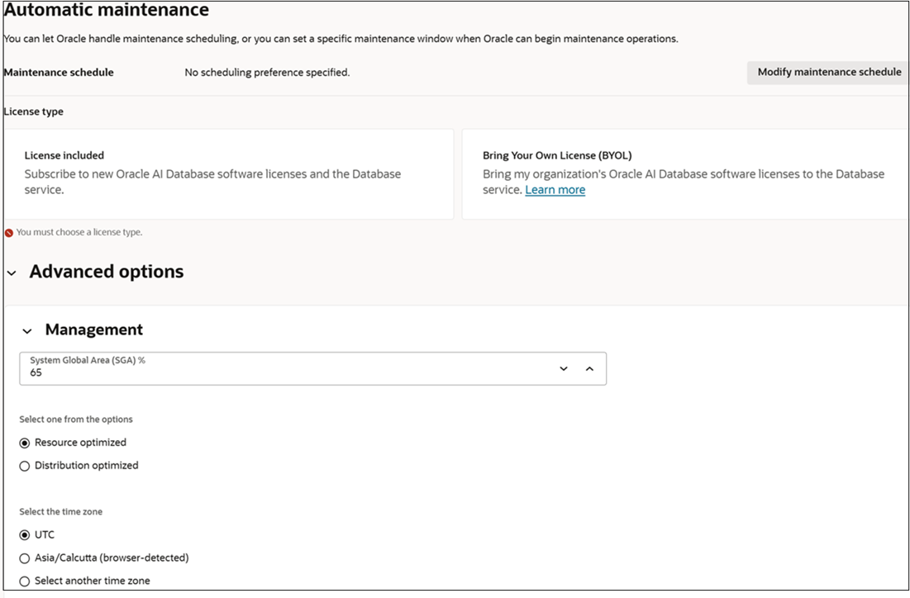
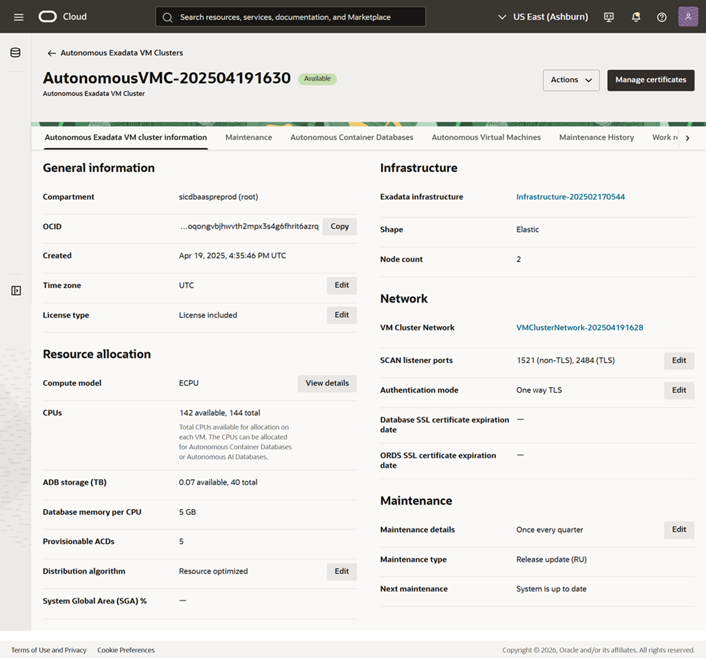

# Provision an Autonomous VM Cluster on Exadata Cloud@Customer

## Introduction

Oracle Autonomous AI Database on Oracle Exadata Cloud@Customer delivers the benefits of a self-driving, self-securing, and self-repairing database management system while keeping the database closer to your on-premises applications and securely deployed behind your firewall. Setting up and using Autonomous AI Databases on your Exadata Cloud@Customer consists of two steps:

1. **Provision an Exadata Infrastructure**

    This step is required regardless of whether you choose to deploy the Autonomous service using Database 19c and later, or a co-managed Exadata Cloud@Customer service using Database 11g and later. To provision an Oracle Exadata Cloud@Customer system, you must work with Oracle to install, configure, and activate the Exadata infrastructure.

    **This step was completed in the [previous lab](?lab=adb-prov-exacc).**

2. **Provision an Autonomous VM Cluster on your Exadata Infrastructure**

    The type of VM Cluster you deploy on your Exadata Infrastructure determines whether the environment is configured for Autonomous AI Database or a co-managed deployment.
    After your Exadata Infrastructure has been deployed and is in the **Available** state, you can create an Autonomous VM Cluster to host your Autonomous Container Databases (ACDs).

**This lab walks you through the steps required to create an Autonomous VM Cluster on your Exadata Cloud@Customer infrastructure.**

### Objectives

- Create an Autonomous VM Cluster on a pre-provisioned Exadata Cloud@Customer infrastructure.

### Required

- An Oracle Cloud Infrastructure account with a pre-provisioned instance of Exadata Infrastructure

## Create an Autonomous VM Cluster on your Exadata Cloud@Customer infrastructure

*Sign in to the OCI Console and Open the Navigation Menu.*.

Select **Oracle AI Database**. Click **Oracle Exadata Database Service at Cloud@Customer**.

Select **Autonomous Exadata VM Clusters** from the menu on the left and click **Create Autonomous Exadata VM Cluster**.

On the **Create Autonomous Exadata VM Cluster** page enter the following information:

1. **Choose a compartment:** Select the compartment where you want to deploy the Autonomous VM Cluster and enter a display name. 

2. **Select the Exadata Infrastructure:** Choose the Exadata Infrastructure on which the Autonomous VM Cluster will be created. If the infrastructure resides in a different compartment, switch to the appropriate compartment before selecting it.

3. **Select the VM Cluster Network:** Choose the VM Cluster Network to associate with the Autonomous VM Cluster. Ensure that you select the correct compartment if the VM Cluster Network is located elsewhere. Select a VM Cluster Network. Once again, ensure you change the compartment to where your VM Cluster is deployed.

   

4. **Configure the Autonomous VM Cluster Resources:**

    - Compute model: The default compute model is ECPU, which allocates compute resources elastically from the shared pool of Exadata database and storage servers. 

        

    - DB Server Selection: By default, all database servers that meet the minimum resource requirements are selected. To add or remove database servers, click **Edit DB Server Selection**. This opens the **Change DB Servers** dialog, where you can review and select from the available database servers.

        

    - Node Count: Displays the number of selected database servers that will participate in the Autonomous VM Cluster.

    - Maximum number of Autonomous Container Databases: Specifies the maximum number of   Autonomous Container Databases (ACDs) that can be created in this Autonomous VM Cluster.      The specified value represents an upper limit only. 
    - ECPU count per VM: Specify the number of ECPUs allocated to each VM. The minimum supported value is 5 ECPUs per VM.

    - Database memory per ECPU (GB): Specify the amount of memory allocated per ECPU for Autonomous Databases running in the Autonomous VM Cluster.

    - Database storage(TB): Specify the storage capacity available for Autonomous Database creation within the Autonomous VM Cluster.

5. **Configure Automatic Maintenance:** Optionally, customize the maintenance schedule by clicking **Modify Schedule**. By default, the schedule is set to **No Preference**, allowing Oracle to perform maintenance when required.

   To define a custom schedule:

    - Select **Specify a Schedule**.
    - Choose the preferred months, weeks, days, and hours for maintenance activities.
    - Optionally, configure a notification lead time to receive advance notice before scheduled maintenance.

6. **Choose the license type** you wish to use.

    - Bring Your Own License (BYOL): Ensure that you have the appropriate Oracle Database license entitlements before selecting this option.
    - License Included: The cost of the cloud service includes the required Oracle Database licenses.

7. **Advanced Options:** Optionally, specify a time zone other than the default UTC setting.

   

   After completing the configuration, click **Create**.

Once provisioning is complete, the Autonomous VM Cluster is ready for Autonomous Container Database deployment. You can review resource allocation and utilization details on the Autonomous VM Cluster details page.

You may now **proceed to the next lab**.

## Acknowledgements

- **Author** - Simon Law, Kris Bhanushali and Ranganath S R
- **Adapted By/Date** - Vandana Rajamani, Consulting UA Developer, June 2026
- **Last Updated By/Date** - Vandana Rajamani, Consulting UA Developer, September 2026
