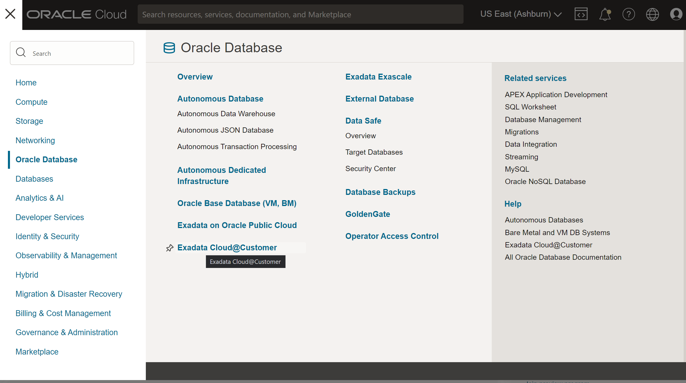

# Provisioning an Autonomous VM Cluster on Exadata Cloud@Customer

## Introduction
Oracle Autonomous Database on Oracle Exadata Cloud@Customer provides the benefits of a self-driving, self-securing, and self-repairing database management system, bringing it closer to your applications on-premises while deployed securely behind your firewall. Setting up and using Autonomous databases on your Exadata Cloud@Customer consists of two steps

1. **Provision an Exadata Infrastructure**

    This step is common regardless wether you chose to deploy the Autonomous service using database 19c and above or co-managed Exadata Cloud @ Customer service using database 11g and above. To provision an Oracle Exadata Cloud@Customer system, you must work with Oracle to set up and configure the system. **This step was completed in the previous lab**

2. **Provision an Autonomous VM Cluster on your Exadata Infrastructure**

    The type of VM Cluster you deploy on your Exadata Infrastrucure determines if its Autonomous  or co-managed. Once your Exadata Infrastruture is deployed and active, you may then create and Autonomous VM Cluster which runs your Autonomous Container Databases

**This lab guide explains steps to setup an Autonomous VM Cluster on your on-premises Exadata Cloud@Customer**

### Objectives

- Create an Autonomous VM Cluster on a pre-provisioned Exadata Cloud@Customer infrastructure.

### Required Artifacts
- An Oracle Cloud Infrastructure account with a pre-provisioned instance of Exadata Infrastructure

Watch the video below for step by step directions on creating an Autonomous VM Cluster on your Exadata Infrastructure

## Create an Autonomous VM Cluster on your Exadata Cloud@Customer infrastructure.

*Login to your OCI account as a fleet administrator*

Navigate to the 'Exadata Cloud@Customer' option in the top left hamburger menu from your OCI home screen.

Select 'Autonomous Exadata VM Clusters' from the menu on the left and click **Create Autonomous Exadata VM Cluster** button

On the **Create Autonomous Exadata VM Cluster** page enter the folowing information;

1. **Choose a compartment** to deploy the VM Cluster and provide a display name.

2. **Select the Exadata Infrastructure.** Change the compartment if your Exadata Infrastructure was created in a different compartment than shown in the title

3. **VM Cluster Network:** Select a VM Cluster Network. Once again, ensure you change the compartment to where your VM Cluster is deployed

4. **Configure the Autonomous VM Cluster Resources:** 
    
        - Select compute model: Default model is ECPU. This is based on the number of cores elastically allocated from the shared pool of Exadata database servers and storage servers. Click Change compute model if you wish to select OCPU. OCPU compute model is based on the physical core of a processor with hyper-threading enabled. 

        - DB Server Selection: By default, all the DB Servers that have the minimum resources needed to create an Autonomous VM Cluster are selected. Optionally, you can add or remove the VMs by clicking Edit DB Server Selection. Clicking this button launches the Change DB Servers dialog listing all the available DB Servers.

        - Node Count: Denotes the number of database servers selected.

        - Maximum number of Autonomous Container Databases: The number of ACDs specified represents the upper limit on ACDs. These ACDs must be created separately as needed. ACD creation also requires 2 available OCPUs per node.

        - OCPU count per VM: Specify the OCPU count for each individual VM. The minimum value is 5 OCPUs per VM.

        - Database memory per OCPU (GB): The memory per OCPU allocated for the Autonomous Databases in the Autonomous VM CLuster.

        - Database storage(TB): Data storage allocated for Autonomous Database creation in the Autonomous VM Cluster

5. **Configure Automatic Maintenance.** Optionally, configure the automatic maintenance schedule by clicking Modify Schedule.

    You can then change the maintenance schedule from the default (No preference, which permits Oracle to schedule maintenance as needed) by selecting Specify a schedule and then selecting the months, weeks, days and hours for the schedule. You can also set a lead time to receive a notification message about an upcoming maintenance from Oracle.

6. **Choose the license type** you wish to use.

        - Bring your own license: If you choose this option, make sure you have proper entitlements to use for new service instances that you create.
        - License included: With this choice, the cost of the cloud service includes a license for the Database service

7. In the advanced options, you may pick a different timezone than the default UTC

Click **Create Autonomous Exadata VM Cluster**

Once created, your Autonomous Exadata VM Cluster is ready to deploy Autonomous Container Databases. You will be able to see the resource allocation and usage info on the Autonomous Exadata VM Cluster details page.

You may now **proceed to the next lab**.

## Acknowledgements

*All Done! You have successfully setup your Autonomous VM Cluster on Exadata Cloud @ Customer environment. It is now ready to deploy Autonomous Container Databases*

- **Author** - Simon Law, Kris Bhanushali and Ranganath S R
- **Last Updated By/Date** - Ranganath S R, Feb 2023

