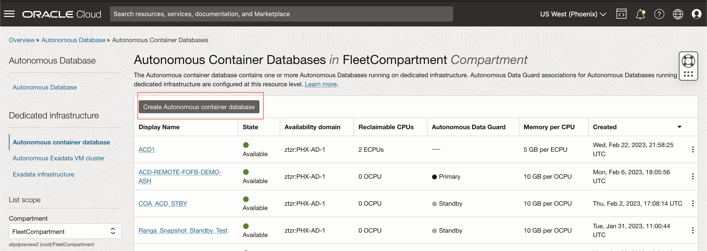
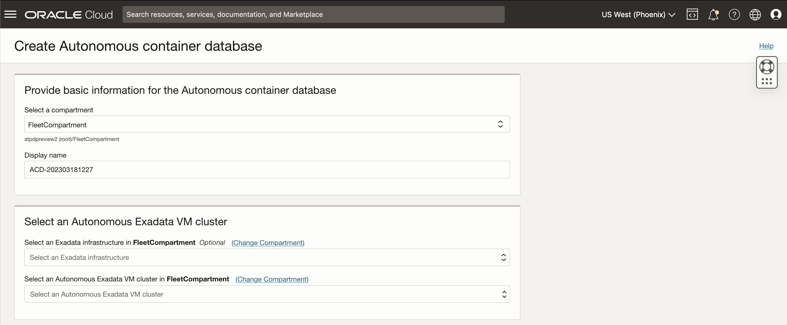
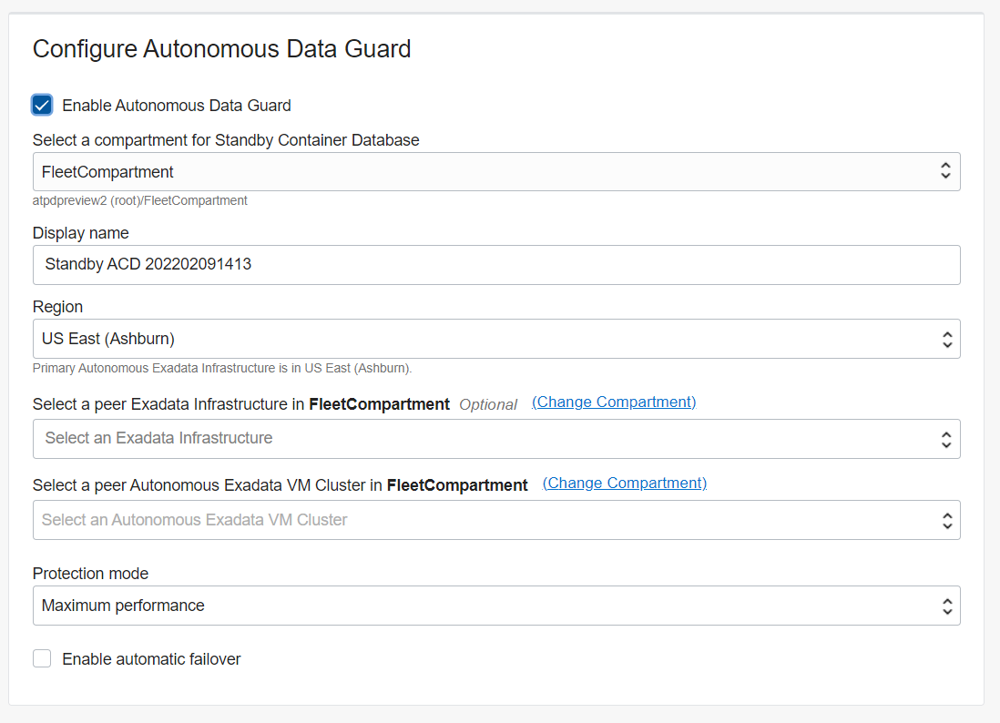
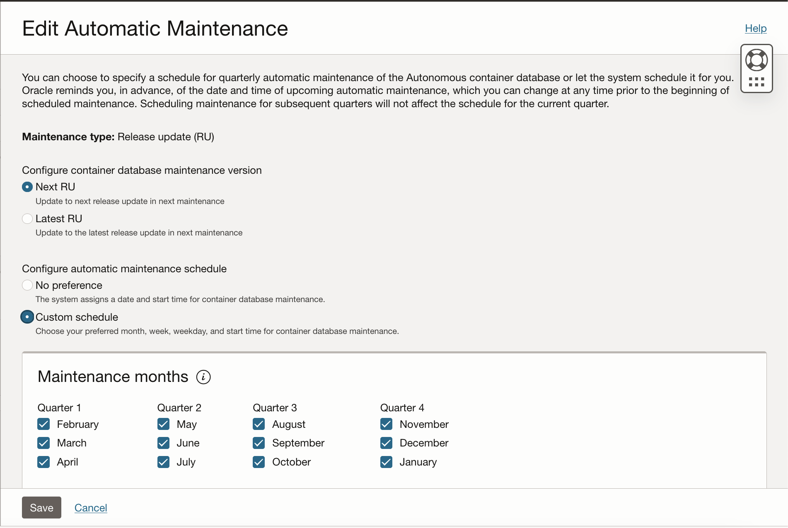
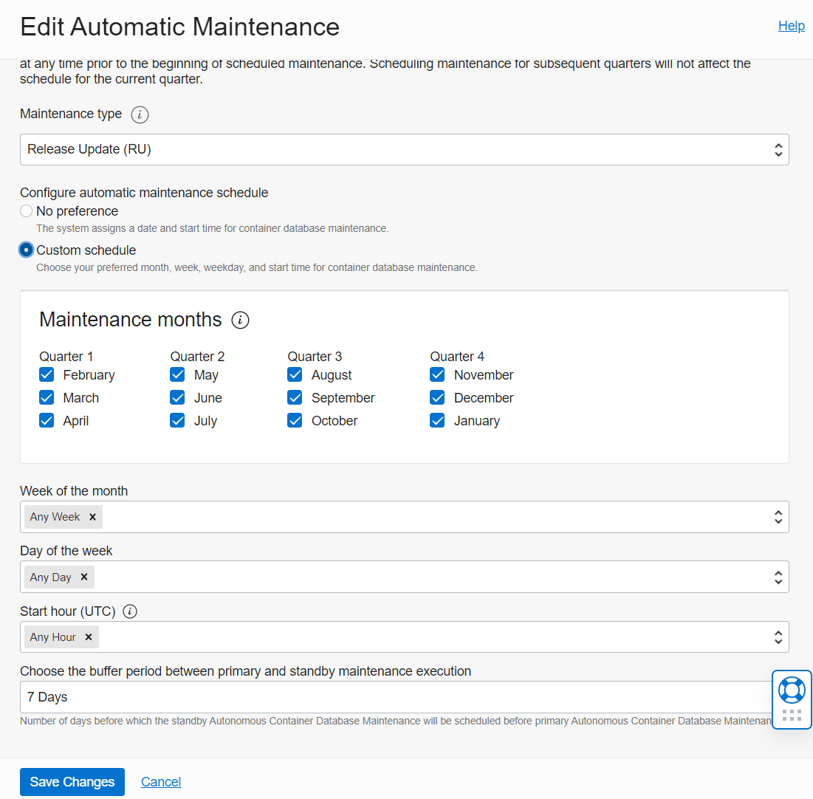
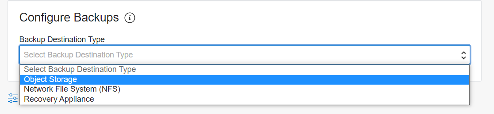
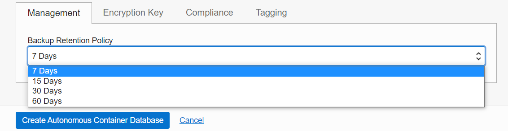
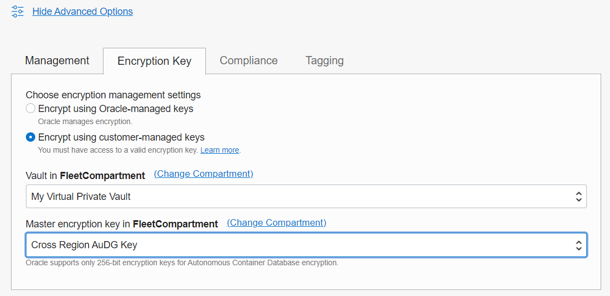
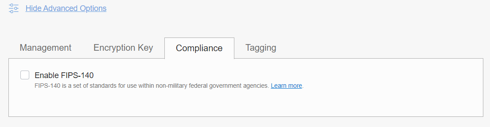

# Provisioning an Autonomous Container Database

## Introduction
An Autonomous Container Database resource provides a container for your Autonomous Databases. You can create multiple Autonomous Container Database resources in an Autonomous Exadata VM Cluster resource, but you must create at least one ACD before you can create any Autonomous Databases.

Estimated Time: 20 mins

### Objectives

As a fleet administrator:
- Deploy an Autonomous Container Database (ACD) onto an Autonomous Exadata VM Cluster (Applicable to both ADB on Exadata Cloud@Customer and ADB on public cloud).

**Note: When using Exadata Cloud@Customer, ACDs are deployed on Autonomous VM Clusters**

### Required Artifacts

- An Oracle Cloud Infrastructure account with fleet administrator privileges. For a detailed description of required IAM policies, please refer to the [documentation on IAM policies](https://docs.oracle.com/en/cloud/paas/autonomous-database/adbdf/) in the Autonomous Database Dedicated documentation set.

Watch the video below for an overview of creating an Autonomous Container Database.

## Task 1: Create an Autonomous Container Database (ACD)

*Log in to your OCI account as a fleet administrator*

- Navigate to the **Autonomous Database or Autonomous Database Dedicated** option under **Oracle Database** in the top left hamburger menu from your OCI home screen.

- Pick **Autonomous Container Database** from the three option, make sure you have selected the compartment hosting your exadata infrastructure and click the blue **Create Autonomous Container Database** button.

    

- On the **Create Autonomous Container Database** dialog box you can choose / modify the compartment to create your ACD. You also need to select the compartment hosting your AEI and the AEI instance as highlighted below.

    

- To configure Autonomous Data Guard, select the **Enable Autonomous Data Guard** checkbox and select your standby region, standby Exadata Infrastructure and Standby Autonomous VM Cluster. You also have the option to change the protection and enable Automatic Failover. To learn more about Autonomous Data Guard, head to our **Autonomous Data Guard** lab in this workshop.

    

- As you scroll down the form you will see an option to modify your ACD's maintenance schedule and the type of update you wish to apply to the container.

- You may choose to apply a Release Update (RU) or simply apply any revisions (fixes and security updates) to the current Release Update (RUR).

    

- Specify your ACD's maintenance schedule, picking a month, week, day and time in each quarter when a maintenance operation can be carried out on that container.

    

- If creating the Autonomous Container Database on Exadata Cloud@Customer, configure the backup destination to be used for backups of Autonomous Databases created in the Autonomous Container Database. Select a Backup Destination Type and then specify options based on the selected type.

    

Lastly, there are multiple features available under the advanced options section.

- You may  choose a different backup retention period by selecting a retention policy from the **Management** tab under **Advanced Options** as shown below.

    

- Optionally, configure the Autonomous Container Database to use customer-managed encryption keys instead of Oracle-managed encryption keys. Select **Encrypt using customer-managed keys** and then select either the **Vault and Master** encryption key or the **Key Store** to use for the Autonomous Container Database, depending on whether you are creating the container database on Oracle Cloud or on Exadata Cloud@Customer.

    

- You may also enable FIPS-140 security standards under the advanced options.
    

That's it. Simply scroll down to the bottom and click the blue **Create Autonomous Container Database** button to deploy your ACD.

You may now **proceed to the next lab**.

## Acknowledgements

*All Done! You have successfully deployed your Autonomous Container Database and it should be available shortly.*

- **Author** - Ranganath S R, Tejus S. & Kris Bhanushali
- **Adapted by** -  Yaisah Granillo, Cloud Solution Engineer
- **Last Updated By/Date** - Kris Bhanushali, March 2022

## See an issue or have feedback?
Please submit feedback [here](https://apexapps.oracle.com/pls/apex/f?p=133:1:::::P1_FEEDBACK:1).   Select 'Autonomous DB on Dedicated Exadata' as workshop name, include Lab name and issue / feedback details. Thank you!
