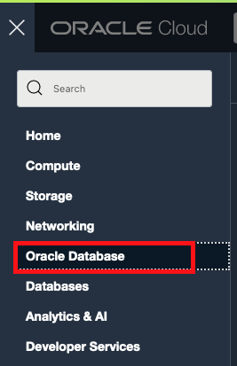

# Provisioning an Autonomous Transaction Processing Database Instance

## Introduction

This lab walks you through the steps to get started using the Oracle Autonomous Transaction Processing Database on Oracle dedicated Autonomous Infrastructure. You will provision a new database.

Estimated Time: 10 minutes

### Objectives

As a database user, DBA or application developer:

1. Rapidly deploy autonomous transaction processing databases.
2. Manage your database backups.

### Required Artifacts

- An Oracle Cloud Infrastructure account with a pre-provisioned Exadata Infrastructure and Container Database

## Task 1: Create an Autonomous Transaction Processing Database

In this section you will be provisioning a dedicated autonomous database using the cloud console.

*Log in to your OCI account as a database user*

-  Click the hamburger menu icon on the top left of the screen.

    

-  Click **Autonomous Transaction Processing** from the menu.

    

- Select **userXX-Compartment under the Workshop Compartment** and click on **Create Autonomous Database** button to start instance creation process.

    

    *Note: Oracle Cloud Infrastructure allows logical isolation of users within a tenancy through Compartments. This allows multiple users and business units to share an OCI tenancy while being isolated from each other.*

    **If you have chosen a compartment you do not have privileges on, such as a root compartment or fleet compartment, you will not be able to provision an ADB instance in it.**

    More information about Compartments and Policies is provided in the OCI Identity and Access Management [documentation](https://docs.cloud.oracle.com/iaas/Content/Identity/Tasks/managingcompartments.htm?tocpath=Services%7CIAM%7C_____13).


-  This will bring up the **Create Autonomous Database** screen where you specify the configuration of the instance.

    

-  Choose workload type **Transaction Processing** and deployment type **Dedicated Infrastructure**.

    

- Choose the right **Compartment** under Autonomous Container Database and select the right **Autonomous Container Database** from the dropdown.
 
     *Note this would be the fleetCompartment*

    


-  You can choose an instance shape, specified by the CPU count and storage size. Default CPU count is 1 and storage is 32 GB. You can also enable **OCPU auto scaling** option.

    

-  Specify the password for the instance.

    *For this lab, we will be using the following as a password.*

    ```
    <copy>
    WElcome#1234
    </copy>
    ```

    


- You can Configure Database-level network access by clicking **Modify Access Control** button.

    

-  Click **Create Autonomous Database** to start provisioning the instance.

- Your autonomous database instance should be up and running in a few minutes.


-  Once provisioned, you can click on the instance name to see instance details.

    

There are a few other things you can do as an administrator of your autonomous database.

- You can take a manual on-demand backup in addition to the scheduled daily backups. Scroll down to *Resources* and Click **Backups** --> **Create Manual Backup** on the database details page, provide a name and click **Create Manual Backup** once again on the dialog box.

    
    
    

- You can do a point in time restore on your database.

    - The service allows you to flash back your database to a specified time in the past using a combination of flashback logs and backups.

    - You can restore from a previous backup.

        

        

You may now **proceed to the next lab**.

## Acknowledgements

*All Done! You have successfully deployed your Autonomous Database instance and it should be ready for use in a few minutes.*

- **Author** - Tejus S. & Kris Bhanushali
- **Adapted by** -  Yaisah Granillo, Cloud Solution Engineer
- **Last Updated By/Date** - Kris Bhanushali, April 2022

## See an issue or have feedback?  
Please submit feedback [here](https://apexapps.oracle.com/pls/apex/f?p=133:1:::::P1_FEEDBACK:1).   Select 'Autonomous DB on Dedicated Exadata' as workshop name, include Lab name and issue / feedback details. Thank you!
