# Provision Cloud Exadata Infrastructure for Autonomous AI Database in OCI

## Introduction

A Cloud Exadata Infrastructure resource is the top-level (parent) resource for Autonomous AI Database on Dedicated Exadata Infrastructure. At the infrastructure level, you control the number of database and storage servers and the Exadata system maintenance schedule. Before you can create an Autonomous AI Database, you must create an Exadata Infrastructure resource, an Autonomous VM Cluster, and an Autonomous Container Database.

Estimated Time: 20 minutes

### Objectives

As a fleet administrator:

1. Deploy Cloud Exadata Infrastructure in your OCI account.
2. Understand Cloud Exadata Infrastructure maintenance scheduling.

### Required Artifacts

- An Oracle Cloud Infrastructure account with service limits to deploy at least one quarter rack of Exadata Infrastructure (two database servers and three storage servers) in an Availability Domain in your chosen region.
- The required IAM policies to create Exadata Infrastructure: `manage cloud-exadata-infrastructures`, `use vnic`, and `use subnet`. See [IAM Policies for Autonomous AI Database on Dedicated Exadata Infrastructure](https://docs.oracle.com/iaas/autonomous-database/doc/iam-policies-autonomous-database-dedicated-exadata-infrastructure.html).
- A compartment and network prepared in the [Preparing your private network in Oracle Cloud Infrastructure](?lab=adb-network-prepare) lab.

## Task 1: Check or request service-limit increases in your tenancy to create Cloud Exadata Infrastructure

Your tenancy has service limits that define the maximum number of resources you can use. You can use quotas to allocate resources to compartments. If you are an administrator in an eligible account, you can request a service-limit increase.

*Sign in to your OCI account as an administrator.*

- In the OCI Console navigation menu, select **Governance & Administration**. Under **Tenancy Management**, select **Limits, quotas and usage**.

    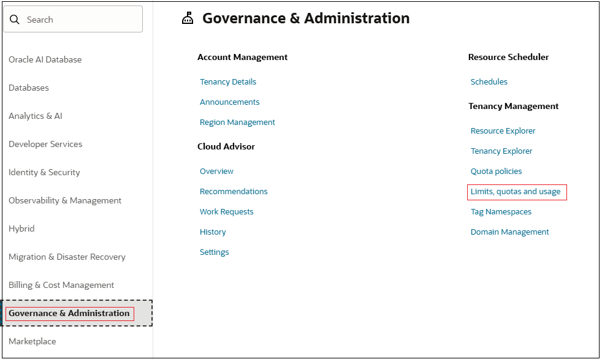

- Select **Edit Filters** and set **Service** to **Database**. For **Scope**, select the Availability Domain in which you plan to deploy Cloud Exadata Infrastructure. For **Compartment**, select the target compartment, then select **Update**. In the search box, enter **Exadata X11M**.
- The list displays the available and used values for **Exadata X11M Database Server Count** and **Exadata X11M Storage Server Count** in the selected Availability Domain.

    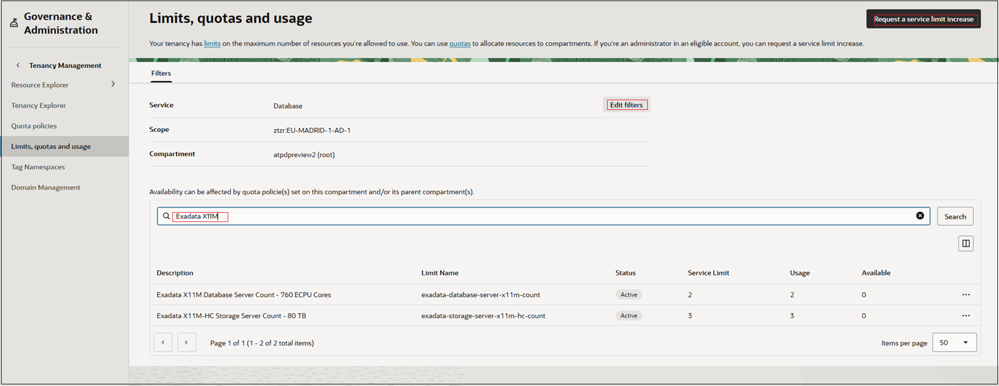

- If the available limits are insufficient, request a service-limit increase. Open the **Help** menu and, under **Targeted help**, select **Request a limit increase**. Enter a request name and reason, then select **Next**.

    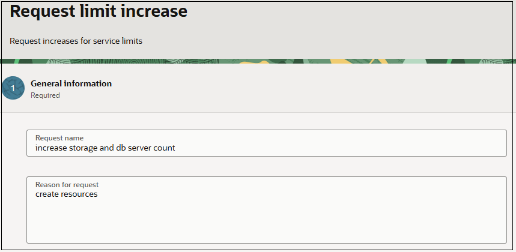

- Add the required **Database - Exadata service** limit items, and specify the requested database-server and storage-server values for each applicable Availability Domain.

    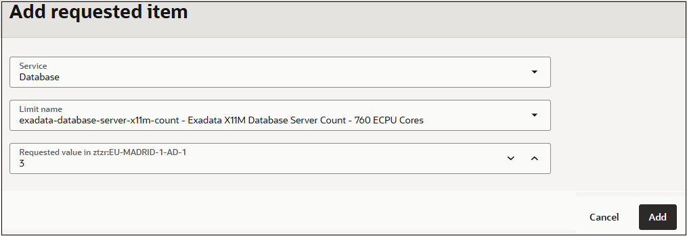

- Review the requested values and select **Submit**.

    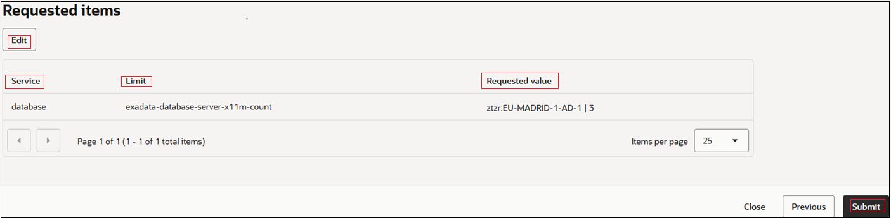

## Task 2: Deploy Cloud Exadata Infrastructure

*Sign in to your OCI account as a fleet administrator.*

- In the OCI Console navigation menu, go to **Autonomous AI Database**. In the side menu, select **Exadata Infrastructure**. You will be redirected to the Exadata Infrastructure page under Exadata Database Service on Dedicated Exadata Infrastructure.

- Select the fleet compartment prepared in the [network-preparation lab](?lab=adb-network-prepare), then select **Create Exadata Infrastructure**.

  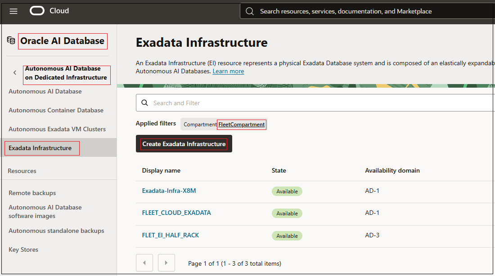

- Enter a user-friendly **Display name** that helps you identify the Exadata Infrastructure. Select the Availability Domain in which you want to create the Cloud Exadata Infrastructure (CEI), then choose the Oracle Exadata Database Machine type to allocate to this resource.

  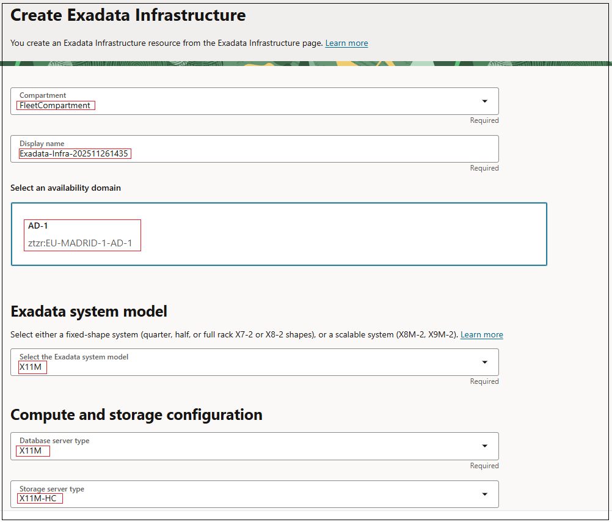

- Specify the number of database and storage servers for the Exadata Infrastructure resource. The default configuration is two database servers and three storage servers. You can choose different values within the ranges supported by the selected Exadata Database machine type and the available service limits.

  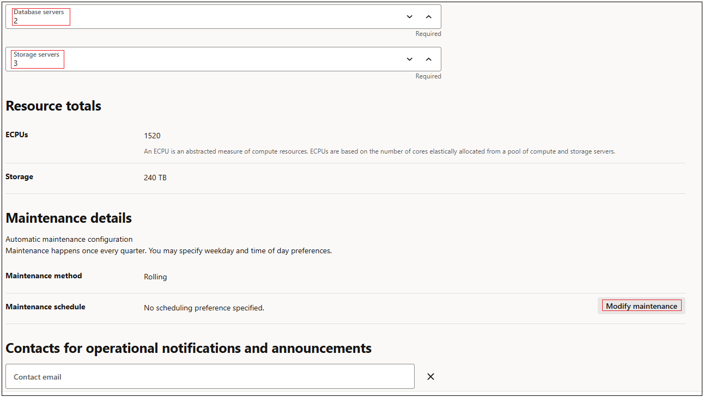

- Optionally, configure the automatic maintenance schedule by selecting **Modify maintenance**.

  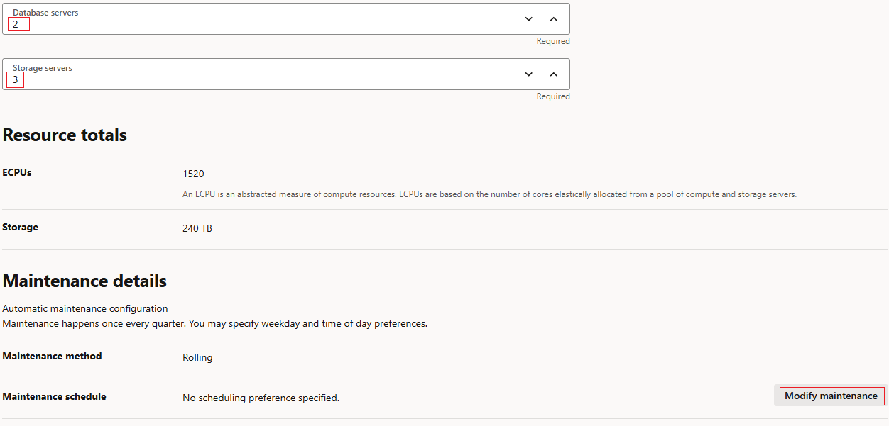

- You can change the maintenance schedule by specifying the quarter, week, day, and time for automatic maintenance of your Exadata hardware.

  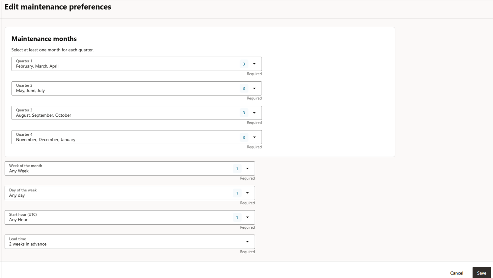

- Add contact email addresses for operational notifications and announcements, then select **Create Exadata Infrastructure**. When the Exadata Infrastructure becomes available, you can proceed to create an Autonomous VM Cluster and an Autonomous Container Database.

  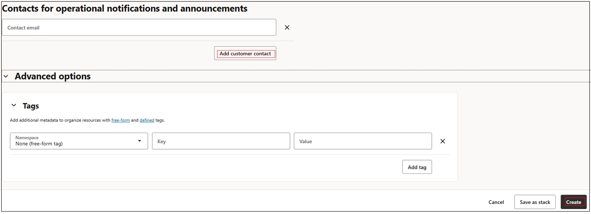

*All done! You have successfully deployed Cloud Exadata Infrastructure.*

You may now **proceed to the next lab**.

## Learn More
[Creating an Exadata Cloud Infrastructure Instance](https://docs.oracle.com/en-us/iaas/exadatacloud/doc/ecs-create-instance.html#GUID-7860EF16-E79E-48DA-9D44-B5EE7B59B492)

## Acknowledgements

- **Author** - Ranganath S R & Kris Bhanushali
- **Adapted by** -  Vandana Rajamani, Consulting UA Developer, July 2026
- **Last Updated By/Date** - Vandana Rajamani, Consulting UA Developer, July 2026
