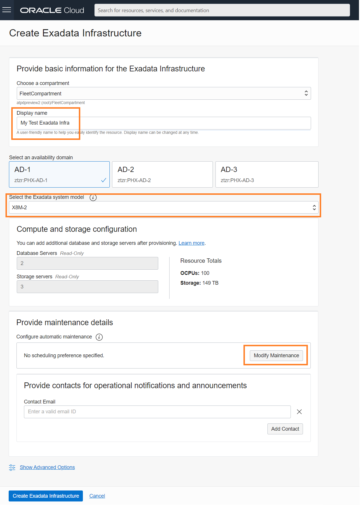

# Provisioning a Cloud Exadata Infrastructure for Autonomous Database in OCI

## Introduction
A Cloud Exadata Infrastructure resource is the top-level (parent) resource for Autonomous Database on Dedicated Infrastructure. At the infrastructure level, you control the number of database and storage servers. You also control Exadata system maintenance scheduling at the Exadata infrastructure level. You must create at least one Exadata Infrastructure resource before you can create any of the other kinds of dedicated infrastructure resources such as Autonomous Container Databases or simply an Autonomous Database instance.

Estimated Time: 20 minutes

### Objectives

As a fleet administrator:
1. Deploy Cloud Exadata Infrastructure in your OCI account.
2. Understand Cloud Exadata Infrastructure maintenance scheduling.

### Required Artifacts
- An Oracle Cloud Infrastructure account with service limits to deploy at least one 1/4 rack of Exadata Infrastructure (or 2 database servers and 3 storage servers limits) in any region's Availability Domain.
- You also need privileges to create Exadata Infrastructure and Autonomous Container database in a pre-provisioned compartment and network.

Watch the video below for an overview of creating a Cloud Exadata Infrastructure.

## Task 1: Check / Add Service Limits in your tenancy to create Cloud Exadata Infrastructure.

Your tenancy has limits on the maximum number of resources you're allowed to use. You can use quotas to allocate resources to compartments. If you're an administrator in an eligible account, you can request a service limit increase.

*Log in to your OCI account as an Administrator.*

- Navigate to **Governance & Administration** --> **Limits, Quotas and Usage**

    

- Under **Limits, Quotas and Usage**, select Service as **Database**, Scope **Availability Domain** you want to deploy your Cloud Exadata infrastructure. The list should show all the available resources, Exadata X8M Database Server Count and Exadata X8M Storage Server Count available or used in selected Availability Domain. 

    
    

- To increase the Service in your teanancy, click on **request a service limit increase** and fill in the detals in **Request Service Limit Updates**.

    
    

## Task 2: Deploy your Cloud Exadata Infrastructure

*Log in to your OCI account as a fleet administrator.*

- Navigate to the **Autonomous Dedicated Infrastructure** option in the top left hamburger menu from your OCI home screen.

    

- Select **Exadata Infrastructure** and ensure you pick the fleet compartment as shown above. Click the blue **Create Exadata Infrastructure** button.

    

- Enter a name for the Exadata Infrastructure and select the Availability Domain in which you want the CEI to be created. Based on the Exadata System model that you select, you will have options to select different Exadata shapes.  

- You can also modify the exadata maintenance schedules at this time. Click the **Modify Maintenance** button and specify the quarter, week, day and time you would like to schedule automatic maintenance for your exadata hardware.

    

- After you add the contact emails for operational notifications and announcements, click **Create Exadata Infrastructure**. Your CEI will soon be ready to deploy autonomous container databases.

*All Done! You have successfully deployed your Autonomous Exadata Infrastructure and it should be available shortly.*

You may now **proceed to the next lab**.

## Acknowledgements

- **Author** - Ranganath S R & Kris Bhanushali
- **Adapted by** -  Yaisah Granillo, Cloud Solution Engineer
- **Updated By/Date** - Ranganath S R, Feb 2022
- **Last Updated By/Date** - Kris Bhanushali, March 2022

## See an issue or have feedback?  
Please submit feedback [here](https://apexapps.oracle.com/pls/apex/f?p=133:1:::::P1_FEEDBACK:1).   Select 'Autonomous DB on Dedicated Exadata' as workshop name, include Lab name and issue / feedback details. Thank you!
