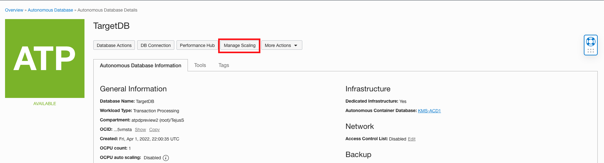
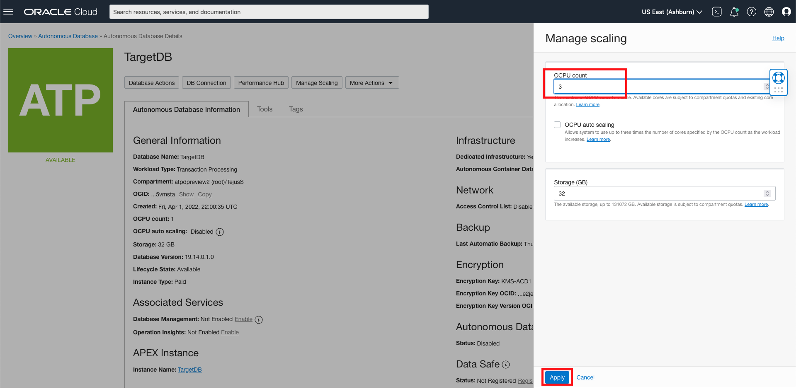
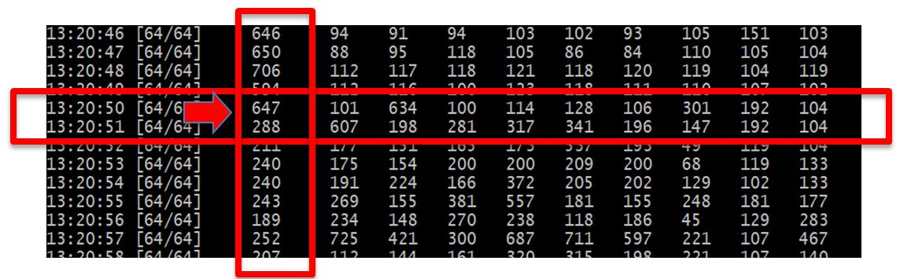

# Test online scaling capabilities of the autonomous database service

## Introduction
Continuous uptime is a key requirement of most business critical applications. While the cloud provides the notion of unlimited scale, this scalability comes at a cost of downtime with most services. The Oracle autonomous database service provides scalability without downtime as demonstrated in this lab.

Estimated Time: 20 minutes

### Objectives

As an administrator:
1. Simulate a production workload using Swingbench load generator.
2. Scale up the OCPUs in your autonomous database service through cloud console and observe effect on the workload performance.
3. Scale down the OCPUs in your autonomous database service through cloud console and observe effect on the workload performance.

### Required Artifacts

- An Oracle Cloud Infrastructure account.
- A pre-provisioned instance of Oracle Developer Client image configured with Swingbench in an application subnet. Refer to the earlier lab, **Build Always On Applications**.
- A pre-provisioned Autonomous Transaction Processing instance. Refer to the earlier lab, **Provisioning Databases**.
- Successful completion of the earlier labs, **Configure a Development System** and **Build Always On Applications**.

## Task 1: Log in to the Oracle Cloud Developer image and start the order entry workload

- To complete this lab it's mandatory you have a developer client image configured with Swingbench, an autonomous dedicated database instance with the wallet uploaded to the dev client. Follow instructions in the earlier labs, **Configure a Development System** and **Build Always On Applications**.

*The remainder of this lab assumes you are connected to the image through VNC Viewer and are operating from the image itself and not your local machine.*

- SSH into your developer client machine and navigate to the folder /home/opc/swingbench/bin.

- Start order entry workload.

- You can now generate loads on your database by running the charbench utility.  Use the command below. There are 2 parameters you can change to modify the amount of load and users being generated.

    ``The –uc flag specifies the number of users that will be ramped up, in the case below 64. The –rt flag specifies the total running time which is set to 30 seconds by default.``  

    You can stop running charbench at any time with *Ctrl C.*

    ```
    <copy>
    /home/opc/swingbench/bin/charbench -c /home/opc/swingbench/configs/SOE_Server_Side_V2.xml \
                -cf ~/Downloads/your_wallet.zip \
                -cs yourdb_tp \
                -u soe \
                -p yourpassword \
                -v users,tpm,tps,vresp \
                -intermin 0 \
                -intermax 0 \
                -min 0 \
                -max 0 \
                -uc 64
    </copy>
    ```

- Once Swingbench starts running, you will see results similar to the screen below. The first column is a time stamp, the second column indicates how many users of the total users requested with the *-uc* parameter are active, and of interest is the third column which indicates transactions per second. If you see any intermittent connect or other error messages, ignore those.

    

## Task 2: Scale up the OCPUs in your autonomous database service

Now, let's scale the autonomous database you created in previous labs from 1 OCPU to 2 or more while Swingbench continues running. You should see the transactions/sec numbers start changing as your database is scaling. Please note that this is also highly influenced by the connection service your are using with the *-cs* parameter. In the statement above we are using the *\_tp* service, but while you are experimenting, stop and start Swingbench with a different service, such as *\_low*, or *\_high* to see what differences you observe.

- To scale the system, go to your Cloud Database Console and select **Manage Scaling**:

    

- When the scaling windows pops up, enter a new **CPU CORE COUNT** and click **Apply**.

    

- The database status will go into **Scaling**. When done it will turn back to **Available**. Please note that during all this time the Swingbench application will continue to run because there is no disruption to the service for scaling. You should also notice that the transactions per second increased or decreased depending on whether you scale the system up or down in number of CPU's.

    

You may now **proceed to the next lab**.

## Acknowledgements
*Congratulations! You successfully tested online scaling capabilities of your autonomous database service.*

- **Author** - Tejus S. & Kris Bhanushali
- **Adapted by** -  Yaisah Granillo, Cloud Solution Engineer
- **Last Updated By/Date** - Kris Bhanushali, March 2022

## See an issue or have feedback?  
Please submit feedback [here](https://apexapps.oracle.com/pls/apex/f?p=133:1:::::P1_FEEDBACK:1).   Select 'Autonomous DB on Dedicated Exadata' as workshop name, include Lab name and issue / feedback details. Thank you!
