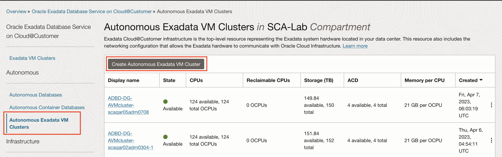
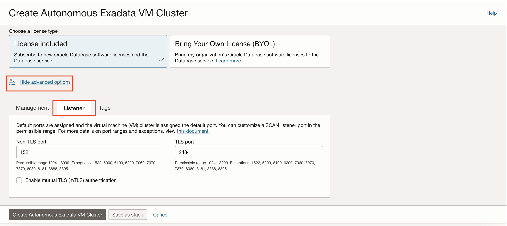
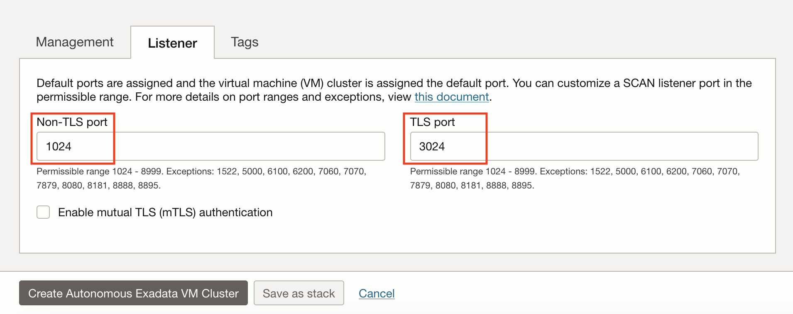
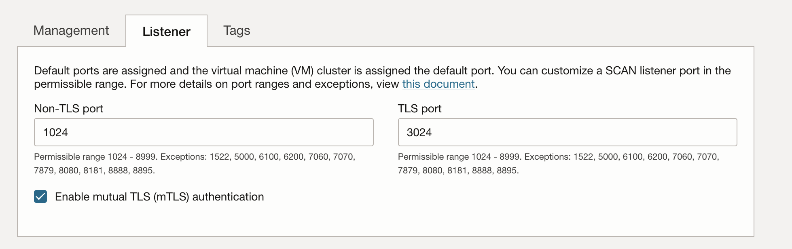
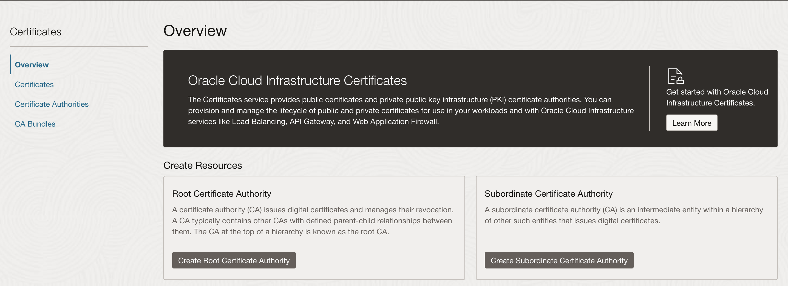
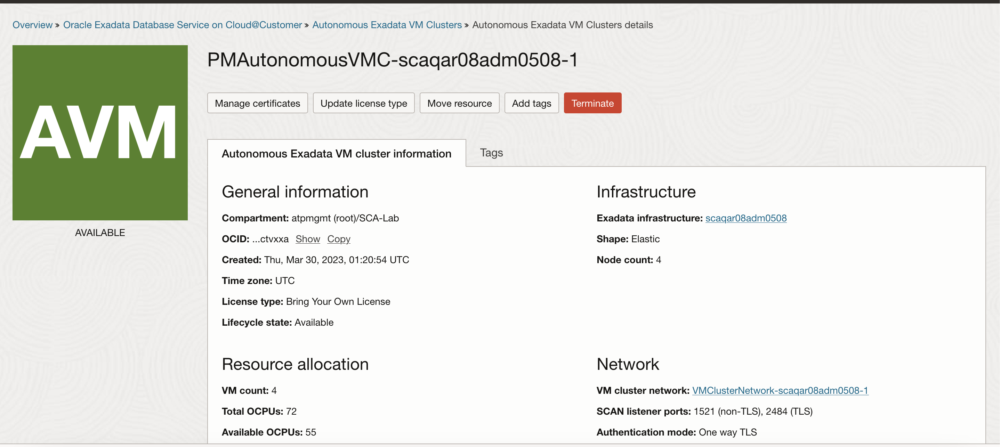
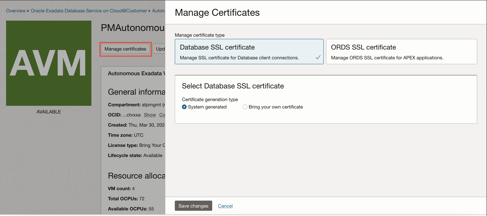
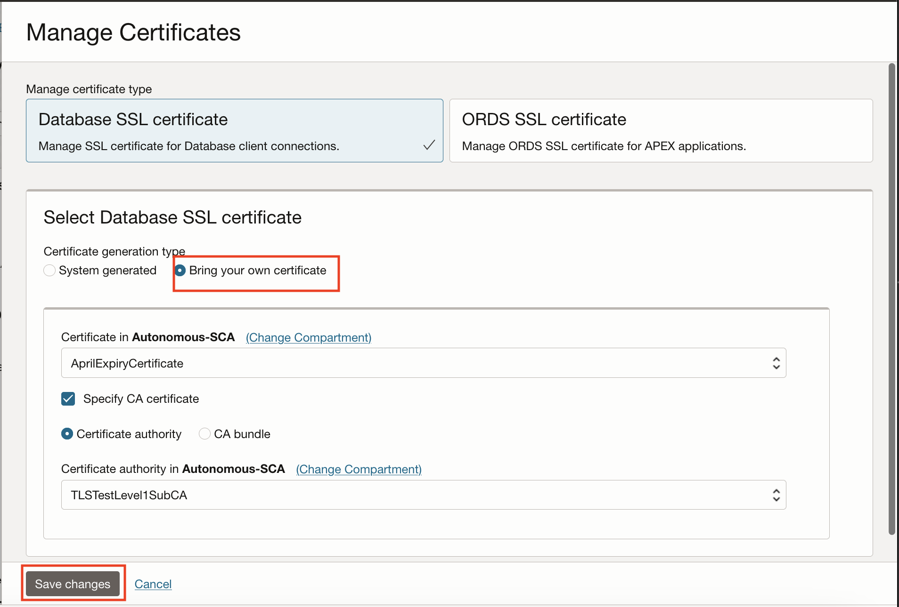
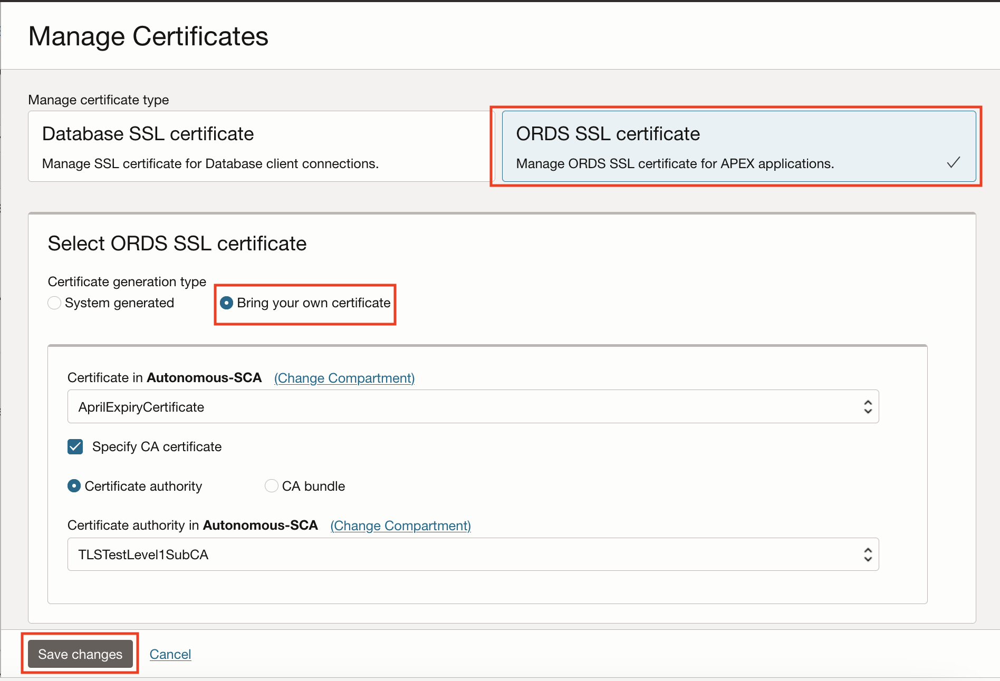
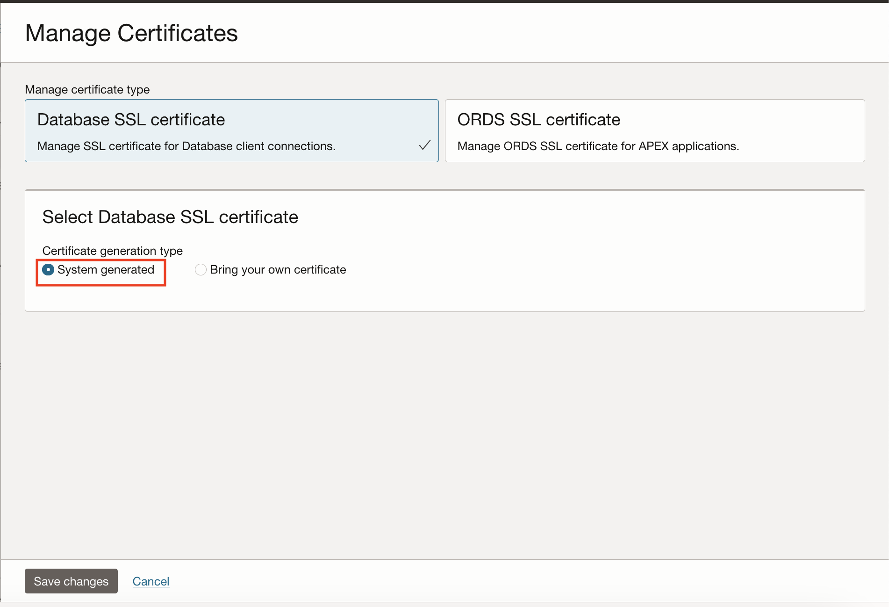

# Configure SCAN Listener port and Bring your own certificates

## Introduction
This lab introduces the functionality to configure SCAN Listener port for Non-TLS and TLS, choose between TLS and mTLS for Autonomous Database and bring or rotate your own TLS and ORDS certificates with Autonomous Exadata VM Cluster on Exadata Cloud@Customer.

While provisioning an Autonomous Exadata VM Cluster on Exadata Cloud@Customer, you can now customize SCAN Listener port for TLS and NON-TLS. You can also choose to authenticate between one-way TLS or mutual TLS. This will allow you to provide a higher level of security for your application connections.

Estimated Time: 20 minutes

### Objectives

As a database security administrator:
1. Configure SCAN Listener port for TLS and Non-TLS
2. Enable mutual TLS authentication
3. Bring your own Database and ORDS certificates via integration with OCI Certificate Service

### Required Artifacts

- An Oracle Cloud Infrastructure account.

## Task 1: Configure SCAN Listener Port

As a Database Security admin, you can now select a non-default SCAN Listener port for both TLS and Non-TLS connections. 

- Log in to your OCI tenancy and navigate to Autonomous Exadata VM Cluster and click on Create Autonomous Exadata VM Cluster.

    

- Enter all the required details and click on Show advanced options and click on Listener.

    

**By Default Non-TLS is assigned to 1521 and TLS is assigned to 2484 to VM Cluster.**

- Enter your Non-TLS port and TLS port. You can customize SCAN Listener port in the permissible range. 
    
    Permissible range: 1024-8999. 
    
    Exceptions: 1522, 5000, 6100, 6200, 7060, 7070, 7879, 8080, 8181, 8888, 8895.   

    

- Check on Enable mutual TLS authentication, to enable mTLS. 

    

- Click Create Autonomous Exadata VM Cluster to create with configured SCAN Listener ports and mutual TLS enabled.

## Task 2: Manage Certificates

You can now manage database listener TLS certificates and ORDS TLS certificates for the Autonomous Exadata VM Cluster. This functionality helps you to 

1. Change from Oracle managed certificates to customer provided certificates.
2. Change from customer provided certificates to Oracle managed certificates.

- Certificate, Certificate Authorities and CA Bundles are created in Oracle Cloud Infrastructure Certificates Service.

- Click on Menu and navigate to **Identity & Security** and **Certificates** .

    .

**Refer to [This documentation](https://docs.oracle.com/en-us/iaas/Content/certificates/managing-certificates.htm#creating_certificate) on how to create a Certificate**.

**Refer to [This documentation](https://docs.oracle.com/en-us/iaas/Content/certificates/managing-certificate-authorities.htm#creating_certificate_authority) on how to create a Certificate Authority**.

**Refer to [This documentation](https://docs.oracle.com/en-us/iaas/Content/certificates/managing-CAbundles.htm#creating_CA_bundle) on how to create a CA Bundle**.
    
- Once you have created your Certificate, Certificate Authority and CA Bundle, navigate to your Autonomous Exadata VM Cluster.

    

- Click on Manage Certificates to change to a System generated or Bring your own Certificate for Database and ORDS Certificates.

    

- To Bring your own Database certificate, Select **Bring your own certificate** under **Select Database SSL certificate**. Choose the right Compartment where you created your Certificate, Crtificate Authority or CA Bundle and select **Certificate** and **Certificate Authority** or **CA Bundle** from the dropdown list and click Save.

    

- To Bring your own ORDS certificate, Select **Bring your own certificate** under **Select ORDS SSL certificate**. Choose the right Compartment where you created your Certificate, Crtificate Authority or CA Bundle and select **Certificate** and **Certificate Authority** or **CA Bundle** from the dropdown list and click Save.

    

- To change from customer provided certificate to Oracle managed certificate, Select **system generated** under **Select Database SSL certificate** and click Save.

    

## Acknowledgements
*Congratulations! You successfully configured the SCAN listener port for TLS and Non-TLS and enabled mutual TLS for Autonomous Exadata VM Cluster and used customer provided certificates*

- **Author** - Tejus S
- **Last Updated By/Date** -  Tejus S, Autonomous Database Product Management, April 2023

