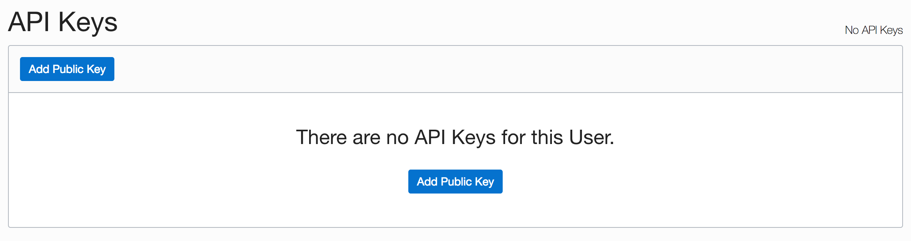
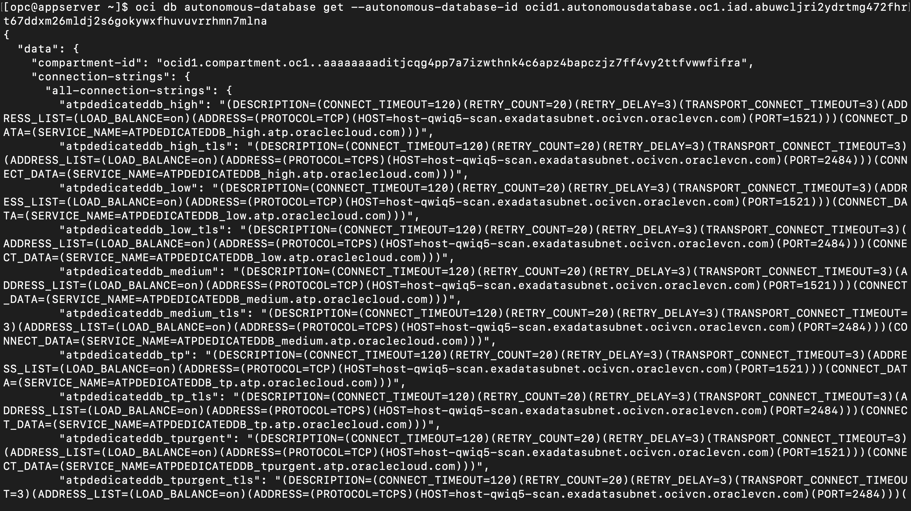
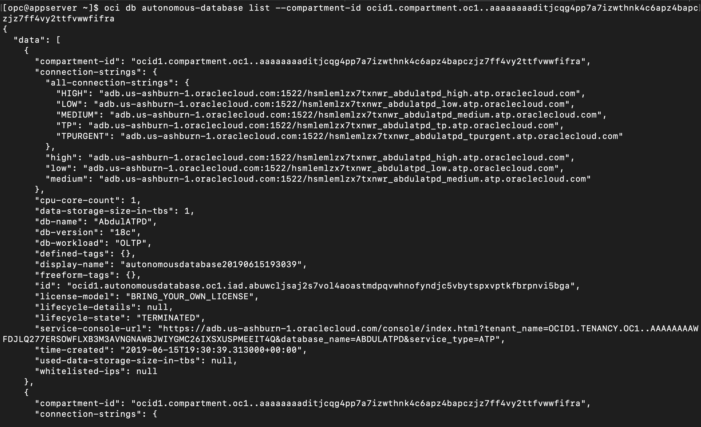
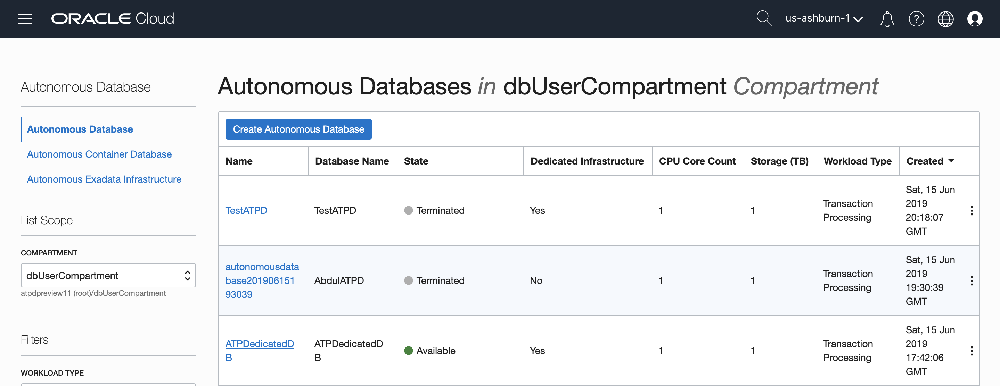

# Using CLI commands to work with your Autonomous Databases

## Introduction

The Oracle Cloud Infrastructure Command Line Interface, OCI CLI, is a small footprint tool that you can use on its own or with the Console to complete Oracle Cloud Infrastructure tasks. The CLI provides the same core functionality as the Console, plus additional commands. Some of these, such as the ability to run scripts, extend the Console's functionality.

This CLI and sample is dual-licensed under the Universal Permissive License 1.0 and the Apache License 2.0; third-party content is separately licensed as described in the code.

The CLI is built on Python (version 2.7.5 or later), running on Mac, Windows, or Linux. The Python code makes calls to Oracle Cloud Infrastructure APIs to provide the functionality implemented for the various services. These are REST APIs that use HTTPS requests and responses. For more information, see [About the API](https://docs.cloud.oracle.com/iaas/Content/API/Concepts/usingapi.htm).

This lab walks you through some examples using the OCI CLI for Autonomous Transaction Processing - Dedicated.

Estimated Time: 30 minutes

### Objectives

As a developer, DBA or DevOps user,

1. Create/Destroy your autonomous database instances using a command line interface.
2. Interact with Oracle Cloud Infrastructure resource using a CLI instead of a web console.

### Required Artifacts

- An Oracle Cloud Infrastructure account with privileges to create dedicated autonomous databases.
- A pre-provisioned instance of Oracle Cloud Developer Image from the OCI marketplace.

    *Note: The OCI Marketplace 'Developer Cloud Image' is pre-configured with many client tools and drivers including OCI command line interface.*

## Task 1: Connect to development client instance and verify OCI CLI version

- To ensure the installed OCI-CLI is the correct version needed for ATP-Dedicated database, let's ssh into the dev client host and check the version.

    ```
    <copy>
    $ ssh -i <ssh_key> opc@<ip address>
    $ oci --version
    </copy>
    ```
    **The OCI CLI version needs to be 2.5.14 or higher to support dedicated autonomous database commands. Refer to the [OCI CLI Github Change Log](https://github.com/oracle/oci-cli/blob/master/CHANGELOG.rst#2514---2019-06-11) for version details.**

## Task 2: Configure OCI CLI

- This step describes the required configuration for the CLI and includes optional configurations that enable you to extend CLI functionality.

- Before using the CLI, you have to create a config file that contains the required credentials for working with your Oracle Cloud Infrastructure account. You can create this file using a setup dialog or manually, using a text editor.

- To have the CLI walk you through the first-time setup process, step by step, use:

    ```
    <copy>
    $ oci setup config
    </copy>
    ```

- The command prompts you for the information required for the config file and the API public/private keys. The setup dialog generates an API key pair and creates the config file.
    

- Once you run the above command, you will need to enter the following:

    - *Enter a location for your config [/home/opc/.oci/config]*: Press Return key
    - *Enter a user OCID*: This is located on your user information page in OCI console

    - To access your user OCID, click the user icon on the top right of the page and click your username from the menu.
    

        - Copy the user OCID from the user details page.
    

    - *Enter a tenancy OCID*: Similarly, for the tenancy, click the tenancy name in the top right menu as shown above and copy the tenancy OCID.

    - *Enter a region (e.g. eu-frankfurt-1, uk-london-1, us-ashburn-1, us-phoenix-1)*: Select a region

    - *Do you want to generate a new RSA key pair? (If you decline you will be asked to supply the path to an existing key.) [Y/n]*: Y
    - *Enter a directory for your keys to be created [/home/opc/.oci]*: Press Return key
    - *Enter a name for your key [oci_api_key]*: Press Return key
    - *Enter a passphrase for your private key (empty for no passphrase)*: Press Return key

## Task 3: Add public key to Oracle Cloud Infrastructure

- Now that you have a private / public key combo, you must add it to OCI Console:

    Add public key to OCI User setting.

- Open Terminal and navigate to folder containing *oci\_api\_key\_public.pem*. Copy the public key.

    ```
    <copy>
    cat oci_api_key_public.pem
    </copy>
    ```

    

- Log in to your OCI console and click **Menu**. Select **Identity and Users**. Select a User and navigate to User Detail page.

- Click **Add Public Key** under API Keys section.
    

    

- Paste Public key which you copied from CLI in Add Public Key.
    

- Once you add the key, run the command below, to autocomplete OCI setup.

    ```
    <copy>
    oci setup autocomplete
    </copy>
    ```

    

## Task 4: Interacting with Oracle Autonomous Database

- Now that you have set up OCI CLI, let us look at examples of using Autonomous Transaction Processing Database.

- Let's start with a simpler command to get details on your autonomous database instance.

### *Get Database*

- Open your command line interface and run the following command to get details of an Autonomous Transaction Processing Database.

    ```
    <copy>
    oci db autonomous-database get --autonomous-database-id [OCID]
    </copy>
    ```

    For Example:

    ```
    <copy>
    oci db autonomous-database get --autonomous-database-id ocid1.autonomousdatabase.oc1.iad.abuwcljri2ydrtmg472fhrt67ddxm26mldj2s6gokywxfhuvuvrrhmn7mlna
    </copy>
    ```

    You are expected to see the following output in the command line interface.
    
    

**Note:** the compartment-id OCIDs are provided in the json output above. Make a note of the compartment-id OCID assigned to you, as you need it in the following example to list databases in a compartment.

### *Listing Databases*

- Open your command line interface and run the following command to list all Autonomous Transaction Processing Databases in a specific compartment.

    ```
    <copy>
    oci db autonomous-database list --compartment-id [OCID]
    </copy>
    ```

    For example:

    ```
    <copy>
    oci db autonomous-database list -c ocid1.compartment.oc1..aaaaaaaahnmqede4hg2sdom74lpljjwyu6nc6o2jr77rc5wagez3cwutu57a
    </copy>
    ```

    You are expected to see the following output in the command line interface.
    

- Run the following command to list all Autonomous Transaction Processing Databases in a specific compartment in a specific Container database.

    ```
    <copy>
    oci db autonomous-database list --compartment-id [OCID] --autonomous-container-database-id [OCID]
    </copy>
    ```

    For Example:

    ```
    <copy>
    oci db autonomous-database list --compartment-id ocid1.compartment.oc1..aaaaaaaaditjcqg4pp7a5izwthnk4c6apz4bapczjz7ff4vy2ttfvwwfifra --autonomous-container-database-id ocid1.autonomouscontainerdatabase.oc1.iad.abuwcljror6spbcnp56j4ihw3rg5k23hjfk24hgiush43akcl7h5k6iobjmvhq
    </copy>
    ```

    You are expected to see the following output in the command line interface.
    
    


### *Creating Database*

- To create an autonomous dedicated database you will need some information handy such as the OCID of the Container Database and OCID of the compartment you want to create the database in. Once you have that ready, open your command line interface and run the following command to create an Autonomous Transaction Processing (dedicated) Database.

    *To find the OCID of the container database, simply navigate to your autonomous database details page and click on the link for container DB. This will take you to the container DB details page and you can copy the OCID there.*
        

    ```
    <copy>
    oci db autonomous-database create --admin-password [password] --compartment-id [OCID] --cpu-core-count [integer] --data-storage-size-in-tbs [integer] --db-name [Database Name] --display-name [Display Name] --is-dedicated True --autonomous-container-database-id [OCID]
    </copy>
    ```

    For example:

    ```
    <copy>
    oci db autonomous-database create --admin-password "WElcome_123#" -c ocid1.compartment.oc1..aaaaaaaaditjcqg4pp7a7izwthnk4c6apz4bapczjz7ff4vy2ttfvwwfifra --cpu-core-count 1 --data-storage-size-in-tbs 1 --db-name "prodATPD1" --display-name "ProdATPD" --is-dedicated True --autonomous-container-database-id ocid1.autonomouscontainerdatabase.oc1.iad.abuwcljrlpmviswncdr6x7f5jo5pkjynxsnyqbtdyvshe7373qds7tetebva
    </copy>
    ```

    You are expected to see the following output in the command line interface.
    
    

### *Deleting Database*

- Open your command line interface and run the following command to delete an Autonomous Transaction Processing Database:

    ```
    <copy>
    oci db autonomous-database delete --autonomous-database-id [OCID]
    </copy>
    ```

    For example:

    ```
    <copy>
    oci db autonomous-database delete --autonomous-database-id ocid1.autonomousdatabase.oc1.iad.abuwcljror7qyzfpt2wwmypfyzlsbkksvg3srgeppe2bc7gbjkhipd73flva
    </copy>
    ```

    You are expected to see the following output in the command line interface.

- You will be asked *Are you sure you want to delete this resource? [Y/N]* type Y to confirm.
    

- Log in to OCI console and navigate to Autonomous Transaction Processing Database from Menu and confirm that the database is *Terminating*.
    
    

### Bonus Steps
*Similarly, you can try the following examples.*

#### *Restore Databse*
- Open your command line interface and run the following command to Restore Autonomous Transaction Processing Database.

    ```
    <copy>
    oci db autonomous-database restore --autonomous-database-id [OCID] --timestamp [datetime]
    </copy>
    ```

#### *Start Database*

- Open your command line interface and run the following command to Start Autonomous Transaction Processing Database.

    ```
    <copy>
    oci db autonomous-database start --autonomous-database-id [OCID]
    </copy>
    ```

#### *Stop Database*

- Open your command line interface and run the following command to Stop Autonomous Transaction Processing Database.

    ```
    <copy>
    oci db autonomous-database stop --autonomous-database-id [OCID]
    </copy>
    ```

#### *Update Database*

- Open your command line interface and run the following command to make updates.

    ```
    <copy>
    oci db autonomous-database update --autonomous-database-id [OCID] --cpu-core-count [integer]
    </copy>
    ```

These are a handful of examples on using the OCI CLI REST interface to work with autonomous databases in your OCI tenancy. For a complete command reference, check out [this OCI documentation](https://docs.cloud.oracle.com/iaas/tools/oci-cli/latest/oci_cli_docs/cmdref/db.html).

Congratulations! You successfully configured Oracle Cloud Infrastructure Command Line Interface and interacted with OCI resources using CLI commands. You may now **proceed to the next lab**.

## Acknowledgements

- **Author** - Tejus S. & Kris Bhanushali
- **Adapted by** -  Yaisah Granillo, Cloud Solution Engineer
- **Last Updated By/Date** - Kris Bhanushali, April 2022


## See an issue or have feedback?  
Please submit feedback [here](https://apexapps.oracle.com/pls/apex/f?p=133:1:::::P1_FEEDBACK:1).   Select 'Autonomous DB on Dedicated Exadata' as workshop name, include Lab name and issue / feedback details. Thank you!
