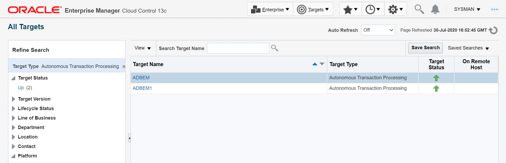

# Connecting to Autonomous Transaction Processing Dedicated from Oracle Enterprise Manager

## Introduction
The Oracle Cloud Infrastructure marketplace provides a pre-built image with necessary client tools and drivers to deploy compute instances and connect to Autonomous Transaction Processing Dedicated . A database administrator can now connect to ATPD from Oracle Enterprise Manager and monitor the performance. 

The image is pre-configured and installed with Oracle Enterprise manager.
For a complete list of features, login to your OCI account, select *Marketplace* --> *All Applications* from the top left menu and browse details on the *Oracle Enterprise Manager* Version 13.4.

*In this lab we will configure and access Autonomous dedicated Transaction Processing database from Oracle Enterprise Manager.*

Estimated Time: 60 minutes

### Objectives

As a Database Administrator,

1. Learn how to connect to Autonomous Dedicated Transaction Processing Database from Oracle Enterprise Manager.
   

### Required Artifacts

   - An Oracle Cloud Infrastructure account.
   - A pre-provisioned dedicated autonomous database instance. Refer to the *Provisioning Databases* lab in the *Introduction to ADB Dedicated for Developers and Database Users* workshop.
   - A pre-provisioned compute instace of Image type *Enterprise Manager 13.4*.


## Task 1: Create a Compute Instance with OEM installed in it

- Login to your Oracle Cloud Infrastructure account and select *Compute* —> *Instances* from top left menu.
    

- Click on "Create Instance" under your *Compartment*
    

- Under *Create compute instance*, select the compartment in which you create compute and click on *Change Image*
    
	
- Select *Enterprise Manager 13c Workshop* under *Oracle Images*.
	
	
- Select VCN compaertment and VCN, subnet compartment and subnet and then click on *Create*, which will create compute with EM installed"
	
	
- Copy the public IP address of the instance in a note pad. 
    

**Mac / Linux users**

- Open Terminal and SSH into linux host machine.

    ```
    <copy>
    sudo ssh -i /path_to/sshkeys/id_rsa opc@publicIP
    </copy>
    ```


**Windows users**

- You can connect to and manage linux host mahine using SSH client. Recent versions of Windows 10 provide OpenSSH client commands to create and manage SSH keys and make SSH connections from a command prompt.

- Other common Windows SSH clients you can install locally is PuTTY. Click [this documentation](https://docs.microsoft.com/en-us/azure/virtual-machines/linux/ssh-from-windows) to follow the steps to connect to linux host machine from you windows using PuTTY.

## Task 2: Connect to Oracle Enterprise Manager from web browser

- In your browser type the URL as "https://publicipaddress_of_oem_compute:7803/em"

## Task 3: Transfer database wallet to developer client

- Login to Oracle Cloud Infrastructure account and select *Autonomous Transaction Processing* from menu.
    

- Click on *Autonomous Database* and select your previously created database.
    

- Click on *DB Connection* and under *Download Client Credential(Wallet)* click *Download*.
    

- Provide a password and download the wallet to a local folder. 
    

    The credentials zip file contains the encryption wallet, Java keystore and other relevant files to make a secure TLS 1.2 connection to your database from client applications. Store this file in a secure location.
	
## Task 4: Add Autonomous Transaction Processing Database dedicated as Target in OEM

- Click *Setup* and select *Add Target* and click on *Add Targets Manually*.
    

- Click on *Add Target Declaratively*.
    

- Search the host name and select as *emcc.marketplace.com*.
    
    
    

- Select Target Type as *Autonomous Transaction Processing* and click on "Add..". 
    

- Give the Target Name as *ADBEM* (Target name can be anything of your desire)

- Select *OCI Client Credential (Wallet)* as ATPD instance wallet downloaded from console   

- Select *Service Name_low*.

- Give the *Monitoring Username• as *ADMIN*.

- Give *Monitoring Password* as wallet (.zip file) download password
	

- Click on *Test Connection* 
	

- Once the connection test is successful, click *Next*"* and Click on *Submit*. 
	
	
	
	
	
	
	
	
## Task 5: Test the Connection

- Click on *Targets* select *All Targets*.
	
	
- Under *Databases* select *Autonomous Transaction Processing*.
	
	
	
	
- Under *Target Name* select *ADBEM*.

## Task 6: Unlock "ADBSNMP" user.

- Select *Users* under *Security*
	

- The default user for OEM *ADBSNMP* will be locked by default, click on the user *ADBSNMP*.
	

- Click on *Edit*.
	

- Select *Unlocked* radio button and give the new password for *ADBSNMP* user and click on *Apply*.
	

- Once the change is saved check under *Users* in *Security*. The user *ADBSNMP* will be *Open*.
	

## Task 7: Establish Connection with ATP as "ADBSNMP" user.

- Repeat Task 4 with the below changes:

- Give the Target Name as *ADBEM2* (Target name can be anything of your desire)

- Select *OCI Client Credential (Wallet)* as ATPD instance wallet downloaded from console   

- Select *Service Name_low*

- Give the *Monitoring Username* as "ADBSNMP"

- Give "Monitoring Password" as ADBSNMP user password and click on "Test Connection"
	

- Once the connection test is successful, Click *OK* and click *Next*.
	

- Click on *Submit* to establish the connection	
	
	


You may now **proceed to the next lab**.

## Acknowledgements

*Congratulations! You have successfully established connection to Autonomous Transaction Processing Dedicated Database from OEM .*

- **Authors** - Navya M S & Padma Priya Natarajan
