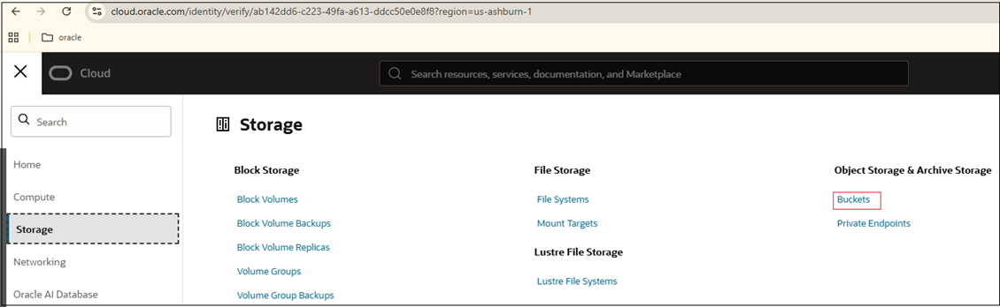
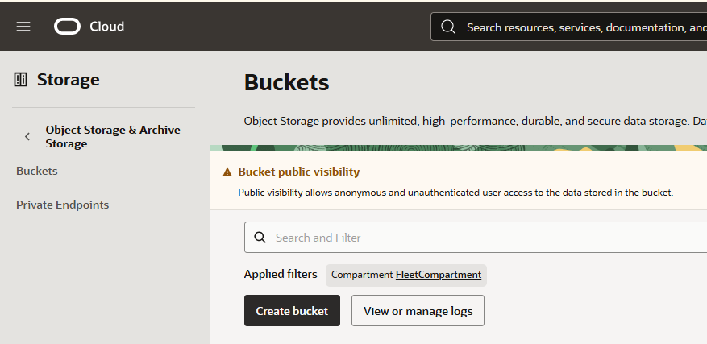
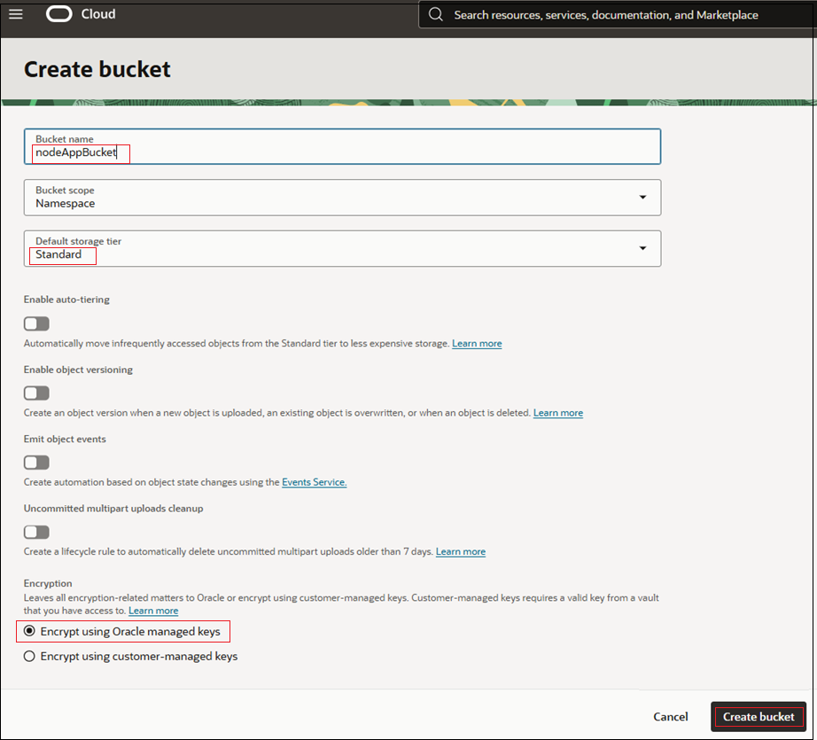
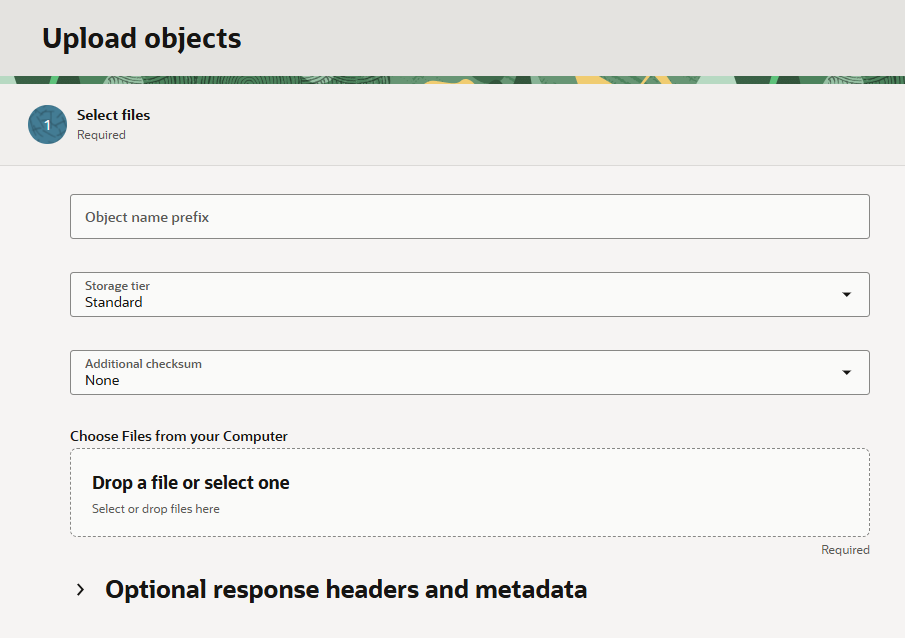
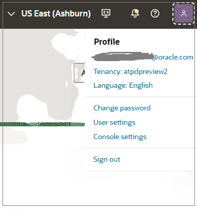
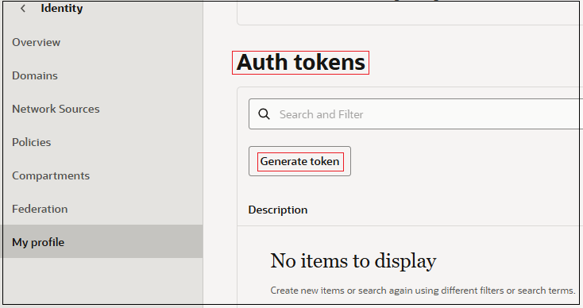
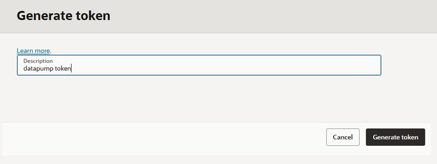
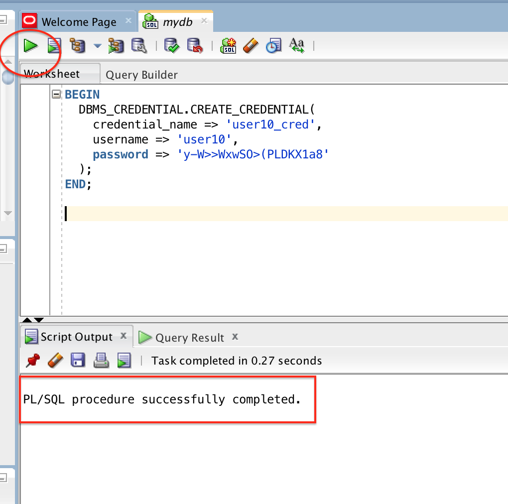
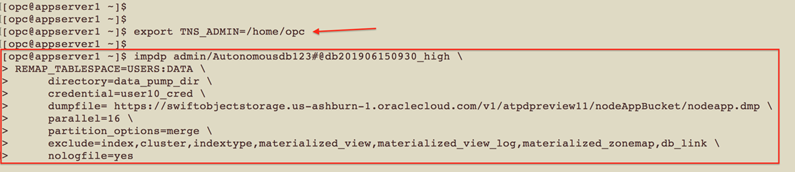
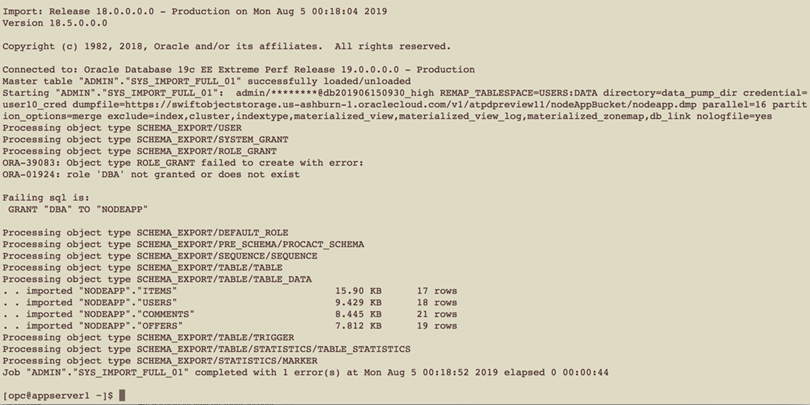

# Migrate to Autonomous AI Database on Dedicated Exadata Infrastructure using Data Pump

## Introduction

Oracle Data Pump provides fast bulk data and metadata movement between user-managed Oracle AI Databases and Autonomous AI Database on Dedicated Exadata Infrastructure.

Data Pump Import can import data from dump files stored in Oracle Cloud Infrastructure Object Storage. In this lab, you upload a sample dump file to Object Storage and use Data Pump Import to load it into an Autonomous AI Database on Dedicated Exadata Infrastructure.

This lab walks you through migrating a sample application schema into your Autonomous AI Database on Dedicated Exadata infrastructure by using Data Pump Import.

Estimated Time: 45 minutes

### Objectives

As a database admin or user:

1. Download a sample Data Pump export dump file from the Oracle Learning Library GitHub repository.
2. Upload the `.dmp` file to an OCI Object Storage bucket.
3. Create cloud credentials and use Data Pump Import to move data into your Autonomous AI Database on Dedicated Exadata Infrastructure.

### Required Artifacts

- An Oracle Cloud Infrastructure account with privileges to create Object Storage buckets and Autonomous AI Database on Dedicated Exadata Infrastructure.
- Access to a pre-provisioned Autonomous AI Database on Dedicated Exadata Infrastructure.
- A pre-provisioned Oracle Developer Client image in an application subnet. If you have not created one yet, complete the lab **Configuring a Development System** in [Autonomous Database Dedicated for Developers and Database Users workshop](https://livelabs.oracle.com/ords/r/dbpm/livelabs/run-workshop?p210_wid=3197).

## Task 1: Download sample Data Pump export file from Oracle Learning Library GitHub repository

- From your Mac or PC, run the following command to download the sample schema dump file from Oracle Learning Library.

    ```
    <copy>
    wget https://objectstorage.us-ashburn-1.oraclecloud.com/p/8fcg4NskCWAIMvRpLE_ivj-a7baylei6XFF5_B1knzw/n/atpdpreview11/b/adb-data-pump/o/nodeapp.dmp
    </copy>
    ```

## Task 2: Create an Object Storage bucket and upload the dump file

- Sign in to your OCI account.

- Open the navigation menu and click **Storage**. Under **Object Storage & Archive Storage**, click **Buckets**.

    

- Select a compartment where you have privileges to create a bucket, and then click **Create Bucket**.

    

- Create a bucket named **nodeAppBucket**. Leave the encryption options at their default values, and then click **Create Bucket**.

    

- Upload the **nodeapp.dmp** file that you downloaded in Task 1.

    

## Task 3: Generate an authentication token for your user account

- In the OCI Console, open the profile menu in the upper-right corner and go to your user profile details page.

    

- On the user details page, Click **Tokens and keys**, and under **Auth tokens**, click **Generate token**.

    

- Enter a name for the token, generate it, and copy the token value to a secure location. You will need this token when you create cloud credentials in the target database.

    

## Task 4: Set up Object Storage credentials in your target Autonomous AI Database

- Use the authentication token from Task 3 to create credentials that allow the target database to read the dump file from Object Storage.

- Connect to your Autonomous AI Database as the **ADMIN** user by using SQL Developer, SQLcl, or SQL*Plus.

**You can connect in one of the following ways:**

1. If you configured VPN connectivity in [Configuring VPN connectivity into your private ATP network](?lab=atp-configuring-vpn), launch SQL Developer on your local machine and connect to your dedicated ATP database.

2. Connect to the developer client that you provisioned in the lab **Configuring a Development System** in [Autonomous Database Dedicated for Developers and Database Users workshop](https://livelabs.oracle.com/ords/r/dbpm/livelabs/run-workshop?p210_wid=3197). You can use SSH and launch SQL*Plus, or connect over VNC and launch SQL Developer. The developer client is also recommended for running the `impdp` command later in this lab.

In the following example, SQL Developer is used to create the Object Storage credentials.

- After you connect as **ADMIN**, run the following PL/SQL procedure. Replace `OCI-Username`, `Your-Auth-Token-Here`, and the credential name with your values.

    ```
    <copy>
    BEGIN
     DBMS_CREDENTIAL.CREATE_CREDENTIAL(
     credential_name => 'userXX_cred',
     username => 'OCI-Username',
     password => 'Your-Auth-Token-Here'
     );
     END;
    /
    </copy>
    ```

- The following screenshot shows the command run from SQL Developer.

    

- Confirm that the PL/SQL procedure completed successfully.

## Task 5: Import data from Object Storage using the impdp utility

- Connect to your developer client by using SSH.

    *Windows users can connect to the developer client by using PuTTY.*

    ```
    <copy>
    $ ssh -i <private-key-file> opc@<IPAddress-of-Dev-Client>
    </copy>
    ```

- Download and transfer the target database wallet to the developer client. If you have not already done this, complete [Task 2: Download and transfer DB wallet to client machine](https://livelabs.oracle.com/cdn/adb/dedicated/workshop/developers-and-db-users/index.html?lab=adb-configure-dev-client#Task2:DownloadandtransferDBwallettoclientmachine).

- Set the `TNS_ADMIN` environment variable to the directory where you unzipped the wallet. The following example uses `/home/opc/wallet`.

    ```
    <copy>
    $ export TNS_ADMIN=/home/opc/wallet
    </copy>
    ```

- From the developer client command prompt, run the Data Pump import command.

    ```
    <copy>
    $ impdp admin/password@connect_string \
        REMAP_TABLESPACE=USERS:DATA \
        directory=data_pump_dir \
        credential=userXX_cred \
        dumpfile=https://swiftobjectstorage.us-ashburn-1.oraclecloud.com/v1/Tenancy-Name/Bucket-Name/nodeapp.dmp \
        parallel=16 \
        partition_options=merge \
        exclude=index,cluster,indextype,materialized_view,materialized_view_log,materialized_zonemap,db_link \
        nologfile=yes
    </copy>
    ```

- In the command, replace the following values:

    *password* - The ADMIN password for your Autonomous AI Database.

    *connect\_string* - The connect string from the database console, such as `myDatabase_high`.

    *directory* - Leave this as `data_pump_dir`, or use a database directory object that you created.

    *credential* - The credential name that you created in Task 4.

    *dumpfile* - The Swift URL for the dump file in Object Storage. If your file is in the Ashburn region, replace `Tenancy-Name` and `Bucket-Name` in the example URL.

    Keep `nologfile=yes`; otherwise, the import can fail.

    

- When the import completes, you may see the following message:

    *Failing sql is:
    GRANT "DBA" TO "NODEAPP"*

    You can ignore this message. It means the source database user **NODEAPP** had the DBA role, but that role is not available in the Autonomous AI database due to security restrictions. For more information, see [Restrictions for Autonomous AI Database](https://docs.oracle.com/en/cloud/paas/atp-cloud/atpdg/experienced-database-users.html#GUID-11ABDC70-C99F-48E4-933B-C7D588E4320A).

    

All Done! Your application schema was successfully imported. The dump file remains in a private Object Storage bucket and is not visible outside your tenancy namespace.

You can now connect to your Autonomous AI Database using a SQL client and validate the imported schema.

*Congratulations! You have successfully completed migration of an Oracle AI Database to the Dedicated Autonomous AI Database.*

You may now **proceed to the next lab**.

## Acknowledgements

- **Author** - Tejus S. & Kris Bhanushali
- **Adapted by** -  Vandana Rajamani, Consulting UA Developer, June 2026
- **Last Updated By/Date** - Vandana Rajamani, Consulting UA Developer, July 2026
