# Live Migration to Autonomous AI Database on Dedicated Exadata Infrastructure Using Oracle GoldenGate Replication

## Introduction

Data replication is an essential task while migrating a traditional Oracle AI Database to an Oracle Autonomous AI Database. While data migration can be achieved in many ways, using Oracle GoldenGate ensures near-zero downtime migrations and continuous data synchronization across source and target systems.

Oracle Cloud Infrastructure Marketplace provides a GoldenGate microservice that can easily be set up for logical data replication between a variety of databases. This lab deploys Oracle GoldenGate from the OCI Marketplace and configures replication from an Oracle AI Database to an Autonomous AI Database on Dedicated Exadata Infrastructure  as the target database.

**Why GoldenGate?**

- Near real time, log-based change data capture.
- Replicates only committed transactions.
- Preserves transactional integrity between source and target systems.

[Learn More about GoldenGate](http://www.oracle.com/us/products/middleware/data-integration/oracle-goldengate-realtime-access-2031152.pdf)

Estimated Time: 60 minutes

### Objectives

1. Deploy Oracle GoldenGate from OCI Marketplace.
2. Configure the source Oracle AI database for replication.
3. Configure the target Autonomous AI Database using Dedicated Exadata Infrastructure (Autonomous AI Database).
4. Create GoldenGate extract and replicat processes.

### Required Artifacts

- OCI tenancy access.
- VPN or jump host access to the Autonomous AI Database network.
- VNC viewer or equivalent if using a jump server.

### Prerequisites

Before you begin, complete the earlier lab steps for:

- Provisioning network access to the Autonomous AI Database network using VPN or a jump server. Refer [Configure VPN Connectivity in your Exadata Network](?lab=atp-configuring-vpn) for details.
- See [Create a DB System](https://docs.oracle.com/en/cloud/paas/base-database/create-dbs-new/index.html#articletitle) and configure the source Oracle AI Database.
- Refer to the lab **Provisioning Databases** in the [Autonomous Database Dedicated for Developers and Database Users workshop](https://livelabs.oracle.com/ords/r/dbpm/livelabs/run-workshop?p210_wid=3197) on how to provision an Autonomous AI database.

## Task 1: Provision a GoldenGate Microservice from OCI Marketplace

- On the OCI console, Under the **Solutions and Platform** section, click **Marketplace** > **All Applications**.
- Search for **Oracle GoldenGate for Oracle**. The image is a terraform orchestration that deploys GoldenGate on a compute image along with required resources. Select the image and deploy it to your compartment.
- Launch the stack. Provide a name and choose the VCN and subnet to be used .
- Click **Next**. For instance details, Select an Availability Domain (AD) with sufficient compute capacity.
- Enable **Assign Public IP**.
- Under **Create OGG Deployment**, choose **Deployment - Autonomous AI Database**.
- Select your deployment compartment and Autonomous AI Database instance.
- Paste your SSH public key and click **Create**.

Wait for the deployment to complete before continuing. Your GoldenGate instance should be ready in a few minutes.

## Task 2: Configure the source database

This task assumes you already have a source Oracle AI Database.

- Connect to the source database as *SYS*.
- Create a common GoldenGate user and enable replication:

```sql
create user C##user01 identified by WElcome_123#;
grant connect, resource, dba to C##user01;
alter database add supplemental log data;
exec dbms_goldengate_auth.grant_admin_privilege('C##user01', container=>'all');
alter system set ENABLE_GOLDENGATE_REPLICATION=true scope=both;
```

- Verify the setting:

```sql
show parameter ENABLE_GOLDENGATE_REPLICATION;
```

- Create the application schema in PDB1 and add the sample table:

```sql
alter session set container=pdb1;
create user appschema identified by WElcome_123# default tablespace users;
grant connect, resource, dba to appschema;
create table appschema.COMMENTS (
  COMMENT_ID number(10),
  ITEM_ID number(10),
  COMMENT_BY number(10),
  COMMENT_CREATE_DATE date default sysdate,
  COMMENT_TEXT varchar2(500)
);
```

The source database is now prepared for replication.

## Task 3: Configure the target Autonomous AI Database

- Connect to the Autonomous AI Database provisioned earlier as *admin*.

  - Use VPN or a jump host if required. Refer [Configure VPN Connectivity in your Exadata Network](?lab=atp-configuring-vpn) for details.  
- Unlock `ggadmin` and grant quota:

```sql
alter user ggadmin identified by WElcome_123# account unlock;
alter user ggadmin quota unlimited on data;
```

- Create the target `appschema` and table:

```sql
create user appschema identified by WElcome_123# default tablespace data;
grant connect, resource to appschema;
alter user appschema quota unlimited on data;
create table appschema.COMMENTS (
  COMMENT_ID number(10),
  ITEM_ID number(10),
  COMMENT_BY number(10),
  COMMENT_CREATE_DATE date default sysdate,
  COMMENT_TEXT varchar2(500)
);
```

The target database is now ready.

## Task 4: Configure GoldenGate service

### 4.1 Access the GoldenGate host

- In OCI, open **Compute** and select the GoldenGate compute instance.
- Note down the public IP address of the GoldenGate compute instance. You will use this IP address to ssh into the virtual machine.

### 4.2 Prepare connectivity

- Gather TNS connection details for:

  - source database common user
  - source database appschema user
  - target Autonomous AI Database
- Download the Autonomous AI Database wallet zip file.

### 4.3 Upload the wallet and configure the GoldenGate host

- Copy the wallet to the GoldenGate host:

   ```bash
   scp -i ~/id_rsa <Wallet_MyAutonomousAIDB.zip> opc@<GG_PUBLIC_IP>:/u02/deployments/<GG-deployment-name>/etc
   ```

   **Note**: Replace the Wallet name, Public IP Address of the Golden Gate instance and the Golden Gate deployment name (The deployment name you gave while provisioning GoldenGate in Task 1) with your exact values.

- SSH into the GoldenGate host:

   ```bash
   ssh -i ~/id_rsa opc@<GG_PUBLIC_IP>
   ```

- Unzip the wallet:

   ```bash
   cd /u02/deployments/Databases/etc
   unzip Wallet_MyATPDB.zip
   ```

- Edit `sqlnet.ora` and set the wallet location:

   ```text
   WALLET_LOCATION = (SOURCE=(METHOD=FILE)(METHOD_DATA=(DIRECTORY="/u02/deployments/Databases/etc")))
   ```

- Edit `tnsnames.ora` and add entries for source common, source appschema, and target ATPD.


### 4.4 Retrieve GoldenGate admin credentials

- On the GoldenGate host:

```bash
cd /home/opc
cat ogg-credentials.json
```

- Save the admin username and password.

### 4.5 Log in to the GoldenGate admin console

- Open a browser to:

   ```
   https://<GG_PUBLIC_IP>
   ```

- Log in with the credentials from `ogg-credentials.json`.

   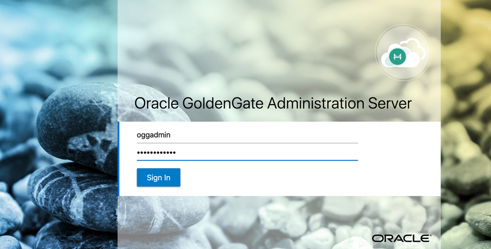

- Once logged on, click on the port # for Admin server to get into configuration mode as shown below.

   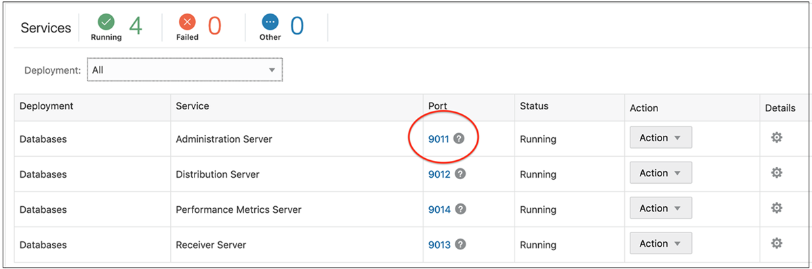

### 4.6 Add database credentials in GoldenGate

- From the left navigation menu, Open **Configuration**.

   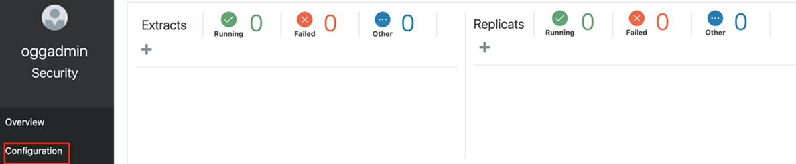

- Add credentials for the source database common user. Use `userid@connect_alias` format. Add the first credential for `C##user01` you created earlier in the lab in the source database.

   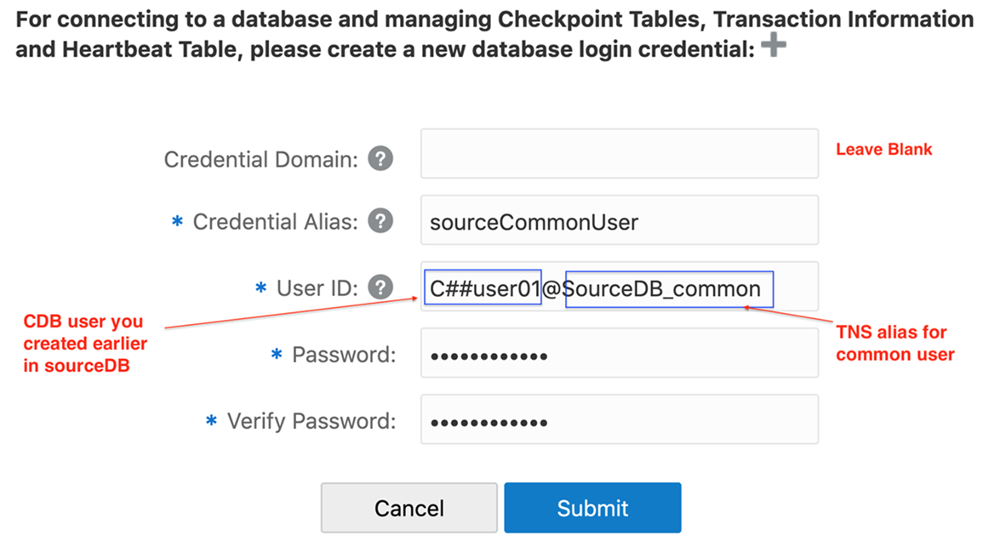

- Test each connection as shown below.

   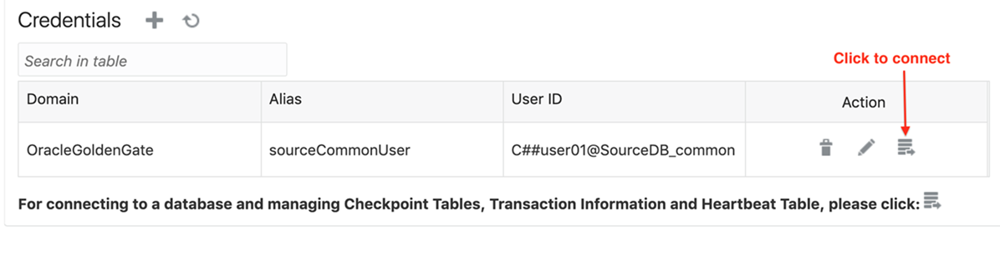

- Similarly, add credentials for source database appschema and target database ggadmin schema as shown below. Note the ggadmin user connects using the same tns entry as 'admin' user.

   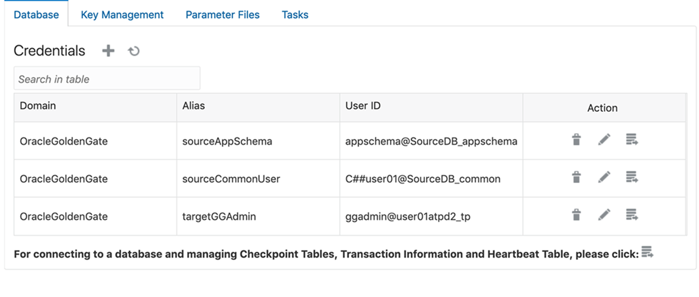

### 4.7 Create checkpoint tables

- Checkpoint tables keep track of changes in the database. You need one in the appschema in the source database and another in the ggadmin schema in the target database. Connect and click the + sign to add a checkpoint table as shown below.

   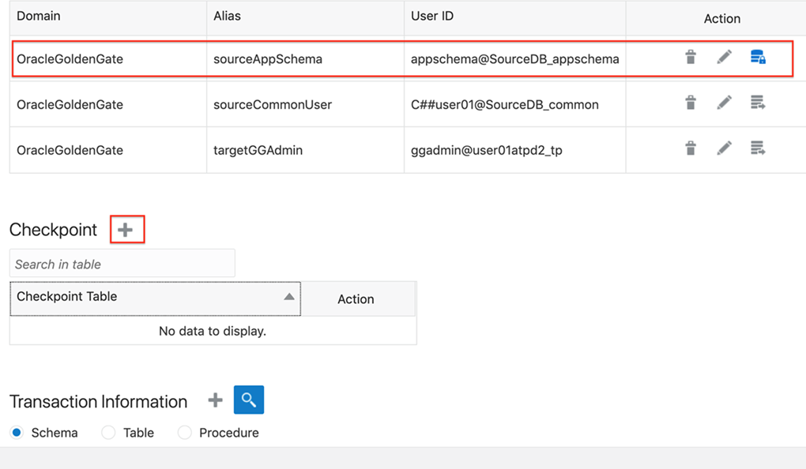

   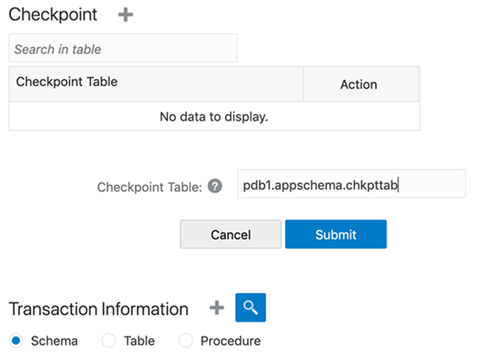

- You also specify the schema you want to replicate here. In the Transaction Information section below checkpoint, add the schema first by clicking the + sign and click Submit.

   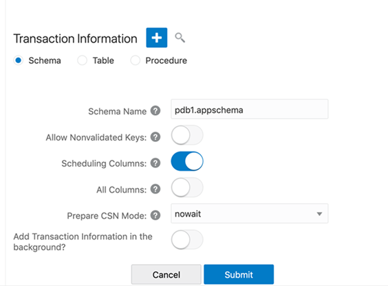

- Create a checkpoint table for the target database ggadmin schema as shown below.

   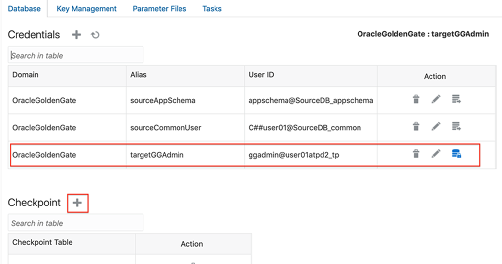

   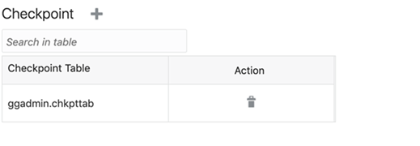

- Set the heartbeat on the target if prompted.

   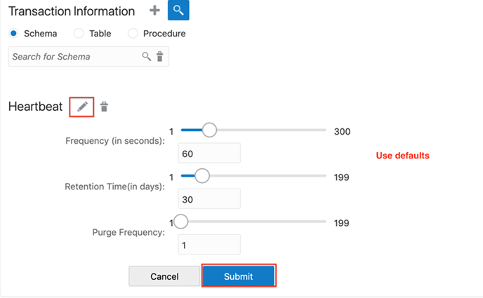

### 4.8 Create the extract process

- Navigate back to the GoldenGate Admin server dashboard so you can see both the extract and replicat setup as shown below.

   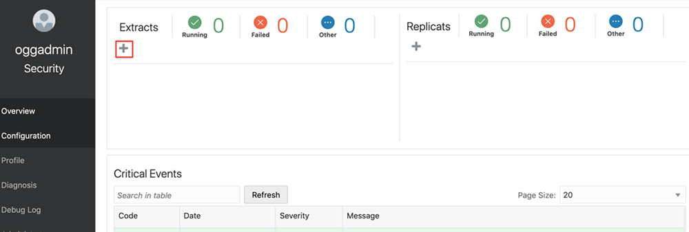

- Create an **Integrated Extract** process. Enter:
    - Process Name: Give a descriptive name
    - Credential Domain: `OracleGoldenGate`
    - Credential Alias: Pick the common user alias for source database. For example, sourceCommonUser
    - Begin: Now
    - Trail Name: Any two character name. For example, `rt`

   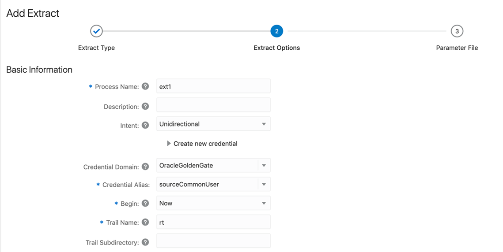

- Register the extract to `PDB1`.

   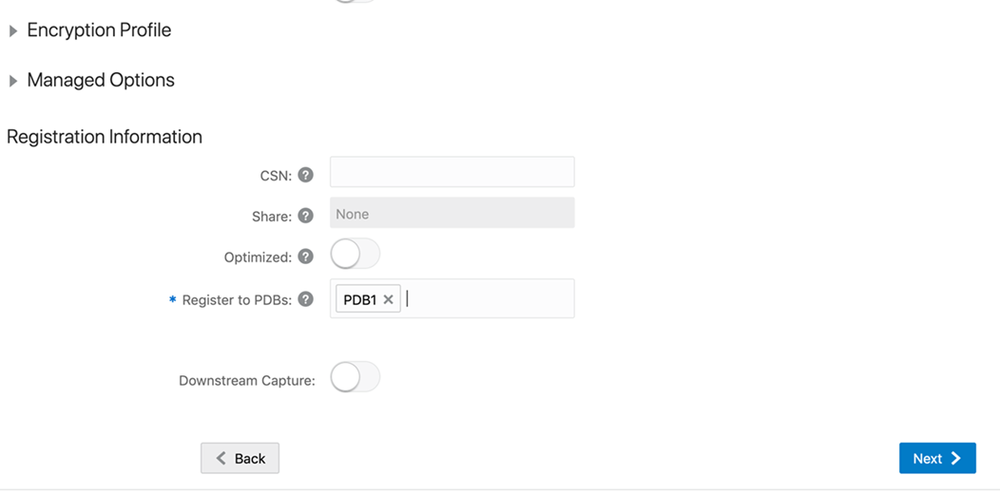

- Add this parameter block:

   ```text
   extract ext1
   useridalias sourceCommonUser domain OracleGoldenGate
   exttrail rt
   table pdb1.appschema.*;
   ```

- Click **Create and Run**. You should now see the extract running on source.

   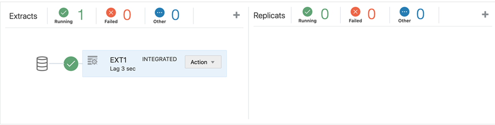

### 4.9 Create the replicat process

- On the same screen, click the + sign on the Replicats side to start configuring one.Create a **Non-Integrated Replicat**.

   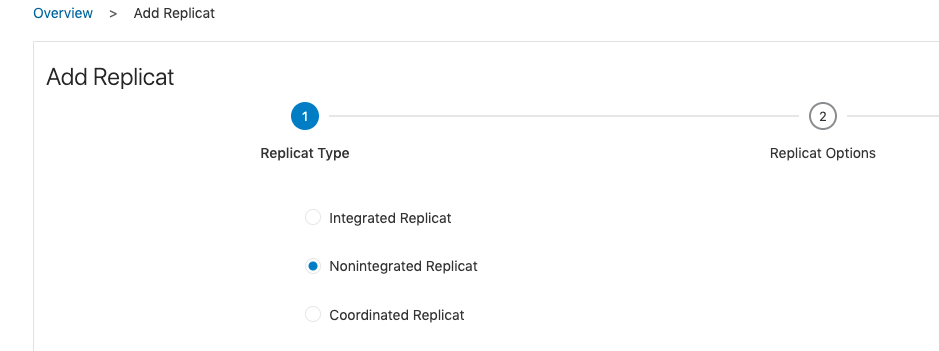

- Enter:

    - Process Name: `Rep1`
    - Credential Domain: `OracleGoldenGate`
    - Credential Alias: target ggadmin alias ((or the alias name you provided for ggadmin user on your Autonomous AI Database instance))
    - Trail Name: Any two character name. For example, `rt`
    - Checkpoint Table: target ggadmin checkpoint table

   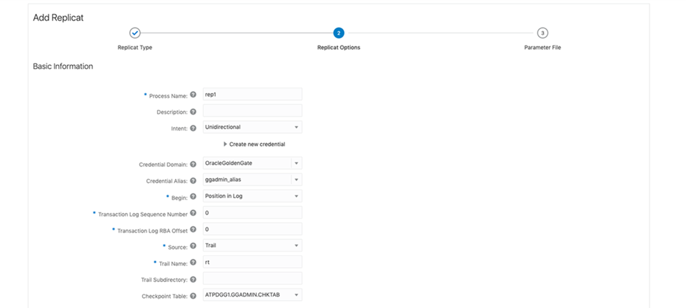

- Replace the default mapping line with the target schema mapping.
- Click **Create and Run**.

   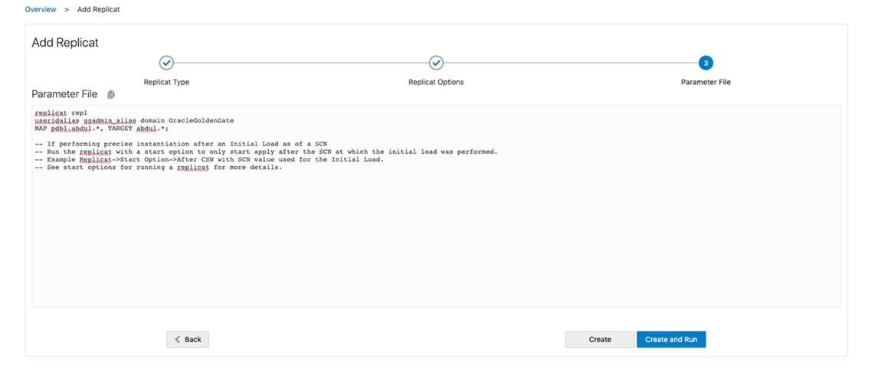

### 4.10 Verify replication

- Insert a row in the source `appschema.COMMENTS` table.
- Commit the transaction.
- Query the same table on the target Autonomous AI Database.

Example insert:

```sql
insert into appschema.COMMENTS (
  COMMENT_ID,
  ITEM_ID,
  COMMENT_BY,
  COMMENT_CREATE_DATE,
  COMMENT_TEXT
) values (
  7,
  4,
  4,
  to_date('06-JUL-15','DD-MON-RR'),
  'Sample comment from source database.'
);
commit;
```

The row should appear on the target within seconds.

You may now **proceed to the next lab**.

## Acknowledgements

- **Author** - Tejus S. & Kris Bhanushali
- **Adapted by** - Vandana Rajamani, Consulting UA Developer, July 2026
- **Last Updated By/Date** - Vandana Rajamani, Consulting UA Developer, July 2026
