# Use Oracle Standard Tags

## Introduction

Oracle Cloud Infrastructure tagging allows you to add metadata to resources, defining keys and values and associating them with resources. You can use the tags to organize and list resources based on your business needs.

To enable customers to manage OCI resources securely and cost-effectively, Oracle provides a set of pre-defined tags in line with best practices for tagging resources. These tags are grouped into two namespaces - the **OracleStandard** namespace and the **OracleApplicationName** namespace.

This lab walks you through the steps to import Oracle Standard Tags into your tenancy, create and edit tag key definitions, and use the standard tags with your Autonomous AI Database.

Estimated Time: 20 minutes

### Objectives

As an OCI Governance administrator and as database users:

1. Enforce tagging best practices.
2. Apply Tags seamlessly to OCI resources.

### Required Artifacts

- An Oracle Cloud Infrastructure account.
- Permission for users to use Tags. Refer to [this documentation](https://docs.oracle.com/en-us/iaas/Content/Tagging/Tasks/managingtagsandtagnamespaces.htm#Who) to allow users to work with Tags.

## Task 1: Import Oracle Standard Tags to your Tenancy

- Log in to OCI console and navigate to **Governance & Administration** and click **Tag Namespaces**.

    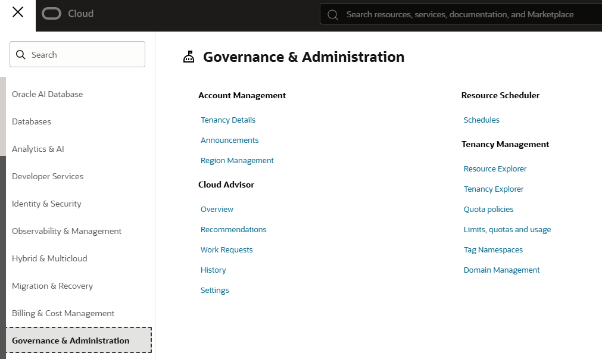

- On the **Tag namespaces** list page, from the **Actions** menu, select **Import standard tag**. The Import Standard Tags is only available from the root compartment.

    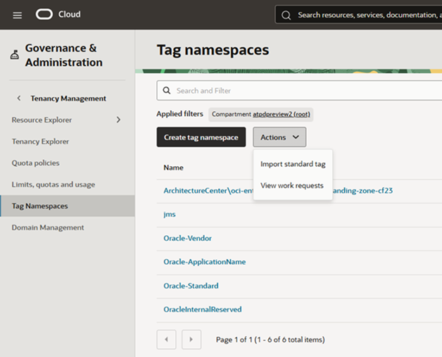

    On the Import standard tags panel, you can expand the standard tag namespace to view the tag definitions present in that template.

- The **Import Standard Tags** page provides a set of Tag Keys for consistent governance across your tenancy. Tag namespace will be created at the root compartment. The list of namespaces are continuously updated by OCI service teams. All new and modified Tags will be listed in the Import Standard Tags page.

    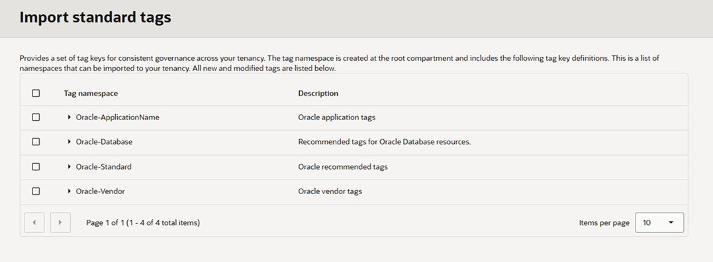

- Select **Oracle-Standard** Tag Namespace and click **Import**.

    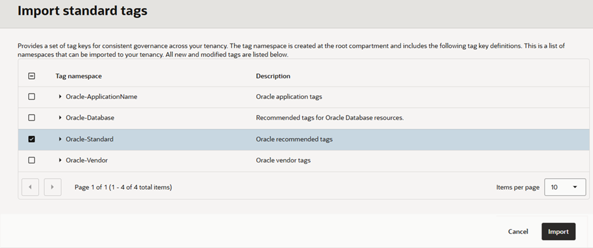

## Task 2: Create or Edit Tag Key Definition

OCI Governance Administrators can add additional **Values** to an existing Tag Key Definition or create a new Tag Key Definition.

- Click **Governance & Administration** and navigate to **Tag Namespaces**.

    

- Click the **Oracle-Standard** Tag Namespace that you created in **Task 1**. The **Oracle-Standard** Tag Namespace **Details** page lists all the existing **Tag Key Definitions**.

    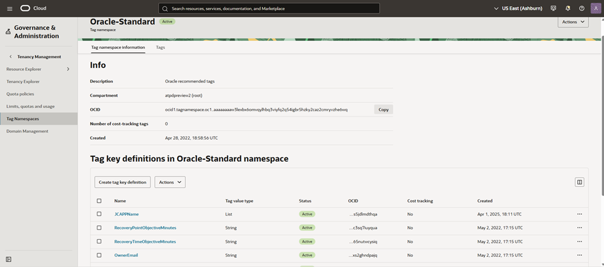

- Click **Create Tag Key Definition** to create a new Tag Key definition in the selected Tag Namespace.

    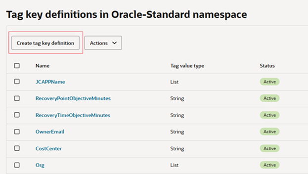

- Enter Tag Key, Description and Values and click **Create Tag Key Definition**.

    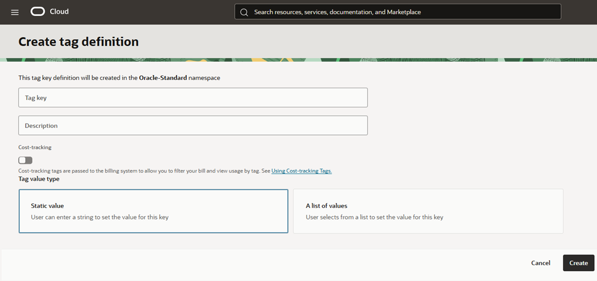

- You have successfully created a new **Tag Key Definition** for **Oracle-Standard** Namespace!

- To add or remove values from an existing **Tag Key Definition**, select your **Tag Key Definition**.

    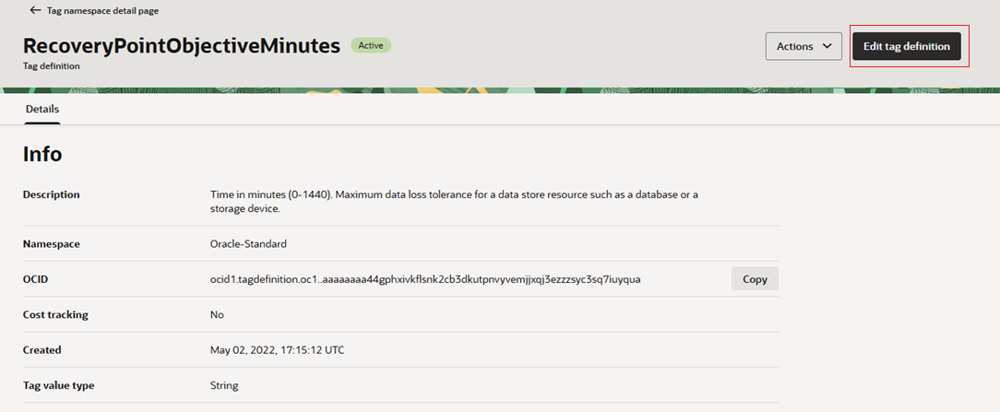

- Click **Edit Tag Key Definition**. Add or remove **Tag Values** and click **Update**.

    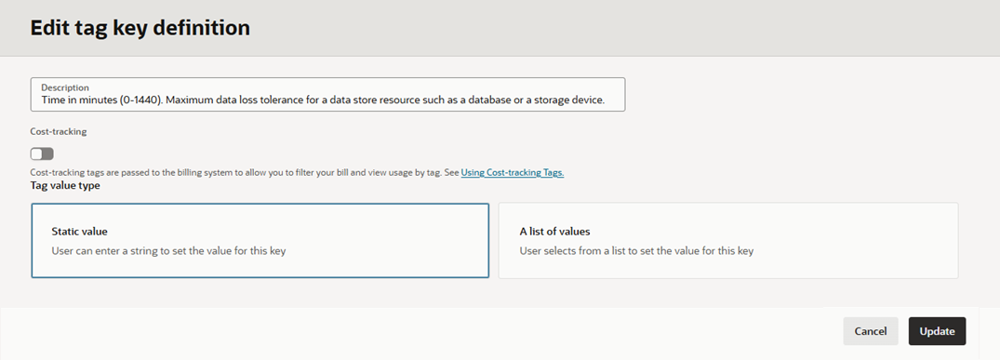

## Task 3: Use Standard Tags with Autonomous AI Database

Tags can be added either at the time of creation of a resource, or by navigating to an existing resource and adding it.

- From the main menu, Click **Oracle AI Database** > **Autonomous AI Database on Dedicated Infrastructure**.

    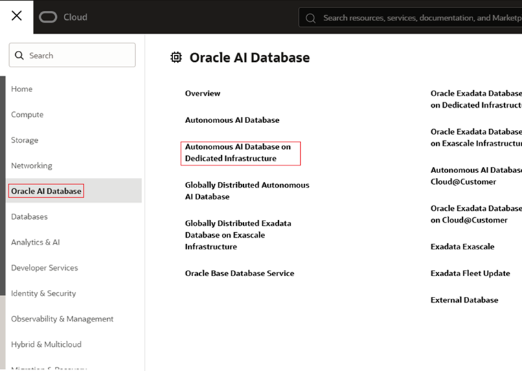

- Choose the appropriate compartment and Click **Create Autonomous AI Database**.

    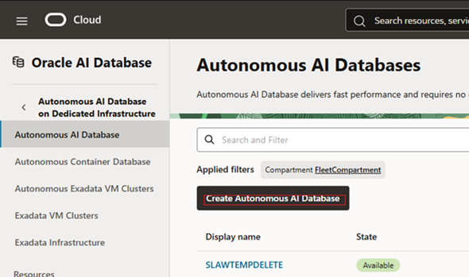

- Enter all the required fields. See [Provisioning Databases](https://livelabs.oracle.com/ords/r/dbpm/livelabs/run-workshop?p210_wid=3197) for the details on how to create an Autonomous AI Database. Scroll down to the bottom of the **Create Autonomous AI Database** page, and click **Show Advanced Options**.

    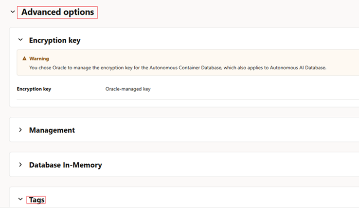

- Select **Tags** and select **Oracle-Standard** under **Tag Namespace**. Select the appropriate **Tag Key** and  **Tag value** and click **Add tag**.

    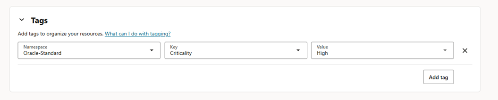

- You can also add Tags to an existing Autonomous AI Database. Select the Autonomous AI Database in which you would like to add the Tags, and click **Tags** in the **Autonomous AI Database Details** page.

    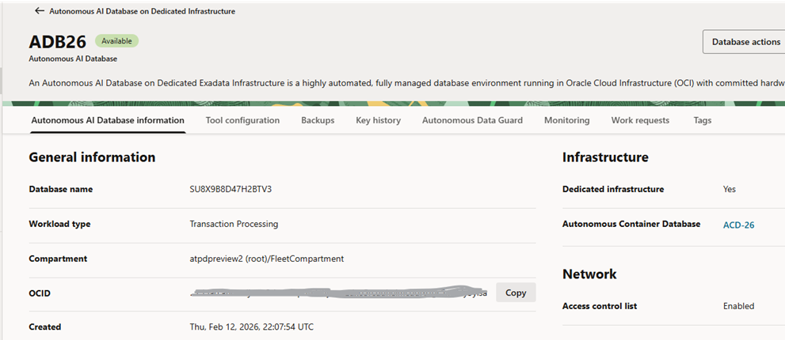

- Click **Add** and in the *Add tags** page, select **Oracle-Standard** under **Tag Namespace** and select the appropriate **Tag Key** and **Tag Value**. Click **Add**.

    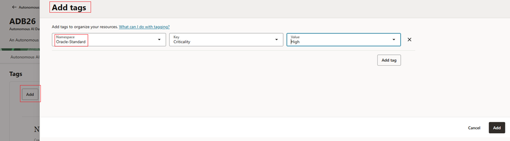

Click [Tag Autonomous AI Database](https://docs.oracle.com/en/cloud/paas/autonomous-database/dedicated/adbaa/tag-autonomous-ai-database-on-dedicated-exadata.html) to learn more about Tagging.

You may now **proceed to the next lab**.

## Acknowledgements

- **Author** - Tejus S, Autonomous AI Database Product Management
- **Adapted by** -  Vandana Rajamani, Consulting UA Developer, July 2026
- **Last Updated By/Date** - Vandana Rajamani, Consulting UA Developer, July 2026
