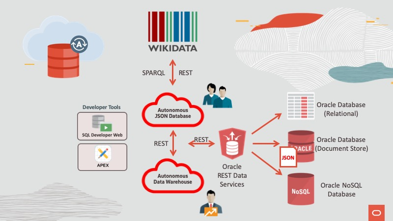

# Using REST and APEX with Autonomous JSON Database

## Workshop Overview

This Getting Started guide will get you ready for the Oracle Autonomous JSON Database (AJD) Workshop labs. This workshop and the labs that follow support either Windows clients or Linux clients.

Oracle Autonomous JSON Database is a cloud document database service that makes it simple to develop JSON-centric applications. It features simple document APIs, serverless scaling, high performance ACID transactions, comprehensive security, and low pay-per-use pricing. Autonomous JSON Database automates provisioning, configuring, tuning, scaling, patching, encrypting, and repairing of databases, eliminating database management and delivering 99.995% availability.

[Whatch the video](https://www.oracle.com/autonomous-database/autonomous-json-database/?bcid=6180289717001)

Estimated Lab Time: 3 hours

## Workshop Requirements

* Access to Oracle Cloud Infrastructure
    * Provided by the instructor for instructor-led workshops
* Access to a laptop or a desktop

## Agenda

- **Lab 1 : Development Project Resources**
- **Lab 2 : Retrieve Data from Web Service**
- **Lab 3 : Process JSON Documents**
- **Lab 4 : Oracle RESTful Data Services (ORDS)**
- **Lab 5 : User Authentication for ORDS**
- **Lab 6 : Submit Form Data using ORDS**

## Access the Labs

- Use **Ξ Lab Contents** menu on your right to access the labs.
    - If the menu is not displayed, click the menu button  on the top right  make it visible.

- From the menu, click on the lab that you like to proceed with. For example, if you like to proceed to **Lab 1**, click **Lab 1 : Development Project Resources**.

- You may close the menu by clicking 

## Acknowledgements

- **Author** - Valentin Leonard Tabacaru
- **Last Updated By/Date** - Valentin Leonard Tabacaru, Principal Product Manager, DB Product Management, Sep 2020

See an issue? Please open up a request [here](https://github.com/oracle/learning-library/issues). Please include the workshop name and lab in your request.
