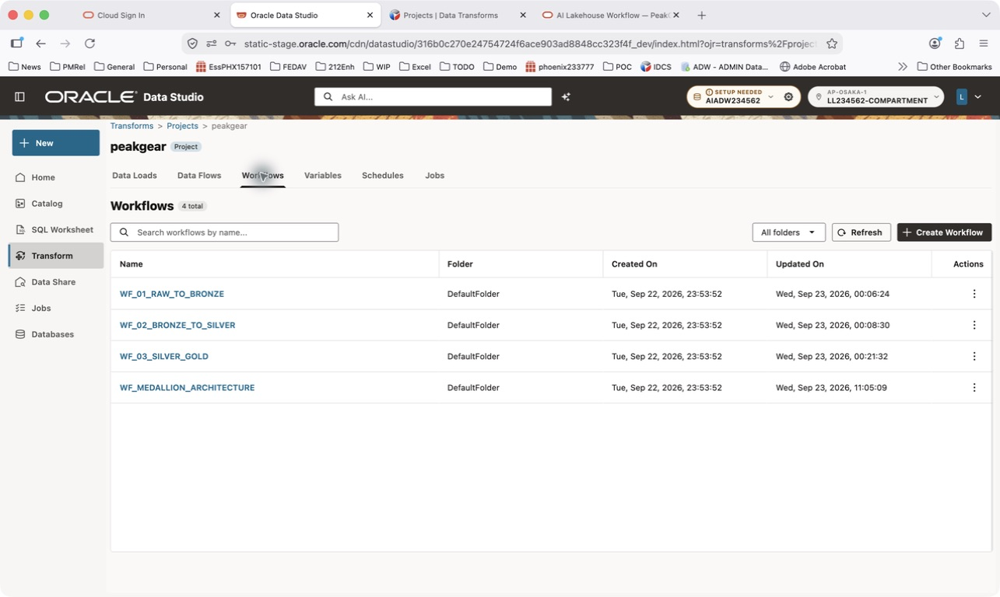
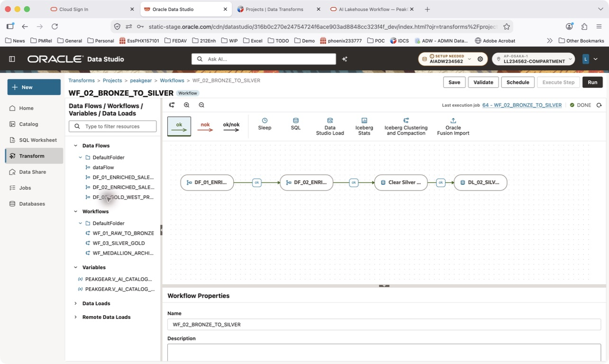
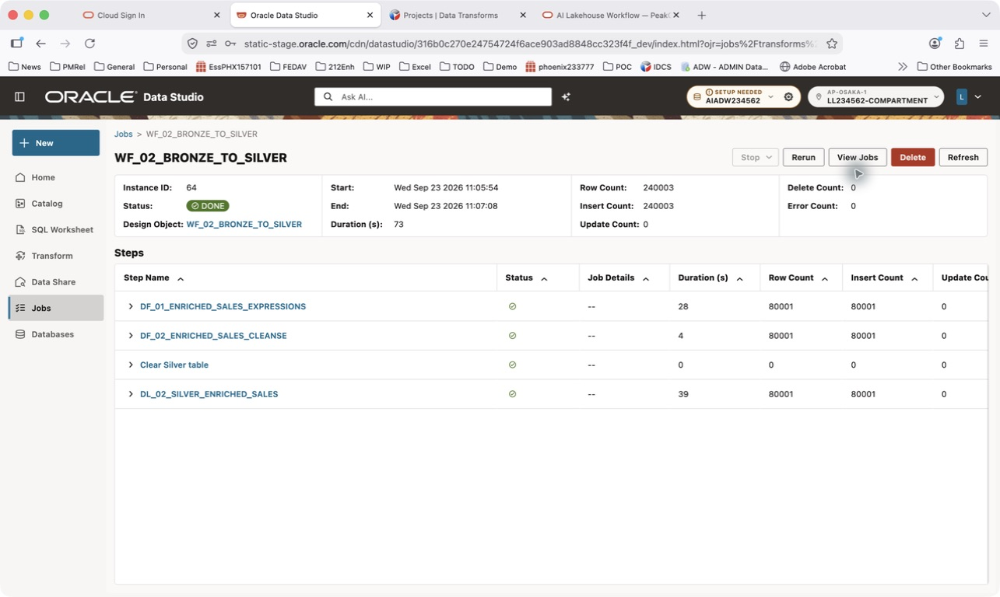
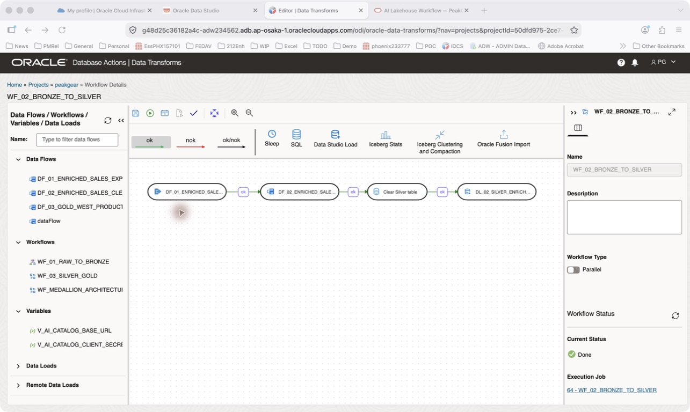
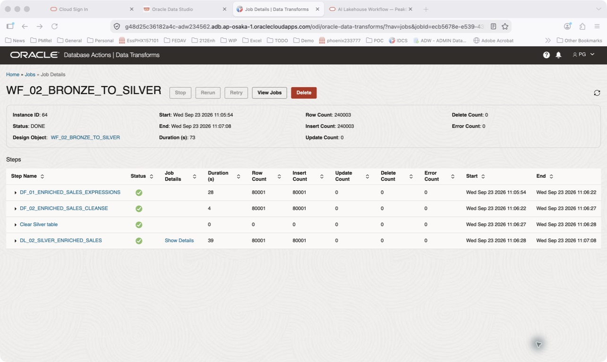

# Lab 2: Alex builds reusable Silver sales data

## Introduction

As Alex, inspect Bronze, improve a product-name expression, and run the workflow that publishes Silver. Use the existing `peakgear` project rather than rebuilding every component.

Estimated Time: 24 minutes, including a five-minute ingestion demonstration.

### Objectives

* Locate and query Bronze Iceberg tables.
* Make one controlled cleansing change.
* Run `WF_02_BRONZE_TO_SILVER` and inspect its job results.

### Prerequisites

Complete Lab 1. Confirm the assigned `PG` connection, catalog mount, preloaded Bronze data, and `peakgear` project.

## Task 1: Watch Raw-to-Bronze ingestion

1. Follow the facilitator into **Transform → Projects → peakgear → Data Loads**. Inspect the prepared raw load. In the reviewed project its name is `dataLoad`; identify it by source and target, not its generic name alone.

2. Review the source files, Iceberg connection, and `bronze` namespace. The facilitator uses `PRODUCTS` to explain mapping and `WF_01_RAW_TO_BRONZE` to explain orchestration and bridge views.

3. Do not run the raw or master workflow unless directed. Bronze already contains data; the master workflow can replace downstream data.

    Facilitator: “The catalog describes an Iceberg table; its files live in object storage. Bronze preserves source data that both engineers and analysts can query.”

## Task 2: Discover and query Bronze in the new UI

1. Open **Catalog → Locally Mounted Catalogs → PG_AICAT → bronze**. If tables appear, select `PRODUCTS` and inspect its available definition and data information.

2. If the tree is empty, open **SQL Worksheet** and run this read-only listing. Use the facilitator's catalog alias if it differs from `PG_AICAT`.

    ```sql
    <copy>
    SELECT owner, table_name
    FROM all_tables@PG_AICAT
    ORDER BY owner, table_name;
    </copy>
    ```

    Preserve the returned namespace/table case. Examples assume lowercase namespace names and uppercase table names. If SQL discovery also fails, use Appendix A or ask the facilitator to check the mount.

3. Run one statement at a time using the worksheet's run-statement control.

    ```sql
    <copy>
    SELECT * FROM "bronze"."PRODUCTS"@PG_AICAT
    FETCH FIRST 10 ROWS ONLY;
    </copy>
    ```

4. Inspect the inventory attributes Sam will use in Lab 3.

    ```sql
    <copy>
    SELECT "STORE_ID", "PRODUCT_ID", "STOCK_ON_HAND",
           "AVAILABLE_TO_PROMISE_QTY", "REORDER_LEVEL", "INVENTORY_STATUS"
    FROM "bronze"."STORE_INVENTORY"@PG_AICAT
    FETCH FIRST 10 ROWS ONLY;
    </copy>
    ```

    **Checkpoint:** identify the four Bronze tables and query at least one. SQL discovery is independent of the new UI's table-list rendering.

## Task 3: Improve one expression

1. Open **Transform → Projects → peakgear → Data Flows → DF_01_ENRICHED_SALES_EXPRESSIONS**.

2. Locate the expression producing `PRODUCT_NAME`. Wrap its existing source reference in this expression. Preserve a source alias if the designer requires one.

    ```sql
    <copy>
    INITCAP(TRIM(REGEXP_REPLACE(PRODUCT_NAME, '[[:space:]]+', ' ')))
    </copy>
    ```

3. Save and validate. This produces title case, not camelCase. Brand names and acronyms may require exception rules in production.

4. If editing is unavailable in the new designer, use Appendix B. Do not run the individual flow and workflow concurrently.

## Task 4: Execute and monitor the Silver workflow

1. Open the project's **Workflows** tab and select `WF_02_BRONZE_TO_SILVER`.

    

2. Review the sequence.

    | Step | Purpose |
    |---|---|
    | `DF_01_ENRICHED_SALES_EXPRESSIONS` | Join Bronze bridge views and derive sales measures |
    | `DF_02_ENRICHED_SALES_CLEANSE` | Cleanse native staging data |
    | `Clear Silver table` | Reset the lab target before append loading |
    | `DL_02_SILVER_ENRICHED_SALES` | Publish Silver Iceberg data |

3. Confirm the assigned environment before starting. **This workflow clears its Silver target.** Use only disposable lab data. Do not bypass this step to resolve a credentials error.

4. Click **Run** in the new workflow designer. If unavailable, use **Start** in Appendix B. Record the job ID and submission time.

    

5. Open the project's **Jobs** tab, refresh, and find your run by name and time. Inspect its status and child steps. Use Appendix B if new-UI job details are unavailable.

    

    The screenshot shows an existing example run, not the run you just submitted.

6. Return to **SQL Worksheet** and validate the published Silver table.

    ```sql
    <copy>
    SELECT COUNT(*) AS silver_rows
    FROM "silver"."HOL2026_ENRICHED_SALES"@PG_AICAT;
    </copy>
    ```

    ```sql
    <copy>
    SELECT "PRODUCT_ID", "PRODUCT_NAME", "SALE_MONTH", "SALES_REGION"
    FROM "silver"."HOL2026_ENRICHED_SALES"@PG_AICAT
    FETCH FIRST 10 ROWS ONLY;
    </copy>
    ```

    **Checkpoint:** the workflow succeeds and Silver is queryable. A workflow total can sum rows processed by several steps; it is not necessarily the final table row count.

## Appendix A: Legacy catalog and SQL fallback

1. Open **legacy Database Actions → Data Studio → Catalog** using the event URL. Locate the mount and Bronze namespace.

2. If tables still do not appear, open **Database Actions → SQL** as `PG`. Run the same discovery and Bronze queries from Task 2. Preserve the exact identifier case returned by discovery.

3. Return to the new UI. Do not treat missing UI nodes as missing data when SQL succeeds.

## Appendix B: Legacy Data Transforms edit, run, and monitor fallback

1. In legacy Data Transforms, select **Projects → peakgear → Data Flows → DF_01_ENRICHED_SALES_EXPRESSIONS**. Select the expression component and update `PRODUCT_NAME`, retaining its source alias. Save and validate.

2. Select **Workflows → WF_02_BRONZE_TO_SILVER** and click **Start** once. Use the execution settings supplied by the facilitator.

    

3. Follow the execution job link or open **Jobs**. Select your run, inspect status and child steps, and record the first failing child if it fails. Ask before rerunning.

    

    This is a historical example, not your run. Its final load processed 80,001 rows; the workflow total includes multiple stages. Dataset versions may produce different counts.

4. Return to Task 4 for SQL validation, using legacy SQL only if the new worksheet is unavailable.

## Learn More

* [Manage catalogs with DBMS_CATALOG](https://docs.oracle.com/en-us/iaas/autonomous-database-serverless/doc/manage-catalogs-dbms-catalogs.html)
* [Oracle Data Transforms](https://docs.oracle.com/en/cloud/paas/autonomous-database/serverless/adbsb/data-transforms.html)

You may now **proceed to the next lab**.

## Acknowledgements

* **Author** - Oracle AI Lakehouse workshop team
* **Last Updated By/Date** - Oracle AI Lakehouse workshop team, September 2026
