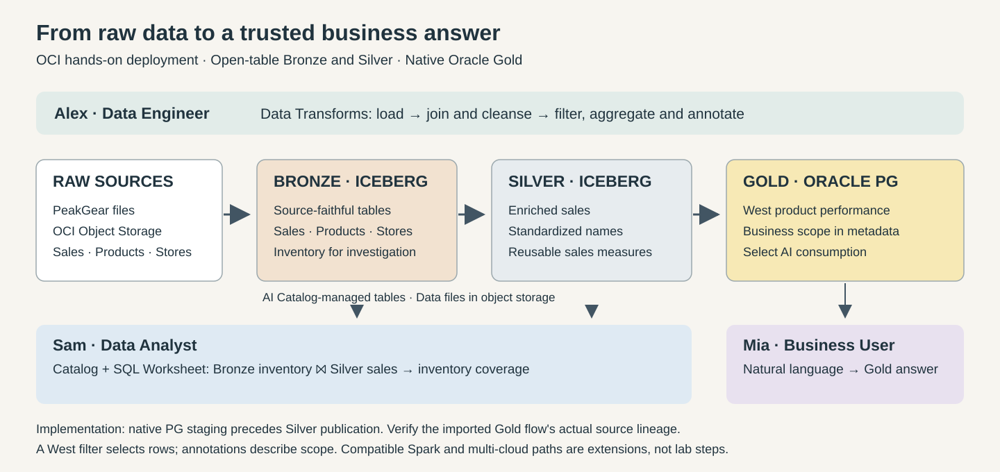
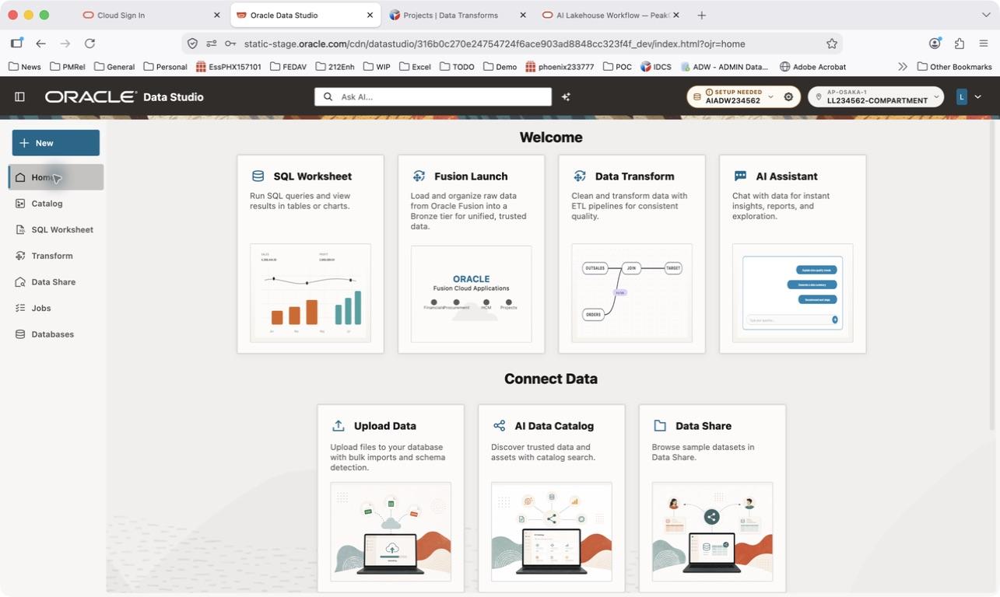
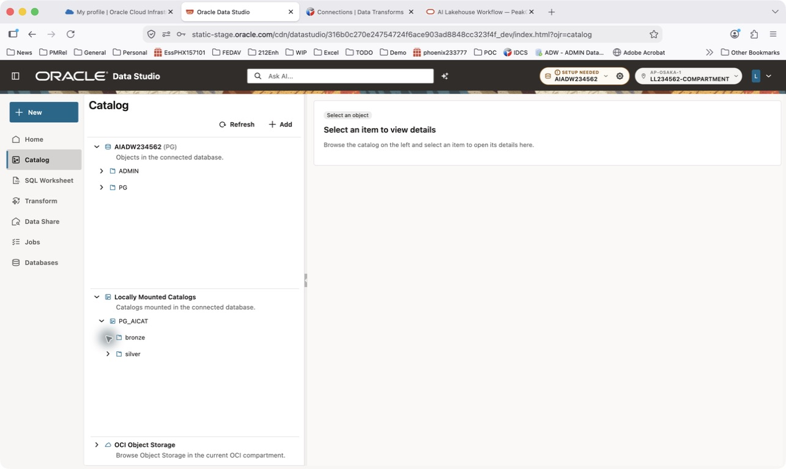
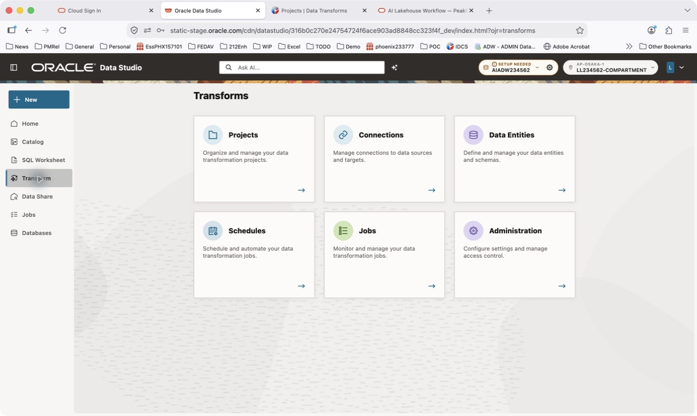
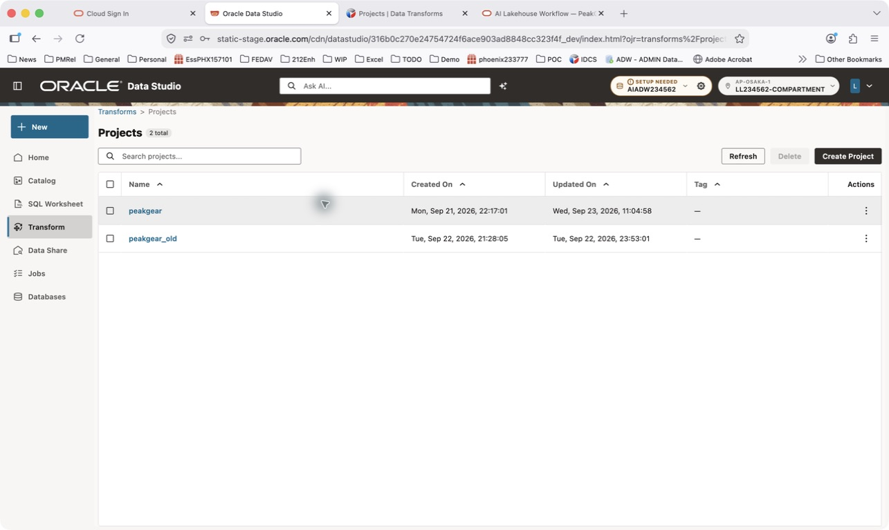
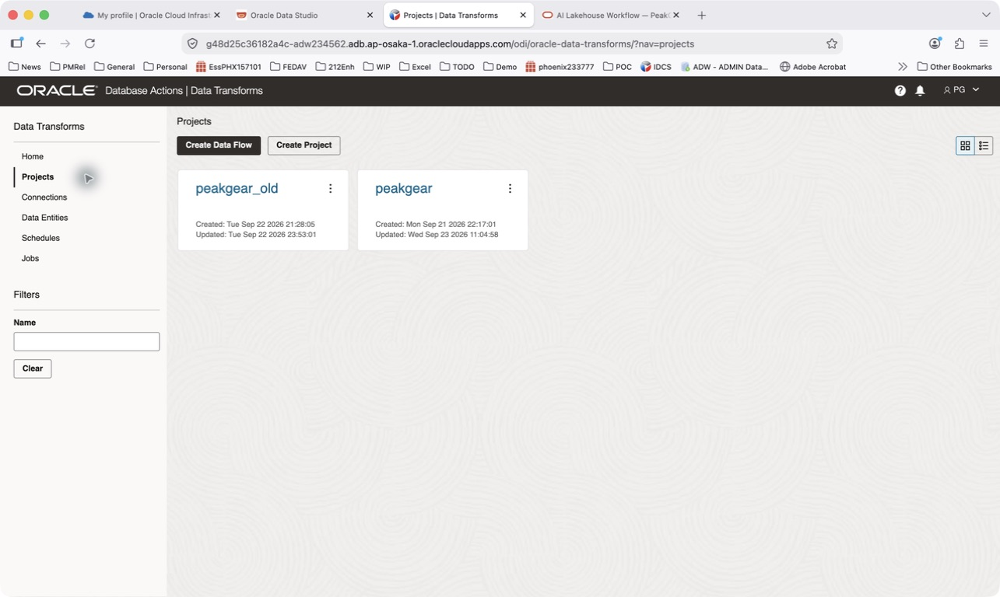

# Lab 1: Meet PeakGear and prepare your Lakehouse

## Introduction

PeakGear sells sporting goods. Its engineers need reusable sales data, analysts investigate inventory coverage, and business users need answers about West-region performance. Follow the data through Bronze, Silver, and Gold using Oracle Autonomous AI Lakehouse.

### Prerequisites

* An assigned event environment with the `PG` schema and preloaded Bronze data.
* New Data Studio and legacy Database Actions URLs and credentials from the facilitator.
* The supplied PeakGear project ZIP and connection handout for attendee setup.
* Basic SQL familiarity; you do not need Spark programming experience.

### Objectives

* Explain each medallion tier and the three personas.
* Locate Catalog, SQL Worksheet, Transform, Jobs, and AI Assistant.
* Check your environment and the `peakgear` project.

Estimated Workshop Time: 90 minutes, including a 12-minute troubleshooting buffer.

Estimated Lab Time: 22 minutes.

## Task 1: Follow the three-persona journey

1. Meet the team. You play these roles with the assigned account; they do not require three additional logins.

    | Persona | Responsibility | Tools and tier |
    |---|---|---|
    | Alex, Data Engineer | Build and monitor reusable pipelines | Data Transforms; Bronze → Silver → Gold |
    | Sam, Data Analyst | Investigate inventory coverage | Catalog and SQL Worksheet; Bronze + Silver |
    | Mia, Business User | Understand West-region performance | Natural-language questions; native Oracle Gold |

2. Review the data movement.

    

    Bronze retains source-faithful Iceberg data. Silver joins and cleanses reusable sales data. Gold publishes a West-only native Oracle data product with business metadata. This project uses native `PG` staging tables before publishing Silver to Iceberg; staging is not the published Silver tier.

3. Review the data objects.

    | Layer | Objects |
    |---|---|
    | Raw | PeakGear files in OCI Object Storage |
    | Bronze Iceberg | `PRODUCTS`, `STORE_SALES_TRANSACTIONS`, `STORE_LOCATIONS`, `STORE_INVENTORY` |
    | Native intermediate tables | `PG.HOL2026_ENRICHED_SALES_STAGE`, `PG.HOL2026_ENRICHED_SALES` |
    | Silver Iceberg | `silver.HOL2026_ENRICHED_SALES` in the mounted catalog |
    | Gold native Oracle | `PG.GOLD_WEST_PRODUCT_PERFORMANCE` |

4. Listen to the facilitator: “Medallion gives each stage a contract: retain, refine, and publish. We use Iceberg for open data access and native Oracle for the curated business product. Today's deployment uses OCI; multi-cloud-ready describes the pattern, not a second cloud you will deploy today.”

## Task 2: Explore the new Data Studio UI

1. Open the **new Data Studio URL from your event handout**. Sign in with your assigned credentials. Do not use the database identifiers shown in screenshots.

    

2. Check the database and OCI scope. Open **SQL Worksheet** and confirm the session uses `PG` on your assigned database. If the header shows **SETUP NEEDED**, ask the facilitator to check configuration. The badge alone does not identify the missing setup.

3. Locate **Catalog**, **SQL Worksheet**, **Transform**, and **Jobs** in the navigation. Locate **AI Assistant** on Home and in the header. Lab 5 checks the configured AI experience against Gold.

4. Open **Catalog → Locally Mounted Catalogs → PG_AICAT** and locate `bronze` and `silver`.

    

    **Known new-UI limitation:** namespaces may appear without their tables. An empty branch does not prove that data is missing. Do not recreate the catalog or reload Bronze. Lab 2 provides SQL discovery and a separate legacy appendix.

## Task 3: Check the PeakGear project and connections

1. Open **Transform → Projects → peakgear**. Do not use `peakgear_old`.

    

    

2. If already provisioned, leave the project in place. Confirm **Workflows** contains `WF_01_RAW_TO_BRONZE`, `WF_02_BRONZE_TO_SILVER`, and `WF_03_SILVER_GOLD`. Do not import a duplicate.

3. For attendee setup, use the event handout to configure Object Storage credentials, the catalog credential/token, and the Oracle JDBC connection. Import the supplied project ZIP and map its connections to your assigned services. Use Appendix A when the new UI lacks an import or connection action.

    Keep passwords and tokens out of screenshots, SQL files, source control, and chat. A catalog OAuth client secret is not an OCI Object Storage auth token.

4. Test the mapped Oracle, Object Storage, and Iceberg connections. Imported connection names may contain old database numbers; verify the actual endpoint with the facilitator. Never target a production or another attendee's schema.

5. Confirm that Bronze already contains data. The facilitator demonstrates ingestion in Lab 2; you start from prepared Bronze data.

## Appendix A: Legacy UI setup fallback

Use this section only when directed. Return to the main new-UI path afterward.

1. Open the **legacy Database Actions / Data Transforms URL** from the event handout and sign in.

2. In **Connections**, edit and test the imported connections using your assigned values. If the project is absent, use the project import action to import the supplied ZIP; otherwise skip import.

3. Select **Projects → peakgear** and verify the tier workflows.

    

4. Return to the new Data Studio tab. Secret-entry and package-import dialogs are environment-specific; follow the facilitator's setup demonstration.

## Learn More

* [Oracle Autonomous AI Lakehouse](https://www.oracle.com/autonomous-database/autonomous-ai-lakehouse/)
* [Oracle AI Data Catalog](https://docs.oracle.com/en/cloud/paas/autonomous-database/serverless/adbsb/oracle-ai-data-catalog.html)

You may now **proceed to the next lab**.

## Acknowledgements

* **Author** - Oracle AI Lakehouse workshop team
* **Last Updated By/Date** - Oracle AI Lakehouse workshop team, September 2026
