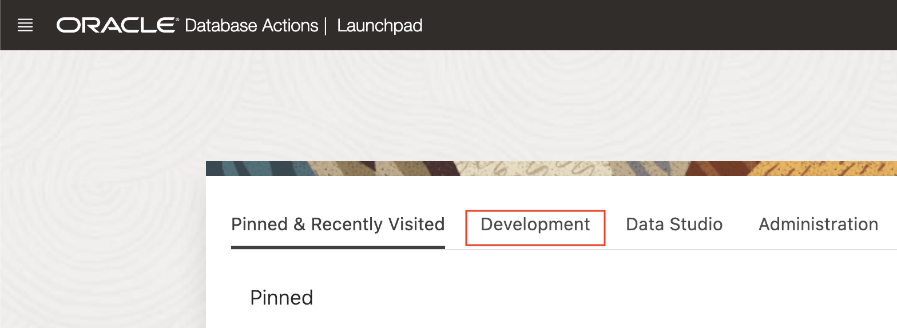

# Provisioning an Autonomous JSON Database

## Introduction

This lab walks you through the steps to get started using the Oracle Autonomous JSON Database [AJD] on Oracle Cloud. In this lab, you will provision a new AJD instance and connect to the Autonomous Database using JSON.

Estimated Time: 10 minutes

### Objectives

In this lab, you will:

* Learn how to provision a new Autonomous Database
* Connect to your Autonomous Database using JSON

### Prerequisites

* Logged into your Oracle Cloud Account

## Task 1: Choose AJD from the Services Menu

1. Login to the Oracle Cloud.

<if type="freetier">

2. If you are using a Free Trial or Always Free account, and you want to use Always Free Resources, you need to be in a region where Always Free Resources are available. You can see your current default **Region** in the top, right hand corner of the page.

    

</if>
<if type="livelabs">

2. If you are using a LiveLabs account, you need to be in the region your account was provisioned in. You can see your current default **Region** in the top, right hand corner of the page. Make sure that it matches the region on the LiveLabs Launch page.

    

</if>

3. Click the navigation menu in the upper left to show top level navigation choices.

    

4. Click on **Oracle Database** and choose **Autonomous JSON Database**.

    

5. Use the __List Scope__ drop-down menu on the left to select a compartment. Make sure your workload type is __JSON Database__. <if type="livelabs">Enter the first part of your user name, for example `LL185` in the Search Compartments field to quickly locate your compartment.

    

</if>
<if type="freetier">
    
</if>
    

<if type="freetier">
   > **Note:** Avoid the use of the ManagedCompartmentforPaaS compartment as this is an Oracle default used for Oracle Platform Services.
</if>

## Task 2: Create the AJD Instance

1. Click **Create Autonomous Database** to start the instance creation process.

    

2.  This brings up the __Create Autonomous Database__ screen where you will specify the configuration of the instance.

3. Provide basic information for the autonomous database:

<if type="freetier">
    - __Choose a compartment__ - Select a compartment for the database from the drop-down list.
</if>
<if type="livelabs">
    - __Choose a compartment__ - Use the default compartment that includes your user id.
</if>
    - __Display Name__ - Enter a memorable name for the database for display purposes. For this lab, use __JSONDB__.
<if type="freetier">
    - __Database Name__ - Use letters and numbers only, starting with a letter. Maximum length is 14 characters. (Underscores not initially supported.) For this lab, use __JSONDB__.

    
</if>
<if type="livelabs">
    - __Database Name__ - Use letters and numbers only, starting with a letter. Maximum length is 14 characters. (Underscores not initially supported.) For this lab, use __JSONDB__ and append you LiveLabs user id. For example, __JSONDB7199__.

    
</if>

4. Choose a workload type: Select the workload type for your database from the choices:

    - __JSON__ - For this lab, choose __JSON__ as the workload type.

    

5. Choose a deployment type: Select the deployment type for your database from the choices:

    - __Shared Infrastructure__ - For this lab, choose __Shared Infrastructure__ as the deployment type.
    - __Dedicated Infrastructure__ - Alternatively, you could have chosen Dedicated Infrastructure as the deployment type.

    

6. Configure the database:

    <if type="freetier">
    - __Always Free__ - If your Cloud Account is an Always Free account, you can select this option to create an always free autonomous database. An always free database comes with 1 CPU and 20 GB of storage. For this lab, we recommend you leave Always Free unchecked.
    </if>
    <if type="livelabs">
    - __Always Free__ - For this lab, we recommend you leave Always Free unchecked.
    </if>
    - __Choose database version__ - Select 19c from the database version. Note: This lab should work on 21c AJD database as well.
    - __OCPU count__ - Number of OCPUs for your service. For this lab, leave the default __1 OCPU__. If you choose an Always Free database, it comes with 1 OCPU.
    - __Storage (TB)__ - Select your storage capacity in terabytes. For this lab, leave the default __1 TB__ of storage. If you choose an Always Free database, it comes with 20 GB of storage.
    - __Auto Scaling__ - For this lab, keep auto scaling enabled, to allow the system to automatically use up to three times more CPU and IO resources to meet workload demand.

    *Note: You cannot scale up/down an Always Free autonomous database.*

    

7. Create administrator credentials:

    - __Password and Confirm Password__ - Specify the password for ADMIN user of the service instance and confirm the password.

    The password must meet the following requirements:
    - The password must be between 12 and 30 characters long and must include at least one uppercase letter, one lowercase letter, and one numeric character.
    - The password cannot contain the username.
    - The password cannot contain the double quote (") character.
    - The password must be different from the last 4 passwords used.
    - The password must not be the same password that is set less than 24 hours ago.
    - Re-enter the password to confirm it. Make a note of this password.

    Later stages of this LiveLab will be easier if you avoid any of the characters / : ? # [ ] and @ in your password.

    

8. Choose network access:

    - Choose __Secure access from allowed IPs and VCNs only__ 

    In the drop-down box, set __IP notation type__ to __CIDR Block__ and enter the following in the __Values__ box:

    ```
    <copy>
    0.0.0.0/0
    </copy>
    ```

    Note: this is insecure, and will allow access to your database from any IP address. For a production database, you should *always* provide a list of the IP addresses for the specific (usually mid-tier) machines that need to access your database. However, using this CIDR block simplifies later parts of this lab.

    


9. Choose a license type:

    - __Bring Your Own License (BYOL)__ - Select this type when your organization has existing database licenses.
    - __License Included__ - Select this type when you want to subscribe to new database software licenses and the database cloud service. For this lab, choose __License Included__.

    

10. Click __Create Autonomous Database__.

    

11.  Your instance will begin provisioning. In a few minutes, the state will turn from Provisioning to Available. At this point, your Autonomous JSON database is ready to use! Have a look at your instance's details here including the Database Name, Database Version, OCPU Count, and Storage.

    

## Task 3: Find REST and MongoDB API Connection URLs

These will be needed in later labs.

1. Open Database Actions

    On the Autonomous Database Information page, click on the Database Actions button

    

    The Database Actions Console will open in a new browser tab.

2. Find ORACLE DATABASE API FOR MONGODB under Related Services

    Scroll down until you find the **Related Services** section. There should be a card for __ORACLE DATABASE API FOR MONGODB__. Click on that card (if the card is not present, most likely you did not correctly configure your database for secure access).

    

3. Save the URL for __Oracle Database API for MongoDB__

    Once you've clicked on the card, a window will pop-up with two URLs listed.

    Copy the first one (containing port number 27017) and save it with a text editor for later use in lab 3. Close the pop-up window when done.

    

4. Also under **Related Services**, you'll see a card for __RESTFUL SERVICES AND SODA__. Click on that card.

    

5. Save the URL for RESTful Services and SODA in your text editor. Close the pop-up windows when done.

    


## Task 4: Connect to your Autonomous Database using "JSON Workshop" UI

1. You should still be in the Database Actions tab from the previous step. Scroll up to the top of the page, to the **Development** section.

2. You'll see a variety of developer tools under **Development** choose **JSON** to manage your JSON documents.

    

6. It opens on a worksheet. The first time you open JSON, a series of pop-up informational boxes introduce the main features. Click Next to know more or click on `X` to close the pop-up.

    
    
    
    
    
    
    
    
    
    
    


You are now connected to your Autonomous Database using JSON.

You may now proceed to the next lab.

## Learn More

* [Provision Autonomous JSON Database](https://docs.oracle.com/en/cloud/paas/autonomous-json-database/ajdug/autonomous-provision.html#GUID-0B230036-0A05-4CA3-AF9D-97A255AE0C08)

## Acknowledgements

- **Author** - Anoosha Pilli, Product Manager, Oracle Database
- **Last Updated By/Date** - Madhusudhan Rao, Apr 2022
