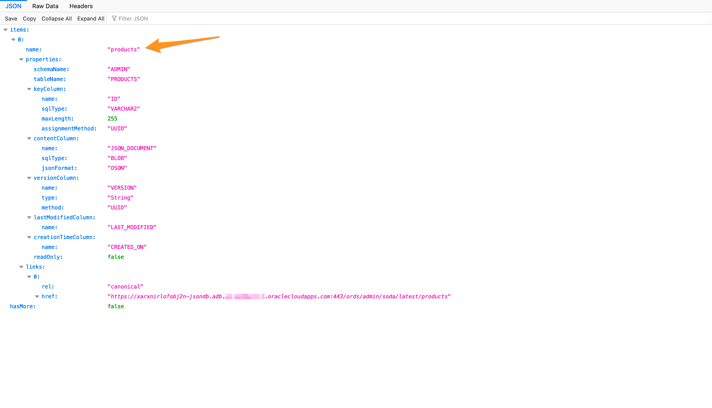
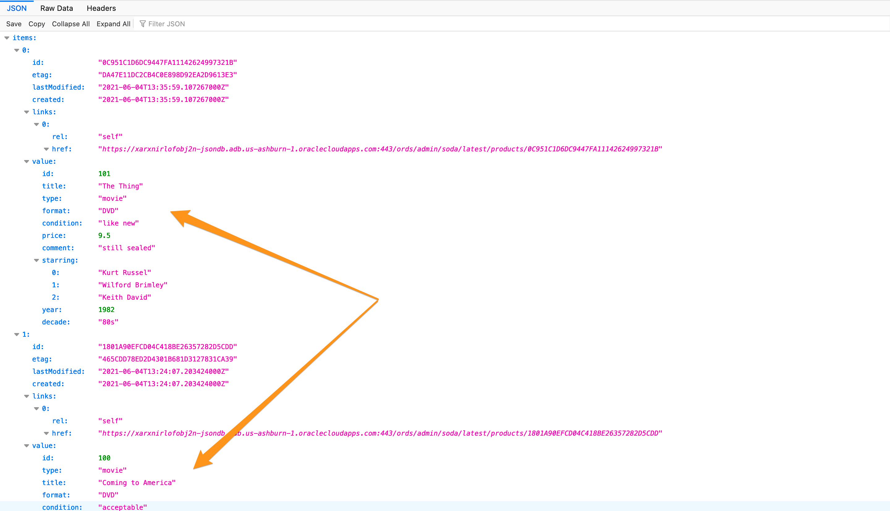
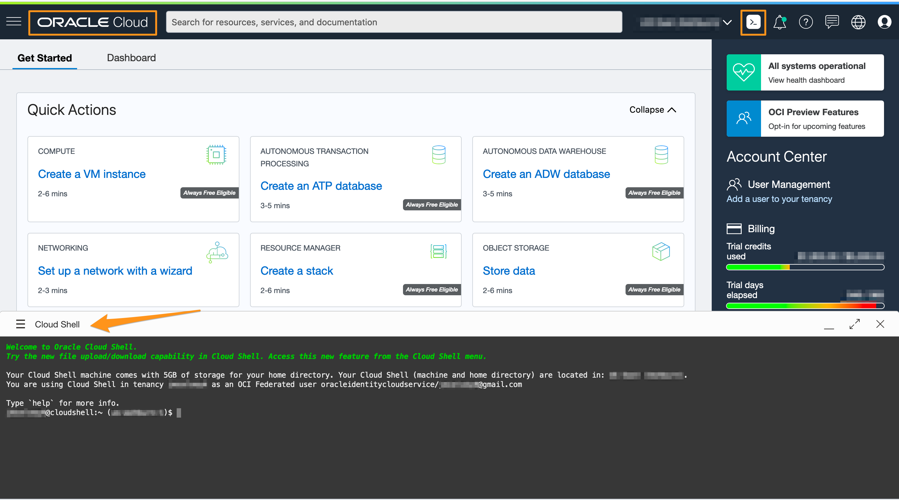
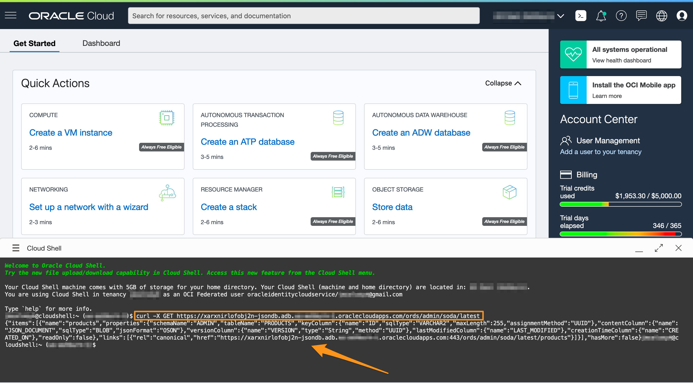
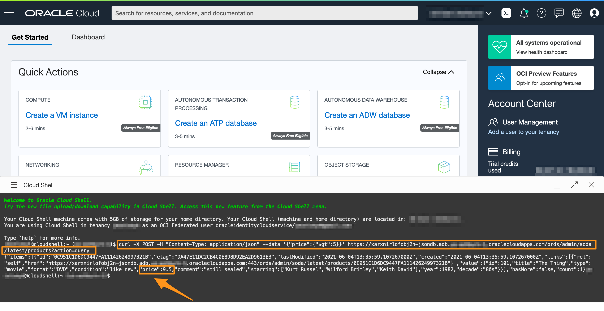
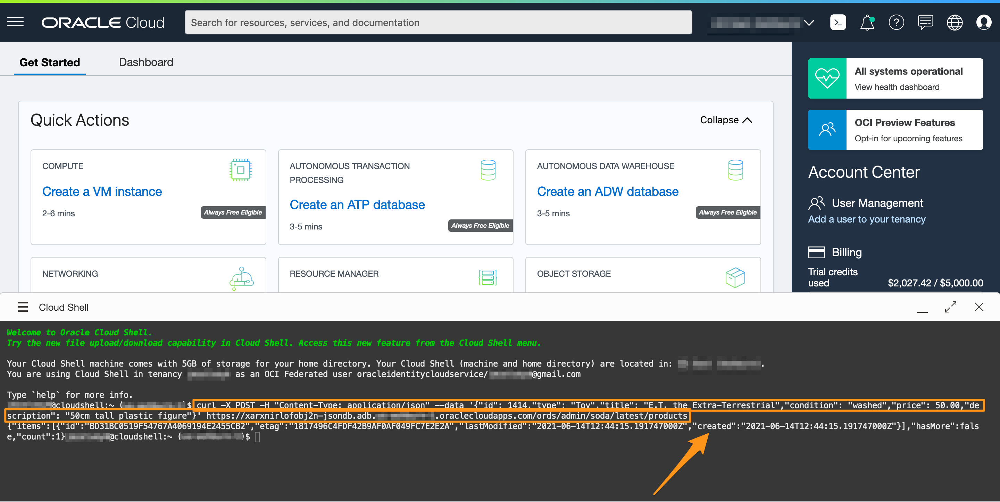
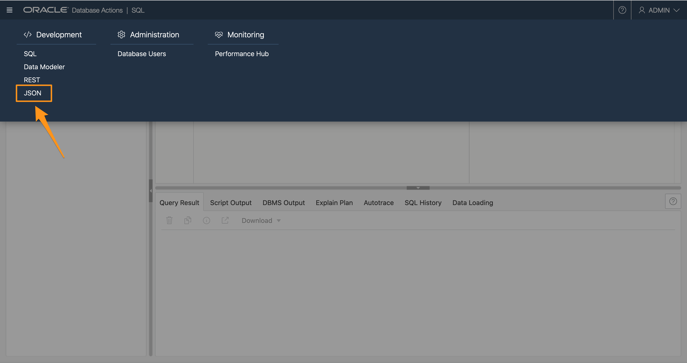
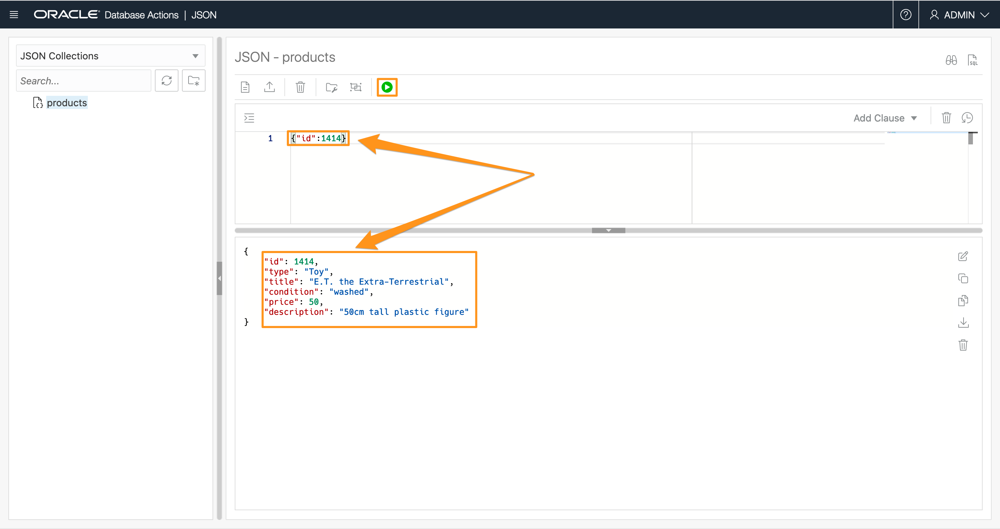

# Using SODA for REST

## Introduction

So far, all collection operations have been issued from a UI in the browser. In a real application these operations would be called directly from a programming language (for example using the open-source SODA drivers for Java, Python or NodeJS). Another option is to use REST.

This lab is optional for those that wish to understand how to access Autonomous JSON Database through raw REST calls. 

Estimated Time: 15 minutes

### Objectives

In this lab, you will:

* Perform Simple REST Operations in Oracle Cloud Shell
* Insert Data into the Collection

### Prerequisites

* Have successfully created a JSON collection in Autonomous JSON Database and have inserted few documents

## Task 1: Perform Simple REST Operations in Oracle Cloud Shell

1. In lab 3, you saved the REST and ORDS URL. It should end with */ords/*.

	In this lab, we refer *your URL* in code snippets where your URL is similar to `ppkenzghg74avsq-atp19cdb.adb.eu-frankfurt-1.oraclecloudapps.com`. Replace *your URL* with the part of your URL before *ords/* in all the code snippets wherever mentioned.

2. First, take your full REST URL and append */admin/soda/latest*.

	```
	https://<your URL>/ords/admin/soda/latest/
	```

	Your URL should now look like this:

	```
	https://ppkhnzjhg74axsq-bedasatpdb.adb.eu-frankfurt-1.oraclecloudapps.com/ords/admin/soda/latest
	```

3. Hit Enter to load this URL. You should see a JSON document which lists your collections - it shows the 'products' collection with some additional information.

	

4. In order to see the contents of the collection (the documents) all we have to do is append */products* (the collection name) to the URL and hit Enter.

	```
	https://<your URL>/ords/admin/soda/latest/products
	```

	Your URL should now look like this:

	```
	https://ppkhnzjhg74axsq-atp19cdb.adb.eu-frankfurt-1.oraclecloudapps.com/ords/admin/soda/latest/products
	```
	

5. The browser is limited to GET requests. For further operations we need to also perform other requests. For this we switch to use the 'curl' command in the Oracle Cloud Shell. If you are familiar with other REST tools like Postman you can also use them for the following examples.

	Navigate to Oracle Cloud Console and click on Cloud Shell icon.

	

6.	In the cloud shell, use the same URL to make a GET request as follows:

	```
	curl -X GET https://<your URL>/ords/admin/soda/latest
	```

	Your URL should now look like this:

	```
	curl -X GET https://ppkhnzjhg74axsq-bedasatpdb.adb.eu-frankfurt-1.oraclecloudapps.com/ords/admin/soda/latest
	```

	You'll see an authorization error. Oracle's security mechanisms kicked in as this REST request came from outside the database cloud service (you didn't get this from the browser as you were already automatically logged in for Database Actions).

	

7. We can use basic authentication to access the database. 

	Using [OAuth](https://docs.oracle.com/en/cloud/paas/autonomous-database/adbsa/ords-soda-oauth.html) is better (faster and more secure) and is much preferred for production systems, but we'll stick with basic authentication for simplicity. You just need to add "-u admin:<YourPassword>" to the end of the command, where <YourPassword> is the database password you set earlier (without the angle brackets). If your password contains special characters you should enclose it in single quotes.

	Repeating the same curl command again with authentication should now return the same result that we have seen in the web browser : the contents of the 'products' collection.

	```
	curl -X GET https://<your URL>/ords/admin/soda/latest -u admin:<YourPassword>
	```

	Your URL should now look like this:

	```
	curl -X GET https://ppkhnzjhg74axsq-bedasatpdb.adb.eu-frankfurt-1.oraclecloudapps.com/ords/admin/soda/latest -u admin:Password123
	```
	

9. We can also run a QBE using curl. This would be a post request. Make sure you add *?action=query* to the URL.

	The following example issues a QBE selecting all products costing more than 5.

	```
	curl -X POST -H "Content-Type: application/json" --data '{"price":{"$gt":5}}' https://<your URL>/ords/admin/soda/latest/products?action=query -u admin:<YourPassword>
	```

	Your URL should now look like this:

	```
	curl -X POST -H "Content-Type: application/json" --data '{"price":{"$gt":5}}' https://ppkhnzjhg74axsq-atp19cdb.adb.eu-frankfurt-1.oraclecloudapps.com/ords/admin/soda/latest/products?action=query -u admin:Password123
	```

	

10. We can insert a new document, also using a POST request but without the ?action=query` at the end of the URL.

	```
	curl -X POST -H "Content-Type: application/json" --data '{"id": 1414,"type": "Toy","title": "E.T. the Extra-Terrestrial","condition": "washed","price": 50.00,"description": "50cm tall plastic figure"}' https://<your URL>/ords/admin/soda/latest/products -u admin:<YourPassword>
	```

	Your URL should now look like this:

	```
	curl -X POST -H "Content-Type: application/json" --data '{"id": 1414,"type": "Toy","title": "E.T. the Extra-Terrestrial","condition": "washed","price": 50.00,"description": "50cm tall plastic figure"}' https://ppkhnzjhg74axsq-atp19cdb.adb.eu-frankfurt-1.oraclecloudapps.com/ords/admin/soda/latest/products -u admin:Password123
	```

	
 
11. To verify that the new document was inserted, navigate to the tab with SQL Developer Web, click on the navigation menu on the top left and select **JSON** under Development.

	

	If you use the following QBE in the JSON Workshop by copying and pasting the following query in the worksheet and running it, you should see a new document.

	```
	<copy>
	{"id":1414}
	</copy>
	```

		


You may now proceed to the next lab.

## Learn More

* [Overview of SODA](https://docs.oracle.com/en/database/oracle/simple-oracle-document-access/adsdi/overview-soda.html#GUID-BE42F8D3-B86B-43B4-B2A3-5760A4DF79FB)
* [SODA for REST Overview](https://docs.oracle.com/en/database/oracle/simple-oracle-document-access/rest/adrst/rest.html#GUID-CDCB8C6D-E830-4851-AED0-1BCBBCD1AC9A)
* [Using SODA for REST](https://docs.oracle.com/en/database/oracle/simple-oracle-document-access/rest/adrst/using-soda-rest.html#GUID-C67498D7-5783-4969-80EF-C180CEC1144A)
* [Use SODA for REST with Autonomous Database](https://docs.oracle.com/en/cloud/paas/autonomous-json-database/ajdug/ords-develop-oracle-soda-data-services.html)
* [Overview of SODA Filter Specifications](https://docs.oracle.com/en/database/oracle/simple-oracle-document-access/adsdi/overview-soda-filter-specifications-qbes.html#GUID-CB09C4E3-BBB1-40DC-88A8-8417821B0FBE)

## Acknowledgements

- **Author** - Beda Hammerschmidt, Architect
- **Contributors** - Anoosha Pilli, Product Manager, Oracle Database
- **Last Updated By/Date** - Anoosha Pilli, Brianna Ambler June 2021
