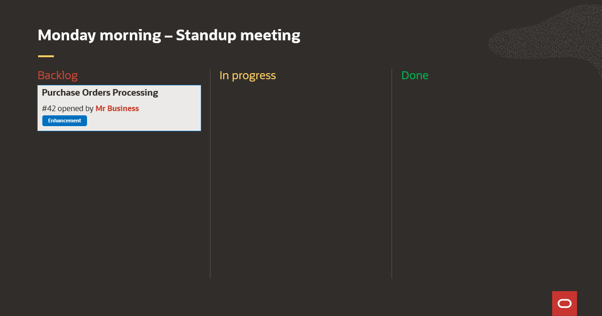
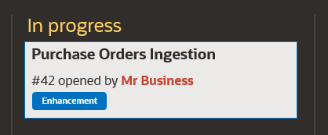
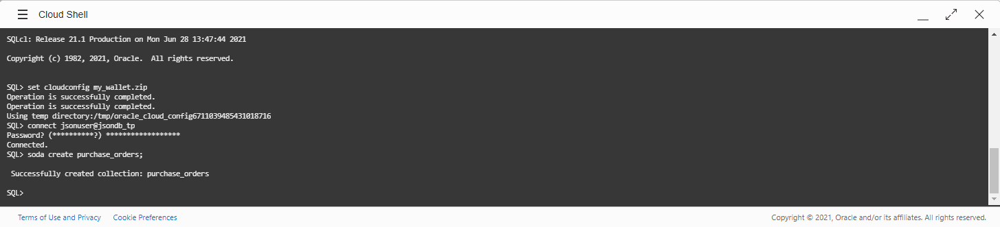
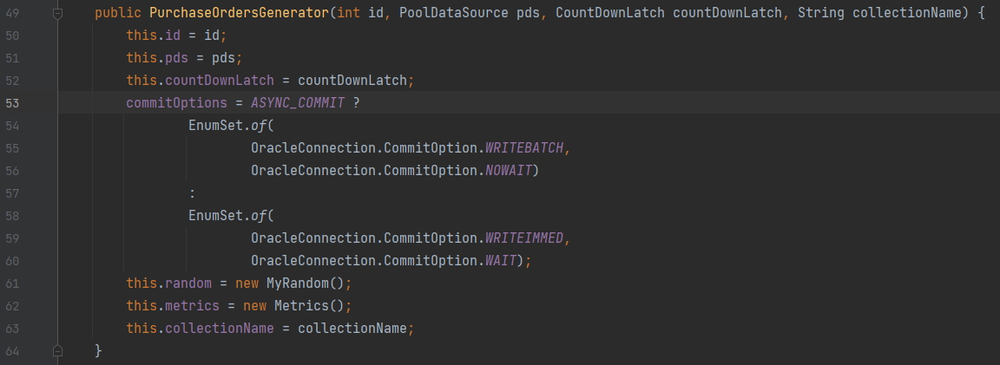
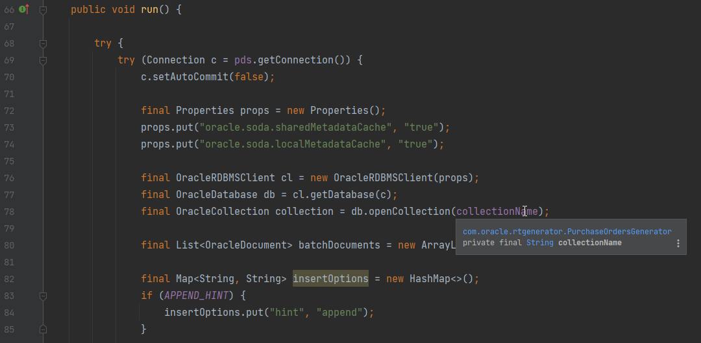
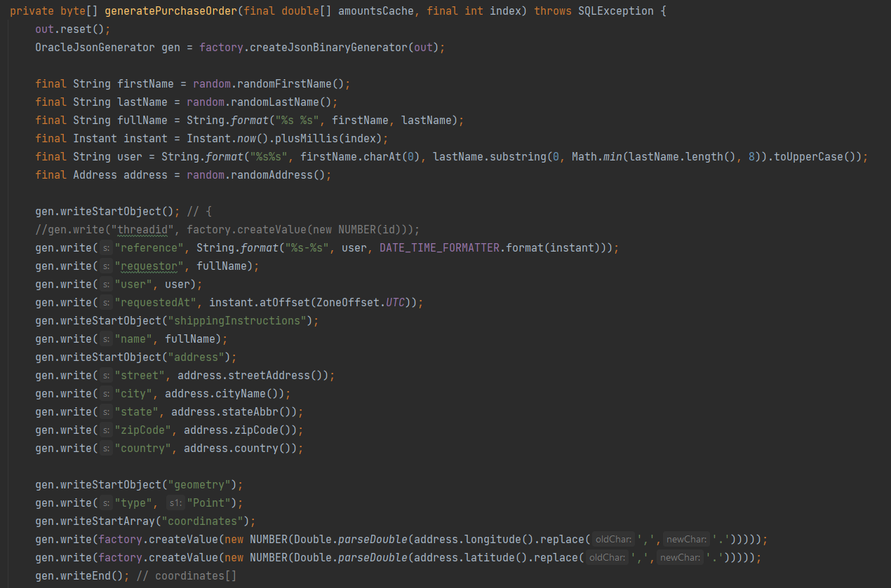
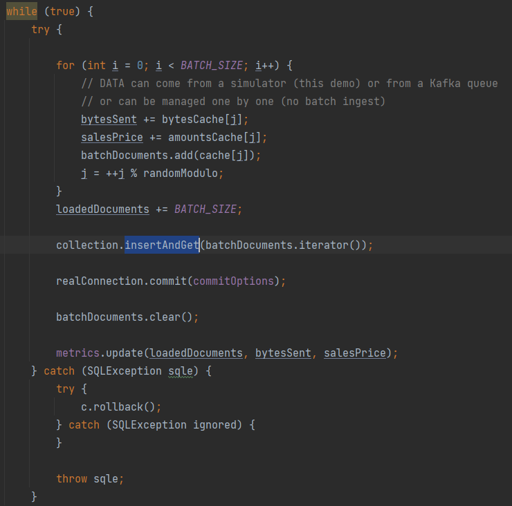
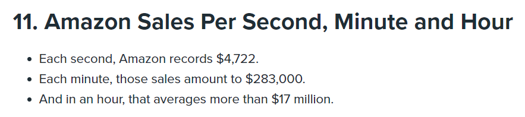
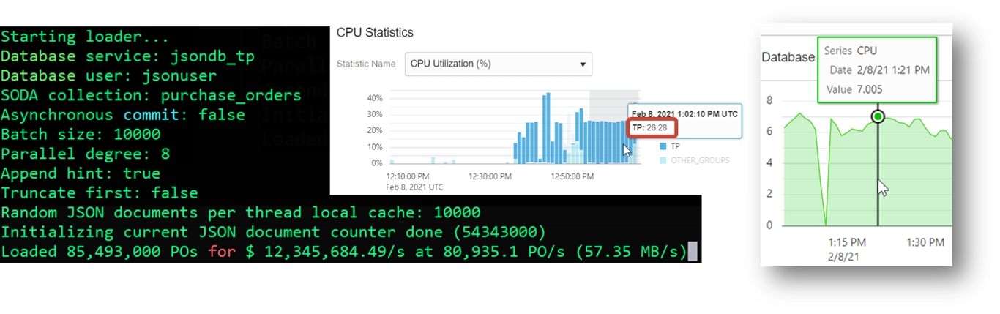

# JSON Data Loading

### Objectives

In this lab, you will:
- learn best practices to load JSON documents using the SODA API for Java

### Prerequisites

* An Oracle Cloud Account - Please view this workshop's LiveLabs landing page to see which environments are supported
* An Autonomous database - please see the Setup section of this lab

## Best practices for loading and storing JSON data

This is Monday morning, and you discover a new enhancement request waiting on your Kanban:


The ER is about the creation of a new microservice to manage **Purchase Orders**. 

## Task 1: Analyze the requirements to load JSON data

1. Purchase Orders are important to any company and specifically for e-commerce, these data need to be loaded efficiently. 
   Indeed, customers don't want to wait 10 seconds to get their purchase order processed and potentially 10s of thousands 
   of customers can submit their basket concurrently.


2. JSON data will be used here because a JSON document will contain all the business properties of a purchase order and in 
the case new ones need to be added, then the flexibility of the JSON schema will help to provide quickly in production such
enhancements. For example, the development team might add GeoJSON to improve further the spatial information gathered while
managing purchase orders. A new feature could then benefit from it to better align stocks management.

   Example of JSON formatted purchase order:

      ```
      {
         "requestor": "Alexis Bull",
         "requestedAt": "2020-07-20T10:16:52Z",
         "shippingInstructions": {
            "address": {
               "street": "200 Sequoia Avenue",
               "city": "South San Francisco",
               "zipCode": 94080,
               "country": "United States of America",
               "geometry": {
                  "type": "Point",
                  "coordinates": [ 37.662187, -122.440148 ]
               }
            },
            "phone": [
               {
                  "type": "Mobile",
                  "number": "415-555-1234"
               }
            ]
         },
         "specialInstructions": "Air Mail",
         "allowPartialShipment": false,
         "items": [
            {
               "description": "One Magic Christmas",
               "unitPrice": 19.95,
               "UPCCode": 13131092899,
               "quantity": 1.0
            },
            {
               "description": "Lethal Weapon",
               "unitPrice": 19.95,
               "UPCCode": 85391628927,
               "quantity": 5.0
            }
         ]
      }
      ```

3. It is also important to realize that the nature of this data is directly related to the financial incomes for the startup.
This means that you don't want to miss any Purchase Order for your customer and for your company!


4. Finally, in terms of data management, and in the case of this startup is really successful, the quantity of JSON documents to
manage can grow quickly over time. Having this in mind early in the design phase can help you to choose the right tool and capabilities
that will simply your life later.

## Task 2: Choose wisely the features to use for your JSON data

Now that we have studied some reasonable capabilities to have, let's see what can be done using the Oracle Autonomous Database...

1. One of the possible way for propagating the purchase orders from one microservice to the other would be to stream these
JSON documents. Typically, this could involve some queuing system such as Kafka or Oracle transactional event queues "in front
of the database". These systems are known to be scalable and can process _a lot_ of data concurrently. Additionally, managing the 
   data by batch can help further scaling the ingestion process by reducing the protocol overheads at the network layer.
   
   With your Autonomous database, comes 3 to 5 pre-configured database services: LOW, MEDIUM, HIGH, TP, and TPURGENT (TP and TPURGENT are not available for Autonomous Data Warehouse).
   They come with associated [resources and capabilities](https://docs.oracle.com/en/cloud/paas/atp-cloud/atpgs/autonomous-connect-database-service-names.html).  

   
2. To simplify the management of JSON data, we'll rely on the [Simple Oracle Document Access (SODA) API](https://docs.oracle.com/en/database/oracle/simple-oracle-document-access/). This API is available for numerous
languages and here we'll demonstrate its capabilities using the Java language. We'll indeed use a SODA **collection** to load our JSON data
   and leverage the Query By Example capabilities to retrieve JSON data without involving any SQL.


3. ACID transactions is generally an accepted feature that Relational databases provide. But, it is less known that the Oracle database can
disable ACID compliance by providing asynchronous commits. Eventual consistency doesn't necessarily improve performance, especially for this 
   lab scenario where the Autonomous databases leverage the Exadata infrastructure and its high-performance scale-out storage. So although, we might be tempted
   using asynchronous commits for scalability purpose, we'll stay with ACID transactions.
   

4. By partitioning our SODA collection by time interval, we'll be able to later drop older partitions of data quite efficiently using a simple DDL command. Also according to
the future analytic needs (for reporting...) we'll be able to filter on the required documents and use the partition pruning technic that will indeed improve
   the query response time by avoiding to process data not needed.

## Task 3: Implementing our Purchase Order loader



In fact the microservice deployed in the previous lab already provides an implementation of the capabilities mentioned previously.

### Inside the Database

1. Start by dropping the collection (in the case you started the data loader before). Then you'll create a table partitioned by interval (time range) with a new partition added automatically every hour:
   
      ```
      <copy>
      soda drop purchase_orders;
      
      -- /!\ Warning for on-premises: this will use the Partitioning Option (costs associated unless you use the database XE version)
      create table PURCHASE_ORDERS (
         ID VARCHAR2(255) default SYS_GUID() not null primary key,
         CREATED_ON timestamp default sys_extract_utc(SYSTIMESTAMP) not null,
         LAST_MODIFIED timestamp default sys_extract_utc(SYSTIMESTAMP) not null,
         VERSION varchar2(255) not null,
         JSON_DOCUMENT BLOB, -- using the 19c compatible way
         check (JSON_DOCUMENT is json format oson))
         LOB(JSON_DOCUMENT) STORE AS (CACHE)
      PARTITION BY RANGE (CREATED_ON)
      INTERVAL (INTERVAL '1' HOUR)
      (
         PARTITION part_01 values LESS THAN (TO_TIMESTAMP('01-JUN-2021','DD-MON-YYYY'))
      );</copy>
      ```

2. Create the SODA collection using either SQL Developer Web or SQLcl: 

    ```
    $ <copy>soda create purchase_orders;</copy>
    ```

   SQL Developer Web:

   
 
   SQLcl:

   

   Doing so, the SODA API will create the collection mapped onto the existing table we just created before.


### Inside your Java code

The microservice source code is available on GitHub. More specifically, you can have a look at the [Java class](https://github.com/loiclefevre/rtgenerator/blob/f65c027a7b82dc796869d3cf3b3bb9ef3bd417d4/src/main/java/com/oracle/rtgenerator/PurchaseOrdersGenerator.java#L27) that generates random purchase orders and then persist them inside the database.

1. Configuring COMMIT options

   Following is the initialization of the commit options inside the constructor:

   


2. Managing JSON data using the SODA API for Java
   
   The JSON document loader implements the `Runnable` interface:
   
   
   You can see on line 69 that a JDBC `Connection` is retrieved from the data source. This connection is forced to use "manual commit" (we control when the commit will occur, and we'll also manage the rollback in case of).
   
   On line 72, we prepare some properties to instantiate an `OracleRDBMSClient` object which will be used to retrieve the `OracleDatabase` instance (line 77). This is a SODA object that will allow us to manage JSON data.

   On line 78, we open the JSON collection for future read/write access.

   Finally, we prepare (line 82) the insert options such as the `APPEND_HINT` (see [here](https://docs.oracle.com/en/database/oracle/oracle-database/19/sqlrf/Comments.html#GUID-562DD503-2F99-448E-B044-737BE726B58A) for more details).  


3. Precomputing random JSON documents

   The JSON documents being used are randomly generated and cached at the very beginning. This is to avoid measuring the performance of the random number (strings, dates...) generator.
   Instead, when we need to persist a JSON document, we'll take one randomly and send it to the database.
   
   The pre-computation is done inside the [method](https://github.com/loiclefevre/rtgenerator/blob/f65c027a7b82dc796869d3cf3b3bb9ef3bd417d4/src/main/java/com/oracle/rtgenerator/PurchaseOrdersGenerator.java#L175) `generatePurchaseOrder`:
   
   
   We use the [OSON](https://blogs.oracle.com/jsondb/osonformat) low level encoding API in order to binary encode the JSON document. This will reduce the size of the document.
   

4. Using Batch mode to persist the JSON documents   

   As a best practice, we reduce the impact of the network latency by sending an array of n JSON documents. This is configurable. As the documents we treat in this workshop have an average size of 600 bytes, sending an array of 100 documents
   avoids managing 100s of network protocol frames. We just send one big frame of about 60 kB. The latency impact of the network is then reduced.
   
   The [batch insertion](https://github.com/loiclefevre/rtgenerator/blob/f65c027a7b82dc796869d3cf3b3bb9ef3bd417d4/src/main/java/com/oracle/rtgenerator/PurchaseOrdersGenerator.java#L144) is done using the SODA API in a way that looks like the JDBC way using the `insertAndGet` method (that needs an iterator):
   

### Running the microservice

According to the number of Java threads, and the number of CPUs available, the number of JSON documents can reach an interesting ingestion rate. Quite easily in the 10,000s of documents ingested per second rate.

While this number might be a significant KPI, it remains a technical one. Hence, while the data are being sent to the database, you can see another interesting metric: the financial income related to all orders processed per second. 
Having an average of $ 51 per order (with 1 to 4 items per order), the sum of the amounts per second can reach incredible amounts. To translate this business KPI into our real world, [some statistics are available online](https://www.repricerexpress.com/amazon-statistics/) 
that describe the average amount of Amazon sales per second in 2020:



Running with 8 threads, and a batch size of 10,000 documents, we can easily reach an ingestion rate of 80,000 documents per second on a 4-OCPUs ATP-S database for an amount of about $ 12M sales per second:



Using the Autonomous Database Performance Hub, we can see that the number of OCPUs increased to 7 (close to the number of loaders) thanks to auto-scaling, and it consumed 26% of these CPUs.


You may now [proceed to the next lab](#next): ...

## Learn More

* [SODA for Java](https://docs.oracle.com/en/database/oracle/simple-oracle-document-access/java/index.html) 

## Acknowledgements
* **Author** - Loic Lefevre, Principal Product Manager
* **Last Updated By/Date** - Loic Lefevre, Principal Product Manager, June 2021


