# Indexing JSON Data

### Objectives

In this lab, you will:
- learn about the different types of indexes available for JSON data 
- learn how to create functional indexes for JSON data 
- learn how to create advanced Full-Text search indexes on a JSON collection

### Prerequisites

* An Oracle Cloud Account - Please view this workshop's LiveLabs landing page to see which environments are supported
* An Autonomous database - Please see the Setup section of this lab
* JSON data to index - Please check the previous lab: JSON Data Loading
  
## Retrieving JSON Data _Quickly_

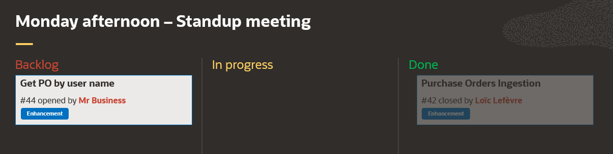

This is a new enhancement request that the business requires. The frontend must now be improved to provide search capabilities
upon the Purchase Orders present inside the application.

Because we are in the context of an e-commerce application, data retrieval is a critical subject. End users want to access there
data very quickly; any delay might cause potential customer to go to another website!

One interesting aspect of JSON data in this context is the fact that all the required information come as one unique document. 

However, as we'll see, **indexing JSON data remains a best practice**.

## Task 1: Indexing a JSON Field

SODA collections support different index types:
- Unique index on the ID
- Single field (functional) index
- Compound index (on several fields)
- Geospatial index
- Search index (aka Full-Text)

Since the username data are stored inside the `requestor` field of our purchase order documents, we'll need to index this field.

```
{
   "requestor": "Alexis Bull",
   "requestedAt": "2020-07-20T10:16:52Z",
   "shippingInstructions": {
      "address": {
...
```

To index a JSON field, you can use the SODA API or SQL commands using right the JSON path expression. First, we'll need to log into SQL Developer Web.
This can be done using the `URL` and `login` resulting from the provisioning of the database in **Lab 1**. If you have these information, then you can skip to point #7.

1. In your Autonomous database's details page, click the **Tools** tab.

   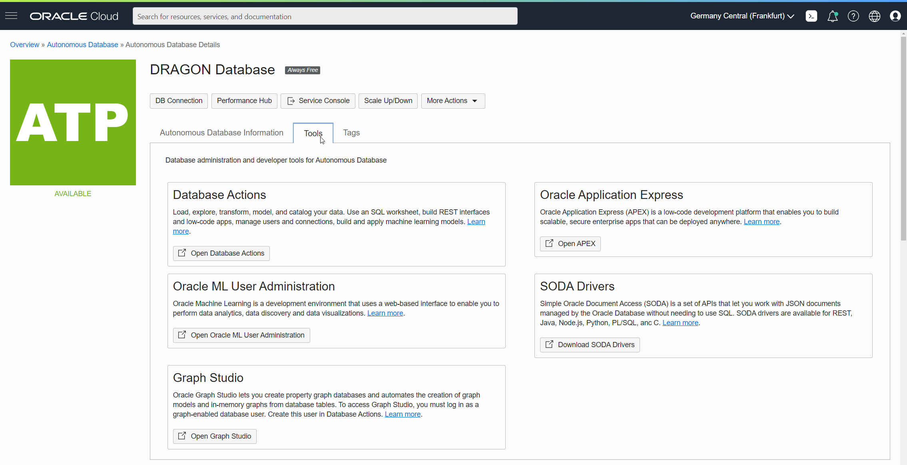


2.  The Tools page provides you access to database administration and developer tools for Autonomous Database: Database Actions, Oracle Application Express, Oracle ML User Administration, SODA Drivers, and Graph Studio.
    In the Database Actions box, click **Open Database Actions**.

    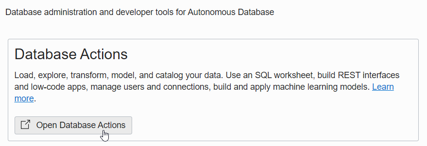


3.  A sign-in page opens for Database Actions. For this lab, use the database username account you've chosen (`jsonuser` in the Lab 1), **Username - jsonuser**, and click **Next**.
    The reason for this _extra step_ is simple: SQL Developer Web uses Oracle REST Data Services (ORDS) and thus need the right user alias for the URL.

    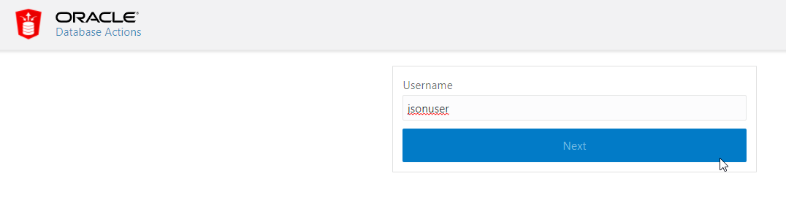


4. Enter the user **Password** you specified when creating the database. Click **Sign in**.

   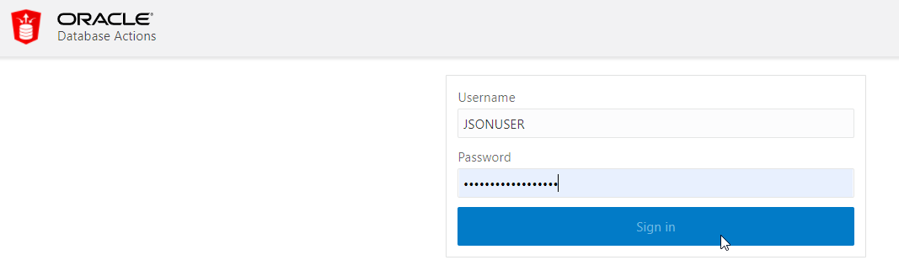


5. The Database Actions page opens. In the **Development** box, click **SQL**.

   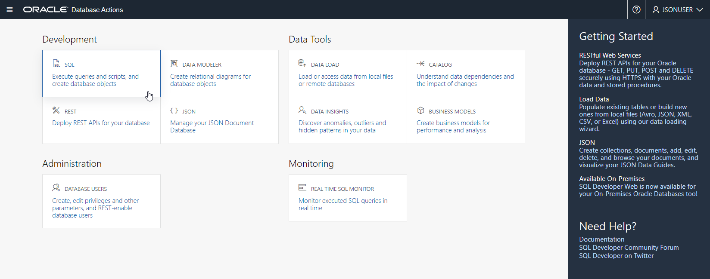


6.  The first time you open SQL Worksheet, a series of pop-up informational boxes introduce you to the main features. Click **Next** to take a tour through the informational boxes.
    Notice the 2 SODA collections appearing in the left panel. There are indeed 2 tables 
   

7. Create a _single field_ (functional) index on the `purchase_orders` SODA collection using the SODA API for PL/SQL:
   
      ```
      <copy>
      DECLARE
         collection  SODA_COLLECTION_T;
         spec        VARCHAR2(32000);
         status      NUMBER;
      BEGIN
         -- Open the collection
         collection := DBMS_SODA.open_collection('purchase_orders');

         -- Define the index specification
         spec := '{"name"   : "IDX_REQUESTOR",
                  "fields" : [{"path"     : "requestor",
                              "datatype" : "string",
                              "order"    : "asc"}]}';
         -- Create the index
         status := collection.create_index(spec);

         DBMS_OUTPUT.put_Line('Status: ' || status);
      END;
      /</copy>
      ```  
   
   We've used the `requestor` JSON Path expression to index only this field (single field index) for each JSON document inside the collection. 
   Behind the curtain, the SODA API will create a functional index (aka function based index) since it'll use the SQL/JSON function `JSON_VALUE`. 

   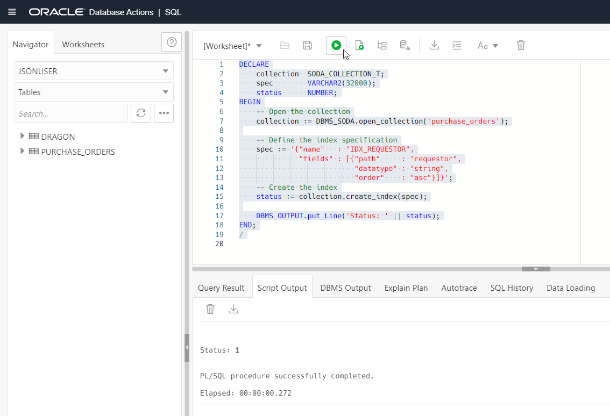


## Task 2: Retrieving JSON Documents

1. Let's run our very first query By Example (aka QBE) using the JSON panel.
 
   Open the JSON panel from the hamburger menu.

   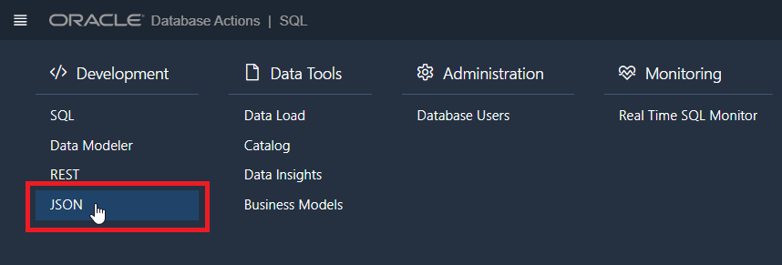
   

2. Running a QBE is simple. Having several JSON documents with the `requestor` field equals to Augustina Shiflett (random value), we can run the following QBE to retrieve all the documents with the `requestor` field starting by Aug:

      ```
      <copy>{ "requestor" : { "$like" : "Aug%" } }</copy>
      ```

      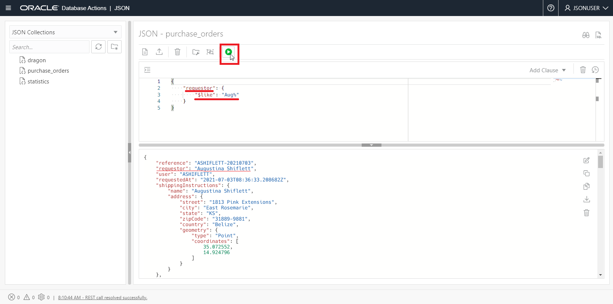
   
   But how do we know if the command uses the index we've just created before?

## Task 3: Looking at the Execution Plan

1. Switch back to the SQL database action:

   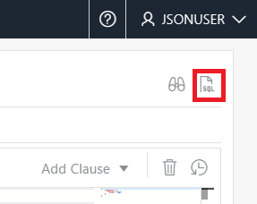


2. Run the following SQL query:
   
   It will count the number of JSON documents from the collection using the exact same QBE filter, but this time written using pure SQL thanks to the SQL/JSON standard operator `JSON_EXISTS`.

      ```
      <copy>SELECT
         COUNT(*)
      FROM
         PURCHASE_ORDERS
      WHERE
         JSON_EXISTS ( JSON_DOCUMENT, '$?(@.requestor like "Aug%")' );</copy>
      ```
      
      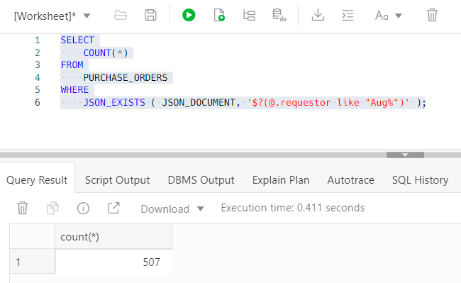


3. Get the _Execution Plan_ by clicking on the highlighted icon:

   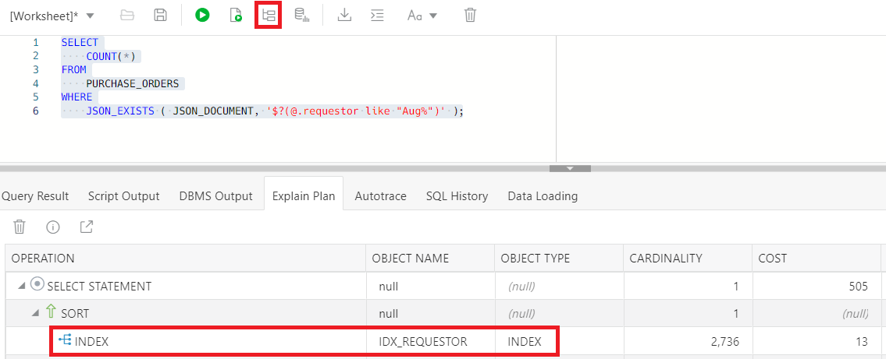

   The index is used!

## Task 4: More Advanced Indexes: _Search Index_

If you test different values in the previous query, you might see that sometimes the index isn't used. This can happen if the value specified starts by the wildcard symbol **%**:

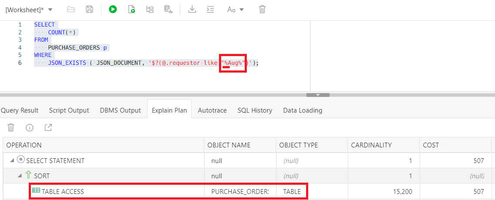

Of course, the business analyst saw this problem while testing the frontend of our application, and he filled a bug...

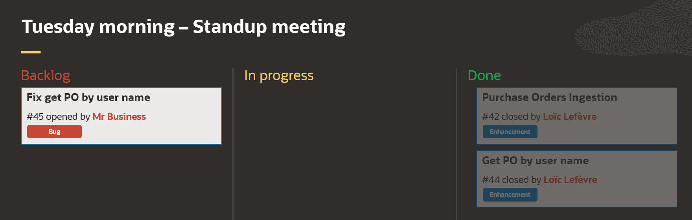

Entering **Search indexes**; a search index indexes the whole JSON document: **every field names and every values**.
It is particularly useful if we don't know the schema (layout) of the JSON documents in advance. Creating a basic (functional) index requires you to 
know the name of the element (such as `requestor`) on which you wish to create the index. 

Search indexes are also used to do full-text searching on textual content (for example, "find me all the purchase orders which have Paris in their address field").
Search indexes take a significant time to create on large collections. 

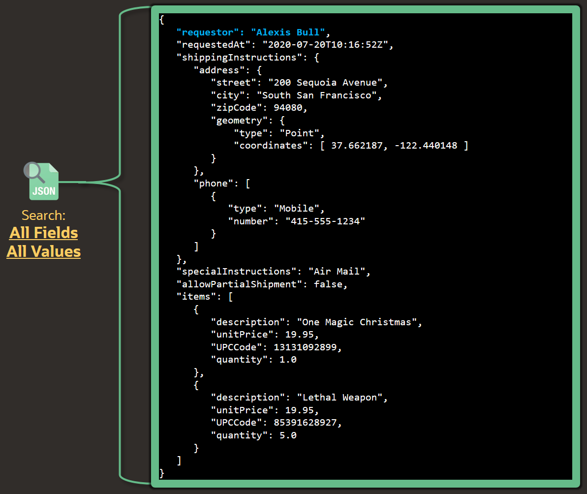

1. Preparing the JSON collection
   
      We'll create a Search Index on a limited set of data: say 300,000 JSON documents:
      - you can either delete JSON documents from the `purchase_orders` collection,
      - or you can also truncate the underlying table and restart the data generator: 
      ```
      $ <copy>truncate table purchase_orders;</copy>
      ```
   
2. Creating the Search Index using the SODA API:

      ```
      <copy>
      DECLARE
         collection  SODA_COLLECTION_T;
         spec        VARCHAR2(32000);
         status      NUMBER;
      BEGIN
         -- Open the collection
         collection := DBMS_SODA.open_collection('purchase_orders');

         -- Define the Search index specification
         spec := '{"name"   : "IDX_PO"}';

         -- Create the Search index
         status := collection.create_index(spec);

         DBMS_OUTPUT.put_Line('Status: ' || status);
      END;
      /   
      </copy>
      ```
   
   The index specification is very simple. Using the LOW database service, this should take about 1 minute to complete.

   You may drop the index if you wish to test the second method hereunder: `<copy>drop index idx_po;</copy>` 


3. Creating an **advanced** Search index using SQL:

   Search indexes rely on the [Oracle Text](https://docs.oracle.com/en/database/oracle/oracle-database/19/adjsn/indexes-for-json-data.html#GUID-D7A604E1-F617-4C92-A9D9-00B6AB78EFD8__GUID-3E1017C5-60BD-428D-A2B6-FAD0C27657A6) indexing infrastructure present inside the Oracle database.
   Hence, they inherit several capabilities such as asynchronous maintenance which allows improving DML operations.
   
   Using the following syntax, you can create a Search index that will be maintained asynchronously (e.g not during the INSERT transaction), every second:

      ```
      <copy>
      CREATE SEARCH INDEX idx_po ON purchase_orders (json_document) FOR JSON
      PARAMETERS('SYNC (EVERY "FREQ=SECONDLY; INTERVAL=1")');
      </copy>
      ```

   The index creation should take about 1 minute to complete.


## Task 5: Retrieving JSON documents using Full-Text search

1. Using the SODA API, you can perform complex search:

   
   
   Back in the JSON database action panel, run the following search:

      ```
      <copy>
      {
         "requestor": {
            "$contains": "(%Aug%)"
         }
      }
      </copy>
      ```
   
   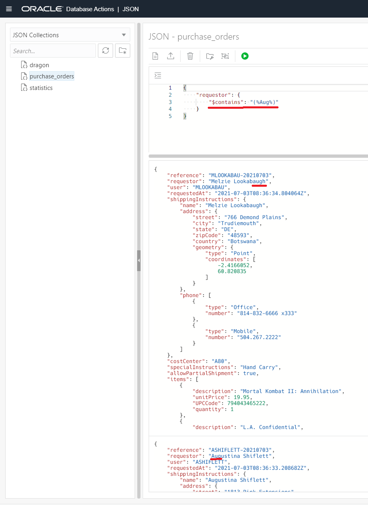

   As you can see, this searches for all the JSON documents having `Aug` inside the `requestor` field whatever the case.
   For this we've used the `$contains` SODA operator.
   
   
2. Using SQL, we can leverage the `JSON_TEXTCONTAINS` SQL/JSON function to do exactly the same.

   Switch back to the SQL database action panel and run the following SQL query:

      ```
      <copy>
      SELECT
         COUNT(1)
      FROM
         PURCHASE_ORDERS p
      WHERE
         JSON_TEXTCONTAINS ( JSON_DOCUMENT, '$.requestor', '(%Aug%)');
      </copy>
      ```

      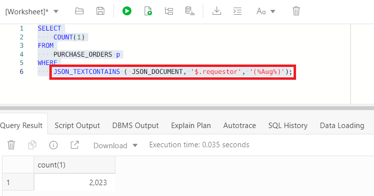
   
   And following, you can see the execution plan:

   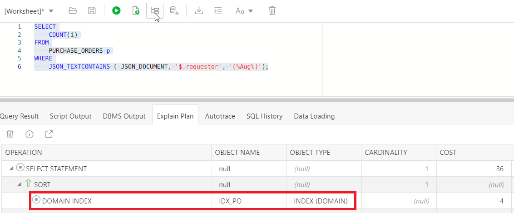


3. Testing other full-text operators

   Oracle Text offers other [advanced operators](https://docs.oracle.com/en/database/oracle/oracle-database/19/ccref/oracle-text-CONTAINS-query-operators.html#GUID-6410B783-FC9A-4C99-B3AF-9E0349AA43D1) such as fuzzy search:
 
      ```
      <copy>
      SELECT DISTINCT
         p.json_document.requestor
      FROM
         PURCHASE_ORDERS p
      WHERE
         JSON_TEXTCONTAINS ( JSON_DOCUMENT, '$.requestor', 'fuzzy(%scoot%)');
      </copy>
      ```
      
      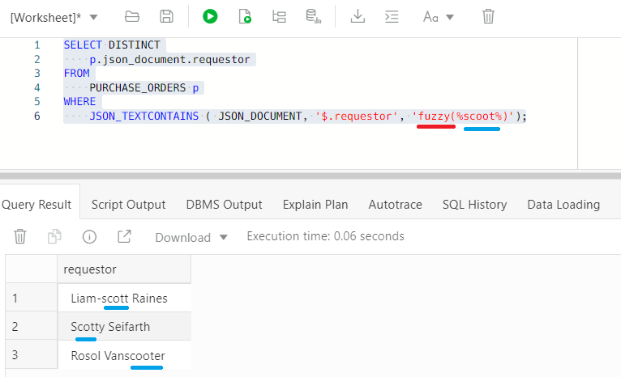


In the next lab, we'll look at even more advanced technics to combine JSON documents with Relational data.

You may now [proceed to the next lab](#next): ...

## Learn More

* [SODA indexing](https://docs.oracle.com/en/database/oracle/simple-oracle-document-access/adsdi/overview-soda-index-specifications.html)

## Acknowledgements
* **Author** - Loic Lefevre, Principal Product Manager
* **Last Updated By/Date** - Loic Lefevre, Principal Product Manager, June 2021

