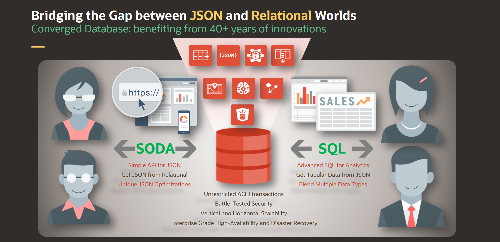

# Introduction

## About this Workshop

This workshop provides insights regarding the true meaning of a **Converged Database**. We'll start from the JSON data 
type perspective but quickly introduce the industry standard to combine JSON data with Relational data: the SQL language
and its set of new SQL:2016 functions to process JSON documents.

The learning curve is based on true use cases introduced as if you were a developer working for a fictive e-commerce startup.

**Estimated Workshop Time: 60 minutes**

### Objectives

In this lab, you will:
- configure the DRAGON tool to easily provision your Autonomous Database and a micro-service used to load JSON data,
- learn best practices to load JSON documents using the SODA API for Java
- use different types of JSON indexes to speed up data retrieval
- create a Relational view over JSON data joined with Relational data
- create a compressed materialized view overs JSON data
- join relational data with JSON data

### Prerequisites

* An Oracle Cloud Account - Please view this workshop's LiveLabs landing page to see which environments are supported

*Note: If you have a **Free Trial** account, when your Free Trial expires your account will be converted to an **Always Free** account. You will not be able to conduct Free Tier workshops unless the Always Free environment is available. **[Click here for the Free Tier FAQ page.](https://www.oracle.com/cloud/free/faq.html)***

You may now [proceed to the next lab](#next).

## Learn More

* [DRAGON Stack manager portal](https://bit.ly/DRAGONStackManager)
* [DRAGON Stack manager on GitHub](https://bit.ly/DragonStack)

## Acknowledgements
* **Author** - Loic Lefevre, Principal Product Manager
* **Last Updated By/Date** - Loic Lefevre, Principal Product Manager, June 2021
