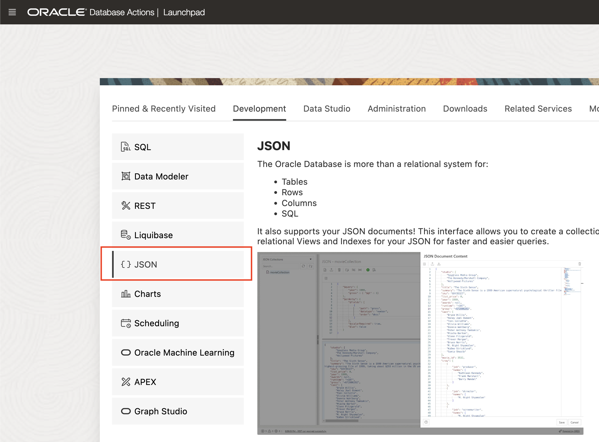

# Interact with JSON Documents through Database Actions

## Introduction

This lab will use JSON and SQL in Database Actions. It shows how we can swap between a document-centric model (MongoDB and Oracle's JSON tool in Database Actions), and a relational model using Oracle's SQL tool in Database Actions.

Estimated Time: 20 minutes

### Objectives

In this lab, you will:

* Open Database Actions in your browser, pointing to your ORDS installation
* Use the JSON and SQL tools in Database Actions to view the data you created from Mongo Shell

### Prerequisites

* Oracle Database 23c Free Developer Release
* ORDS started with MongoDB API enabled
* Password of database user hol23c known

## Task 1: Open Database Actions


6. Return to your web browser and choose the **JSON** card in Database Actions

    

    When you first enter JSON, you will get a tour of the features. We recommend you step through it, but you can skip the tour by clicking on the "X". The tour is available at any time by clicking the tour button.

    

    After the tour, you should see the 'emp' collection you created in Mongo Shell on the left. If it's not shown, click the refresh circle. Then click on the 'emp' collection.

    The left-hand side shows collections. The upper right allows us to run queries, and the lower right shows the documents found by that query. An empty search - {} - will show all documents, which is what you should be looking at now. You can confirm using the scroll bar that there are three documents for Blake (Intern), Smith and Miller (Programmers).

2. Let's go ahead and do a search. Enter {"job": "Programmer"} in the search box and press the Run Query button. Case **is** significant, so be careful, or copy the query below:

    ```
    <copy>
    {"job": "Programmer"}
    </copy>
    ```

    

    We can see only two records are fetched as a result of that search. Let's give Miller a pay rise. Click on the "Edit" button to the right of the Miller document:

    

    That drops us into a JSON editor. In the JSON Document Content, change Miller's salary to 80000 and click the "Save" button. If you make an error which would produce invalid JSON, the editor will not let you save the content.

    

    We can now see that Miller's salary is 80000. Let's add another document to the collection. Click on the "New JSON Document" button immediately below the collection name on the top panel.

    


    That will bring up the JSON editor again, this time with an empty document. Copy the following document in:

    ```
    <copy>
    {
        "name": "Jones",
        "job": "Manager",
        "salary": 50000
    }
    </copy>
    ```

    Since there's already an empty document in there, make sure you don't end up with two sets of braces (curly brackets) around the JSON. Click "Create" when done.

    

    Click the "Clear" button for the existing search, then run another empty search to see all documents.

    **Caution:** the same "trashcan" icon is used in two places in the JSON workshop. To the right of "add clause", it means "Clear the current search". On the top row, it means "Delete all documents found by the current query". Don't delete your documents by accident!

    

    Finally, let's sort the results of our query, in descending order of salary (so highest first).

    On the right, click "Add Clause" and choose "$orderby". This will guide us through adding an order-by clause to our (currently empty) query.

    

    That will change our query to have two parts - a $query part and a $orderby part. The $query part is the default if neither is specified.

    $query still contains our empty search - {}.

    We need to complete some details for the $orderby. We want to sort by salary, so change the path to "salary". It's a number, so change datatype from "varchar2" to "number". And finally, change the order from "asc" (ascending) to "desc" (descending), so we get largest first. 

    

    Use the scrollbar to confirm that we have fetched back the records in descending order of salary.

    Before we leave JSON, let's just create a new collection. On the left side, click the "New Collection" button. 

    

    On the right, give our collection the name "newcollection" and check the "MongoDB Compatible" box. 
    
    If you're interested, the main effect of the MongoDB compatibility is to include the allocated ID field within the document itself, as a field called "_id". This is a requirement for MongoDB utilities, but if you are only going to use Oracle SODA (Simple Oracle Document Access) then the ID field can be external to the document. You can see the difference in the sample JSON document if you check and uncheck the box.

    When done, click "Create".  We won't do anything else with this collection, but it illustrates a point in the next section.

    

    You can refresh the collection list on the left-hand side to check the new collection is there.

    After that, we're ready to move on to the next task.

## Task 3: SQL in Database Actions


## Acknowledgements

- **Author** - Roger Ford, Principal Product Manager
- **Contributors** - Kamryn Vinson, Andres Quintana
- **Last Updated By/Date** - Roger Ford, March 2022
