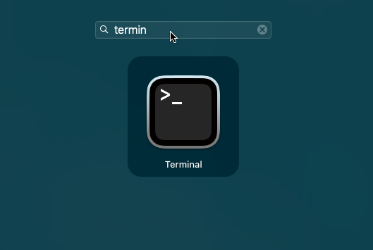

# Install Mongo Shell

## Introduction

This lab walks you through the installation of the Mongo Shell tool on your own machine. Instructions are provided for Mac OS/X and Windows machines. Installation on a Linux machine will be similar to the Mac instructions, but obviously will require a different download file.

**NOTE**: Mongo Shell is a tool provided by MongoDB Inc. Oracle is not associated with MongoDB Inc, and has no control over the software. These instructions are provided simply to help you learn about Mongo Shell. Links may change without notice.

Estimated Time: 10 minutes

Watch the video below for a quick walk-through of the lab.
[Install Mongo Shell](videohub:1_b7deqo67)

### Objectives

In this lab, you will:

* Install Mongo Shell on your local machine
* Set up your PATH to point to the Mongo Shell executable

### Prerequisites

* A Mac OS/X machine (Intel or Apple hardware) or a Windows PC.
* Access to the command prompt / terminal

## Task 1: (Mac only) Determine the type of hardware

1. If you know already whether your Mac uses Intel or Apple Silicon you can skip this step. Otherwise:

    Click on the Apple menu in the top left-hand corner of your screen and go to "About this Mac". 

    

    That will open a "details" panel. Intel Mac will show a line with *Processor:* and the name of an Intel processor. Apple Silicon Macs will show a line saying *Chip"* and a line such as "Apple M1 Pro".

    

## Task 2: Open a command prompt or terminal window

1. On a Mac:

    Open the Launchpad icon in the Dock (or press Command-space) and start typing "terminal" in the search box. Press enter to start terminal.

    

2.  On a Windows PC:

    Press "Run" (Windows-R) and type "cmd.exe". Press enter or click "OK".

    

3.  Create and enter a suitable directory. We'll create a directory 'mongosh' under the default home directory, but you can choose to create it elsewhere. For **Mac or Windows**, enter the following commands:

    ```
    <copy>
    mkdir mongosh
    cd mongosh
    </copy>
    ```

## Task 3: Download and expand the MongoDB installer file

On both Mac and Windows, you can use the built-in 'curl' command to access a URL and download a file from it. The URL to use will vary according to the machine involved.

**Note:** If you encounter any issues with the download or the version listed here, then please visit https://www.mongodb.com/try/download/shell to download the most recent shell for your operating system.

Copy **ONE** of the following *curl* commands and paste it to the command or terminal window:

1. For **Mac with Intel processor**:

    ```
    <copy>
    curl https://downloads.mongodb.com/compass/mongosh-1.9.1-darwin-x64.zip -o mongosh.zip
    </copy>
    ```

2. For **Mac with Apple chip**:

    ```
    <copy>
    curl https://downloads.mongodb.com/compass/mongosh-1.9.1-darwin-arm64.zip -o mongosh.zip
    </copy>
    ```

3. For **Windows**:

    ```
    <copy>
    curl https://downloads.mongodb.com/compass/mongosh-1.9.1-win32-x64.zip -o mongosh.zip
    </copy>
    ```

4. The previous step will have downloaded a zip file called mongosh.zip, which we need to expand. 

    On **Mac or Windows**, run the following command:

    ```
    <copy>
    tar -xvf mongosh.zip
    </copy>
    ```

    **Notes**: tar is a built-in command in Windows 11 and recent Windows 10 builds. If for any reason it is not available, you will need to expand the zip file using Windows Explorer. On Mac, you could use the command 'unzip mongosh.zip' to the same effect.

## Task 4: Set the PATH to include the mongosh executable

1. On **Mac** (Intel or Apple silicon) run the following command to set your path variable to include the location of the **mongosh** executable.

    ```
    <copy>
    export PATH=$(dirname `find \`pwd\` -name mongosh -type f`):$PATH
    </copy>
    ```

    If that fails, you'll have to set your path manually to include the 'bin' directory from the files you just downloaded. If you close and reopen your terminal window, you will need to re-run this comamnd. Alternatively, you can always navigate to the directory where you have extracted the software and run the shell with the relative path.

2. On **Windows** you can use the following command, assuming you created the 'mongosh' directory in your home directory. If you created it elsewhere, you'll need to edit the path command appropriately.

    ```
    <copy>
    set path=%cd%\mongosh-1.5.0-win32-x64\bin\;%PATH%
    </copy>
    ```

3. Keep the command or terminal window open for later use. If you close it and need to reopen it, you will need to set the PATH again according to the instructions above.    

Mongo Shell is now set up on your PC or Mac.

You may now **proceed to the next lab**.

## Acknowledgements

- **Author** - Roger Ford, Principal Product Manager, Oracle Database
- **Contributors** - Kamryn Vinson, Andres Quintana
- **Last Updated By/Date** - Hermann Baer, June 2023
