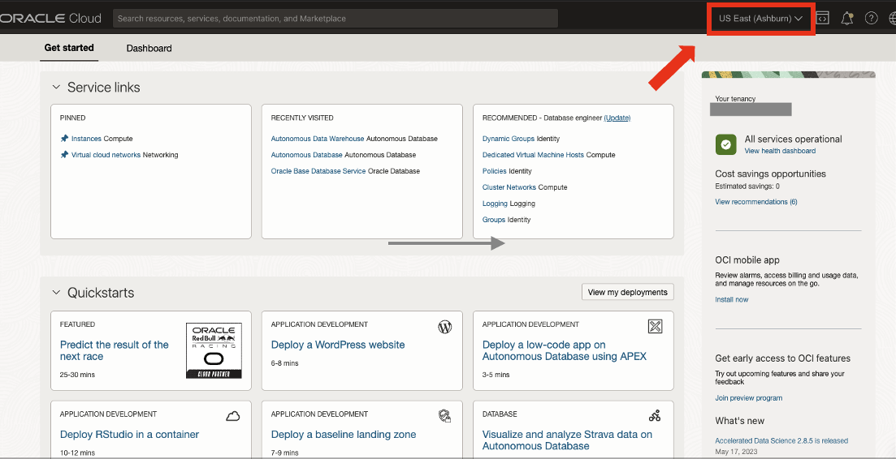
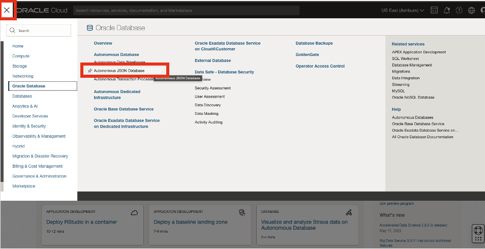
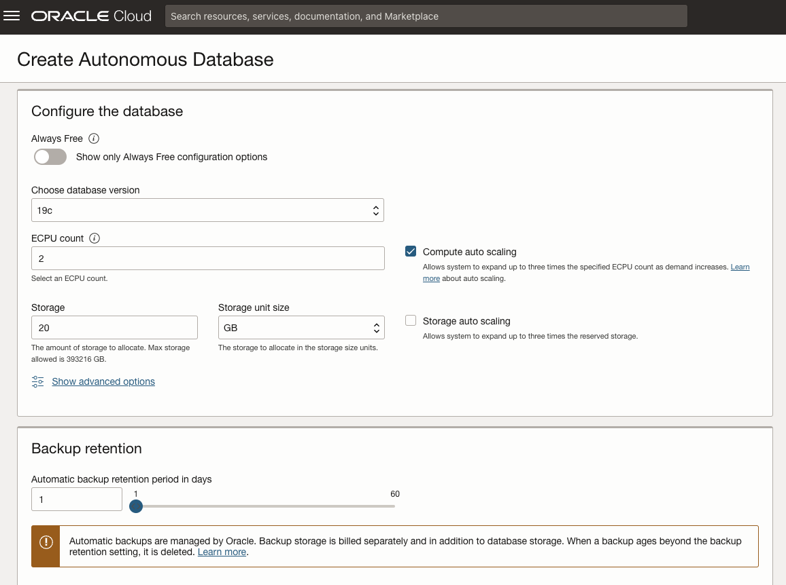
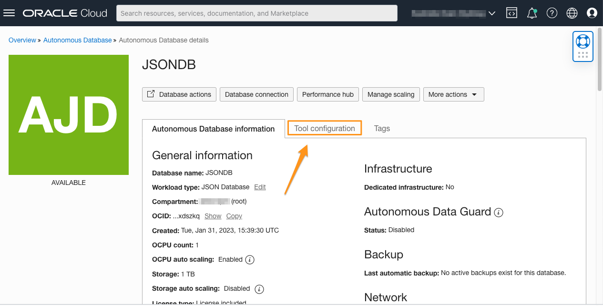

# Provisioning an Autonomous AI JSON Database

## Introduction

This lab walks you through the steps to get started using the Oracle Autonomous AI JSON Database [AJD] on Oracle Cloud. In this lab, you will provision a new AJD instance and connect to the Autonomous AI Database using JSON.

Estimated Time: 10 minutes

### Objectives

In this lab, you will:

* Learn how to provision a new Autonomous AI Database
* Connect to your Autonomous AI Database using JSON

### Prerequisites

* Logged into your Oracle Cloud Account

## Task 1: Choose AJD from the Services Menu

1. Login to the Oracle Cloud.

<if type="freetier">

2. If you are using a Free Trial or Always Free account, and you want to use Always Free Resources, you need to be in the home region of the tenancy. Always Free Resources are only available in the home regions. You can see your current default **Region** in the top, right hand corner of the page.

    

</if>
<if type="livelabs">

2. If you are using a LiveLabs account, you need to be in the region your account was provisioned in. You can see your current default **Region** in the top, right hand corner of the page. Make sure that it matches the region on the LiveLabs Launch page.

    

</if>

3. Click the navigation menu in the upper left to show top level navigation choices. Click on **Oracle AI Database** and choose **Autonomous AI Database**.

    

5. Click the Compartment Filter beside the __Applied filters__ to select a compartment.
 <if type="livelabs">Enter the first part of your user name, for example `LL185` in the Search Compartments field to quickly locate your compartment.

    

</if>
<if type="freetier">
    

<if type="freetier">
   > **Note:** Avoid the use of the ManagedCompartmentforPaaS compartment as this is an Oracle default used for Oracle Platform Services.
</if>

## Task 2: Create the AJD Instance

1. Click **Create Autonomous AI Database** to start the instance creation process.

    

2.  This brings up the __Create Autonomous AI Database Serverless__ screen where you will specify the configuration of the instance.

3. Provide basic information for the autonomous database:

<if type="freetier">
    - __Choose a compartment__ - Select a compartment for the database from the drop-down list.
</if>
<if type="livelabs">
    - __Choose a compartment__ - Use the default compartment that includes your user id.
</if>
    - __Display Name__ - Enter a memorable name for the database for display purposes. For this lab, use __JSONDB__.
<if type="freetier">
    - __Database Name__ - Use letters and numbers only, starting with a letter. Maximum length is 14 characters. (Underscores not initially supported.) For this lab, use __JSONDB__.

    
</if>
<if type="livelabs">
    - __Database Name__ - Use letters and numbers only, starting with a letter. Maximum length is 14 characters. (Underscores not initially supported.) For this lab, use __JSONDB__ and append you LiveLabs user id. For example, __JSONDB7199__.

    
</if>

4. Choose a workload type: Select the workload type for your database from the choices:

    - __JSON__ - For this lab, choose __JSON__ as the workload type. Note that the MongoDB API is also available on Autonomous Transaction Processing and Autonomous Data Warehouse. However, Autonomous AI JSON database was purposely build, designed, and priced for JSON and document store workloads.

    

5. Configure the database:
    <if type="freetier">
    __Always Free__ - For this lab, we recommend you leave Always Free unchecked.
    </if>
    - __Choose database version__ - Select 26ai from the database version. Note: This lab should work on 19c AJD database as well.
    - __ECPU count__ - Number of ECPUs for your service. For this lab, leave the default __2 ECPU__. If you choose an Always Free database, it comes with preconfigured and fixed cpu capabilities.
    - __Storage__ - Select your storage capacity in gigabytes. For this lab you can reduce the storage to the minimum of __20 GB__ of storage.
    - __Auto Scaling__ - For this lab, keep auto scaling enabled, to allow the system to automatically use up to three times more CPU and IO resources to meet workload demand. (While this will not happen as part of the workshop, we don't know what else you are going to experiment with.)

    If you are planning to use this Autonomous AI Database solely for the purpose of this workshop, you can reduce the backup retention also to the minimum of __1 day__.

    

6. Administrator credential creation:

    - __Password and Confirm Password__ - Specify the password for ADMIN user of the service instance and confirm the password.

    

7. Set network access:

    In order to use the Database API for MongoDB, you must set the database up with an access control rule. So choose __Secure access from allowed IPs and VCNs only__.

    You can then click "Add My IP Address" to allow access from your current IP address. You should avoid any VPN or proxy server access which may mask or change your actual IP address.

    If you are behind a proxy setup and have issues with access from your local IP address, you can set the CIDR block access to 0.0.0.0/0, which allows access from **everywhere**. This is not recommended for systems used in any production configuration, but sufficient for a workshop.

    

8. Click __Create__.

    

9.  Your instance will begin provisioning. In a few minutes, the state will turn from Provisioning to Available. At this point, your Autonomous AI JSON database is ready to use! Have a look at your instance's details here including the Database Name, Database Version, OCPU Count, and Storage.

    

## Task 3: Find MongoDB API Connection URL

These will be needed in later labs.

1. Go to Tool Configuration

    On the Autonomous AI Database Information page, click on the __Tool configuration__ tab.

    

2. Find MongoDB API

    Scroll down the page until you find the section __MongoDB API__. For Autonomous AI JSON databases, it should be enabled by default. For Autonomous AI Transaction Processing or Autonomous AI Data Warehouse, it will be disabled by default and you will need to click the three dots next to the status and then click edit. If you have not correctly set __Secure access from allowed IPs and VCNs only__ in the previous Task, you will not be able to enable the MongoDB API.

    

3. Save the URL for __Oracle AI Database API for MongoDB__

    Click on the three dot icon next to the public access URL and select the __Copy__ button to copy the access URL, and save it to a text file for later use.

You may now **proceed to the next lab**.

## Learn More

* [Provision Autonomous JSON Database](https://docs.oracle.com/en/cloud/paas/autonomous-json-database/ajdug/autonomous-provision.html#GUID-0B230036-0A05-4CA3-AF9D-97A255AE0C08)

## Acknowledgements

- **Author** - Roger Ford, Principal Product Manager, Oracle Database
- **Contributors** - Kamryn Vinson, Andres Quintana
- **Last Updated By/Date** - Abby Mulry, November 2025
