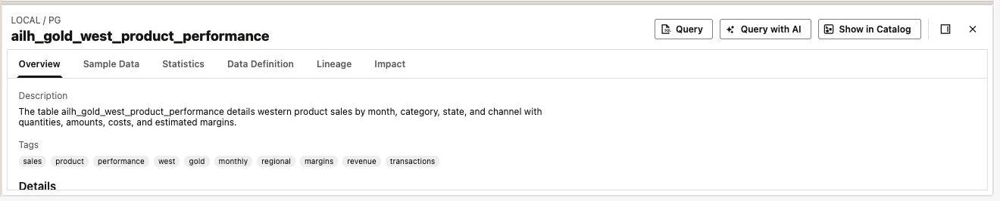

# Lab 5: Mia asks business questions in natural language

## Introduction

Mia wants to know which products lead West-region sales in the latest month available. Start from the native Gold table, generate SQL from a business question, and compare the answer with reference SQL.

Estimated Time: 7 minutes.

### Objectives

* Use **Query with AI** with the Gold table selected.
* Review generated SQL before running it.
* Validate the source, reporting month, and sales totals.

### Prerequisites

Complete Lab 4. Gold must contain West-only data. The facilitator must test the Gold-query AI configuration before the event; the revised Gold prompt still requires an end-to-end event dry-run.

## Task 1: Select Gold as the AI query context

1. Open **SQL Worksheet** and create a worksheet named **Lab 5 - West product sales**.

2. In the worksheet's **Catalog** pane, expand **your connected database → PG → Tables** and select `ailh_gold_west_product_performance`.

3. In the table detail pane, click **Query with AI**. Confirm that the **Using** selection identifies `ailh_gold_west_product_performance` and the worksheet shows **AI Profile ready**.

    

4. Keep the scope on native Gold. Do not select `PG."ailh_enriched_sales"` or the mounted Silver table for Mia's question. The header's general **Assistant** is not the entry point for this exercise.

## Task 2: Generate and review SQL

1. Enter this single-line prompt, with the Gold table selected:

    ```text
    <copy>
    Using only PG."ailh_gold_west_product_performance", show the top 10 product names by total sales amount for the latest SALE_MONTH available in this table. Sum TOTAL_SALE_AMOUNT by PRODUCT_NAME and sort from highest to lowest sales amount.
    </copy>
    ```

2. Click **Generate SQL**. Inspect the generated SQL before executing it.

3. Confirm these points:

    * The query and any latest-month subquery read `"PG"."ailh_gold_west_product_performance"`.
    * The reporting month is the maximum `SALE_MONTH` in Gold, not the current calendar month.
    * Sales amounts are summed by product name, ordered descending, and limited to 10 rows.
    * The result describes West-region sales only. No additional region predicate is needed because this Gold table contains only West data.

4. Run the reviewed statement using **Run Statement**. Do not accept a result from another table simply because its totals look reasonable.

## Task 3: Validate the business answer

1. In a separate worksheet, run this reference query. It adapts the supplied sales query to the confirmed Gold table.

    ```sql
    <copy>
    SELECT
        a."PRODUCT_NAME" AS product_name,
        SUM(a."TOTAL_SALE_AMOUNT") AS total_sales_amount
    FROM "PG"."ailh_gold_west_product_performance" a
    WHERE a."SALE_MONTH" = (
        SELECT MAX(b."SALE_MONTH")
        FROM "PG"."ailh_gold_west_product_performance" b
    )
    GROUP BY a."PRODUCT_NAME"
    ORDER BY total_sales_amount DESC
    FETCH FIRST 10 ROWS ONLY;
    </copy>
    ```

2. Compare the leading product and its total sales amount with the generated query result. Both queries must use the same Gold dataset and period. Product names are the grouping key for this exercise.

3. Save the worksheet. Explain the answer as: “These are the leading products by sales amount in the latest available month for the West region.” This is not a company-wide ranking.

    **Checkpoint:** the AI-generated query uses Gold, its result agrees with the reference calculation, and you can explain its scope. A reference-SQL result alone does not demonstrate successful natural-language querying.

## Appendix A: Legacy Select AI route

1. Open **legacy Database Actions → SQL** as `PG`. Set the Gold profile supplied in the event handout. Replace `EVENT_GOLD_PROFILE` with that profile name.

    ```sql
    <copy>
    BEGIN
      DBMS_CLOUD_AI.SET_PROFILE('EVENT_GOLD_PROFILE');
    END;
    /
    </copy>
    ```

2. Generate SQL for inspection.

    ```sql
    <copy>
    SELECT AI SHOWSQL Using only PG."ailh_gold_west_product_performance" show the top 10 product names by total sales amount for the latest SALE_MONTH available in this table. Sum TOTAL_SALE_AMOUNT by PRODUCT_NAME and sort from highest to lowest sales amount;
    </copy>
    ```

3. Check the source and calculations against Task 3. Execute the reviewed generated SQL, then compare it with the reference query.

4. If the AI configuration is unavailable, the facilitator can demonstrate the reference SQL and explain the intended NLQ step. Label that as a SQL demonstration, not a completed AI exercise.

## Learn More

* [Select AI concepts](https://docs.oracle.com/en-us/iaas/autonomous-database-serverless/doc/select-ai-concepts.html)
* [Select AI user guide](https://docs.oracle.com/en/database/oracle/oracle-database/26/selai/oracle-database-select-ai-users-guide.pdf)

You may now **proceed to the next lab**.

## Acknowledgements

* **Author** - Oracle AI Lakehouse workshop team
* **Last Updated By/Date** - Oracle AI Lakehouse workshop team, October 2026
