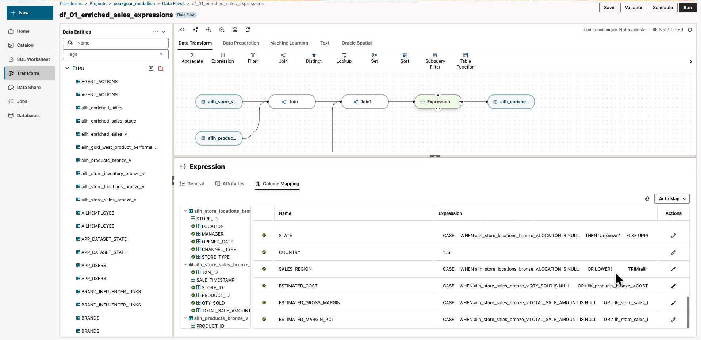
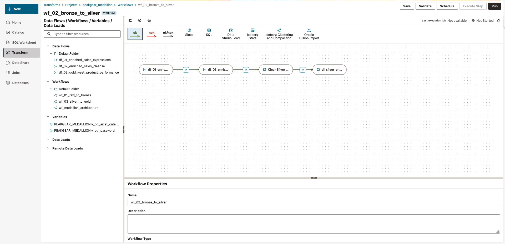
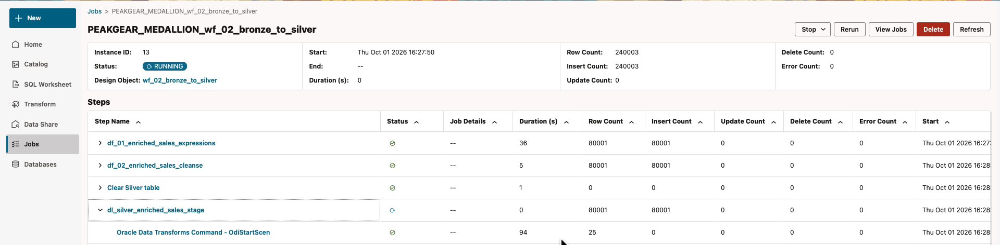

# Lab 2: Alex builds reusable Silver sales data

## Introduction

Alex turns source sales, product, and store data into a reusable sales dataset. Inspect Bronze, review the prepared visual transformations, and run the workflow that publishes Silver Iceberg data.

Estimated Time: 24 minutes, including the ingestion demonstration.

### Objectives

* Browse and query Bronze Iceberg tables.
* Register the prepared Bronze bridge views.
* Review joins and expressions without changing the prepared flow.
* Run the Silver workflow and inspect its child jobs.

### Prerequisites

Complete Lab 1. Use your assigned environment and the `peakgear_medallion` project.

## Task 1: Watch the Raw-to-Bronze overview

1. Follow the facilitator's explanation of the prepared ingestion: PeakGear source files are loaded into Bronze Iceberg tables through Data Transforms.

2. Open **Catalog** → **Locally Mounted Catalogs** → `PG_AICAT` → **bronze** → **Tables**. Select `products`, then **Sample Data**. Repeat for `store_inventory`.

3. Identify the other two Bronze tables: `store_sales_transactions` and `store_locations`. All four are preloaded. You will not reload raw files in this exercise.

    Facilitator: “The catalog lets us find and query open tables. Their data files remain in object storage. The next workflow registers views so our prepared Data Transforms flows can refer to those tables.”

## Task 2: Query Bronze in SQL Worksheet

1. Open **SQL Worksheet → Worksheets → New**. Use the worksheet menu to rename it **Lab 2 - Bronze checks**, then save it.

2. Paste and execute each statement separately with **Run Statement**. First, list the catalog tables.

    ```sql
    <copy>
    SELECT owner, table_name
    FROM all_tables@PG_AICAT
    ORDER BY owner, table_name;
    </copy>
    ```

3. Query the products table. Keep the lowercase quoted table name.

    ```sql
    <copy>
    SELECT * FROM "bronze"."products"@PG_AICAT
    FETCH FIRST 10 ROWS ONLY;
    </copy>
    ```

4. Inspect the inventory fields that Sam will use.

    ```sql
    <copy>
    SELECT "STORE_ID", "PRODUCT_ID", "STOCK_ON_HAND",
           "AVAILABLE_TO_PROMISE_QTY", "REORDER_LEVEL", "INVENTORY_STATUS"
    FROM "bronze"."store_inventory"@PG_AICAT
    FETCH FIRST 10 ROWS ONLY;
    </copy>
    ```

    **Checkpoint:** the catalog listing includes the four Bronze tables, and both sample queries return data.

## Task 3: Register views and review the transformations

1. Open **Transform** → **Projects** → `peakgear_medallion` → **Workflows** → `wf_01_raw_to_bronze`.

2. Review the prepared **Create Bronze** view-registration step. In this event project, Bronze data already exists; this workflow creates the database views used by the downstream data flows. It is not another raw-data load.

3. Click **Run** at the upper right. Retain the pre-provisioned variable defaults if the **Variable values** dialog opens, then click **OK**. Do not expose or replace the variable values.

4. Open **Jobs → Transforms**, select the `wf_01_raw_to_bronze` run, and click **Refresh** until it finishes successfully. Continue only after success.

5. Return to **Transform** → **Projects** → `peakgear_medallion` → **Data Flows** → `df_01_enriched_sales_expressions`.

6. Select the **Expression** component, then the **Column Mapping** tab in the lower panel. Scroll the mapping rows to inspect `COUNTRY`, which is set to `'US'`, and the expressions for sales region, estimated cost, and margin.

    

7. Trace the joins from the Bronze sales, products, and store-location views into the expression and target. These views expose catalog data to the flow; they are not a second copy of the Bronze files.

8. Review only. Do not edit expressions or run this individual flow. The workflow will execute the prepared expression and cleansing flows in order.

    Facilitator: “The value is a reusable visual pipeline: joins, business rules, cleansing, and orchestration. We are inspecting its logic, not typing a new SQL pipeline during the lab.”

## Task 4: Execute and monitor Silver

1. Open **Workflows** → `wf_02_bronze_to_silver` in `peakgear_medallion`.

    

2. Review the sequence.

    | Prepared step | Purpose |
    |---|---|
    | `df_01_enriched_sales_expressions` | Join Bronze views and derive sales fields |
    | `df_02_enriched_sales_cleanse` | Cleanse the native intermediate data |
    | `Clear Silver table` | Clear the disposable lab target before loading |
    | `dl_silver_enriched_sales_stage` | Publish the curated data to Silver Iceberg |

3. Confirm that you are in your assigned lab environment. This workflow clears its Silver target. Click **Run** once, retain the prepared variable defaults, and click **OK**.

4. Open **Jobs → Transforms**, not **Data Loads**. Select the new `wf_02_bronze_to_silver` run by its start time. You can also follow the workflow's latest-execution job link.

5. Click **Refresh** while the job runs. Expand the child steps to inspect their status. Allow about two to three minutes; timings can vary. Wait for the workflow and all its children to finish successfully before starting Gold.

    

    The screenshot illustrates monitoring an in-progress run. The workflow total can count the same rows at multiple stages; it is not the final Silver table count.

## Task 5: Check published Silver

1. Open **Catalog** → **Locally Mounted Catalogs** → `PG_AICAT`, click **Refresh**, and expand **silver** → **Tables** → `AILH_ENRICHED_SALES`. Inspect **Sample Data**.

2. Open a new worksheet named **Lab 2 - Silver checks**. Execute the two checks separately.

    ```sql
    <copy>
    SELECT *
    FROM "silver"."AILH_ENRICHED_SALES"@PG_AICAT
    FETCH FIRST 10 ROWS ONLY;
    </copy>
    ```

    ```sql
    <copy>
    SELECT "PRODUCT_ID", "PRODUCT_NAME", "SALE_MONTH", "SALES_REGION"
    FROM "silver"."AILH_ENRICHED_SALES"@PG_AICAT
    FETCH FIRST 10 ROWS ONLY;
    </copy>
    ```

3. Save the worksheet. The uppercase Silver identifier is intentional; it differs from the lowercase native intermediate table `PG."ailh_enriched_sales"`.

    **Checkpoint:** the Silver workflow succeeded and the published Iceberg table returns enriched sales data.

## Appendix A: Legacy UI instructions

1. In legacy **Data Transforms** → **Projects** → `peakgear_medallion`, select the same workflow under **Workflows** and use **Start**. Retain the assigned defaults. Run `wf_01_raw_to_bronze` before `wf_02_bronze_to_silver`.

2. Follow the execution link or open legacy **Jobs** to inspect the run and its child steps.

3. For transformation review, open **Data Flows** → `df_01_enriched_sales_expressions` → **Expression** → **Column Mapping**. Do not edit the prepared mapping.

4. In legacy **Database Actions → SQL**, execute the same Bronze and Silver queries as `PG`. Return to the new UI for the next lab.

## Learn More

* [Manage catalogs with DBMS_CATALOG](https://docs.oracle.com/en-us/iaas/autonomous-database-serverless/doc/manage-catalogs-dbms-catalogs.html)
* [Oracle Data Transforms](https://docs.oracle.com/en/cloud/paas/autonomous-database/serverless/adbsb/data-transforms.html)

You may now **proceed to the next lab**.

## Acknowledgements

* **Author** - Oracle AI Lakehouse workshop team
* **Last Updated By/Date** - Oracle AI Lakehouse workshop team, October 2026
