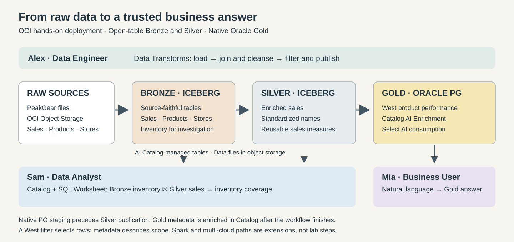
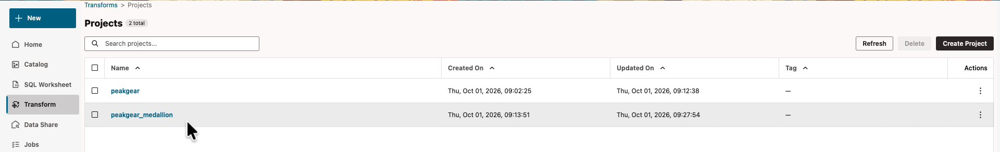

# Lab 1: Meet PeakGear and prepare your Lakehouse

## Introduction

PeakGear sells sporting goods. Alex needs to prepare reusable sales data, Sam needs to investigate inventory coverage, and Mia needs an answer about West-region sales. You will follow their work in Oracle Autonomous AI Lakehouse.

Medallion separates three responsibilities: retain source data in Bronze, refine it into reusable Silver, and publish purpose-built Gold. Consumers can use the appropriate tier without repeating every preparation step.

Estimated Workshop Time: 90 minutes, including a 12-minute troubleshooting buffer.

Estimated Lab Time: 22 minutes.

### Objectives

* Explain the three personas and the purpose of each tier.
* Sign in to the reserved environment and connect Data Studio as `PG`.
* Locate the catalog, SQL Worksheet, and prepared Data Transforms project.

### Prerequisites

* An active LiveLabs reservation with database and OCI login details.
* The Data Studio URL supplied by the facilitator.
* A pre-provisioned environment with Bronze data, a mounted catalog, and the imported project.
* Basic SQL familiarity. No Spark programming experience is required.

## Task 1: Follow the three-persona journey

1. Meet the team. You play all three roles using your assigned account; no additional persona logins are required.

    | Persona | Business need | Interaction |
    |---|---|---|
    | Alex, Data Engineer | Prepare consistent sales data once | Data Transforms workflows across the tiers |
    | Sam, Data Analyst | Compare recent sales with available inventory | Catalog discovery and SQL across Bronze and Silver |
    | Mia, Business User | Find the best-selling West-region products | Natural-language queries against native Gold |

2. Review the architecture.

    

    Bronze and Silver are Apache Iceberg tables with files in OCI Object Storage and metadata in Oracle AI Data Catalog. Gold is a native Oracle table in `PG`. Native intermediate tables support the transformations; they are not the published Silver Iceberg table.

3. Review the exact objects you will use. Quoted table names are case-sensitive.

    | Layer | Objects |
    |---|---|
    | Bronze, mounted through `PG_AICAT` | `"bronze"."products"`, `"bronze"."store_sales_transactions"`, `"bronze"."store_locations"`, `"bronze"."store_inventory"` |
    | Native intermediate tables | `PG."ailh_enriched_sales_stage"`, `PG."ailh_enriched_sales"` |
    | Published Silver, through `PG_AICAT` | `"silver"."AILH_ENRICHED_SALES"` |
    | Native Gold | `PG."ailh_gold_west_product_performance"` |

4. Listen to the facilitator: “Open tables let compatible engines share data. Today we use Oracle SQL and visual Data Transforms, not a separate Spark cluster. Lakehouse can support selected tiers or the entire medallion pattern. This workshop runs on OCI; multi-cloud-ready does not mean that we deploy a second cloud today.”

## Task 2: Open your reservation and sign in

1. In LiveLabs, open **My Reservations**, select your reservation, and click **Launch Workshop**.

2. Open **Reservation Information**. Keep the OCI username, initial password, tenancy, assigned compartment, database region, and database login details available privately.

3. Click **Launch OCI** or open the supplied OCI console link. Use the identity domain and username from your reservation. On first sign-in, change the initial password when prompted. Store your new password securely.

4. Note the region where the lab database is provisioned. The region in the initial OCI sign-in URL may differ from the database region. Use your reservation values, not the identifiers in a screenshot.

5. Open the facilitator-provided **Data Studio** URL and choose **Sign in with your cloud account**. Use your assigned OCI account and the password you just set.

6. Click **Connect to database**. Select the assigned database region and compartment, choose your database, and connect with username `PG` and the database password from the reservation.

    The OCI account password and the `PG` database password are separate credentials. Do not paste either into worksheets, screenshots, or shared notes.

## Task 3: Explore Data Studio and check the project

1. Locate **Catalog**, **SQL Worksheet**, **Transform**, and **Jobs** in the left navigation.

2. Open **Catalog** → **Locally Mounted Catalogs** → `PG_AICAT` → **bronze** → **Tables**. Select `products` and open **Sample Data**. Bronze is already loaded. Silver may not appear until you complete Lab 2; you do not need to create it manually.

3. Open **Transform** → **Projects** → `peakgear_medallion`. Use this project, not the separate `peakgear` project.

    

4. Open **Workflows** and confirm these prepared workflows are present:

    * `wf_01_raw_to_bronze`
    * `wf_02_bronze_to_silver`
    * `wf_03_silver_to_gold`

5. The project, connections, catalog mount, and execution variables are pre-provisioned. Do not import another ZIP, replace credentials, or edit connection endpoints. Ask the facilitator if the project is missing.

    **Checkpoint:** Data Studio is connected as `PG`, Bronze is visible, and `peakgear_medallion` contains the workflows.

## Appendix A: Legacy UI access

Use the legacy interface only when directed by the facilitator.

1. Open the assigned **Database Actions** URL and sign in as `PG`. Use **SQL** for the same SQL blocks provided in later labs.

2. Open legacy **Data Transforms** → **Projects** → `peakgear_medallion` to inspect the prepared project. Connection and import setup belong to the facilitator's preparation, not this attendee exercise.

3. Return to the new Data Studio tab for the main lab sequence.

## Learn More

* [Oracle Autonomous AI Lakehouse](https://www.oracle.com/autonomous-database/autonomous-ai-lakehouse/)

You may now **proceed to the next lab**.

## Acknowledgements

* **Author** - Oracle AI Lakehouse workshop team
* **Last Updated By/Date** - Oracle AI Lakehouse workshop team, October 2026
