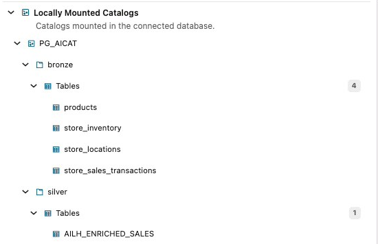
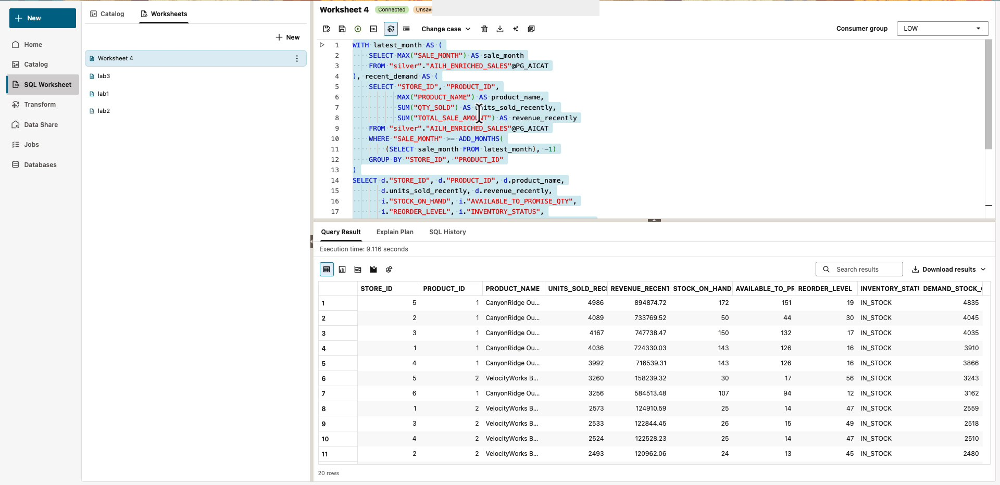

# Lab 3: Sam investigates inventory coverage across tiers

## Introduction

Sam asks: “Which store and product combinations have recent sales that exceed their available-to-promise inventory?” Combine curated Silver sales with Bronze inventory without building another pipeline or copying inventory into Silver. Available to promise (ATP) is the inventory quantity available for new commitments.

Estimated Time: 12 minutes, including a four-minute discovery demonstration.

### Objectives

* Discover the inventory asset needed for a business question.
* Check join grain before combining Bronze and Silver.
* Use SQL to identify candidates for replenishment review.

### Prerequisites

Complete Lab 2. Silver must contain queryable enriched sales, and Bronze must contain the assigned inventory extract.

## Task 1: Find the inventory asset in the new UI

1. As Sam, open **Catalog** → **Locally Mounted Catalogs** → `PG_AICAT` → **bronze** → **Tables** → `store_inventory`. Inspect the columns and **Sample Data**, especially `STORE_ID`, `PRODUCT_ID`, and `AVAILABLE_TO_PROMISE_QTY`.

2. Expand **silver** → **Tables** → `AILH_ENRICHED_SALES`. This is the curated sales table Alex published. Notice that inventory remains in Bronze; you can investigate it with Silver without creating a new pipeline.

    

3. Open **SQL Worksheet → Worksheets → New**, name the worksheet **Lab 3 - Data checks**, and run this catalog query to confirm the objects you found.

    ```sql
    <copy>
    SELECT owner, table_name
    FROM all_tables@PG_AICAT
    WHERE UPPER(table_name) LIKE '%INVENTORY%'
       OR UPPER(table_name) LIKE '%ENRICHED_SALES%'
    ORDER BY owner, table_name;
    </copy>
    ```

4. Confirm `bronze.store_inventory` and `silver.AILH_ENRICHED_SALES` in the results. Preserve the quoted case in the following SQL.

    Facilitator: “Discovery lets Sam find another governed asset and query it with Silver. This exercise joins across tiers in place. It does not silently promote raw inventory into a curated Silver product.”

## Task 2: Check the join grain

1. Run this check. The prepared inventory extract must have at most one row per store and product for this exercise.

    ```sql
    <copy>
    SELECT "STORE_ID", "PRODUCT_ID", COUNT(*) AS row_count
    FROM "bronze"."store_inventory"@PG_AICAT
    GROUP BY "STORE_ID", "PRODUCT_ID"
    HAVING COUNT(*) > 1
    FETCH FIRST 20 ROWS ONLY;
    </copy>
    ```

    Expected: no rows. If rows appear, stop and ask the facilitator to select the appropriate inventory snapshot or complete join key. Do not remove duplicates arbitrarily or sum repeated inventory snapshots.

2. Check the sales period and inventory completeness.

    ```sql
    <copy>
    SELECT MIN("SALE_MONTH") AS first_month, MAX("SALE_MONTH") AS latest_month
    FROM "silver"."AILH_ENRICHED_SALES"@PG_AICAT;
    </copy>
    ```

    ```sql
    <copy>
    SELECT COUNT(*) AS inventory_rows,
           SUM(CASE WHEN "AVAILABLE_TO_PROMISE_QTY" IS NULL THEN 1 ELSE 0 END)
               AS missing_atp_rows
    FROM "bronze"."store_inventory"@PG_AICAT;
    </copy>
    ```

    The reviewed sample contains only January 2025, so equal first and latest months are expected. The analysis uses the latest month and the preceding month when available; it does not require two months of data.

    The reviewed inventory sample has 1,200 rows and zero missing ATP values. A different approved extract can have a different row count. Missing ATP is unknown, not zero; the analysis excludes it. These checks explain whether the join can duplicate sales, which period is covered, and whether available inventory is known.

## Task 3: Answer the inventory question

1. Save the data-check worksheet and create another worksheet. Execute this query. It aggregates sales first, then joins inventory at store/product grain to avoid multiplying transaction-level sales.

    ```sql
    <copy>
    WITH latest_month AS (
        SELECT MAX("SALE_MONTH") AS sale_month
        FROM "silver"."AILH_ENRICHED_SALES"@PG_AICAT
    ), recent_demand AS (
        SELECT "STORE_ID", "PRODUCT_ID",
               MAX("PRODUCT_NAME") AS product_name,
               SUM("QTY_SOLD") AS units_sold_recently,
               SUM("TOTAL_SALE_AMOUNT") AS revenue_recently
        FROM "silver"."AILH_ENRICHED_SALES"@PG_AICAT
        WHERE "SALE_MONTH" >= ADD_MONTHS(
            (SELECT sale_month FROM latest_month), -1)
        GROUP BY "STORE_ID", "PRODUCT_ID"
    )
    SELECT d."STORE_ID", d."PRODUCT_ID", d.product_name,
           d.units_sold_recently, d.revenue_recently,
           i."STOCK_ON_HAND", i."AVAILABLE_TO_PROMISE_QTY",
           i."REORDER_LEVEL", i."INVENTORY_STATUS",
           d.units_sold_recently - i."AVAILABLE_TO_PROMISE_QTY"
               AS demand_stock_gap
    FROM recent_demand d
    JOIN "bronze"."store_inventory"@PG_AICAT i
      ON i."STORE_ID" = d."STORE_ID"
     AND i."PRODUCT_ID" = d."PRODUCT_ID"
    WHERE i."AVAILABLE_TO_PROMISE_QTY" IS NOT NULL
      AND d.units_sold_recently > i."AVAILABLE_TO_PROMISE_QTY"
    ORDER BY demand_stock_gap DESC, d.revenue_recently DESC
    FETCH FIRST 20 ROWS ONLY;
    </copy>
    ```

2. Inspect the result columns: store ID, product, recent units sold, available-to-promise quantity, and `DEMAND_STOCK_GAP`. A positive gap means recent units sold exceed the available inventory quantity.

    

    In the recorded sample, store 5/product 1 has 4,986 recent units sold and ATP of 151, giving a gap of 4,835. Your values depend on the provisioned extract.

3. Treat the output as a list for inventory review, not an automatic reorder recommendation. Past sales are a demand proxy, not a forecast or an unfulfilled-order count. The inner join excludes sales keys without matching inventory, and null ATP rows are excluded. No rows means no matched records satisfy this rule.

4. Use **Save As** to save the worksheet as **Inventory gap analysis**. **Checkpoint:** you answered a business question using both tiers without publishing another physical table.

## Appendix A: Legacy SQL and discovery fallback

1. Open the assigned **legacy Database Actions → SQL** session as `PG`. Use legacy **Data Studio → Catalog** for browsing if available.

2. Run Task 1's catalog query, Task 2's checks, and Task 3's analysis unchanged after confirming identifier case and mount alias.

3. Record the result and return to the new Data Studio tab for Lab 4. Do not create or reload catalog tables to work around a UI listing problem.

## Learn More

* [Query mounted catalogs](https://docs.oracle.com/en-us/iaas/autonomous-database-serverless/doc/manage-catalogs.html)

You may now **proceed to the next lab**.

## Acknowledgements

* **Author** - Oracle AI Lakehouse workshop team
* **Last Updated By/Date** - Oracle AI Lakehouse workshop team, October 2026
