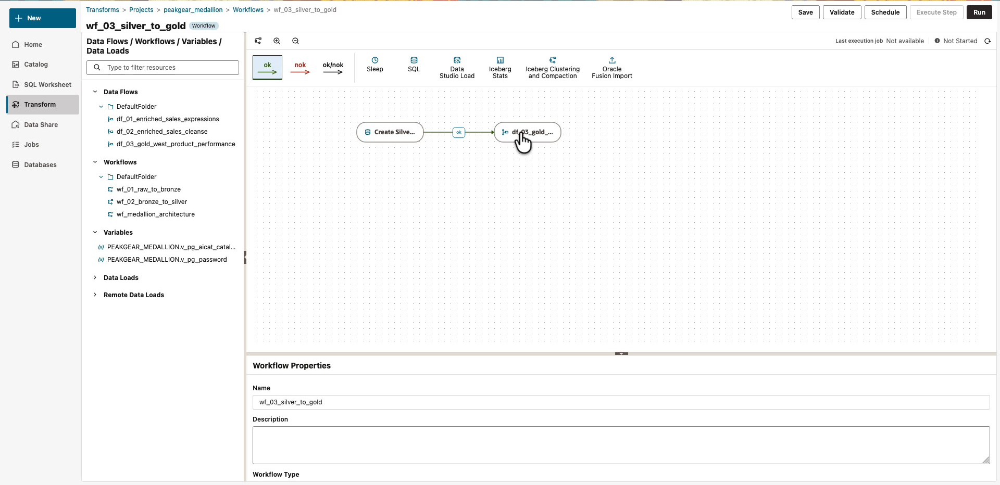
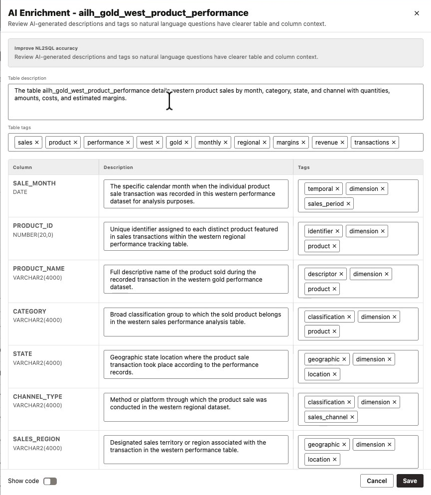
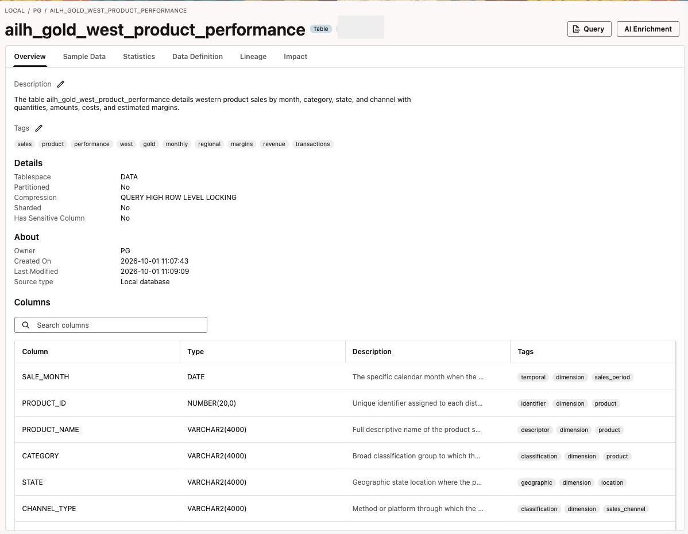

# Lab 4: Alex publishes an AI-ready West-region Gold product

## Introduction

Alex publishes a business-focused Gold table in the native Oracle `PG` schema. After loading it, the facilitator uses Catalog AI Enrichment to describe its West-region scope and columns.

The data-flow filter selects the rows. Metadata explains those rows to people and configured AI consumers; it does not filter data or enforce access controls.

Estimated Time: 9 minutes, including the facilitator's enrichment demonstration.

### Objectives

* Run the prepared Silver-to-Gold workflow.
* Browse and query the native Gold table.
* Review AI-generated table and column metadata.

### Prerequisites

Complete Lab 2 successfully before this lab. The Silver workflow and final Iceberg load must be finished. Use `peakgear_medallion` in your assigned environment.

## Task 1: Run the Gold workflow

1. Open **Transform** → **Projects** → `peakgear_medallion` → **Workflows** → `wf_03_silver_to_gold`.

2. Review its two prepared steps: the Silver-view registration step and `df_03_gold_west_product_performance`.

    

    The Gold flow uses the `ailh_enriched_sales_v` bridge view. The view provides a local SQL reference to the curated source used by the prepared flow. The facilitator verifies its definition points to the published Silver catalog table before the event.

3. Click **Run** once. Retain the pre-provisioned variable defaults if prompted, then click **OK**. Do not run the master workflow or change the Gold flow.

4. Open **Jobs → Transforms** and select the new `wf_03_silver_to_gold` run. Click **Refresh** until both steps and the workflow finish successfully.

    **Checkpoint:** Gold execution has completed. Do not query an incomplete target or start this workflow before Silver finishes.

## Task 2: Inspect the native Gold table

1. Open **Catalog**. Expand **your connected database** → **PG** → **Tables** → `ailh_gold_west_product_performance`. This is the native database branch, not **Locally Mounted Catalogs** → `PG_AICAT`.

2. Open **Sample Data** and inspect the sales month, product, sales amount, and `SALES_REGION`. Return to **Overview** to inspect its columns.

## Task 3: Watch the facilitator enrich Gold metadata

1. The facilitator returns to **Catalog** → **your connected database** → **PG** → **Tables** → `ailh_gold_west_product_performance` and clicks **AI Enrichment** at the upper right.

2. Wait for the generated descriptions and tags to appear. Review the table description and the proposed column descriptions before saving.

    

3. Check that the description clearly states the business scope. The facilitator can refine the description to:

    ```text
    <copy>
    West-region product sales performance by sales month, product, category,
    state, and sales channel. Contains West-region data only, not company-wide
    sales. TOTAL_SALE_AMOUNT is the sales amount; ESTIMATED_GROSS_MARGIN is an
    estimated sales margin, not audited profit.
    </copy>
    ```

4. Review the descriptions for `SALE_MONTH`, `PRODUCT_NAME`, `TOTAL_SALE_AMOUNT`, and `SALES_REGION`. Correct unsupported statements. Do not accept generated descriptions solely because they sound plausible.

5. Click **Save** at the bottom of the enrichment panel. Return to **Overview** and verify that the saved description and tags are visible.

    

6. Listen to the facilitator: “We added business context after loading Gold. The West filter controls which data is present; the description tells a consumer what it represents. This demonstration uses Catalog AI Enrichment, not a Data Transforms annotation editor.”

    The facilitator performs enrichment; attendees do not create an AI connection or enter model credentials.

## Task 4: Validate Gold with SQL

1. Open a new SQL worksheet, name it **Lab 4 - Gold checks**, and run:

    ```sql
    <copy>
    SELECT *
    FROM "PG"."ailh_gold_west_product_performance"
    FETCH FIRST 10 ROWS ONLY;
    </copy>
    ```

2. Run the region check separately.

    ```sql
    <copy>
    SELECT SALES_REGION, COUNT(*) AS gold_rows
    FROM "PG"."ailh_gold_west_product_performance"
    GROUP BY SALES_REGION;
    </copy>
    ```

    Expected: one row for `West` with a positive count. This confirms that the published product contains only West-region data. The reviewed sample has 199 Gold rows; the count can vary with the extract. Another region or a null value needs facilitator investigation.

3. Save the worksheet.

    **Checkpoint:** Gold is queryable, the region check returns only West, and the catalog metadata explains that scope.

## Appendix A: Legacy execution and SQL

1. In legacy **Data Transforms** → **Projects** → `peakgear_medallion` → **Workflows** → `wf_03_silver_to_gold`, click **Start** and retain the assigned defaults.

2. Open the execution job link or legacy **Jobs**. Wait for the workflow to finish.

3. Open legacy **Database Actions → SQL** as `PG` and run Task 4's checks unchanged.

4. Return to new Data Studio for the facilitator's **Catalog → AI Enrichment** demonstration. This guide does not assume that legacy Data Transforms exposes the same enrichment control.

## Learn More

* [Select AI concepts and metadata context](https://docs.oracle.com/en-us/iaas/autonomous-database-serverless/doc/select-ai-concepts.html)

You may now **proceed to the next lab**.

## Acknowledgements

* **Author** - Oracle AI Lakehouse workshop team
* **Last Updated By/Date** - Oracle AI Lakehouse workshop team, October 2026
