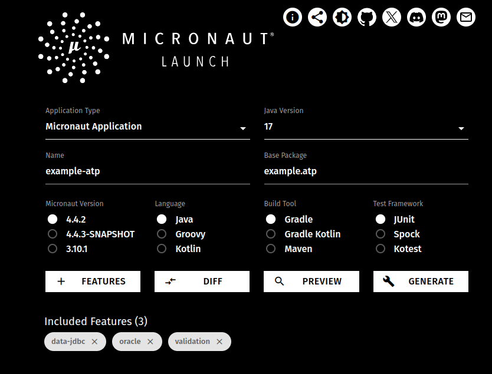
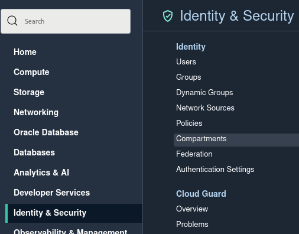
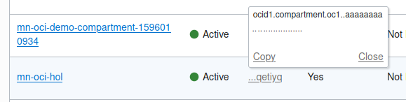
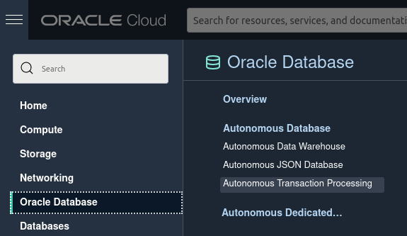
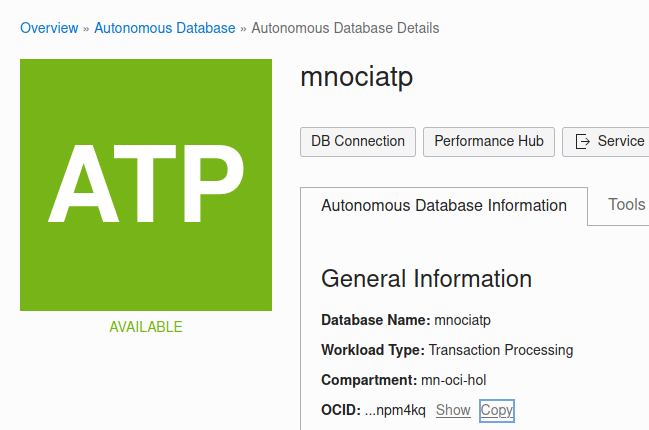
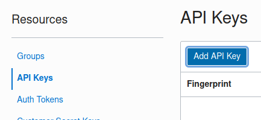
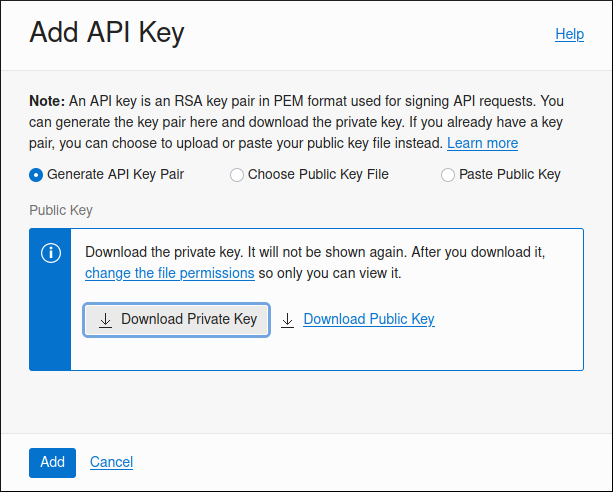
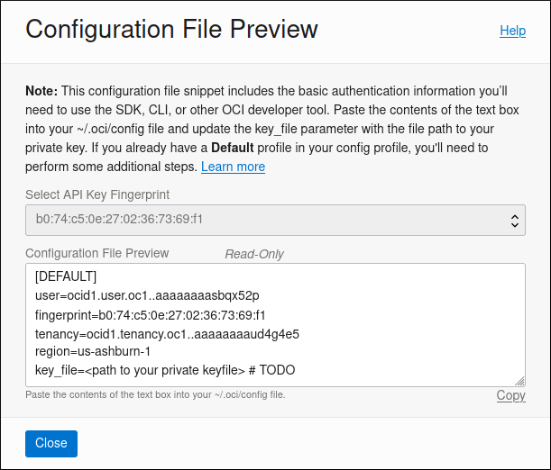

# Create the Micronaut Application

## Introduction

In this lab you are going to get create a Micronaut application locally and configure the application to communicate with an Oracle Autonomous Database instance.

If at any point you run into trouble completing the steps, the full source code for the application can be cloned from Github using the following command to checkout the code:

    <copy>
    git clone -b lab2 https://github.com/graemerocher/micronaut-hol-example.git
    </copy>

If you were unable to set up the Autonomous Database and necessary cloud resources you can also checkout a version of the code that uses an in-memory database:

    <copy>
    git clone -b lab2-h2 https://github.com/graemerocher/micronaut-hol-example.git
    </copy>

Estimated Lab Time: 15 minutes

### Objectives

In this lab you will:

* Create a new Micronaut application
* Configure the Micronaut application to connect to Autonomous database

### Prerequisites
- An Oracle Cloud account, Free Trial, LiveLabs or a Paid account

## Task 1: Create a new Micronaut application

There are several ways you can get started creating a new Micronaut application.

1. If you have the Micronaut CLI installed (see the [Installation instructions](https://micronaut-projects.github.io/micronaut-starter/latest/guide/#installation) for how to install) you can use the `mn` command to create a new application. This will create an application that uses Micronaut Data JDBC and has support for Autonomous Database.

    ```
    <copy>
      mn create-app example-atp --jdk 11 --features oracle,data-jdbc
    cd example-atp
    </copy>
    ```

> **NOTE:** By default Micronaut uses the [Gradle](https://gradle.org/) build tool, however you can add `--build maven` if you prefer Maven.

2. If you do not have the Micronaut CLI installed, you can `curl` and `unzip`:

    ```
    <copy>
    curl https://launch.micronaut.io/example-atp.zip\?javaVersion\=JDK_11\&features\=oracle,data-jdbc -o example-atp.zip
    unzip example-atp.zip
    cd example-atp
    </copy>
    ```

3. If none of these options are viable, open [Micronaut Launch](https://micronaut.io/launch/) in a web browser and perform the following steps:

* Choose JDK 11 as the Java version.
* Choose `example-atp` as the Name
* Choose `example.atp` as the Base Package
* Click the `Features` button and select the `oracle` and `data-jdbc` features
* Then click `Generate` -> `Download Zip` which will download a zip file you can unzip locally with the created application.



## Task 2: Configure the Micronaut Application

To configure the Micronaut application to work with Autonomous Database, open the `src/main/resources/application.yml` file and modify the default datasource connection settings as follows replacing the `password` entry with the password you chose for the schema user in the previous lab:

    <copy>
    micronaut:
      application:
        name: example-atp
      executors:
        io:
          type: fixed
          nThreads: 75
    datasources:
      default:
        url: jdbc:oracle:thin:@mnociatp_high?tns_admin=/tmp/wallet
        driverClassName: oracle.jdbc.OracleDriver
        username: mnocidemo
        password: XXXXXXXX
        dialect: ORACLE
        data-source-properties:
          oracle:
            jdbc:
              fanEnabled: false
    netty:
      default:
        allocator:
          max-order: 3
    </copy>

> **NOTE**: The password you enter should be the Schema user password not the Admin password for the Autonomous Database instance.

## Task 3: Configure Oracle Autonomous Database JDBC Drivers

If you are using Gradle add the following dependencies to the `build.gradle` file in the root of your project inside the `dependencies` block:

    <copy>
    runtimeOnly("com.oracle.database.security:oraclepki:21.5.0.0")
    runtimeOnly("com.oracle.database.security:osdt_cert:21.5.0.0")
    runtimeOnly("com.oracle.database.security:osdt_core:21.5.0.0")
    </copy>

Alternatively if you are using Maven, add the following dependencies to your `pom.xml` inside the `<dependencies>` element:

    <copy>
    <dependency>
        <groupId>com.oracle.database.security</groupId>
        <artifactId>oraclepki</artifactId>
        <version>21.5.0.0</version>
        <scope>runtime</scope>
    </dependency>
    <dependency>
        <groupId>com.oracle.database.security</groupId>
        <artifactId>osdt_cert</artifactId>
        <version>21.5.0.0</version>
        <scope>runtime</scope>
    </dependency>
    <dependency>
        <groupId>com.oracle.database.security</groupId>
        <artifactId>osdt_core</artifactId>
        <version>21.5.0.0</version>
        <scope>runtime</scope>
    </dependency>
    </copy>

## Task 4: Configure Flyway to Create the Schema

Once you have configured the `DataSource`, add a dependency on `micronaut-flyway` to your `build.gradle` configuration inside the `dependencies` block:

    <copy>
    runtimeOnly("io.micronaut.flyway:micronaut-flyway")
    </copy>

or if using Maven, add to your `pom.xml` under `<dependencies>`:

    <copy>
    <dependency>
        <groupId>io.micronaut.flyway</groupId>
        <artifactId>micronaut-flyway</artifactId>
        <scope>runtime</scope>
    </dependency>
    </copy>

This enables support for the Open Source [Flyway database migration toolkit](https://flywaydb.org) which lets you define SQL scripts that manage and version your database schema so you can gradually evolve the schema along with new versions of your application.

To enable Flyway to run on startup, add the following configuration to your `application.yml`:

    <copy>
    flyway:
      datasources:
        default:
          enabled: true
    </copy>

Replace the contents of the file `src/main/resources/application-test.yml` with the following entry for flyway which will contain your test configuration and set Flyway to clean the schema when the application starts, to ensure tests run with fresh data:

    <copy>
    flyway:
      datasources:
        default:
          clean-schema: true
    </copy>

> **NOTE:** that in a real world scenario you would setup a separate database to run your tests against

## Task 5: Defining a SQL Migration Script

The next step is to define a SQL migration script that will create the application's initial schema. To do that create a new SQL script in a file called `src/main/resources/db/migration/V1__create-schema.sql` and add the following SQL:

    <copy>
    CREATE TABLE "PET" ("ID" VARCHAR(36),"OWNER_ID" NUMBER(19) NOT NULL,"NAME" VARCHAR(255) NOT NULL,"TYPE" VARCHAR(255) NOT NULL);
    CREATE TABLE "OWNER" ("ID" NUMBER(19) PRIMARY KEY NOT NULL,"AGE" NUMBER(10) NOT NULL,"NAME" VARCHAR(255) NOT NULL);
    CREATE SEQUENCE "OWNER_SEQ" MINVALUE 1 START WITH 1 NOCACHE NOCYCLE;
    </copy>

The SQL above will create `owner` and `pet` tables to store data for owners and their pets in Autonomous Database.

## Task 6: Replace Hardcoded Password With Vault Secret (Optional)

> **NOTE:** Also complete task 8 below to configure OCI authentication, which is required when using Vault secrets.

If you created a Vault with secrets for the user and admin passwords in the previous lab, you can replace the hardcoded user password with a placeholder for the secret which will be resolved at application startup.

1. Add a dependency for __micronaut-oraclecloud-vault__ to your build.

    If you are using Gradle, add the following dependency in `build.gradle` inside the `dependencies` block:

        <copy>
        runtimeOnly('io.micronaut.oraclecloud:micronaut-oraclecloud-vault')
        </copy>

    and if you are using Maven, add the following dependency to your `pom.xml` inside the `<dependencies>` element:

        <copy>
        <dependency>
            <groupId>io.micronaut.oraclecloud</groupId>
            <artifactId>micronaut-oraclecloud-vault</artifactId>
            <scope>compile</scope>
        </dependency>
        </copy>

2. Create `src/main/resources/bootstrap.yml` with the following content:

        <copy>
        micronaut:
          application:
            name: example-atp
          config-client:
            enabled: true
        oci:
          config:
            profile: DEFAULT
          vault:
            config:
              enabled: true
            vaults:
              - ocid: OCID_VAULT
                compartment-ocid: OCID_COMPARTMENT
        </copy>

    Replace __OCID\_VAULT__ with the Vault OCID that you saved when creating it (the OCID should start with "ocid1.vault"), and replace __OCID\_COMPARTMENT__ with the OCID of the compartment where you created the secrets (the compartment OCID should start with "ocid1.compartment"). To find that, in the OCI Console, click on the burger menu and select "Compartments" under "Identity & Security".

    

    then find your compartment in the list, mouse over the link, and click the __Copy__ link in the popup:

    

3. Replace the password value in `src/main/resources/application.yml` with the placeholder for the __ATP\_USER\_PASSWORD__ secret:

        ...
        username: mnocidemo
        password: ${ATP_USER_PASSWORD}
        dialect: ORACLE
        ...

## Task 7: Configure Automatic Wallet Download (Optional)

> **NOTE:** Also complete task 8 below to configure OCI authentication, which is required when using automatic Wallet download.

1. Add a dependency for __micronaut-oraclecloud-sdk__ and __micronaut-oraclecloud-atp__ to your build.

    If you are using Gradle, add the following dependencies in `build.gradle` inside the `dependencies` block:

        <copy>
        runtimeOnly('io.micronaut.oraclecloud:micronaut-oraclecloud-sdk')
        runtimeOnly('io.micronaut.oraclecloud:micronaut-oraclecloud-atp')
        </copy>

    and if you are using Maven, add the following dependencies to your `pom.xml` inside the `<dependencies>` element:

        <copy>
        <dependency>
            <groupId>io.micronaut.oraclecloud</groupId>
            <artifactId>micronaut-oraclecloud-sdk</artifactId>
            <scope>compile</scope>
        </dependency>
        <dependency>
            <groupId>io.micronaut.oraclecloud</groupId>
            <artifactId>micronaut-oraclecloud-atp</artifactId>
            <scope>compile</scope>
        </dependency>
        </copy>

2. Comment out the current __datasources__ section in `src/main/resources/application.yml` by adding a `%` character to the start of each line (you'll need this version when deploying), and add the following:

        <copy>
        datasources:
          default:
            ocid: OCID_ATP
            walletPassword: ${ATP_WALLET_PASSWORD}
            username: mnocidemo
            password: ${ATP_USER_PASSWORD}
        </copy>


    Replace __OCID\_ATP__ with the your Autonomous Database OCID. To find that, in the OCI Console, click on the burger menu and select "Autonomous Transaction Processing" under "Oracle Database".

    

    then click the link for your database and click the __Copy__ link in the __OCID__ row of the database details page to copy the OCID to the clipboard:

    

3. If you are not using Vault secrets, replace __${ATP\_WALLET\_PASSWORD}__ with the cleartext wallet password, and replace __${ATP\_USER\_PASSWORD}__ with the cleartext database user password.

## Task 8: Configure OCI authentication (Optional)

If you already have the [Oracle Cloud CLI](https://docs.oracle.com/en-us/iaas/Content/API/SDKDocs/cliinstall.htm) installed and you have run __oci setup config__ to configure local access, then you should be all set. If you are using a profile in __~/.oci/config__ other than __DEFAULT__, change the profile name in `bootstrap.yml`:

        oci:
          config:
            profile: MY_OTHER_PROFILE

Don't install the Oracle Cloud CLI if you haven't already since it involves a few steps including installing or updating Python. Instead, manually create the __~/.oci/config__ file.

1. In the OCI Console, open the Profile menu  in the top right corner and click __User Settings__.

    

2. Under __Resources__, click __API Keys__, then click __Add API Key__

    

3. Select __Generate API Key Pair__, then click __Download Private Key__ and save the private key file (as a .pem file) in the __~/.oci__ directory (create the __~/.oci__ directory if it doesn't already exist).

    

4. Click __Add__ to add the new API signing key to your user settings

    

5. Click the __Copy__ link in the lower right corner of the __Configuration File Preview__ dialog to copy the API key configuration to the clipboard, then create __~/.oci/config__ in a text editor and paste the contents there. 

   

6. Update the __key\_file__ value in __~/.oci/config__ to be the location of the .pem file you downloaded, e.g.

        key_file=/home/burt/.oci/burt.beckwith-09-03-05-32.pem

You may now *proceed to the next lab*.

## Acknowledgements
- **Owners** - Graeme Rocher, Architect, Oracle Labs - Databases and Optimization
- **Contributors** - Chris Bensen, Todd Sharp, Eric Sedlar
- **Last Updated By** - Kay Malcolm, DB Product Management, August 2020
