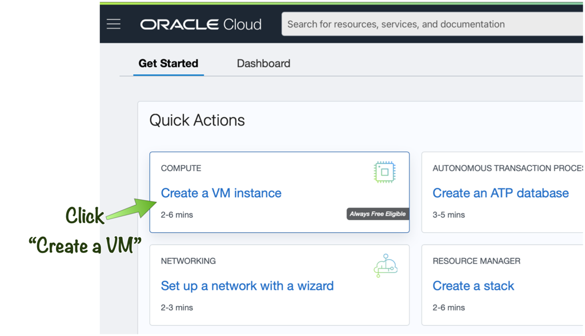
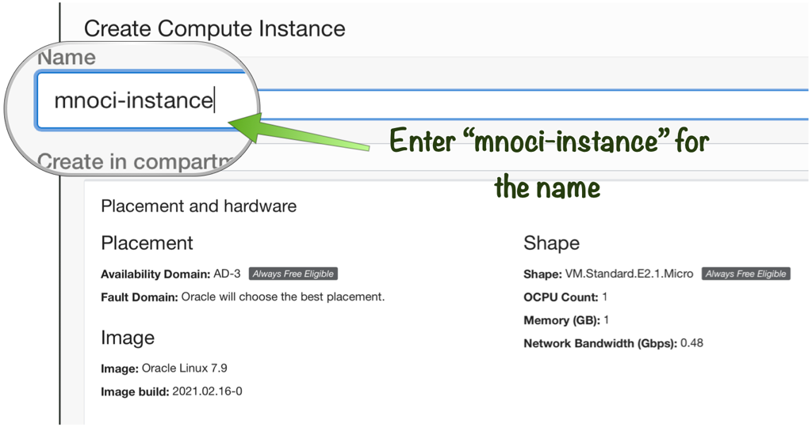
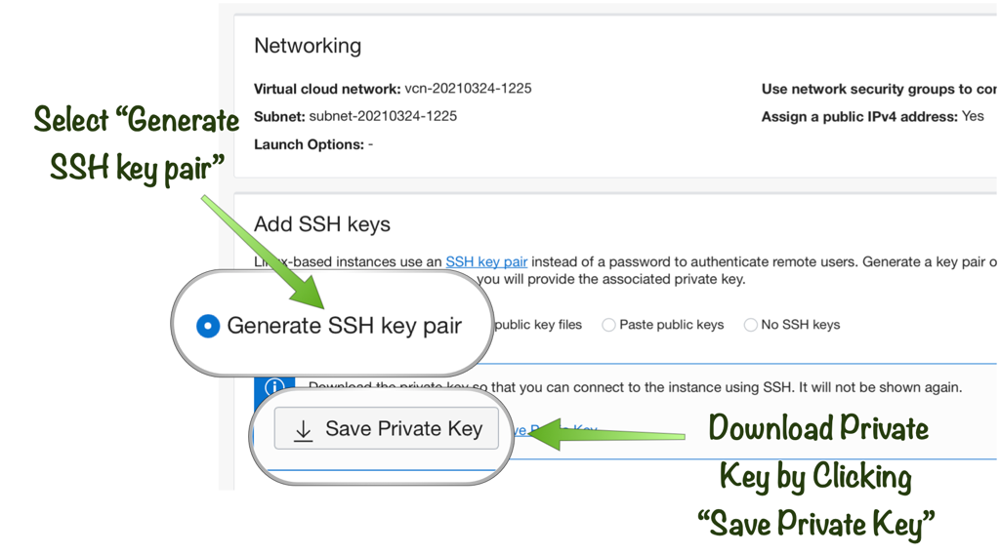
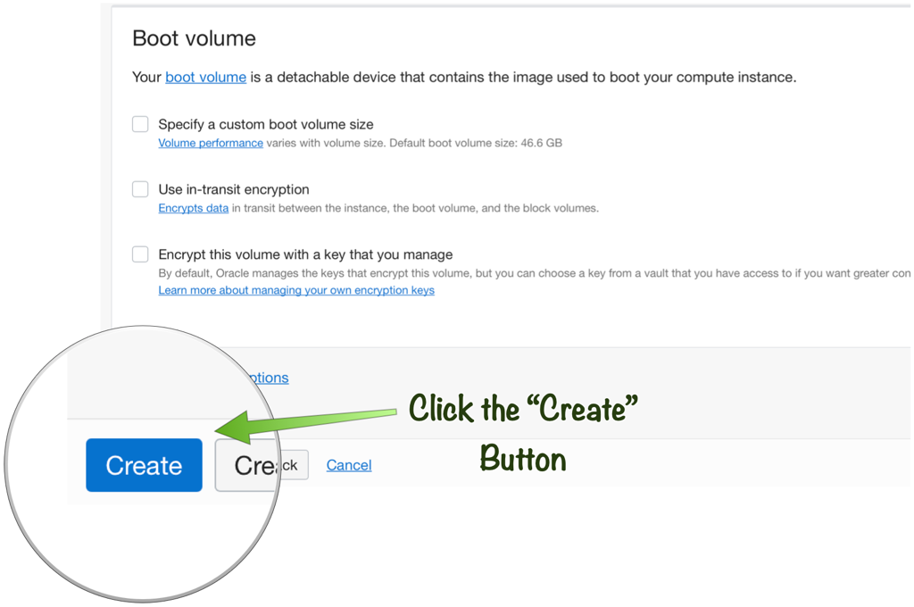
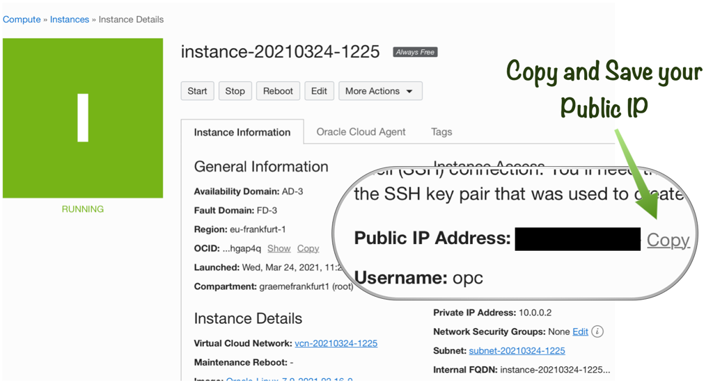
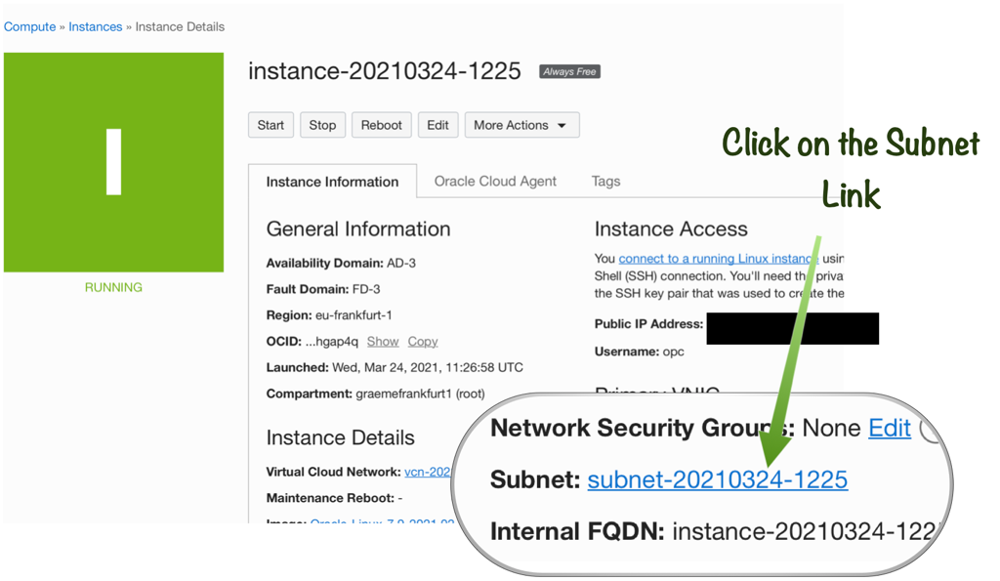
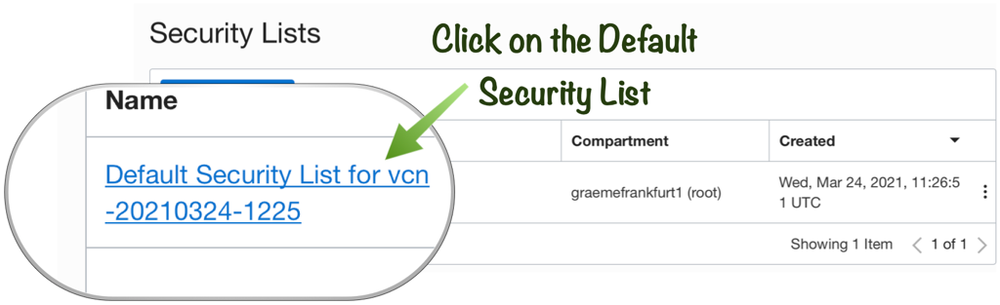
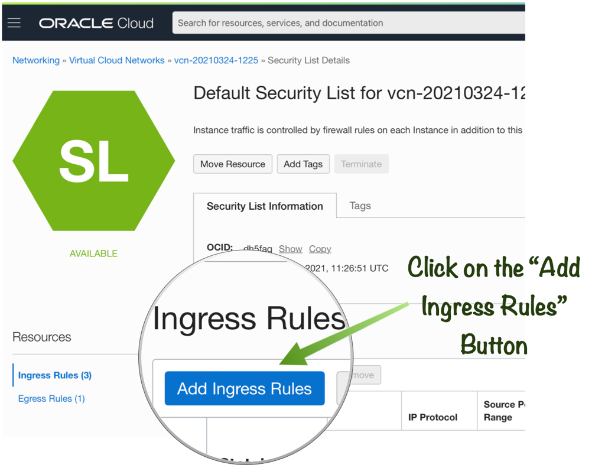
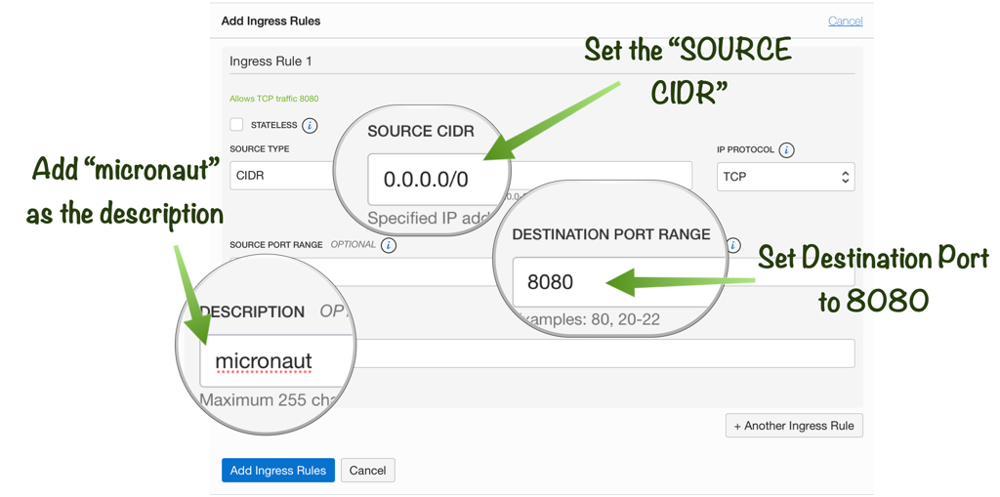

# Deployment

## Introduction

This lab takes you through deploying the Micronaut application to an OCI VM.

Estimated Lab Time: 15 minutes

### Objectives

In this lab you will:

* Create an Oracle Cloud Oracle Cloud Compute Instance
* Build your application distribution
* Upload the application distribution and wallet to an OCI VM
* Run your application on the OCI VM

## Task 1: Create an Oracle Cloud Compute Instance

1. From the Oracle Cloud Home Page select "Create a VM Instance":



2. Enter "mnoci-instance" as the name of the instance leaving the "Placement" and "Shape" as "Always Free Eligible":



3. Under "Add SSH keys" choose "Generate SSH key pair" and then click "Save Private Key" to save the private key locally on disk:



The private key will download as a file named "ssh-key-(date).key".

4. Leave the remaining settings as their defaults and click the "Create" button:



5. Take note of the "Public IP" of your instance:



6. Click on the "Subnet" link:



7. Under "Security Lists" click on the "Default Security List":



8. Click "Add Ingress Rules":



9. Add an Ingress Rule for port 8080 and click "Add Ingress Rules":



The following values should be supplied:

* *description:*  micronaut
* *Source CIDR:* 0.0.0.0/0
* *Destination Port Range:*: 8080

## Task 2:  Deploy Micronaut Application to OCI

1. First ensure that you private key you downloaded has the correct permissions:

    ```
    <copy>
    chmod 600 /path/to/ssh-key-*.key
    </copy>
    ```

2. To keep things simple, we'll revert to hardcoded passwords and explicit wallet configuration for the deployed instance. Ensure that your `datasources` block in `application.yml` looks like this (replace __XXXXXXXX__ with the user password):

        <copy>
        datasources:
          default:
            url: jdbc:oracle:thin:@mnociatp_high?tns_admin=/tmp/wallet
            driverClassName: oracle.jdbc.OracleDriver
            username: mnocidemo
            password: XXXXXXXX
            dialect: ORACLE
            data-source-properties:
              oracle:
                jdbc:
                  fanEnabled: false
        </copy>

3. Before deploying, ensure the wallet exists on the VM by running the following snippet replacing [YOUR IP] with the public IP from the previous section:

    ```
    # run on local machine to push to VM
    <copy>
    scp -i /path/to/ssh-key-*.key -r /tmp/wallet opc@[YOUR IP]:/tmp/wallet
    </copy>
    ```

> *NOTE:* that the command above refers to the directory where you extracted the wallet to (in this case `/tmp/wallet`). If you extracted to a different location you will need to alter the command appropriately.

4. If you are using Gradle, build a runnable JAR file with:

    ```
    # run on local machine
    <copy>
    ./gradlew assemble
    </copy>
    ```

5. Alternatively with Maven run the `package` goal:

    ```
    <copy>
    # run on local machine
    ./mvnw package
    </copy>
    ```

6. Push the runnable JAR file to VM:

    ```
    # run on local machine to push to VM
    <copy>
    scp -i /path/to/ssh-key-*.key build/libs/example-atp-0.1-all.jar opc@[VM IP Address]:/home/opc/application.jar
    </copy>
    ```

> *NOTE:* It is important that you copy the JAR file that ends with `-all.jar` which represents the runnable JAR file. Also if you are using Maven the JAR file name will be `target/example-atp-0.1.jar`.

7. To run on the VM, first SSH in:

    ```
    <copy>
    ssh -i /path/to/ssh-key-*.key opc@[YOUR IP]
    </copy>
    ```

Then install GraalVM 22:

    <copy>
    yum check-update
    sudo yum install graalvm22-ee-11.x86_64
    </copy>

Open up the firewall to port 8080:

    <copy>
    sudo firewall-cmd --permanent --zone=public --add-port=8080/tcp
    sudo firewall-cmd --reload
    </copy>

Finally start the application:

    <copy>
    java -jar application.jar
    </copy>

## Task 3:  Verify Application

You can now access `http://[VM IP Address]:8080/pets` for the `/pet` endpoint and `http://[VM IP Address]:8080/owners` for the `/owners` endpoint in a browser or using `curl`:

    curl -i http://[VM IP Address]:8080/pets
    HTTP/1.1 200 OK
    Date: Thu, 20 Aug 2020 15:12:47 GMT
    Content-Type: application/json
    content-length: 55
    connection: keep-alive

    [{"name":"Dino"},{"name":"Baby Puss"},{"name":"Hoppy"}]

You may now *proceed to the next lab*.

## Acknowledgements
- **Owners** - Graeme Rocher, Architect, Oracle Labs - Databases and Optimization
- **Contributors** - Chris Bensen, Todd Sharp, Eric Sedlar
- **Last Updated By** - Kay Malcolm, DB Product Management, August 2020
