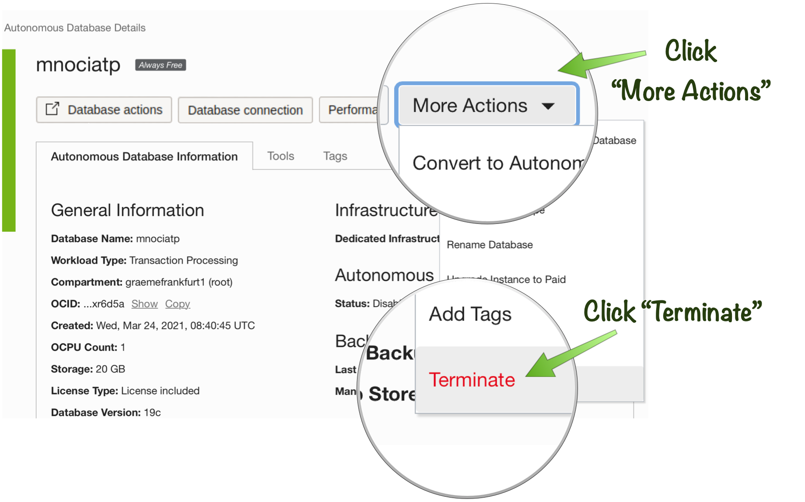

# Cleaning Up Cloud Resources

## Introduction
This lab takes you through shutting down and destroying the resources created as part of this lab including VMs and Autonomous Database Instances.

Estimated Lab Time: 5 minutes

### Objectives
In this lab you will:
* Terminate the Autonomous Database Instance used for this lab
* Terminate the Oracle Cloud Compute Instance used for this lab

### Prerequisites
- An Oracle Cloud account, Free Trial, LiveLabs or a Paid account

## Task 1: Stopping the Autonomous Database Instance

To shutdown the Autonomous database instance follow these steps:

1. On the "Autonomous Database Details" page click "More Actions" and then "Terminate"

2. Enter the database name to confirm termination:

## Task 2: Terminating the Oracle Cloud Compute Instance

To shutdown the Compute Instance instance follow these steps:

1. On the "Instance Details" page click "More Actions" and then "Terminate"

2. Click "Terminate Instance" to confirm termination:

*Congratulations! You have successfully completed the lab.*

## Acknowledgements
- **Owners** - Graeme Rocher, Architect, Oracle Labs - Databases and Optimization
- **Contributors** - Chris Bensen, Todd Sharp, Eric Sedlar
- **Last Updated By** - Kay Malcolm, DB Product Management, August 2020
