# Create an insight application with APEX


## Introduction

Oracle APEX is a low-code development platform that enables you to build scalable, secure enterprise apps, with world-class features, that can be deployed anywhere. Using APEX, developers can quickly develop and deploy compelling apps that solve real problems and provide immediate value. You won't need to be an expert in a vast array of technologies to deliver sophisticated solutions. Focus on solving the problem and let APEX take care of the rest.

In this Lab we are going to use APEX to visualize the result from all the labs.

Estimated Lab Time: 15 minutes.

### Objectives

In this lab, you will:

* Create an APEX application
* Create simple charts 
* Modify a chart


### Prerequisites

This lab assumes you have done all the other labs.

## Task 1: Create workspace

1. Let's create a new workspace in **APEX** before we create an application. In your **Autonomous Database**, go to **Tools** and then **Oracle APEX**. Finally click on **Open APEX** button.

    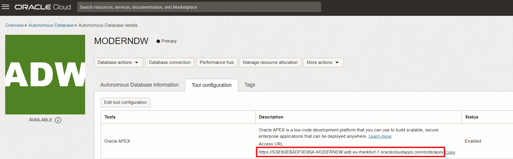

2. We need to log in with the admin user. We just need to introduce the password. 

    - **Password:** Password123##
        ```
            <copy>Password123##</copy>
        ```

    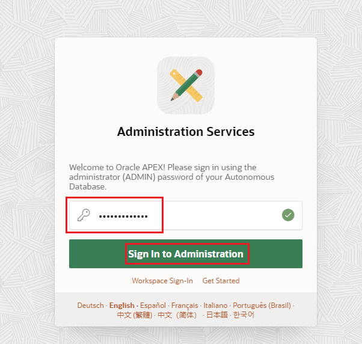

3. Click on **Create Workspace**.

    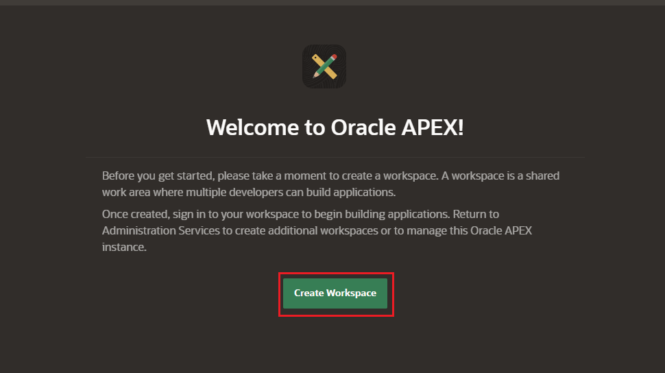

4. Click on **Existing Schema**.

    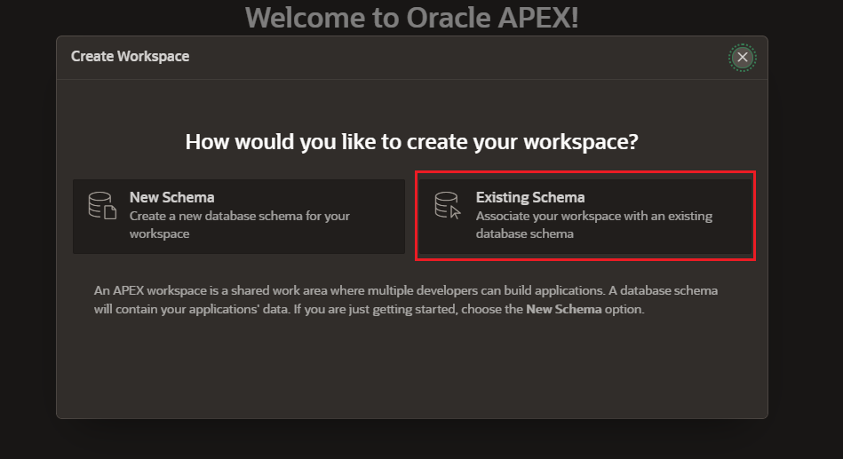

5. Define the **user**, **workspace** and password. Then click on **Create Workspace**.

    - **Database User:** CNVG. You have to search the database user as you have selected existing schema option previously.
        ```
            <copy>CNVG</copy>
        ```

    - **Workspace Name:** CNVG
        ```
            <copy>CNVG</copy>
        ```

    - **Workspace Username:** CNVG
        ```
            <copy>CNVG</copy>
        ```

    - **Password:** Password123##
        ```
            <copy>Password123##</copy>
        ```

    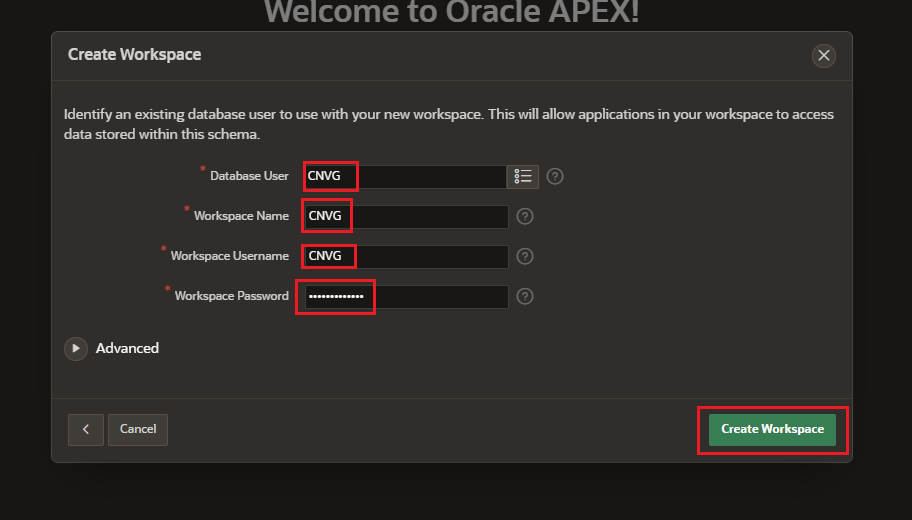

6. Click over **CNVG** to go to the new **workspace**.

    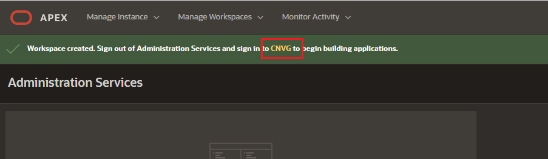

7. **Sign in** with the **CNVG** user:

    - **Workspace:** CNVG
        ```
            <copy>CNVG</copy>
        ```

    - **Workspace Username:** CNVG
        ```
            <copy>CNVG</copy>
        ```

    - **Password:** Password123##
        ```
            <copy>Password123##</copy>
        ```

    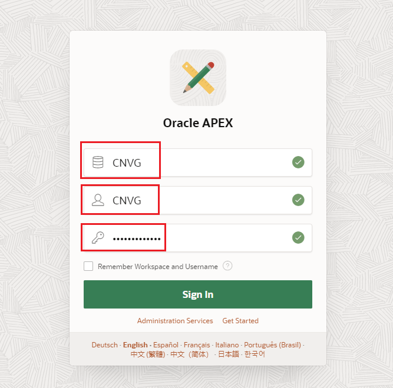

## Task 2: Create an application with charts

1. Let's **create our application**. Go to **App Builder** and click on **Create**.

    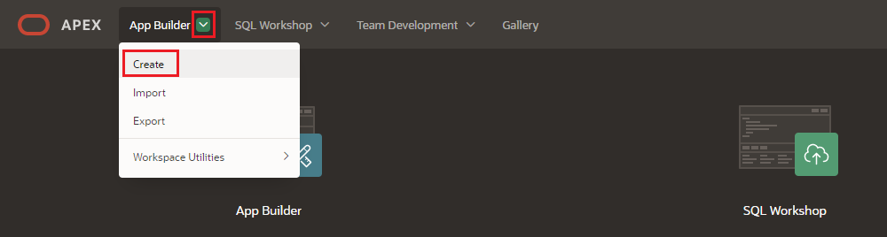

2. Select **New Application**.

    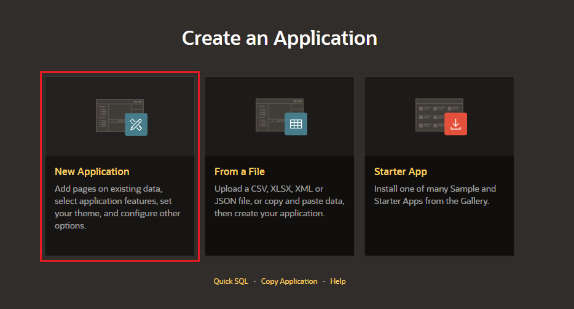

3. Let's define the **name** for our application. Let's call it **Data Insights**.
    
    - **Name:** Data Insights
        ```
            <copy>Data Insights</copy>
        ```

    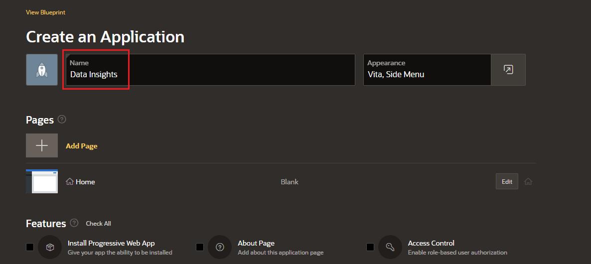

4. Let's add a page to our application. Click on **Add Page**.

    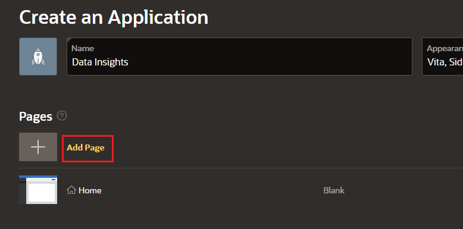

5. Click on **Dashboard**.

    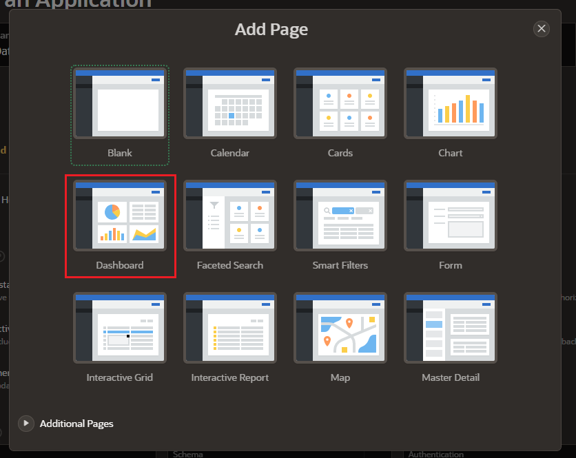

6. This dashboard will **populate 4 charts**. We just need to define what we want to plot. Let's define our **first chart**.

    - **Type:** Pie Chart
    - **Chart Name:** Sentiment Results
        ```
            <copy>Sentiment Results</copy>
        ```
    - **Table or View:** SENTIMENT_RESULTS
    - **Label Column:** EMOTION
    - **Value:** Count
    - **Value Column:** EMOTION

    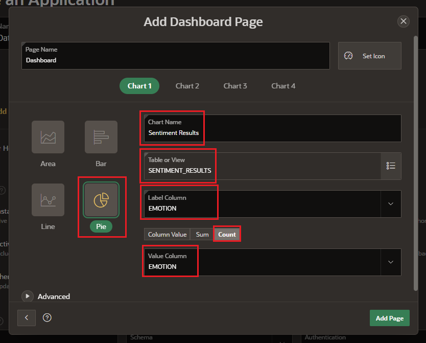

7. Let's populate our **second chart**.

    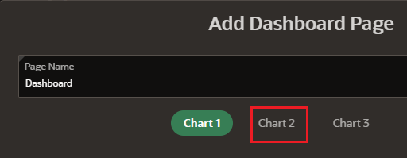

    - **Type:** Bar Chart
    - **Chart Name:** Top Followers
        ```
            <copy>Top Followers</copy>
        ```
    - **Table or View:** MV_TWEETS
    - **Label Column:** NAME
    - **Value:** Column Value
    - **Value Column:** FOLLOWERS_COUNT

    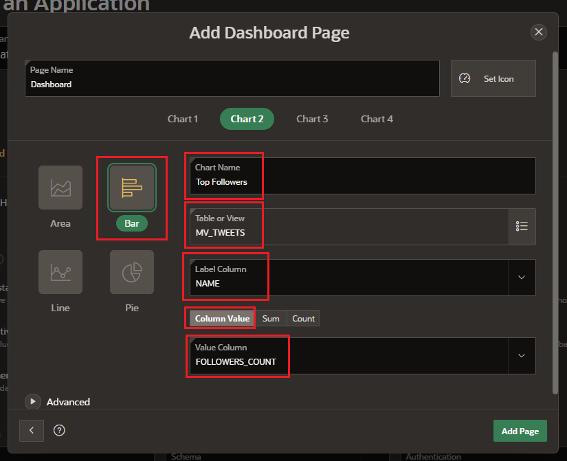

8. Let's populate our **third chart**.

    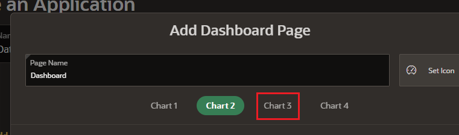

    - **Type:** Bar Chart
    - **Chart Name:** Top Revenue
        ```
            <copy>Top Revenue</copy>
        ```
    - **Table or View:** Revenue
    - **Label Column:** ORDER_TYPE
    - **Value:** SUM
    - **Value Column:** REVENUE

    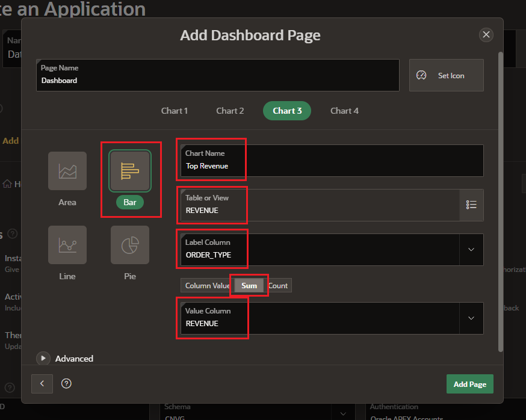

9. Let's populate our **fourth chart**.

    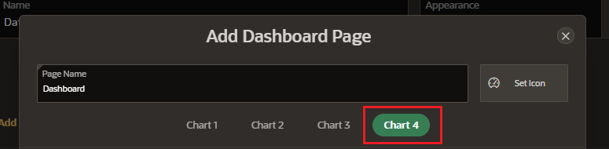

    - **Type:** Pie Chart
    - **Chart Name:** Location Popularity
        ```
            <copy>Location Popularity</copy>
        ```
    - **Table or View:** MV_TWEETS
    - **Label Column:** LOCATION
    - **Value:** COUNT
    - **Value Column:** LOCATION

    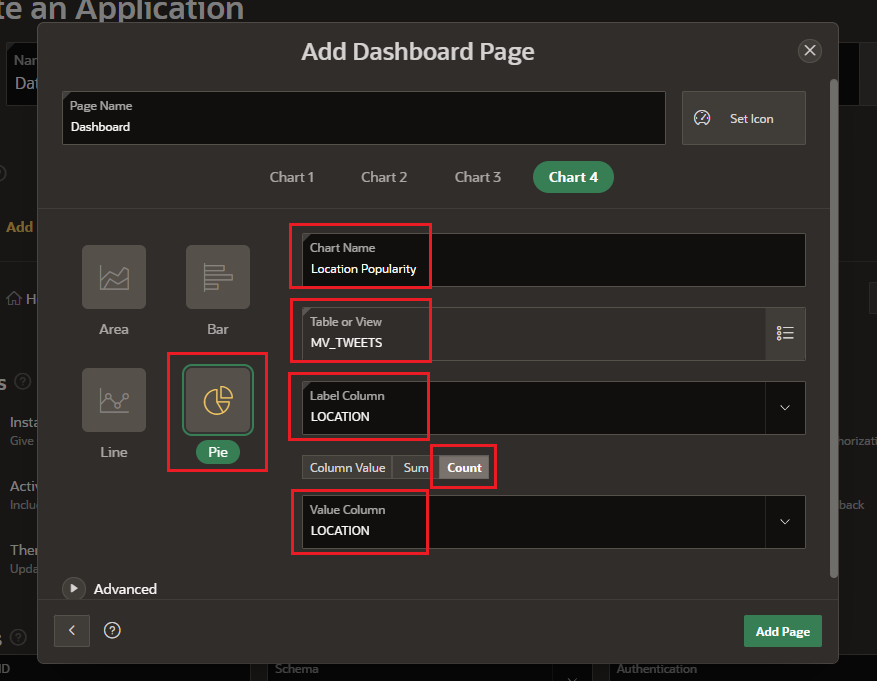

10. Click on **Add Page**.

    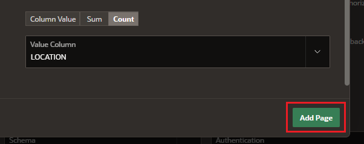

11. Select **Check All** and click on **Create Application**.

    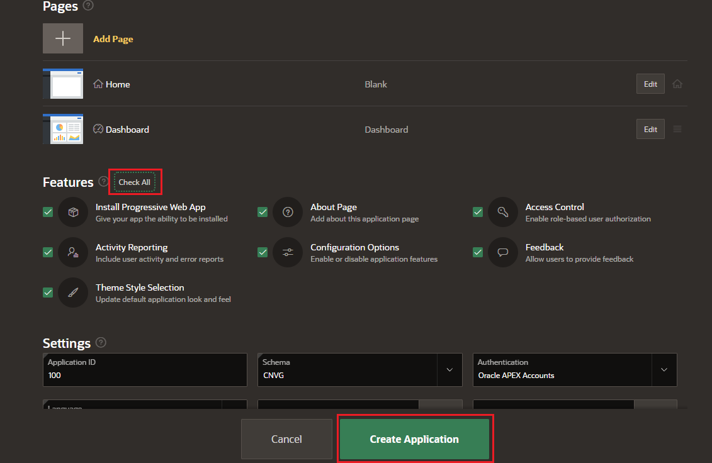

12. Let's have first look into our application. Click on the **Run** button.

    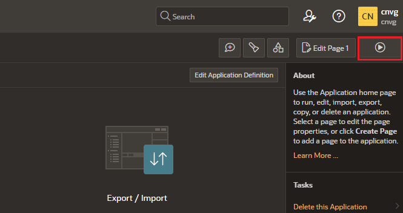

13. Log in with the **CNVG** user. Then click on **Sign in**.

    - **Username:** CNVG
        ```
            <copy>CNVG</copy>
        ```

    - **Password:** Password123##
        ```
            <copy>Password123##</copy>
        ```

    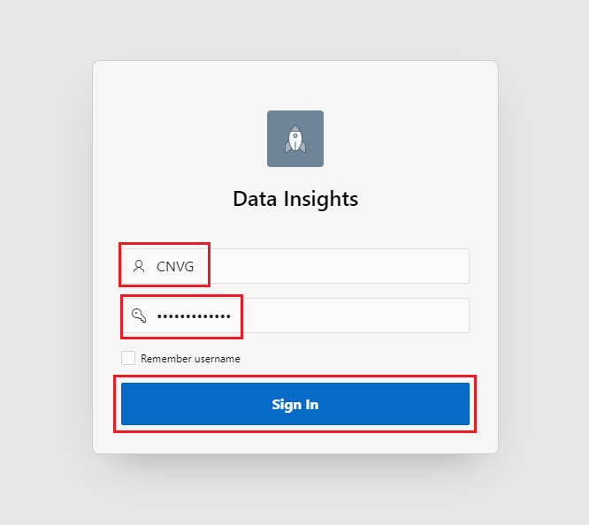

14. Click on **Dashboard**.

    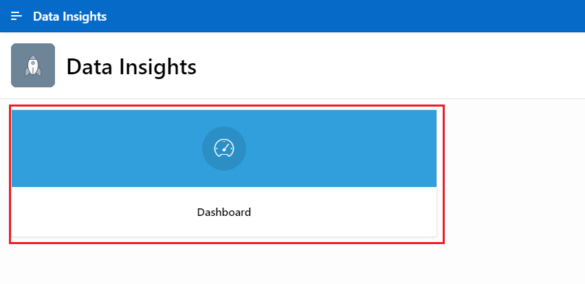

15. We can see our insight application with the **reports**.

    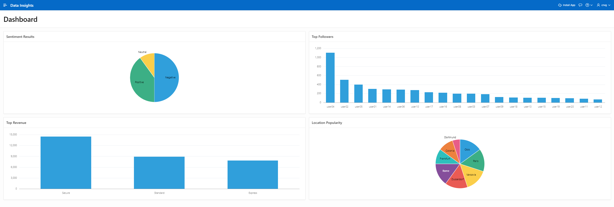


_Congratulations! Well done!_

## Acknowledgements
* **Author** - Javier de la Torre, Principal Data Management Specialist
* **Contributors** - Priscila Iruela, Technology Product Strategy Director
* **Last Updated By/Date** - Javier de la Torre, Principal Data Management Specialist, November 2024


