# Predict Customer Churn with AutoML


## Introduction

Oracle Machine Learning AutoML UI (OML AutoML UI) is a no-code user interface supporting automated machine learning for both data scientist productivity and non-expert user access to powerful in-database algorithms. Oracle Machine Learning AutoML UI automates model building with minimal user input – you just have to specify the data and the target in what’s called an experiment and the tool does the rest. However, you can adjust some settings, such as the number of top models to select, the model selection metric, and even specific algorithms. Similarly, you can deploy models from OML AutoML UI as REST endpoints to Oracle Machine Learning (OML) Services in just a few clicks.

In this Lab we are going to use all the data we have for creating a Machine Learning model to predict customer churn or which customer could be a candidate to use our affinity card.

Estimated Lab Time: 15 minutes.

### Objectives

In this lab, you will:


* Create a Machine Learning Model
* Store the Machine Learning model in Autonomous for running SQL with it

### Prerequisites

This lab assumes you have created the Autonomous Data Warehouse database in the previous lab.

## Task 1: Prepare the data

1. **Oracle AutoML requires an unique table to understand how the data is related and to define the column to predict**. For that we are going to create an unique table called **dw\_table**. Go to **SQL** and **Run** the following statement. Remember, you need to be the **CNVG** user and not the admin user.

    ```
        <copy> 
            create table dw_table as
            select a.*,b.sentiment,b.emotion
            from revenue a, SENTIMENT_RESULTS b
            where a.cust_key=b.name;
        </copy>
    ```
    
    Check that the **statement has being completed successfully**.

    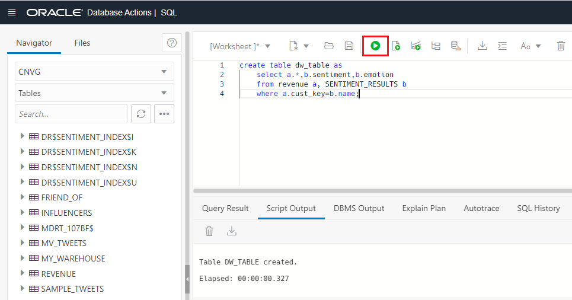

## Task 2: Create the model

1. As we have our data ready, let's create our **Machine Learning Model**. Go to your **Autonomous Database** dashboard and click on **Tools** and then **Oracle ML User Administration**. Click finally on **Open Oracle ML User Administration** to open the ML development environment.

    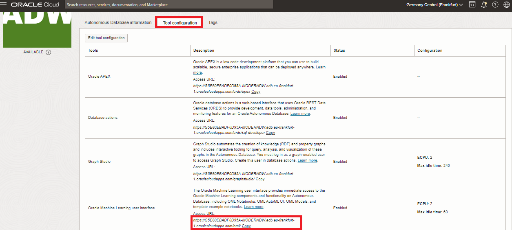

2. Log in with the **ADMIN** user.

    - **Username:** ADMIN
        ```
            <copy>ADMIN</copy>
        ```
    
    - **Password:** Password123##
        ```
            <copy>Password123##</copy>
        ```

    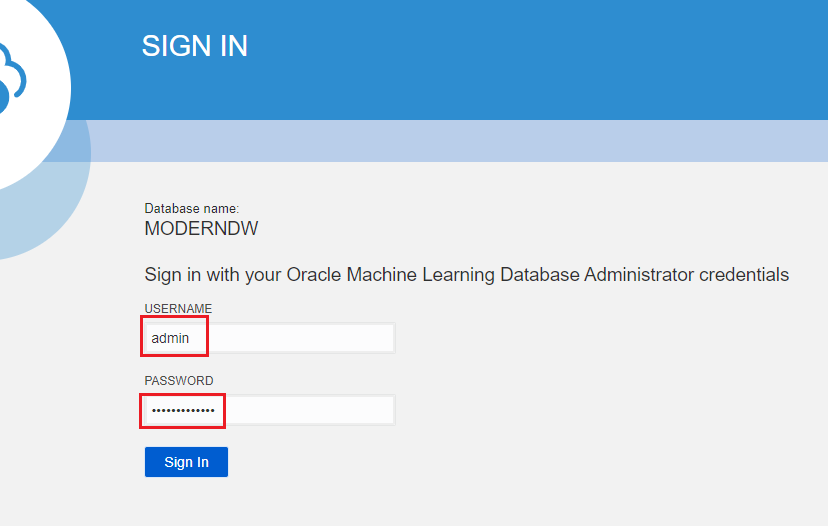

3. You will see that the **CNVG** user is already there. Click the **Home** button to sign in into the AutoML page.

    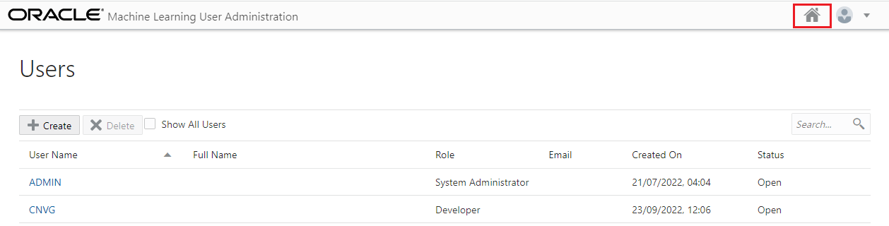

4. Now we can **Sign In** with the **CNVG** user.

    - **Username:** CNVG
        ```
            <copy>CNVG</copy>
        ```
    
    - **Password:** Password123##
        ```
            <copy>Password123##</copy>
        ```

    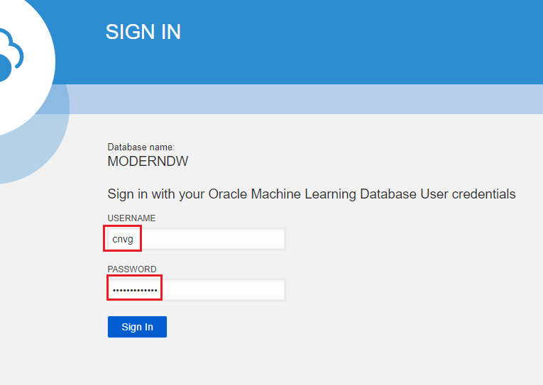

5. Click on the **Home** menu of the ML page. Select **AutoML Experiments**.

    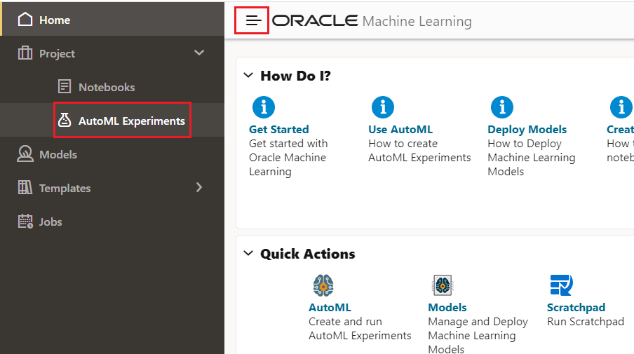

6. Click on **Create** button.

  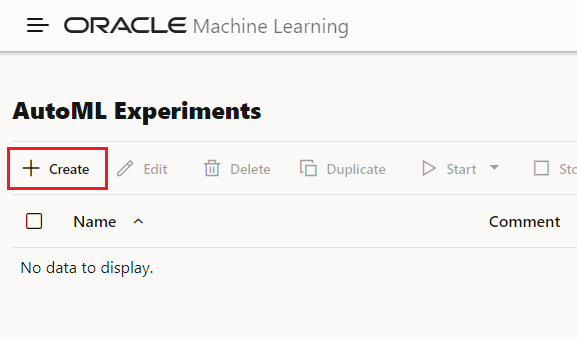

7. Let's define our experiment. Fill the following information:

    - **Name:** Predict Churn
        ```
            <copy>Predict Churn</copy>
        ```
    
    - **Data Source:** CNVG.DW_TABLE

    - **Predict:** AFFINITY_CARD

    - **Case ID:** CUST_KEY

  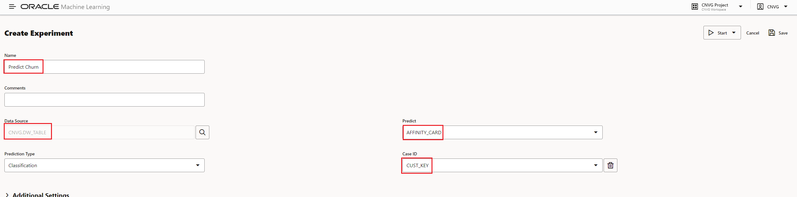

8. We don't need to fill more information, click on **Start** and select **Faster Results**.

    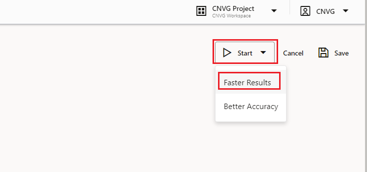

9. Once it is finished, we can see which are the columns or features that have bigger impact in our model. **The prediction will take a few minutes, be patience!**. **We can see that emotion is very important**.

    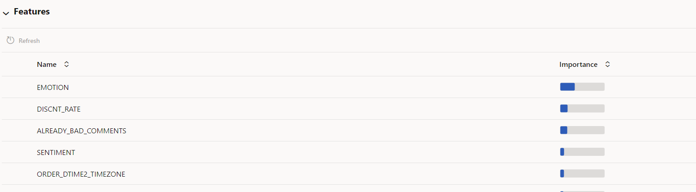

## Task 3: Store and query the model inside the Autonomous Database

1. Once the job has finished, we can see the **result and compare the different algorithms**. Note: we see a 100% accuracy. Consider that it is a small dataset built for demo purposes. Let's select the **Decision Tree Model** and let's create a **Notebook**.

    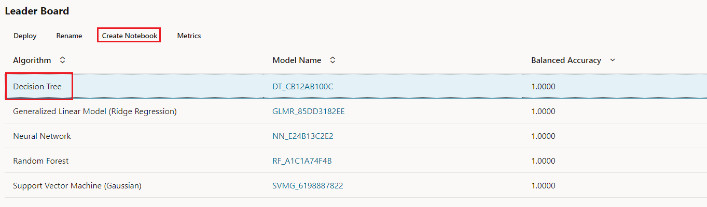

2. Click **OK**.

    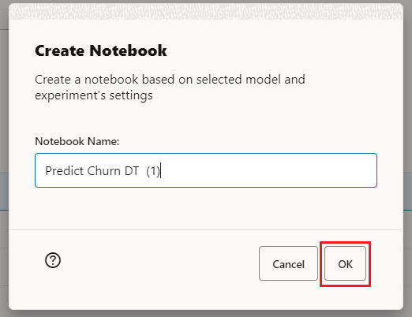

3. Click on **Open Notebook**.

    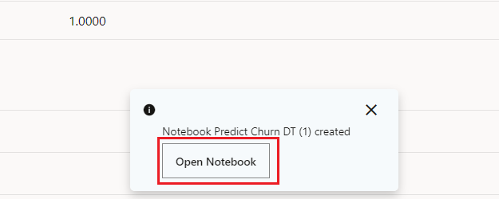

4. We need to define the name of the model to be stored inside of the database. For that we need to add a new parameter called **model\_name** in the box called **Build MODEL\_NAME\_TITLE model** at the very end of the last sentence of this box. **Be sure you add the new part before `)`, otherwise, you will get an error**.

    - At the moment it looks like:
        - **dt\_mod = dt\_mod.fit(X\_train, y\_train , case\_id = 'CUST\_KEY')**
    - And it should look like:
        - **dt\_mod = dt\_mod.fit(X\_train, y\_train , case\_id = 'CUST\_KEY', model\_name='CHURN\_MODEL')**

     ```
        <copy> 
            , model_name='CHURN_MODEL'
        </copy>
    ```

    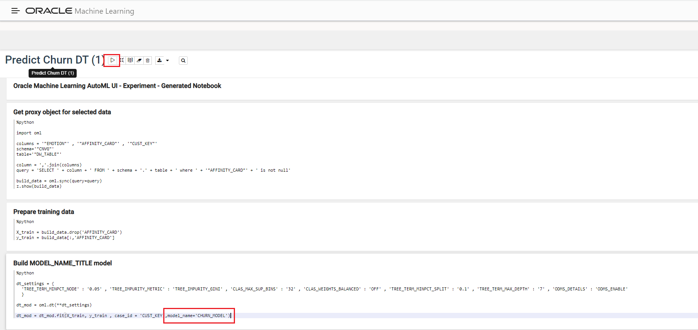

5. Once you **have add** it, you can click on the **Play** button to **Run all the paragraphs**. If you get a confirmation message to **Run all paragraphs?**, answer **OK**.

    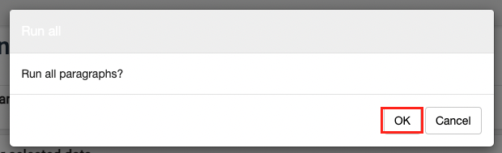

6. We can **validate** if our model has been stored inside of the database. We are going to **run** a simple query, in **SQL** section part of Database Actions as **CNVG** user, finding from our customer if they are likely to have our **affinity card and their probability**.

    ```
        <copy> 
            select AFFINITY_CARD,cust_key,PREDICTION(cnvg.churn_model USING *),PREDICTION_PROBABILITY(cnvg.churn_model USING *) 
            from dw_table
        </copy>
    ```

    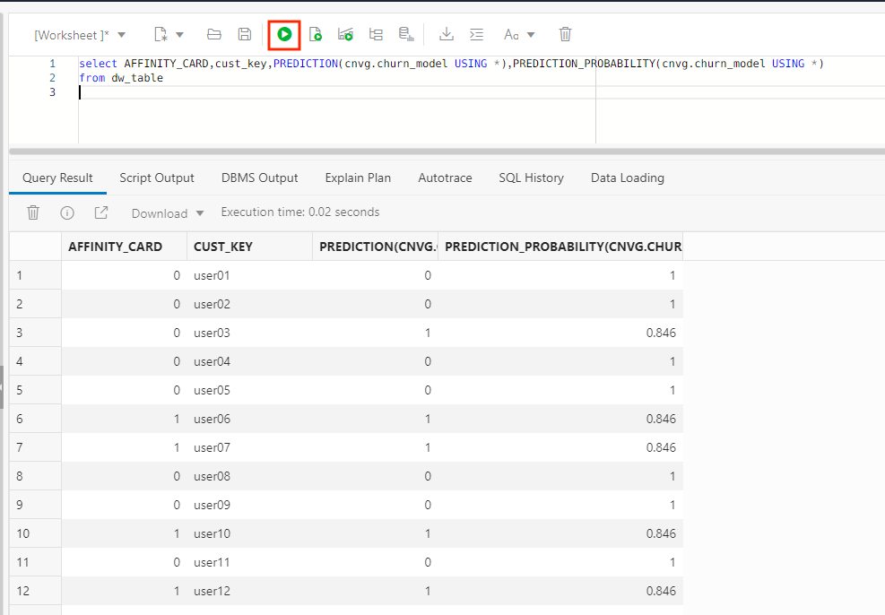

_Congratulations! Well done!_

## Acknowledgements
* **Author** - Javier de la Torre, Principal Data Management Specialist
* **Contributors** - Priscila Iruela, Technology Product Strategy Director
* **Last Updated By/Date** - Javier de la Torre, Principal Data Management Specialist, November 2024


