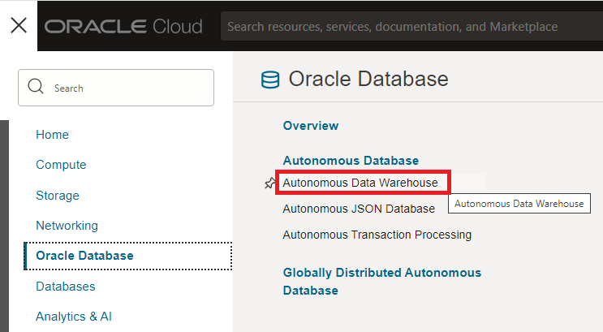
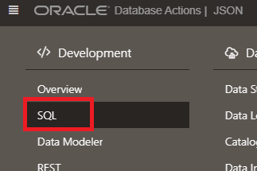
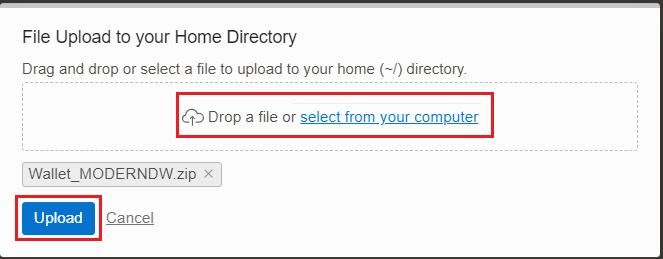
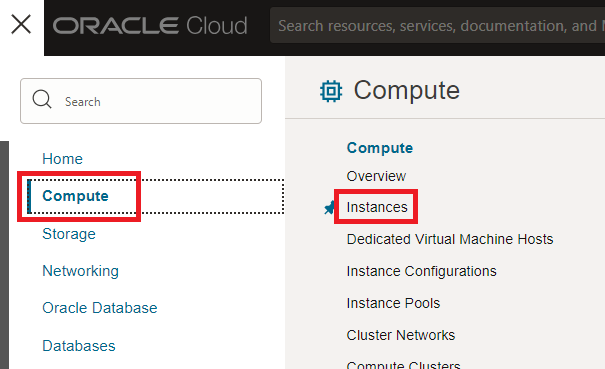

# Identify influencers using Oracle Graph

## Introduction

Oracle Graph eliminate the need to set up a separate database and move data. Analysts and developers can perform fraud detection in banking, find connections and link to data, and improve traceability in smart manufacturing, all while gaining enterprise-grade security, ease of data ingestion, and strong support for data workloads.

In this Lab you are going to use the Twitter data into a Graph to see how users interact with others in order to find new insights.

Estimated Lab Time: 40 minutes.

### Objectives

In this lab, you will:

* Create a Graph Server
* Populate a graph
* Use the Page Rank algorithm to find influencers


### Prerequisites

This lab assumes you have created the Autonomous Data Warehouse database and you have loaded the JSON tweets from Lab 2.

## Task 1: Load friends JSON data


1. Before start the exercise you need to download the data that we will use. **Click** on the following [LINK](https://c4u04.objectstorage.us-ashburn-1.oci.customer-oci.com/p/EcTjWk2IuZPZeNnD_fYMcgUhdNDIDA6rt9gaFj_WZMiL7VvxPBNMY60837hu5hga/n/c4u04/b/livelabsfiles/o/labfiles/friend_of.json "open the json file") to see the JSON dataset and **Save it** using **Control S** or different method to save files. We recommend you to call the file **friend\_of.json**.

    - **File name:** friend\_of.json
    ```
        <copy>friend_of.json</copy>
     ```

2. We have a new dataset which has information about twitter's users followers. We are going to use this data to **build a graph**. First we need to upload this file into the object storage. First we need to create a bucket. Access to **Storage** from the **Oracle Cloud Console Burger Menu** and after **Buckets** section.

    

3. Select our **json_data** bucket.

    

4. Click on **Upload** button.

    

5. Select the **friend\_of.json** and click **Upload**.

    

6. Click **Close**.

    

7. Let's find the information from the 'friend_of' file. From the menu of the file, select **View Object Details**.

    

8. You will find the url with the JSON file location. **Save this url** as we are going to need it for loading it later on. Then click **Cancel** to exit.

    

9. We need to go back to **JSON** menu on the **Database Actions** section. If you are still connected as CNVG user, you can go to step number 16 from this lab and step. Otherwise, you can follow the following steps.

10. Let's go to our **Autonomous Data Warehouse**.

    

11. Select our **MODERNDW** database.

    

12. Go to **Database Actions**.

    

13. We need to connect with the **CNVG** and not with the **ADMIN** user. Let's log out first.

    

14. Click on **Sign in**.

    

15. Connect with the **CNVG** user we created before.

    - **User Name:** CNVG
        ```
        <copy>CNVG</copy>
        ```

    - **Password:** Password123##
        ```
        <copy>Password123##</copy>
        ```

    


16. Let's create a **new JSON Collection**.

    

17. Click on create **New collection**.

    

18. Set the new name for the collection as **friend_of** and click **Create**.

    - **Collection name:** friend\_of
    ```
        <copy>friend_of</copy>
    ```

    

19. Go back to **SQL**, for loading the data.

    

20. Execute the **COPY\_COLLECTION** utility for loading the JSON file into the collection. We need to provide the **credential name** created on previous task, **json_cred**, the **collection name**, **friend\_of** and the **URL** where the JSON is located, that is the URL that we copied on the step number 8 from this lab. You should have all this information from steps before. **Change** the information and **Execute** it.

    ```
        <copy> 
        BEGIN 
            DBMS_CLOUD.COPY_COLLECTION(    
                collection_name => 'friend_of', 
                credential_name=>'json_cred',   
                file_uri_list => 'YOUR_URL',
                format => '{"recorddelimiter" : "0x''01''", "unpackarrays" : "TRUE", "maxdocsize" : "10240000"}'
            );
        END;
        /
        </copy>
    ```

    Check that the **PL/SQL procedure has being successfully completed**.

    

## Task 2: Create a VCN for the Graph server

1. We need to create a Virtual Cloud Network (VCN) before we provision the **Graph Server**. Open a new web browser window, access to the **Oracle Cloud console** page, cloud.oracle.com, after access to **Networking** and then **Virtual Cloud Network**.

    

2. Click on **Start VCN Wizard**.

    

3. Select **Create VCN with Internet Connectivity** and click on **Start VCN Wizard**.

    

4. Define the VCN Name as **vcn_graph**. Then click on **Next**.

    - **VCN Name:** vcn_graph
        ```
        <copy>vcn_graph</copy>
        ```

    

5. Keep the default configuration. Click on **Create**.

    

    After a few seconds the **VCN will be created.**

    

6. We need to open the port **7007** for the Graph Server. Let's go back to the VCN configuration.

    

7. Select the just created VCN, **vcn_graph**.

    

8. Select the **Public Subnet-vcn_graph**.

    

9. Select the **Default Security List for vcn graph**.

    

10. Click on **Add Ingress Rule**.

     

11. Set the following rule for opening the port 7007, then click on **Add Ingress Rules**: 

    - **Source CIDR:** 0.0.0.0/0
        ```
        <copy>0.0.0.0/0</copy>
        ```
    
    - **IP Protocol:** select **TCP**

    - **Destination Port Range:** 7007
        ```
        <copy>7007</copy>
        ```

    - **Description:** Graph Server
        ```
        <copy>Graph Server</copy>
        ```

     

12. After a few second the new Ingress Rule will be created and included on your **Ingress Rule list**.

     


## Task 3: Create Oracle Graph server

1. Before we create the Graph Server, we need to generate a **ssh key**. For that we are going to use the **cloud shell**. You will get announcements and messages in green when you open cloud shell, spend a few minutes reading them, then can be useful for you!.

     

     

2. Once the cloud shell has started, **run** the following commands to generate a **ssh key**.

    ```
        <copy>mkdir .ssh</copy>
    ```

    ```
        <copy>cd .ssh</copy>
    ```

    ```
        <copy>ssh-keygen -b 2048 -t rsa -f graphkey</copy>
    ```

    **Press Enter twice for no passphrase**.

     

3. We will need the **public key** when creating the Graph Server. In order to get the public key, you can **run** the following command:

    ```
        <copy>cat graphkey.pub</copy>

    ```

     

4. Now we are ready to provision the **Graph Server**. We can find it in the **marketplace**. Go from the **Oracle Cloud Console Burger Menu**, after **Marketplace** section and finally **All Applications**. If you see an error collecting all applications, please try again.

     

5. In the marketplace, search **Graph**. There you can select **Oracle Graph Server and Client**.

    

6. Select that you **had reviewed the terms and restrictions** and click on **Launch Stack**.

    

7. Leave the **default configuration** and click **Next**.

    

8. Now configure the Graph Server:
    
    - **Compartment:** Be sure you have selected your compartment
    
    - **Availability Domain:** Choose any available

    - **Shape:** VM.Standard.E2.1 or VM.Standard.E2.1.Micro shapes

    - **SSH Public Key:** Copy from the cloud shell. **Be sure you don't miss any character at the very beginning and at the end.**

    

9. Select the VCN and the **Public Subnet** we already created, **Public Subnet-vcn_graph (Regional)**. **Be sure you have selected the correct compartment in network and subnet sections, otherwise, you will not be capable of selected the VCN and Subnet**.

    

10. Finally we have to define the **JDBC connection** for our Autonomous Database.

    ```
        <copy> 
            jdbc:oracle:thin:@moderndw_low?TNS_ADMIN=/etc/oracle/graph/wallets
        </copy>
    ```

    

11. Click on **Next**.

    

12. Click on **Create**.

    

13. This will create a **terraform job** for creating this instance. It should take a few minutes.

    

14. You should see it as **SUCCEEDED**.

    

15. The Graph connect needs the **Autonomous Wallet** to connect. We need to **download it** and **upload it** into the Graph Server. Go to the **Autonomous Database** once more and click on **DB Connection** section. 

    

16. Click on **Download Wallet**.

    

17. Set the same password: **Password123##** and click download.

    - **Passwords:** Password123##
        ```
        <copy>Password123##</copy>
        ```

    

18. Now we are going to **upload** the wallet to the **Cloud Shell**.

    

19. Select the wallet and click on **Upload**.

    

20. We are going to use **SCP** to move the wallet from the Cloud Shell into the Graph Server. Before we need the **Public IP**. Let's find it under **compute** dashboard. After click on **Instances** section.

    

21. Copy the **Public IP** from the **oraclegraph-instance** that you can find on the list of instances created. We are going to need it for the next exercise, so write it down for later on.

    

22. Go back to the **Cloud shell**. **Run** the following command to copy the wallet into the Graph Server. **Remember to use YOUR IP that we copied in the previous step**. Remember to **type `yes`** to complete the command.

    ```
        <copy> 
            scp -i .ssh/graphkey Wallet_MODERNDW.zip opc@YOUR_IP:/etc/oracle/graph/wallets
        </copy>
    ```

    

23. Now we just need to **unzip** the wallet on the Graph Server. We need to connect via ssh and unzip it running the following commands. **Remember to use YOUR IP that we copied in  previous step**.
        
    ```
        <copy> ssh -i .ssh/graphkey opc@YOUR_IP </copy>
    ```

      

    ``` 
        <copy>
            cd /etc/oracle/graph/wallets/
        </copy>
    ```
    ```
        <copy>
            unzip Wallet_MODERNDW.zip
        </copy>
    ```
    ```
        <copy>
            chgrp oraclegraph *
        </copy>
    ```

    

## Task 4: Create a graph

1. The **Graph Server is created**, now we need to **populate** the Graph. For simplicity, we are going to create a simpler table of twitter users and we are going to create a view on top of the friend_of JSON Collection. Let's **create the view** first. We need to go back to **JSON** menu on the **Database Actions** section. If you are still connected as CNVG user, you can go to step number 8 from this lab and step. Otherwise, you can follow the following steps.

2. Let's go to our **Autonomous Data Warehouse**.

    

3. Select our **MODERNDW** database.

    

4. Go to **Database Actions**.

    

5. We need to connect with the **CNVG** and not with the **ADMIN** user. Let's log out first.

    

6. Click on **Sign in**.

    

7. Connect with the **CNVG** user we created before.

    - **User Name:** CNVG
        ```
        <copy>CNVG</copy>
        ```

    - **Password:** Password123##
        ```
        <copy>Password123##</copy>
        ```

    

8. Go to **JSON** section.

    

9. Select the **friend_of** collection and click on **Create View**.

    

10. Click **Add All** to add all columns and click on **Create**.

    

11. Be sure your **view has been created**.

    

12. Go back to **SQL** section.

    

13. We need a **primary key** for our view. Also we are going to create a **simplified table** for our twitter users. **Run** the following statements.

    ```
        <copy> 
            ALTER VIEW FRIEND_OF_VIEW ADD CONSTRAINT FRIEND_OF_VIEW_PK PRIMARY KEY ( ID ) DISABLE;
            create table twitter_user as select name, identifier, description, location from MV_TWEETS;
            ALTER TABLE twitter_user ADD CONSTRAINT twitter_user_pk PRIMARY KEY (identifier);
        </copy>
    ```

    Check that **statements have being completed successfully**.

    

14. Now we can finally create the **Graph**. Let's go back to our **cloud shell** once again to connect to the Graph Server. If you have disconnected you can connect again via ssh.

    ```
        <copy> 
            ssh -i .ssh/graphkey opc@YOUR_IP
        </copy>
    ```

15. Let's connect with the **opg4py** utility. We are going to use the **cnvg** user and the password **Password123##**. **Be sure you type the password correctly, otherwise, you can't connect to the Oracle Graph Server**.
    ```
        <copy> 
            opg4py -b https://localhost:7007 -u cnvg
        </copy>
    ```

    

    

16. Let's **define** the Graph.

    ```
        <copy> 
            statement = '''
            CREATE PROPERTY GRAPH "influencer"
            VERTEX TABLES (
            TWITTER_USER
            )
            EDGE TABLES (
            friend_of_view
            SOURCE KEY(user_id) REFERENCES TWITTER_USER
            DESTINATION KEY(is_frend_of) REFERENCES TWITTER_USER
            )
            '''
        </copy>
    ```

    

17. Let's **execute** the definition.

    ```   
        <copy> 
            session.prepare_pgql(statement).execute()
        </copy>
    ```

    

18. Let's **store** the graph in a variable.

    ```
        <copy> 
            graph=session.get_graph("influencer")
        </copy>
    ```

    

19. Now let's **run** a simple query.

    ```
        <copy> 
            graph.query_pgql("""
            SELECT a.name,a.description, a.location,b.name as "friend of"
            FROM MATCH (a)-[e]->(b)
            """).print()
        </copy>
    ```

    


## Task 5: Find influencers

1. As we have the **Graph loaded**, let's use the **Page Rank Algorithm** to determine influencers in our community. **Run** the following statement:

    ```
        <copy> 
            analyst.pagerank(graph)
        </copy>
    ```

    

2. Now let's see the **results**. Let's **run** a simple query.

    ```
        <copy> 
            graph.query_pgql("""
            SELECT a.name,a.description, a.pagerank
            FROM MATCH (a)
            ORDER BY a.pagerank DESC
            """).print()
        </copy>
    ```

    

3. Now let's **store the result in a variable**. We will use this variable to **store the result back into the Oracle Database**. **Run** the following statement:

    ```
        <copy> 
            result= graph.query_pgql("""
            SELECT a.name,a.description, a.pagerank
            FROM MATCH (a)
            ORDER BY a.pagerank DESC
            """)
        </copy>
    ```

    

4. Let's **store the result in our Autonomous Database**. We are going to store it in a new table called **Influencers**. For that, **run** the following statement:

    ```
        <copy> 
            result.to_frame().write().db().table_name("INFLUENCERS").overwrite(True).owner("CNVG").store()
        </copy>
    ```

    

5. If we go back to **SQL**, we should be able to **run** a simple query over that table. Be sure you are connect as **CNVG** user.

    ```
        <copy> 
            select * from INFLUENCERS order by 3 desc 
        </copy>
    ```

    

You can **proceed to the next lab.**

## Acknowledgements
* **Author** - Javier de la Torre, Principal Data Management Specialist
* **Contributors** - Priscila Iruela, Technology Product Strategy Director
* **Last Updated By/Date** - Javier de la Torre, Principal Data Management Specialist, November 2024

