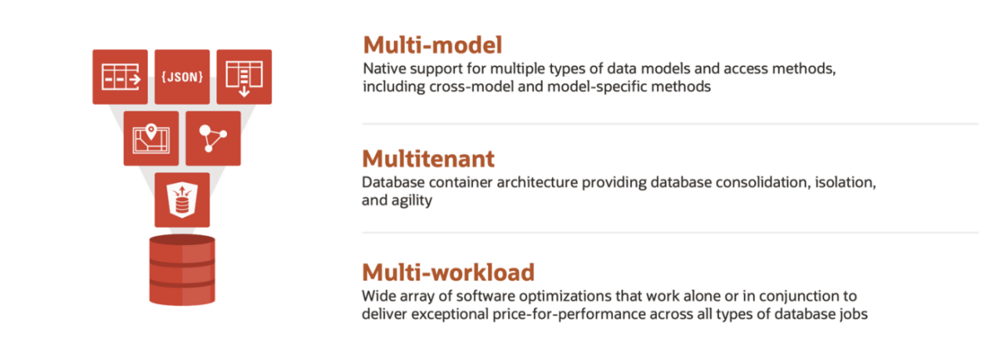

# Modern Data Warehouse Workshop

## Introduction

Oracle Autonomous Data Warehouse provides unique capabilities thanks to its integrated multi-model and multi-workload database, also called converged. The goal of this workshop is to show the instant value and new insights when taking advantage of all its capabilities.

### **Who Should Use This Workshop?**

Everyone can benefit from doing the exercises listed in this guide: technical experts (data warehouse architects to database administrators), business users who want to focus on extracting meaning and insight from their own data, along with data scientists who want to build machine learning models within the context of a data warehouse project.

### **Welcome to Modern Data Warehouse Workshop**

In this workshop we are going to use different capabilities to integrate structured and non-structured data and provide new business value. We are going to be a company who is shipping different products to our customers. As many of them buy in as a “guest mode”, it is difficult to find patterns or improve the business. Therefore, we are going to collect Twitter data to discover them. As a result of the workshop, we will learn which customers are at risk of “churn” or they are not happy with our service and identify patterns inside of our data.

During this workshop, we are going to use these capabilities: JSON, Oracle Text, Graph, Blockchain, Spatial, AutoML and APEX.

**Estimated Workshop Time: 2 hours.**

### Objectives

The aim of this workshop is to explore how Autonomous Data Warehouse can support the types of everyday business operations that are needed for real-world data analysis. At the end of this workshop, you will have learned how to do the following:

* Quickly and easily load structured and unstructured data into an Autonomous Data Warehouse
* Sentiment Analysis with Oracle Text 
* Explore and discover relationships in social networks using Oracle Graph
* Learn more about how Autonomous Data Warehouse stores and manages your data
* Load transactional data into Blockchain table to ensure fraud protection 
* Use Oracle Spatial to perform spatial analysis on business data quickly and easily
* Use machine learning to predict customer behavior 
* Easily create an application using Oracle APEX to get business insights and visualize data

### Prerequisites

* [An Oracle Free Tier](https://signup.cloud.oracle.com/?sourceType=:em:lw:rce:cpo:::RC_WWMK220606P00109:FY23Q1_Workshop_JSON1207_EMEA),Always Free, Paid or LiveLabs Cloud Account - You can check Getting Started section for more information.

Here is a video to help with the Oracle Trial Sign Up Process:

*At this point, you are ready to start learning! Please proceed.*

## Acknowledgements
* **Author** - Javier de la Torre, Principal Data Management Specialist
* **Contributors** - Priscila Iruela, Technology Product Strategy Director
* **Last Updated By/Date** - Javier de la Torre, Principal Data Management Specialist, November 2024

