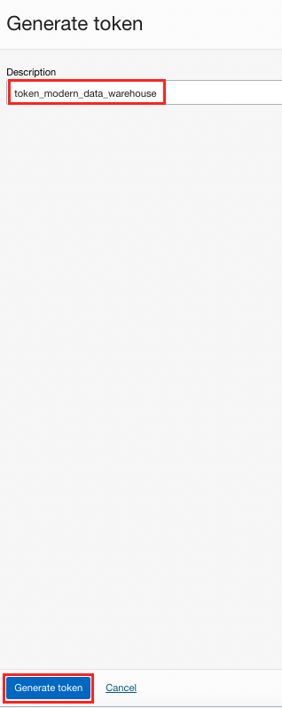
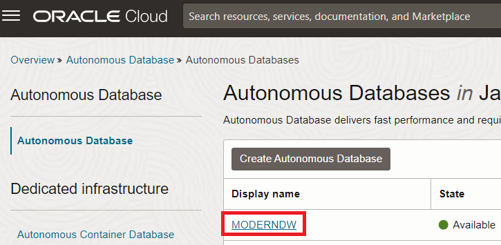
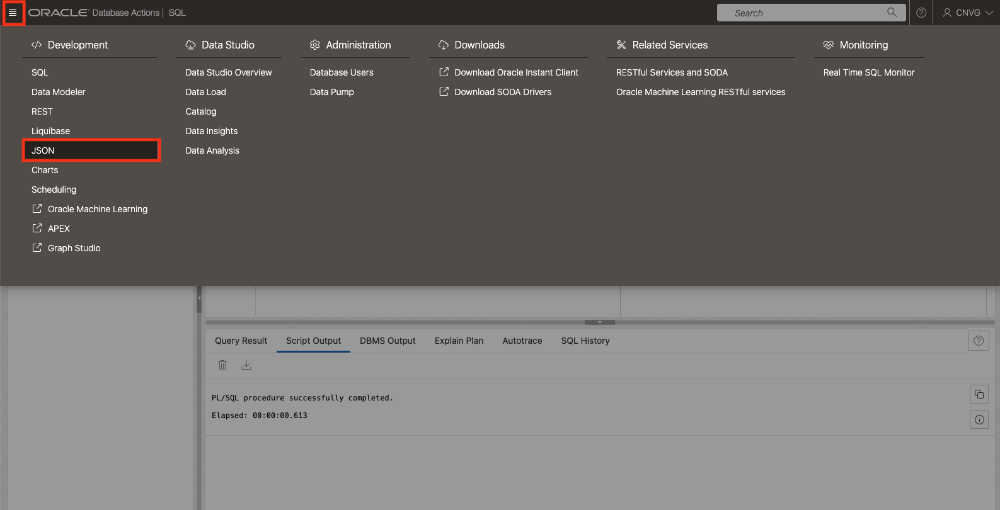
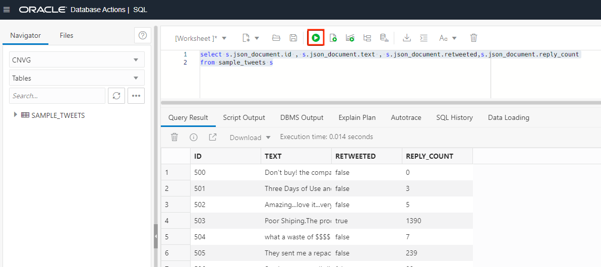
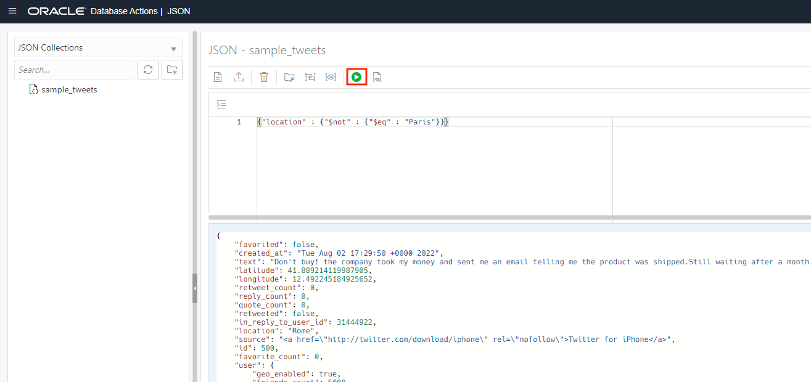

# Load JSON tweets in the Autonomous Database


## Introduction

Autonomous Database supports JSON data natively in the database. You can use NoSQL-style APIs to develop applications that use JSON document collections without needing to know SQL or how the documents are stored in the database.

In this Lab you are going to learn how to upload JSON data and how to run some queries over them.

Estimated Lab Time: 30 minutes.

### Objectives

In this lab, you will:

* Create a Object Storage bucket
* Upload JSON data
* Create Autonomous Credentials
* Query JSON data


### Prerequisites

This lab assumes you have created the Autonomous Data Warehouse database in the previous lab.

## Task 1: Upload JSON tweets into Object Storage


1. Before start the exercise you need to download the data that we will use. **Click** on the following [LINK](https://c4u04.objectstorage.us-ashburn-1.oci.customer-oci.com/p/EcTjWk2IuZPZeNnD_fYMcgUhdNDIDA6rt9gaFj_WZMiL7VvxPBNMY60837hu5hga/n/c4u04/b/livelabsfiles/o/labfiles/JSON_Full_tweets.jsonn "open the json file") to see the JSON dataset and **Save it** using **Control S** or different method to save files. We recommend you to call the file **JSON\_Full\_tweets.json**.

    
    - **File name:** JSON\_Full\_tweets.json
        ```
        <copy>JSON_Full_tweets.json</copy>
        ```

2. Once you have downloaded the JSON containing some tweets, we need to upload them into Object Storage. First we need to create a bucket. Open a new web browser window, access to the **Oracle Cloud console** page, cloud.oracle.com, after access to **Storage** from the **Oracle Cloud Console Burger Menu** and after **Buckets** section.

    

3. Click on **Create Bucket**

    

4. Set the name for the bucket. We are going to call it **json_data**. Then click the **create** button.

    - **Bucket name:** json_data
        ```
        <copy>json_data</copy>
        ```

    

5. Select the **json_data** bucket.

    

6. Click on the **upload** button.

    

7. Select the JSON file we just downloaded, **JSON\_Full\_tweets.json**, and then click on **upload**.

    

8. We should see the JSON file there on the Objects part of this bucket.

    
    

## Task 2: Create credential for Autonomous Database

1. We have the tweets available in the Object Storage. Now we need to create a **credential**. This credential will allow the Autonomous Database to authenticate against the Object Storage Service. Click on your **profile icon** and then on **My profile**. **Take a note** of your user as you will need it for later.

    

    If you don't see **My profile** section, please copy your user from the information that you can see in this menu under **Profile**. The format should be `oracleidentitycloudservice/your_email`.

    

2. Let's create a new token for the Autonomous Database. Click on **Auth Tokens** under the **Resources** section on the left size of the screen.

    

3. Click on **Generate Token**.

    

4. Provide a **token name**, for instance, **token\_modern\_data\_warehouse**, and click **Generate token**.

    - **Description:** token\_modern\_data\_warehouse
        ```
        <copy>token_modern_data_warehouse</copy>
        ```
    
    

5. It will show a popup like this. **This token will be shown only once**. Click **Show** to show the token.

    

6. Click **Copy** and store it in a secure place. **Save it** in a notepad or a secure place for later. **It will never be shown again**. Then you can click **Close**.

    

7. We have stored the credential, now we need to find and store the location of where the data is stored. We will share this info with the Autonomous Database so it can load it. Let's go back to the **Object Storage**. Go from the **Oracle Cloud Console Burger Menu** and after **Buckets** section.

    

8. Select the JSON bucket we already created.

    

9. Let's find the information from the tweets. From the menu of the file, select **View Object Details**

    

10. You will find the url with the JSON file location. **Save this url** as we are going to need it for loading it later on. Then click **Cancel** to exit.
 
    

11. As we have the credential created and we know the url where we store our JSON data, now we can proceed to authorize Autonomous with this credential. Let's go to our Autonomous Data Warehouse.

    

12. Select our **MODERNDW** database.

    

13. Go to **Database Actions**.

    

14. We need to connect with the **CNVG** and not with the **ADMIN** user. Let's log out first.

    

15. Now we are ready to **Sign in**.

    

16. Connect with the **CNVG** user we created before.

    - **User Name:** CNVG
        ```
        <copy>CNVG</copy>
        ```

    - **Password:** Password123##
        ```
        <copy>Password123##</copy>
        ```

    

17. Select the **SQL** to access to the **SQL Web** from the **Development** section. 

    

18. Run the following **SQL** for creating the credential, replacing username and password for the information that we already copied before.
    - **username**, it is your **Oracle Cloud user name** that we copied on step number 1 of this task. It should be your your email address.
    - **password**, it is the **Auth token** that we copied on step number 6 of this task.

    ```
        <copy> 
        begin
            dbms_cloud.create_credential (
                credential_name => 'json_cred',
                username        => 'your_user',
                password        => 'your_key'
                );
            end;
        /
        </copy>
    ```

    Check that the **PL/SQL procedure has being successfully completed**.

    

## Task 3: Load JSON into Autonomous Database

1. In this task we are going to learn how to upload single document and how to load bulk JSONs. First let's learn how to do load a simple document. Go to the menu and select **JSON**.

    

2. Let's create a **new collection** to store our JSON data. Click on **Create Collection**.

    

3. Name our new collection as **sample_tweets** and click **create**.

    - **Collection Name:** sample_tweets
        ```
        <copy>sample_tweets</copy>
        ```

    

4. Let's upload a new JSON document. Click on the icon for creating a **New JSON Document**.

    

5. Copy and paste the following tweet. Then click on the **Create** button.
    
    ```
        <copy>
        {
            "id": 500,
            "text": "Don't buy! the company took my money and sent me an email telling me the product was shipped.Still waiting after a month. Very dissapointed!",
            "favorited": false,
            "created_at": "Tue Aug 02 17:29:50 +0000 2022",  
            "retweet_count": 0,
            "reply_count": 0,
            "quote_count": 0,
            "retweeted": false,
            "location":"Rome",
            "latitude": 41.889214119987905,
            "longitude":12.492245184925652,
            "in_reply_to_user_id": 31444922,
            "source": "<a href=\"http://twitter.com/download/iphone\" rel=\"nofollow\">Twitter for iPhone</a>",
            "favorite_count": 0,
            "user": {
                "name": "user01",
                "identifier": 1,
                "description": "loves cupcakes and cats",
                "geo_enabled": true,
                "friends_count": 5000,
                "protected": false,
                "favourites_count": 35150,
                "followers_count": 306,
                "is_translator": false,
                "statuses_count": 9029,
                "verified": false 
            }
        }
        </copy>
    ```

    

6. Now let's proceed for the bulk load. Let's load the JSON file stored in the object storage. Let's go back to **SQL**.

    

7. Execute the **COPY_COLLECTION** utility for loading the JSON file into the collection. We need to provide the **credential name** created on previous task, **json\_cred**, the **collection name**, **sample\_tweets** and the **URL** where the JSON is located, that is the URL that we copied on the step number 10 from the previous lab. You should have all this information from steps before. **Change** the information and **Execute** it.

    ```
        <copy> 
        BEGIN 
            DBMS_CLOUD.COPY_COLLECTION(    
                collection_name => 'sample_tweets', 
                credential_name=>'json_cred',   
                file_uri_list => 'your_url',
                format => '{"recorddelimiter" : "0x''01''", "unpackarrays" : "TRUE", "maxdocsize" : "10240000"}'
            );
        END;
        /
        </copy>
    ```

    Check that the **PL/SQL procedure has being successfully completed**.

    


## Task 4: Run queries over JSON

1. With all the tweets loaded, let's run some SQL queries over our JSON. In our first query, let's see how many tweets do we have. We must see 20 rows.
    
    ```
        <copy> 
            select count(*) from sample_tweets;
        </copy>
    ```

    

2. Now let's visualize the content of the JSON tweets. For that we are going to use the **json\_serialize**.

    ```    
        <copy> 
            select json_serialize(json_document) from sample_tweets;
        </copy>
    ```

    

3. Oracle provides the capability for showing the JSON like a table, we can run a simple query using the **dot notation**. Let's query some fields.

    ```
        <copy> 
            select s.json_document.id , s.json_document.text , s.json_document.retweeted,s.json_document.reply_count
            from sample_tweets s
        </copy>
    ```

    

4. Also we can use the **where condition over JSON**. Let's run a query filtering by tweets located in Paris.

    ```
        <copy> 
            select s.json_document.id , s.json_document.text , s.json_document.retweeted,s.json_document.reply_count,s.json_document.location
            from sample_tweets s
            where s.json_document.location='Paris'
        </copy>
    ```

    

5. If you feel more comfortable with JSON, we can use the **Query by Example** directly on JSON. Let's run a simple query. Let's go to the JSON utility.

    

6. Let's run a simple query, **to filter by specific id**, in this case **510**:

    ```
        <copy> 
            {"id":510}
        </copy>
    ```

    

7. Let's query for all the tweets **not located in Paris**.

    ```
        <copy> 
            {"location" : {"$not" : {"$eq" : "Paris"}}}
        </copy>
    ```

    

You can **proceed to the next lab.**

## Acknowledgements
* **Author** - Javier de la Torre, Principal Data Management Specialist
* **Contributors** - Priscila Iruela, Technology Product Strategy Director
* **Last Updated By/Date** - Javier de la Torre, Principal Data Management Specialist

