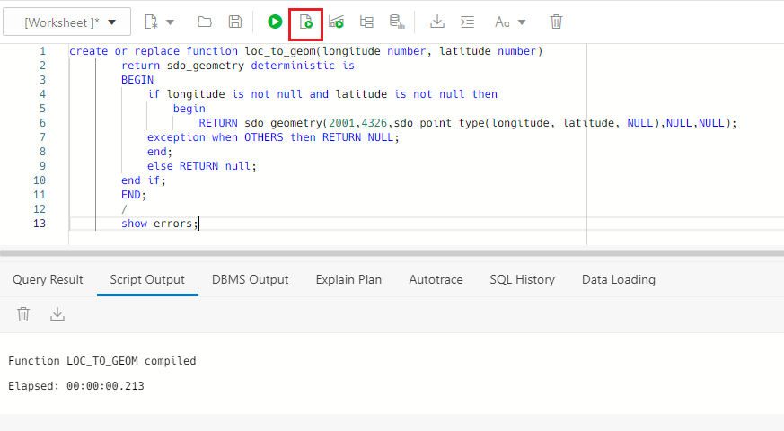

# Use Spatial to analyze tweets location


## Introduction

Oracle's spatial database is included in Oracle's converged database, allowing developers and analysts to get started easily with location intelligence analytics and mapping services. Organizations can manage different types of geospatial data, perform hundreds of spatial analytic operations, and use interactive map visualization tools with the spatial features in Oracle Autonomous Database and Oracle Database.

In this lab we are going to analyze the tweets location and compare them with our warehouses location to get new insights.

Estimated Lab Time: 15 minutes.

### Objectives

In this lab, you will:

* Create warehouse table
* Create Spatial function to use latitude and longitude
* Query distance among users and warehouses


### Prerequisites

This lab assumes you have created the Autonomous Data Warehouse database in the previous lab.

## Task 1: Create warehouse table

1. We are going to create a **new table**. This table is going to store the location of our warehouses where we ship the products to our customers. **Run** the following statements:

    ```
        <copy> 
            create table my_warehouse(
            id number,
            city varchar2(50),
            latitude number,
            longitude number
            );
            insert into MY_WAREHOUSE values (1, 'Frankfurt', 50.110307329549634, 8.68548127192586);
            insert into MY_WAREHOUSE values (2, 'Dusseldorf', 51.228071678687535, 6.770907365667318);
            commit;
        </copy>
    ```
    Check that the **statements have being completed successfully**.

    

## Task 2: Create Spatial function for latitude and longitude

1. **Create function** to convert latitude and longitude into Oracle Spatial Objects. With this function, we will be able to run queries easily.

    ```
        <copy> 
                create or replace function loc_to_geom(longitude number, latitude number)
                return sdo_geometry deterministic is
                BEGIN
                    if longitude is not null and latitude is not null then
                        begin
                            RETURN sdo_geometry(2001,4326,sdo_point_type(longitude, latitude, NULL),NULL,NULL);
                    exception when OTHERS then RETURN NULL;
                    end;
                    else RETURN null;
                end if;
                END;
                /
                show errors;
        </copy>
    ```
    Check that the **function has being compiled successfully**.

    

2. We need to **modify the Spatial metadata** for creating an spatial index over the latitude and the longitude. **Run** the following statements:

    ```    
        <copy> 
            insert into user_sdo_geom_metadata values('MV_TWEETS', 'CNVG.LOC_TO_GEOM(LONGITUDE,LATITUDE)',
            sdo_dim_array(sdo_dim_element('Longitude', -180, 180, 0.5),
            sdo_dim_element('Latitude', -90, 90, 0.5)), 4326);
            commit;
        </copy>
    ```

    Check that the **statements have being completed successfully**.

    

3. Now we can create the **Spatial index** over the latitude and longitude. **Run** the following statement:

    ```
        <copy> 
            create index geo_index on MV_TWEETS(loc_to_geom(longitude, latitude)) indextype is mdsys.spatial_index_v2;
        </copy>
    ```
    Check that the **index has being created successfully**.

    

## Task 3: Analyze distance using the location

1. Let's start **running queries**. Let's run a query to find the **tweets inside 250KM from our warehouse in Frankfurt**. **Run** the following query:

    ```
        <copy> 
            Select s.location, s.id 
            from MV_TWEETS s, MY_WAREHOUSE i where 
            i.city = 'Frankfurt' and 
            sdo_within_distance(loc_to_geom(s.longitude, s.latitude),
            loc_to_geom(i.longitude, i.latitude), 'distance=250 unit=km')='TRUE' and s.location <> 'Frankfurt';
        </copy>
    ```

    

2. Now let's run the following query to see the **tweets outside that 250KM range**. For that we are going to use the **NOT** operator. **Run** the following query:

    ```
        <copy> 
            Select s.location, s.id,
            sdo_geom.sdo_distance(loc_to_geom(s.longitude, s.latitude),
            loc_to_geom(i.longitude, i.latitude), 0.5, 'unit=km') DistInKM from MV_TWEETS s, MY_WAREHOUSE i
            where 
            i.city='Frankfurt' and not
            sdo_within_distance(loc_to_geom(s.longitude, s.latitude),
            loc_to_geom(i.longitude, i.latitude), 'distance=250 unit=km')='TRUE' and s.location <> 'Frankfurt';
        </copy>
    ```

    

3. Now let's use the **emotion column**, to see the **sentiment for the Twitter users outside the range of 250KM**. **Run** the following query:

    ```
        <copy> 
            Select s.location, s.id, r.emotion,
            sdo_geom.sdo_distance(loc_to_geom(s.longitude, s.latitude),
            loc_to_geom(i.longitude, i.latitude), 0.5, 'unit=km') DistInKM from MV_TWEETS s, MY_WAREHOUSE i, sentiment_results r
            where 
            i.city='Frankfurt' and 
            s.name=r.name
            and not
            sdo_within_distance(loc_to_geom(s.longitude, s.latitude),
            loc_to_geom(i.longitude, i.latitude), 'distance=250 unit=km')='TRUE' and s.location <> 'Frankfurt';
        </copy>
    ```

    


You can **proceed to the next lab.**

## Acknowledgements
* **Author** - Javier de la Torre, Principal Data Management Specialist
* **Contributors** - Priscila Iruela, Technology Product Strategy Director
* **Last Updated By/Date** - Javier de la Torre, Principal Data Management Specialist, November 2024

