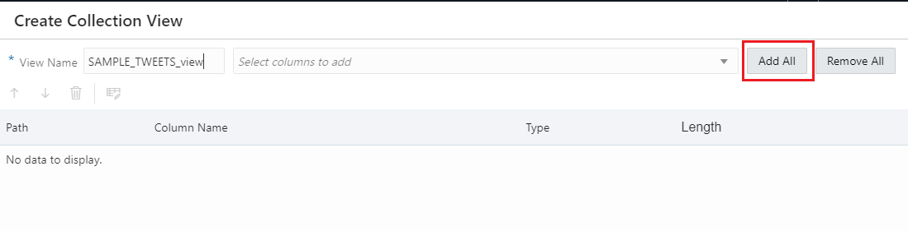
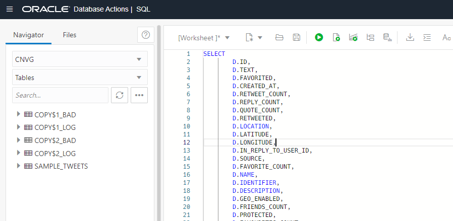
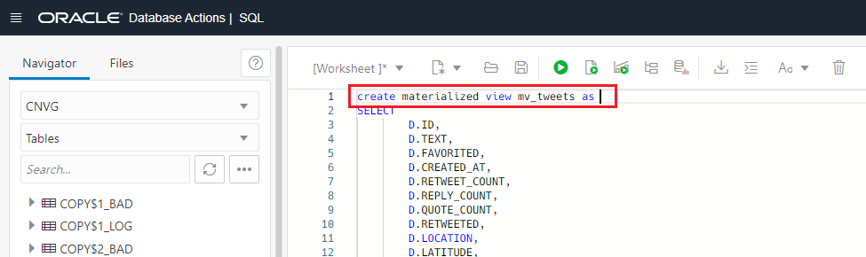
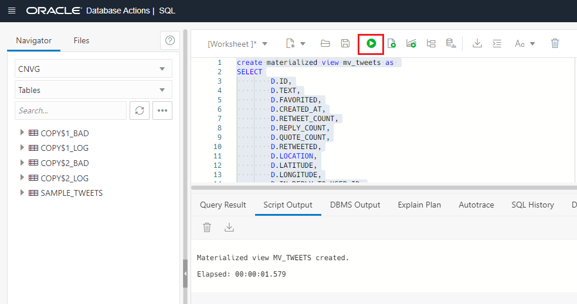
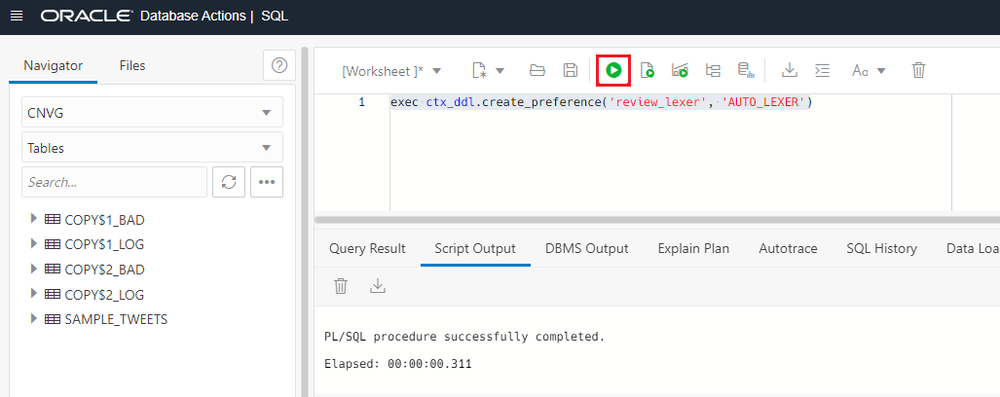
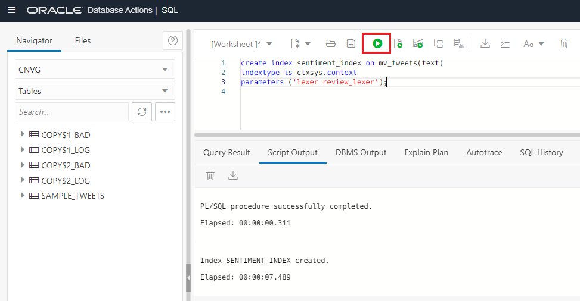
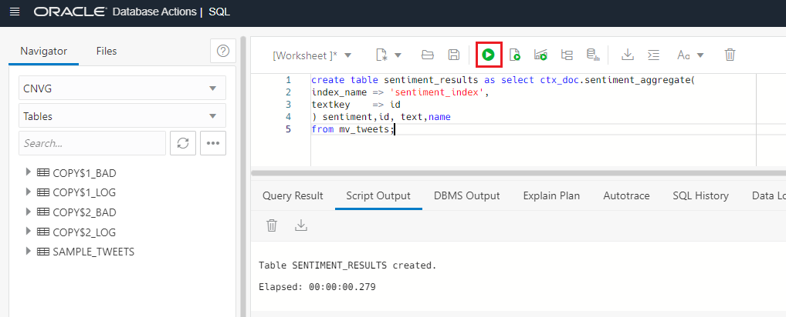
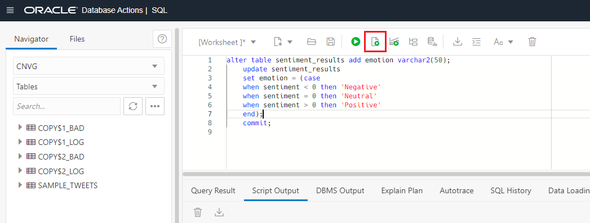
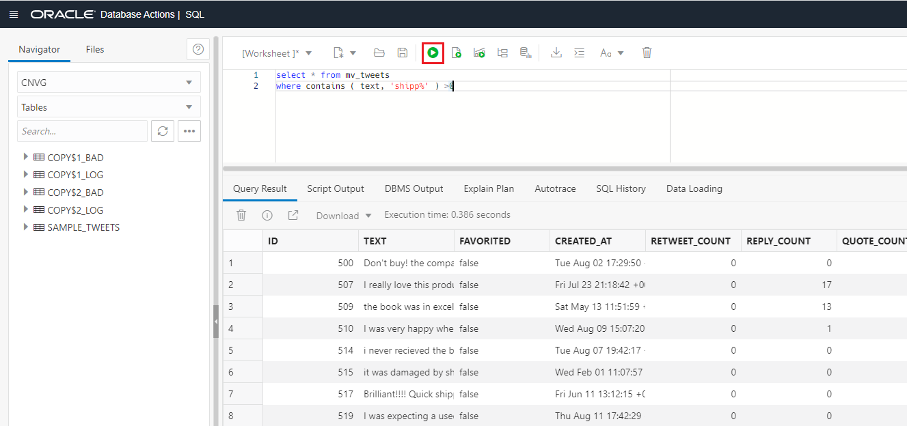

# Sentiment Analysis with Oracle Text

## Introduction

Oracle Text provides specialized text indexes for traditional full text retrieval applications such as - website searching, e-business
catalogs, document classification and routing applications, text warehousing, document libraries and archives.
Oracle Text can filter and extract content from different document formats, including popular ones like the Microsoft Office file formats, the Adobe PDF family of formats, HTML and XML.

Oracle Text enables you to perform sentiment analysis for a topic or document by using sentiment classifiers that are trained to identify sentiment metadata. We are going to use this feature to categorize the sentiment of each tweet. 

Estimated Lab Time: 15 minutes.

### Objectives

In this lab, you will:

* Create a Oracle Text Index
* Get sentiment from text
* Search over text


### Prerequisites

This lab assumes you have created the Autonomous Data Warehouse database and you have loaded the JSON tweets from Lab 2.

## Task 1: Create materialized view over JSON data

1. Before we create the Oracle Text index, we are going to create a **materialized view**. We are going to take advantage of the JSON utilities. Click on **New Collection View**.

    

2. Click **Add All** to add all the columns to the view.

    

3.  Click on **Test Query**.

    

4. **Copy** the view definition.

    

5. Click **Close**.

    

6. Go back to **SQL**.

    

7. **Paste** the SQL we got from JSON.

    

8. **Add the create materialized view statement** at the beginning of the query, like in the screenshot:

    ```
        <copy> 
            create materialized view mv_tweets as 
        </copy>
    ```

    

9. Click on the **Run** button to create the materialized view.

    Check that the **MV_TWEETS Materialized view has being created**.

    

10. Let's create a **primary key over our materialized view**. We will need it for our Oracle Text index. Click on the **Run** button to alter the table.

    ```
        <copy> 
            ALTER TABLE mv_tweets ADD CONSTRAINT mv_tweets_pk PRIMARY KEY (id);
        </copy>
    ```
    
    Check that **statement has being completed successfully**.

    

## Task 2: Create Oracle Text index

1. Let's create the **lexer**. You can create your own lexer to train and classify the tweets based on the content. In this exercise we are going to use the default one. Click on the **Run** button to execute the statement.

    ```
        <copy> 
            exec ctx_ddl.create_preference('review_lexer', 'AUTO_LEXER')
        </copy>
    ```

    Check that the **statement has being completed successfully**.

    

2. Let's create the **Oracle Text index**. Click on the **Run** button to execute the statement.

    ```
        <copy> 
            create index sentiment_index on mv_tweets(text)
            indextype is ctxsys.context 
            parameters ('lexer review_lexer');
        </copy>
    ```
    
    Check that the **statement has being completed successfully**.

    

## Task 3: Get sentiment analysis

1. As we have our index created, let's have a look to the **sentiment**. Click on the **Run** button to execute the statement.

    ``` 
        <copy> 
            select ctx_doc.sentiment_aggregate(
            index_name => 'sentiment_index',
            textkey    => id 
            ) sentiment,id, text
            from mv_tweets;
        </copy>
    ```
    
    

2. Let's **store the result into a table**. Click on the **Run** button to execute the statement.

    ```
        <copy> 
            create table sentiment_results as select ctx_doc.sentiment_aggregate(
            index_name => 'sentiment_index',
            textkey    => id 
            ) sentiment, id, text, name
            from mv_tweets;
        </copy>
    ```
    
    Check that the **statement has being completed successfully**.

    

3. Let's **add some metadata**, to identify easier which comment is negative, neutral or positive. Be sure you **Run the script** and not just statement this time, otherwise you will not modify the table at all.

    ```
        <copy> 
            alter table sentiment_results add emotion varchar2(50);
            update sentiment_results
            set emotion = (case
                when sentiment < 0 then 'Negative'
                when sentiment = 0 then 'Neutral'
                when sentiment > 0 then 'Positive'
                end
            );
            commit;
        </copy>
    ```

    Check once more that the **alter, update and commit statements has being completed successfully**.

    

4. Finally, let's look for tweets that contain the word **ship**. We will look for all the tweets related to the shipping. Click on the **Run** button to execute the statement.

    ```
        <copy> 
            select * from mv_tweets
            where contains ( text, 'shipp%' ) >0
        </copy>
    ```

    

You can **proceed to the next lab.**

## Acknowledgements
* **Author** - Javier de la Torre, Principal Data Management Specialist
* **Contributors** - Priscila Iruela, Technology Product Strategy Director
* **Last Updated By/Date** - Javier de la Torre, Principal Data Management Specialist, November 2024


