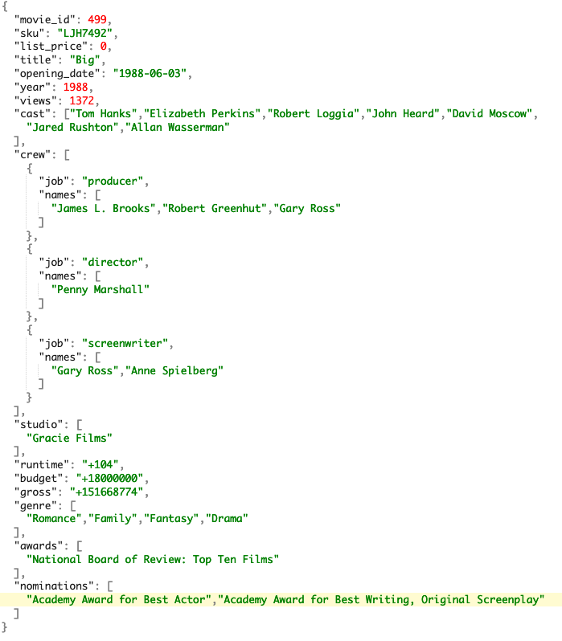

# Analyze movie sales data

## Introduction
Data is stored in many different types and places. In this lab, you will use SQL to analyze that data from your Autonomous Database.

The MovieStream data warehouse uses an design approach called a 'star schema'. A star schema is characterized by one or more very large fact tables that contain the primary information in the data warehouse and a number of much smaller dimension tables (or lookup tables), each of which contains information about the entries for a particular attribute in the fact table.


The main advantages of star schemas are that they:

* Offer a direct and intuitive mapping between the business entities being analyzed by end users and the schema design.
* Offer highly optimized performance for typical data warehouse queries.

In our example:
* Customer, time, genre and customer sales data is stored in optimized Autonomous Database tables
* Movie data is stored in JSON format on Oracle Object Storage
* Customer addresses have a latitude and longitude location - enabling spatial analyses

You will use Oracle SQL to seamlessly blend these sources and apply specialized algorithms to uncover meaningful insights.

Estimated time: 10 minutes

Watch the video below for a quick walk-through of the lab.

<!--[](youtube:lgug4o8qqB8)-->
[Use Data Tools to create a user and load data](videohub:1_bgf4qczp)

### Objectives

- Understand how to use SQL Worksheet
- Find important customers with binning
- Save queries as database views
- Find local pizza shops using spatial analytics
- Query complex JSON files
- Combine all of the above!

### Prerequisites
- This lab requires completion of Labs 1 and 2 in the Contents menu on the left.

## Task 1: Log into the SQL Worksheet
[](include:adb-connect-with-sql-worksheet-body.md)


## Task 2: Use filters and joins

You will use filters and joins in nearly every query you run. Let's take a look at an example.

1. What are our most popular genres in 2020?

    To answer this question, the SQL query requires a *join* and *filters*:
    * The **GENRE** table is combined with the **CUSTSALES** table using an inner join. An inner join requires a match between columns across tables in order for a row to return ([check out the documentation](https://docs.oracle.com/en/database/oracle/oracle-database/19/sqlrf/Joins.html#GUID-39081984-8D38-4D64-A847-AA43F515D460) for more information about joins). Here, the genre name is selected from the GENRE table when the genre_id's match across the **GENRE** and **CUSTSALES** tables.
    * The **COUNT** function is used to accumulate the number of rows that match the condition.
    * A filter is applied to the **DAY\_ID** column to only retrieve rows for *2020*. Because **DAY\_ID** field is a date field, the year is extracted using the **TO\_CHAR** function. Oracle SQL provides hundreds of useful functions for operating on data.

    Copy this code snippet:

    ```
    <copy>SELECT
        g.name,
        count(c.genre_id)    
    FROM custsales c, genre g
    WHERE to_char(day_id, 'YYYY') = '2020'
    AND g.genre_id = c.genre_id
    GROUP BY g.name
    ORDER BY 1;</copy>
    ```

    In the SQL Worksheet, paste in this code and run it using the **Run Statement** button. The result will look like this:

    

    *elapsed: 1.427s*  (your time may vary)


2. Now simply run the query again.

    

    *elapsed: 0.141s*  (your time may vary)

    This time the query ran much faster, taking just 0.141 seconds! So what happened?

    When we executed the query the first time, Autonomous Database executed the query against our movie sales table and scanned all the rows. It returned the result of our query to our worksheet and then it stored the result in something called a result cache. When we then ran the same query again, Autonomous Database simply retrieved the result from its result cache! No need to scan all the rows again. This saved a lot of time and saved us money because we used hardly any compute resources.

## Task 3: Save queries as views
There are certain queries that you will execute frequently. It can be really useful to create database views when queries join several tables, apply multiple functions and aggregations. A view is a database object that can be thought of as a saved query; the view's defining query is executed with each invocation. However, a view appears to users and applications like a table. Much like a table, the view is named, has columns and supports fine grained access controls.

1. In a SQL Worksheet, copy and execute the following script to create a view:  

    ```
    <copy>
    create or replace view sales_dashboard as
    select
        ce.last_name,
        ce.first_name,
        cs.short_name as customer_segment,
        ce.income_level,
        case
            when age > 75 then 'Silent Generation'
            when age between 57 and 75 then 'Boomer'
            when age between 41 and 56 then 'Gen X'
            when age between 25 and 40 then 'Millenials'
            when age between 9 and 24 then 'Gen Z'
            end as age_range,
        cc.country,
        cc.city,
        cc.loc_lat as latitutde,
        cc.loc_long as longitude,
        c.day_id,
        g.name genre,
        1 as views,
        actual_price as sales        
    from customer_extension ce, custsales c, genre g, customer_segment cs, customer_contact cc
    where ce.cust_id = c.cust_id
      and ce.cust_id = cc.cust_id
      and g.genre_id = c.genre_id
      and ce.segment_id = cs.segment_id;
    </copy>
    ```

2. Let's look at sales across our customer segments. Copy and paste the following SQL into the worksheet and click **Run Script**:

    ```
    <copy>
    select
        customer_segment,
        round(sum(sales), 0)
    from sales_dashboard
    group by customer_segment
    order by 2 desc;
    </copy>
    ```

    Notice that the complexity of the underlying view is abstracted to the user.

    

    And, you can see that customer segment *DINKS* (Double Income No Kids) is spending the most money at MovieStream!

## Task 4: Find our most important customers

Let's now enrich our existing understanding of customer behavior by utilizing an *RFM analysis*. RFM is a very commonly used method for analyzing customer value. You will find it applied in general customer marketing, direct marketing, and retail sectors.

An RFM analysis combines the following key metrics:

* Recency: when was the last time the customer accessed the site?
* Frequency: what is the level of activity for that customer on the site?
* Monetary: how much money has the customer spent?

Customers will be categorized into 5 buckets measured (using the **NTILE** function) in increasing importance. For example, an RFM combined score of *551* indicates that the customer is in the highest tier of customers in terms of recent visits (*R=5*) and activity on the site (*F=5*), however the customer is in the lowest tier in terms of spend (M=1). Perhaps this is a customer that performs research on the site, but then decides to buy movies elsewhere!

1. Let's use RFM to find customers in a High Spend and Frequency quintile and Low Recency quintile. In other words, let's find important customers (spend a lot and frequently come to the site) that haven't been around for a while. Copy and paste the following SQL into the worksheet and click **Run Script**:

    ```
    <copy>
    with rfm as (
        SELECT cs.cust_id,
            c.last_name,
            c.first_name,
            c.country,
            c.gender,
            c.age,
            c.income_level,
            NTILE (5) over (order by sum(cs.actual_price)) AS rfm_monetary,
            NTILE (5) over (order by max(cs.day_id)) AS rfm_recency,
            NTILE (5) over (order by count(1))    AS rfm_frequency
        FROM custsales cs, customer c
        WHERE c.cust_id = cs.cust_id
        GROUP BY cs.cust_id,         
            c.last_name,
            c.first_name,
            c.country,
            c.gender,
            c.age,
            c.income_level
    )
    select *
    from rfm
    where
      rfm_monetary = 5
      and rfm_frequency = 5
      and rfm_recency <= 2
    order by rfm_monetary desc, rfm_recency asc
    fetch first 20 rows only;
    </copy>
    ```

    

    These are customers that require some tender loving care :).

## Task 5: Find pizza shops near our important customers
One of the ways to take care of our important customers is to make them a specialized offer. Everyone loves pizza, so MovieStream has partnered with pizza shops as part of a promotion.

It doesn't make sense to make a promotional offer if the pizza shop is too far away. We'll use Autonomous Database spatial analytics to not only find the nearest pizza shop but also the distance to the shop's location.

To accomplish this task, we'll take advantage of two of the many Autonomous Database spatial functions that are offered: **nearest neighbor** and **nearest neighbor distance**. You can check out the [Oracle Spatial and Graph Developer's Guide](https://docs.oracle.com/en/database/oracle/oracle-database/19/spatl/index.html) for more details about spatial analytics.

1. Use spatial SQL analytic functions to find the nearest pizza locations and their distance for selected important customers. Copy and paste the following SQL into the worksheet and click **Run**:

    ```
    <copy>
    SELECT
        a.cust_id,
        a.first_name,
        a.city as customer_city,
        a.state_province customer_state,
        b.chain,
        b.address as pizza_address,
        b.city as pizza_city,
        b.state as pizza_state,
        round( sdo_nn_distance(1), 1 ) distance_km
    FROM customer_contact a, pizza_location  b
    WHERE  sdo_nn(
            latlon_to_geometry(b.lat, b.lon),
            latlon_to_geometry(a.loc_lat, a.loc_long),
            'sdo_num_res=1 unit=KM',
            1 ) = 'TRUE'
        and a.cust_id in (1266803, 1059376, 1372976, 1067362,1044859,1250340)
    ORDER BY sdo_nn_distance(1) asc;
    </copy>
    ```

    The **sdo\_nn** Nearest Neighbor function takes a few parameters:
    * a geometry object for both the customer and pizza location (*latlon\_to\_geometry* is a custom function that returns a geometry for a latitude and longitude)
    * the number of results to return (e.g. 1)
    * the unit of measure to return (e.g. kilometers)
    * an identifier for the nearest neighbor (e.g. 1)

    The **sdo\_nn\_distance** function returns the distance for that nearest neighbor. The value "1" points to the identifier used by the nearest neighbor function.

    You will see a result similar to the following:

    

    Notice a couple of things. First, the nearest pizza location is not necessarily in the same city; the nearest neighbor is using the actual distance. Second, it's clear that this is not the right promotion for all customers. Unless Reba wants to travel over 200km for a slice!

## Task 6: What movies are people watching near me?
In the MovieStream application, there is a shelf that lists movies watched by people near you. In order to answer this question, three types of data will be combined:

* JSON data - The movie data is in JSON format stored on Oracle Object Storage. The movie data contains complex fields like lists of genres, cast members and awards.
* Spatial data - Customer locations are used to find people who are nearby.
* Sales data - Fact table that captures every movie watched by each customer.

Let's break the query into multiple parts:

1. Review movie JSON document:

    MovieStream's movie data is stored on Oracle Object Storage in a semi-structured format known as *JSON*. JSON's major benefit is that it is a self-describing, open and flexible format. Each JSON record (or document) has a set of attributes which can be both simple (basic key value pairs) or complex (e.g. arrays of objects). Not all JSON records need to have identical schemas - a feature that simplifies extensibility. It was derived from JavaScript, but many modern programming languages include code to generate and parse JSON-format data.

    Let's take a look at a movie document. Each movie has simple fields like "title", "opening_date" and "budget". Movie documents also have complex fields: a crew associated with it and that crew is comprised of jobs, such as "producer," "director," "writer," along with the names of the individuals. Each movie also has a list of award nominations and wins. An example of how this information is organized is shown below:

    

2. An Autonomous Database external table **JSON\_MOVIE\_DATA\_EXT** was defined over the movie file on object storage. The data is not stored in Autonomous Database; the data is retrieved at query time from object storage.

    Query the movie data using simple SQL by copying and pasting the following in SQL worksheet:

    ```
    <copy>
    select *
    from json_movie_data_ext
    where rownum < 10;
    </copy>
    ```

    Your results will look similar to the following, after you drag the **doc** column header wider to see more data:

    

    As you can see, the data is shown in its native JSON format; that is, there are no columns in the table for each identifier (movie_id, sku, list price, and more). So how can we query this table if there is only one column?

3. Use the dot notation within Oracle SQL query to convert the content above into a more normal looking table containing columns and rows. This approach is known as Simple Dot Notation and it looks very similar to the way we have constructed previous queries.

    ```
    <copy>
    select
        j.doc.movie_id,
        j.doc.title,
        j.doc.year,
        j.doc.genre,
        translate(j.doc.genre, '["]', ' ') as genres
    from json_movie_data_ext j
    where rownum < 10;
    </copy>
    ```

    The structured result is much easier to read and analyze:

    

    Notice that each column in the SELECT statement has three components:
    * the name of the source table - **JSON\_MOVIE\_DATA\_EXT** which is referenced using the letter m
    * the column containing our json data - **DOC**
    * the name of the json attribute - **MOVIE\_ID**, **TITLE**, **YEAR** and **GENRE**

4. We now can understand movies. Let's move on to the second part: who lives nearby our customer Roberta? Use the following spatial query to find 20 customers who live near Roberta. Copy and paste the following query into the SQL worksheet:

    ```
    <copy>
    SELECT
        a.cust_id,
        a.first_name,
        a.city,
        b.cust_id as neighbor,
        b.first_name as neighbor_name,
        b.city as neighbor_city,
        b.state_province as neighbor_state,
        round( sdo_nn_distance(1), 1 ) distance_km
    FROM customer_contact a, customer_contact  b
    WHERE a.cust_id = 1059376
     AND a.cust_id != b.cust_id
     AND sdo_nn(
           latlon_to_geometry(b.loc_lat, b.loc_long),
           latlon_to_geometry(a.loc_lat, a.loc_long),
           'sdo_num_res=20 unit=KM',
           1 ) = 'TRUE';
    </copy>
    ```
    Notice that the query joins the **CUSTOMER_CONTACT** table to itself. Then, for each customer combination, the nearest neighbor spatial function determines the 20 closest customers. Your result should look similar to the following:

    

5. Find the movies that our neighbors are watching! Combine the movie details (JSON) for our nearest neighbors (spatial) with sales activity to get the 20 most popular movies. Copy and paste the following SQL into the SQL Worksheet and click **Run Statement**:

    ```
    <copy>
    with neighbors as (
        SELECT
            b.cust_id -- the neighbor
        FROM customer_contact a, customer_contact  b
        WHERE a.cust_id = 1059376
        and a.cust_id != b.cust_id
        AND sdo_nn(
            latlon_to_geometry(b.loc_lat, b.loc_long),
            latlon_to_geometry(a.loc_lat, a.loc_long),
            'sdo_num_res=20 unit=KM',
            1 ) = 'TRUE'
    ),
    neighbors_movies as (
        select
            movie_id,
            count(*) as popularity    
        from custsales c, neighbors n -- combine sales activity with neighbors' movies
        where c.cust_id = n.cust_id
        group by movie_id  
    )
    select
        j.doc.movie_id,
        j.doc.title,
        j.doc.year,
        n.popularity,
        translate(j.doc.genre, '["]', ' ') as genres,
        translate(j.doc.cast, '["]', ' ') as starring    
    from neighbors_movies n, json_movie_data_ext j -- combine all the above!
    where n.movie_id = j.doc.movie_id
    order by popularity desc nulls last
    fetch first 10 rows only;
    </copy>
    ```
    Your result should look similar to the following:

    

    MovieStream will feed these results into their web application - providing a tailored page to each customer.

6. Close your Oracle Database Actions tab.

    Now that you're done running queries with SQL Worksheet, close your Database Actions browser tab by clicking the **x** next to the tab name.

## Summary
We answered a lot of questions in this lab. The power to use analytic functions across different data types dramatically simplifies the process. Instead of using specialized database engines for relational, spatial and JSON data - you and your applications are able to use SQL against a single, converged Autonomous Database.

You may now [proceed to the next lab](#next).

## **Acknowledgements**

- **Authors** - Marty Gubar, Oracle Autonomous Database Product Management
- **Last Updated By/Date** - Marty Gubar, September 2022
