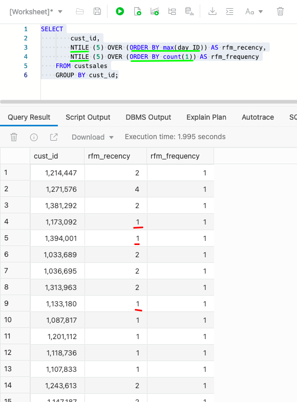

# Analyze movie sales data

## Introduction
In this lab, you will learn many of the basics for analyzing data across multiple tables. This includes using views to simplify sophisticated queries, performing time series analyses and more.

Estimated time: 10 minutes

Watch the video below for a quick walk through of the lab.

[](youtube:lgug4o8qqB8)

### Objectives

- Understand how to use SQL Worksheet

- Perform time series analyses

- Calculate rankings and shares

- Bin customers by key metrics

### Prerequisites
- This lab requires completion of Labs 1 and 2 in the Contents menu on the left.

## Task 1: Log into the SQL Worksheet
Make sure you are logged into Autonomous Database's **Database Tools** as the MOVIESTREAM user.   

1. Navigate to the Details page of the Autonomous Database you provisioned in the "Provision an ADW Instance" lab. In this example, the database name is "My Quick Start ADW." Click **Database Actions**.

    

2. Enter MOVIESTREAM for the username and click **Next**. On the next form, enter the MOVIESTREAM password - which is the one you entered when creating your MOVIESTREAM user. Click **Sign in**.

    

3. In the Development section of the Database Actions page, click the SQL card to open a new SQL worksheet:

    

4. Enter your commands in the worksheet. You can use the shortcuts [Control-Enter] or [Command-Enter] to run the command and view the Query Result (tabular format). Clear your worksheet by clicking the trash:

    

You are now ready to start analyzing MovieStream's performance using SQL.

## Task 2: Prepare the data warehouse schema
The MovieStream data warehouse uses an design approach called a 'star schema'. A star schema is characterized by one or more very large fact tables that contain the primary information in the data warehouse and a number of much smaller dimension tables (or lookup tables), each of which contains information about the entries for a particular attribute in the fact table.


The main advantages of star schemas are that they:

* Offer a direct and intuitive mapping between the business entities being analyzed by end users and the schema design.</li>
* Offer highly optimized performance for typical data warehouse queries.</li>

One of the key dimensions in the MovieStream data warehouse is **TIME**. Currently the time dimension table has a single stored column containing just the ids for each day. When doing type data warehouse analysis there is a need to view data across different levels within the time dimension such as week, month, quarter, and year. This time table was expanded using computed virtual columns that are derived from the day_id.

1. View the time dimension table.

    ```
    <copy>
    SELECT
    *  
    FROM time;</copy>
    ```

> **Note:** The TIME dimension table has a typical calendar hierarchy where days aggregate to weeks, months, quarters and years.

Querying a data warehouse can involve working with a lot of repetitive SQL. This is where 'views' can be very helpful and very powerful. The code below is used to simplify the queries used throughout this workshop. The main focus here is to introduce the concept of joining tables together to returned a combined result set.

The code below uses a technique called **INNER JOIN** to join the dimension tables to the fact table.

2. Creating a view that joins the GENRE, CUSTOMER and TIME dimension tables with the main fact table CUSTSALES.

    >**Note**: For copy/pasting, be sure to click the convenient Copy button in the upper right corner of the following code snippet, and all subsequent code snippets:

    ```
    <copy>CREATE OR REPLACE VIEW vw_movie_sales_fact AS
    SELECT
    m.day_id,
    t.day_name,
    t.day_of_week,
    t.day_of_month,
    t.day_of_year,
    t.week_of_month,
    t.week_of_year,
    t.month_of_year,
    t.month_name, 
    t.month_short_name,
    t.quarter_name,  
    t.year_name,  
    c.cust_id as customer_id,
    c.state_province,
    c.country,
    c.continent,
    g.name as genre,
    m.app,
    m.device,
    m.os,
    m.payment_method,
    m.list_price,
    m.discount_type,
    m.discount_percent,
    m.actual_price,
    m.genre_id,
    m.movie_id
    FROM custsales m
    INNER JOIN time t ON m.day_id = t.day_id
    INNER JOIN customer c ON m.cust_id = c.cust_id
    INNER JOIN genre g ON m.genre_id = g.genre_id;
    </copy>
    ```

There are lots of different types of joins you can use within a SQL query to combine rows from one table with rows in another table. Typical examples are:

### A) INNER JOIN
An inner join, which is sometimes called a simple join, is a join of two or more tables that returns only those rows that satisfy the join condition. In the example above, only rows in the sales fact table will be returned where a corresponding row for day exists in the time dimension table and a corresponding row exists in the customer dimension table and a corresponding row exists in the genre dimension table.

### B) OUTER JOIN
An outer join extends the result of a simple join. An outer join returns all rows that satisfy the join condition and also returns some or all of those rows from one table for which no rows from the other satisfy the join condition. This join technique is often used with time dimension tables since you will typically want to see all months or all quarters within a given year even if there were no sales for a specific time period. There is an example of this type of join in the next task.

## Task 3: Learn more about joins
In the previous SQL code we used an inner join to merge time, customer and genre dimensional data with the sales data. However, inner joins ignore rows in the dimension tables where there is no corresponding sales data. This means that some queries may need to use a different join method if you want to gain a deeper understanding of your sales data. Consider the following example:

1. How many news category films were viewed in 2020?

    ```
    <copy>SELECT
        g.name,
        count(m.genre_id)
    FROM (SELECT genre_id FROM vw_movie_sales_fact  WHERE year_name = '2020') m
    INNER JOIN genre g ON m.genre_id = g.genre_id
    GROUP BY g.name
    order by 1;</copy>
    ```

    The result will look like this:

    


    Unless you had a detailed knowledge of all the available genres, you would probably miss the fact that there is no row shown for the genre "News" because there were no purchases of movies within this genre during 2020. This type of analysis requires a technique that is often called "densification." This means that all the rows in a dimension table are returned even when no corresponding rows exist in the fact table. To achieve data densification we use an OUTER JOIN in the SQL query. Compare the above result with the next query.

2. Modify the above SQL to use an outer join:

    ```
    <copy>SELECT
        g.name,
        count(m.genre_id)
    FROM (SELECT genre_id FROM vw_movie_sales_fact WHERE year_name = '2020') m
    FULL OUTER JOIN genre g ON m.genre_id = g.genre_id
    GROUP BY g.name
    order by 1;</copy>
    ```

    The result will now look like this, where we can now see how many news category films were viewed in 2020:

    


    > **Note**: there is now a row for the genre "News" in the results table which shows that no news genre films were watched during 2020. When creating your own queries you will need to think carefully about the type of join needed to create the result set you need. For the majority of examples in this workshop the JOIN requirements have been captured in the sales view created above. Now that we have our time dimension defined as a view and a view to simplify SQL queries against the fact table, we can move on to how SQL can help us explore the sales data.


## Task 4: Explore sales data with fast performance

1. Next, let's use a very simple query to look at total movie sales by year and quarter, which extends the earlier simple SQL queries by adding a GROUP BY clause.

    ```
    <copy>SELECT
    year_name,
    quarter_name,
    SUM(actual_price)
    FROM vw_movie_sales_fact
    WHERE year_name = '2020'
    GROUP BY year_name, quarter_name
    ORDER BY 1,2;</copy>
    ```
    **Note**: In this query, we have returned a result set where the data has been aggregated (or grouped by) year then, within year, by quarter. The ORDER BY clause sorts the result set by year and then quarter. In addition, there is a filter or WHERE clause that enables us to return only data for the year 2020.    

    This should return something similar to the following:

    

    *elapsed: 0.495s*  (your time may vary)

    Note the time taken to run your query. In the above example, this was 1.315 seconds to run (*when you run your query the timing may vary slightly*).

2. Now simply run the query again

    

    *elapsed: 0.023*  (your time may vary)

    This time the query ran much faster, taking just 0.023 seconds! So what happened?

    When we executed the query the first time, Autonomous Data Warehouse executed the query against our movie sales table and scanned all the rows. It returned the result of our query to our worksheet and then it stored the result in something called a **result cache**. When we then ran the same query again, Autonomous Data Warehouse simply retrieved the result from its result cache! No need to scan all the rows again. This saved a lot of time and saved us money because we used hardly any compute resources.


## Task 5: Compare sales to last year

### Overview

Time comparisons are one of the most common types of analyses. MovieStream has just completed sales for December. What is the year over year comparison for this latest month? What is this breakout by movie genre? Oracle SQL has a **LAG** function that facilitates these types of analyses.  

1. Let's start by looking at sales in December for the latest two years for our major genres (we can use an INNER JOIN because there is always a current and previous year value):

    ```
    <copy>SELECT
        g.name as genre,
        TO_CHAR(c.day_id,'YYYY-MM') as month,
        ROUND(sum(c.actual_price),0) sales
    FROM  custsales c, genre g
    WHERE g.genre_id = c.genre_id
      AND to_char(c.day_id, 'MON') in ('DEC')
      AND g.name in ('Action','Drama','Comedy')
    GROUP BY to_char(c.day_id,'YYYY-MM'), c.genre_id, g.name
    ORDER BY genre, month;</copy>
    ```

    This produces the following result:

    

    This result is fine, but to simplify comparisons you want to do a side-by-side comparison of sales across the two years.  Oracle SQL analytic functions will help solve that problem.


2. The **LAG** function will allow us to compare this year vs last (or any other time comparison). In addition, we are going to leverage the SQL **WITH** clause. The **WITH** clause allows you to define in-line views - which greatly simplifies your queries by breaking a query down into smaller, understandable chunks. It's a very powerful tool to have in your toolbox. We'll be using these in-line views as "query blocks" - or named result sets that can be easily referenced. Here, we're using the **WITH** clause to set up the comparison to last year.

    ```
    <copy>WITH sales_vs_lastyear as (
    SELECT
        g.name as genre,
        TO_CHAR(c.day_id,'YYYY-MM') as month,
        ROUND(SUM(c.actual_price),0) as sales,
        LAG(ROUND(SUM(c.actual_price),0), 1) OVER (
                PARTITION BY g.name
                ORDER BY to_char(c.day_id,'YYYY-MM') ASC
            ) as last_year         
    FROM custsales c, genre g
    WHERE g.genre_id = c.genre_id
    AND to_char(c.day_id, 'MON') in ('DEC')
    AND g.name in ('Action','Drama','Comedy')
    GROUP BY TO_CHAR(c.day_id,'YYYY-MM'), c.genre_id, g.name
    ORDER BY genre, month
    )
    SELECT
        genre,
        sales as sales,
        last_year as last_year,
        sales - last_year as change
    FROM  sales_vs_lastyear
    WHERE last_year is not null
    ORDER BY round(last_year - sales) DESC;</copy>
    ```

    The subquery **sales\_vs\_lastyear** aggregates sales by genre and month for both this year and last. The **LAG** function is looking back "1" row for each genre name **PARTITION** - or grouping. The **ORDER BY** clause is critical to ensure that the prior row is indeed the prior month for that genre. The subquery is then used by the SELECT statement that calculates the sales change.

    You can see that Action and Comedy genres have shown a significant drop off. This drop off was more than offset by a large increase in Drama movies:

    

## Task 6: Understanding sales contributions

### Overview

In the MovieStream application, when customers select a movie to watch, they pick from a "shelf" that is broken out by genre. A movie may be both an adventure and comedy (and the movie table contains these details) - but the customer selected a movie via a specific genre in the application - and this genre is captured in the sales data.

Explore the movie-genre relationship.

1. Let's begin by looking at the top movie-genre combinations.

    ```
    <copy>WITH sales_by_movie_genre as (
    SELECT        
        c.movie_id,
        c.genre_id,
        round(sum(c.actual_price),0) as sales              
    FROM custsales c
    GROUP BY c.movie_id, c.genre_id
    )
    SELECT          
        m.title,  
        g.name as genre,
        sales,
        RANK () OVER ( order by sales desc ) as ranking
    FROM sales_by_movie_genre s, movie m, genre g
    WHERE g.genre_id = s.genre_id
      AND m.movie_id = s.movie_id
    ORDER BY sales desc
    FETCH FIRST 20 ROWS ONLY;</copy>
    ```

    Here are the top genre-movie combinations:

    

    Again, the query starts with a subquery `sales_by_movie_genre` which calculates the sales for the movie-genre combinations.  Then, it **RANKS** the result by `sales` for the top 20.

    There are clearly movies - like *Spider-Man: Far from Home* and *Avengers: End Game* - that are popular across genres. No matter what shelf they're on - people find and watch them! Of course, this leads to more questions. How important is a movie to its genre(s)? What are the most popular way that people are finding movies?

2. Let's answer the second question - What are the most popular ways that people find movies that appear in multiple genres.

    ```
    <copy>WITH top_movies AS (
    -- top movies
    SELECT c.movie_id,           
           SUM(c.actual_price) as sales
    FROM custsales c
    GROUP BY c.movie_id
    ORDER BY 2 DESC
    FETCH FIRST 20 ROWS ONLY
    ),
    genre_ranking_by_movie as (
        -- rank the genres for the top 10 movies
        SELECT
            t.movie_id,
            c.genre_id,
            ROUND(SUM(c.actual_price), 0) as sales,
            RANK () OVER ( PARTITION BY t.movie_id ORDER BY sum(c.actual_price) DESC ) as ranking
        FROM top_movies t, custsales c
        WHERE t.movie_id = c.movie_id
        GROUP BY t.movie_id, c.genre_id    
    )
    SELECT m.title as movie,
        g.name as genre,
        r.sales,
        r.ranking,
        ROUND(RATIO_TO_REPORT (sales) OVER (PARTITION BY m.title), 2) as ratio
    FROM genre_ranking_by_movie r, movie m, genre g
    WHERE r.movie_id = m.movie_id
    AND r.genre_id = g.genre_id
    AND ranking <= 3
    ORDER BY movie, ranking; </copy>
    ```
    The result is shown below:

    

There were a few changes to this query.  First, there is a suquery that finds the top movies. The second suquery uses that as a source to rank the movie-genre combinations.  Notice, **RANK** has been updated to include a **PARTITION BY** in order to rank the top genres by movie.  Finally, the query adds a **RATIO\_TO\_REPORT** in order to easily view that genre's contribution relative to the other top genres.

The result appears to show that - at least for best selling movies - people select the movie with an equivalent distribution across genres.

## Task 7: Finding our most important customers

### Overview
Let's pivot and look at customers.

This final example will enrich our existing understanding of customer behavior by utilizing an RFM analysis. RFM is a very commonly used method for analyzing customer value. It is commonly used in general customer marketing, direct marketing, and retail sectors.

In the following steps, the scripts will build a SQL query that will identify:

- Recency: when was the last time the customer accessed the site?

- Frequency: what is the level of activity for that customer on the site?

- Monetary: how much money has the customer spent?

Customers will be categorized into 5 buckets measured (using the NTILE function) in increasing importance. For example, an RFM combined score of 551 indicates that the customer is in the highest tier of customers in terms of recent visits (R=5) and activity on the site (F=5), however the customer is in the lowest tier in terms of spend (M=1). Perhaps this is a customer that performs research on the site, but then decides to buy movies elsewhere!

1.  Binning customers' sales by value

    Use the following query to segment customers into 5 distinct bins based on the value of their purchases:

    ```
    <copy>SELECT
        m.cust_id,
        c.first_name||' '||c.last_name as cust_name,
        c.country,
        c.gender,
        c.age,
        c.income_level,
        NTILE (5) OVER (ORDER BY SUM(m.actual_price)) AS rfm_monetary
    FROM custsales m
    INNER JOIN customer c ON c.cust_id = m.cust_id
    GROUP BY m.cust_id,
        c.first_name||' '||c.last_name,
        c.country,
        c.gender,
        c.age,
        c.income_level
    ORDER BY m.cust_id,
    c.first_name||' '||c.last_name,
    c.country,
    c.gender,
    c.age,
    c.income_level;</copy>
    ```
    Below is a snapshot of the result (and your result may differ):

    


    The last column in the report shows the "Bin" value. A value of 1 in this column indicates that a customer is a low spending customer and a value of 5 indicates that a customer is a high spending customer. For more information about using the `NTILE` function, see [the SQL documentation](https://docs.oracle.com/en/database/oracle/oracle-database/19/sqlrf/NTILE.html#GUID-FAD7A986-AEBD-4A03-B0D2-F7F2148BA5E9).

2.  Binning customer sales by frequency

    The next step is to determine how frequently customers are watching movies on our platform. To do this, we simply calculate the number of movies watched by each customer and then bin that calculation across 5 buckets.

    ```
    <copy>SELECT
        cust_id,
        NTILE (5) OVER (ORDER BY max(day_ID)) AS rfm_recency,
        NTILE (5) OVER (ORDER BY count(1)) AS rfm_frequency
    FROM custsales
    GROUP BY cust_id;</copy>
    ```
    This should return a result similar to the following (again, your results may differ):

    

    Now we can categorize customers based on when they last watched a movie (rfm\_recency) and how frequently they viewed movies (rfm\_frequency).

3.  Create an RFM query

    Now we use the **`WITH`** clause to combine these two queries to create an RFM query:

    ```
    <copy>WITH rfm AS (
    SELECT
        m.cust_id,
        NTILE (5) OVER (ORDER BY max(day_id)) AS rfm_recency,
        NTILE (5) OVER (ORDER BY count(1)) AS rfm_frequency,
        NTILE (5) OVER (ORDER BY SUM(m.actual_price)) AS rfm_monetary
    FROM custsales m
    GROUP BY m.cust_id
    )
    SELECT
        r.cust_id,
        c.first_name||' '||c.last_name AS cust_name,
        r.rfm_recency,
        r.rfm_frequency,
        r.rfm_monetary,
        c.country,
        c.gender,
        c.age,
        c.income_level
    FROM rfm r
    INNER JOIN customer c ON c.cust_id = r.cust_id
    WHERE r.rfm_monetary >= 5
      AND r.rfm_recency = 1
    ORDER BY r.rfm_monetary desc, r.rfm_recency desc;</copy>
    ```
    The result only shows customers who have history had significant spend (equal to 5) but have not visited the site recently (equal to 1).  MovieStream does not want to lose these important customers!

    


### Recap
We covered alot of ground in this lab. You learned how to use different types of analytic functions, time series functions and subqueries to answer important questions about the business.
These features include:

- Different ways of joining tables

- Time-series functions

- Analytic functions to calculate contribution (**RATIO\_TO\_REPORT** and **RANK**)

- **NTILE** binning functions that helps categorize customer sales and activity

Subsequent labs will showcase other types of database analytics that are equally if not more powerful.

You may now [proceed to the next lab](#next).

## **Acknowledgements**

- **Authors** - Keith Laker and Marty Gubar, Oracle Autonomous Database Product Management
- **Adapted for Cloud by** - Richard Green, Principal Developer, Database User Assistance
- **Last Updated By/Date** - Richard Green, November 2021
