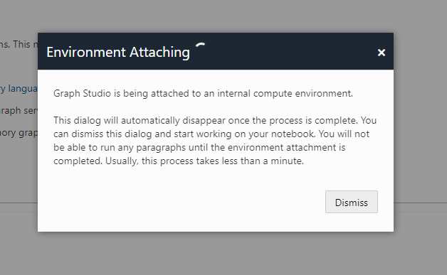

# Use graph analytics to recommend movies

## Introduction

#### Video Preview

<!---->

In this lab, you will use Oracle Graph analytics to detect and create customer communities based on movie viewing behavior. Once you've created communities - make recommendations based on what your community members have watched.

Estimated Time: 10 minutes

Watch the video below for a quick walk-through of the lab.
[Use graph analytics to recommend movies](videohub:1_ret5ywcn)

### About graph
When you model your data as a graph, you can run graph algorithms to analyze connections and relationships in your data. You can also use graph queries to find patterns in your data, such as cycles, paths between vertices, anomalous patterns, and others. Graph algorithms are invoked using a Java or Python API, and graph queries are run using PGQL (Property Graph Query Language, see [pgql-lang.org](https://pgql-lang.org)).

In this lab you will create a graph from the tables MOVIE, CUSTOMER\_SAMPLE, and WATCHED. MOVIE and CUSTOMER\_SAMPLE are vertex tables (every row in these tables becomes a vertex). WATCHED connects the two tables, and is the edge table. Every time a customer in CUSTOMER\_SAMPLE watches a movie in the table MOVIE, that is an edge in the graph. 

You have the choice of over 60 pre-built algorithms when analyzing a graph. In this lab you will use the **Personalized SALSA** algorithm, which is a good choice for product recommendations. Customer vertices map to *hubs* and movies map to *authorities*. Higher hub scores indicate a closer relationship between customers. Higher authority scores indicate that the vertex (or movie) is plays a more important role in establishing that closeness.

### Objectives

In this lab, you will use the Graph Studio feature of Autonomous Database to:
* Create a movie recommendations graph
* Use a notebook
* Run a few PGQL graph queries
* Use python to run Personalized SALSA from the algorithm library
* Query and save the recommendations

### Prerequisites

- This lab requires completion of Lab 1 (or the optional Labs 2 & 3).

## Task 1: Log into Graph Studio

## Task 2: Create a Movie Recommendations graph

## Task 3: Use a notebook to run graph queries and graph analytics

 You can import a notebook that has the graph queries and analytics. Each paragraph in the notebook has an explanation.  You can review the explanation, and then run the query or analytics algorithm.   

[Click here to download the notebook](./files/movie_recommendations_psalsa.dsnb) and save it to a folder on your local computer.  This notebook includes graph queries and analytics for the MOVIE_RECOMMENDATIONS graph.

 1. Import a notebook by clicking on the notebook icon on the left, and then clicking on the **Import** icon on the far right.

    

 Click on the + sign and navigate to the folder where you just downloaded the notebook.  Select the notebook and click **Import**.

    

 A dialog pops up named **Environment Attaching**. It will disappear when the compute environment finishes attaching, usuallly in less than one minute. Or you can click **Dismiss** to close the dialog and start working on your environment. Note that you will not be able to run any paragraph until the environment finishes attaching.

    

 2. Review the description before each paragraph.   Review the graph queries and analytics.   You can then run the query by clicking on the triangle on the top right if you would like to do so.  Below is an example of running a query in a paragraph.  

     

 You can click on the **Settings** icon to change the visualization parameters.

     

     

## Learn more

* [LiveLabs](https://livelabs.oracle.com/pls/apex/dbpm/r/livelabs/view-workshop?wid=758&clear=180&session=900372122498)
* [Documentation](https://docs.oracle.com/en/cloud/paas/autonomous-database/serverless/adbsb/graph-autonomous-database.html)
* [Get Started](https://www.oracle.com/autonomous-database/graph/get-started/)
* [Webpage](https://www.oracle.com/database/graph/)

## Acknowledgements
* **Author** - Melli Annamalai, Product Manager, Oracle Spatial and Graph
* **Contributors** -  Jayant Sharma
* **Last Updated By/Date** - Rick Green, Database User Assistance, September 2022
