# Find the closest pizza shops with Oracle Spatial

## Introduction

#### Video Preview

[](youtube:kFB9C36oIaw)

Time to run a promotion to help keep our at-risk customers. Run a localized promotion by finding these customers' local pizza locations using Oracle Spatial's nearest neighbor algorithm.

To reduce customer churn, our business has partnered with a pizza chain to offer coupons for free pizza. The promotion will be offered to customers identified as both likely to churn and within reasonable proximity to a pizza chain location. Likelihood to churn is covered in Lab 4 (Using Oracle Machine Learning AutoML UI to Predict Churn). In this lab you determine which customers are near one or more pizza chain locations, and for those customers, which location is the closest. Specifically, we will answer the following question: "For customers that are within 10km of pizza chain location(s), which is the closest and what is the distance?"

Estimated Time: 10 minutes

### About product/technology

Oracle Database, including Oracle Autonomous Database, provides native support for spatial data management, analysis, and processing. Oracle Database stores spatial data (points, lines, polygons) in a native data type called SDO_GEOMETRY. Oracle Database also provides a native spatial index for high performance spatial queries. This spatial index relies on spatial metadata that is entered for each geometry column storing spatial data. Once spatial data is populated and indexed, robust APIs are available to perform spatial analysis, calculations, and processing. A self-service web application, Spatial Studio, is also available for no-code access to the Spatial features of Oracle Database.

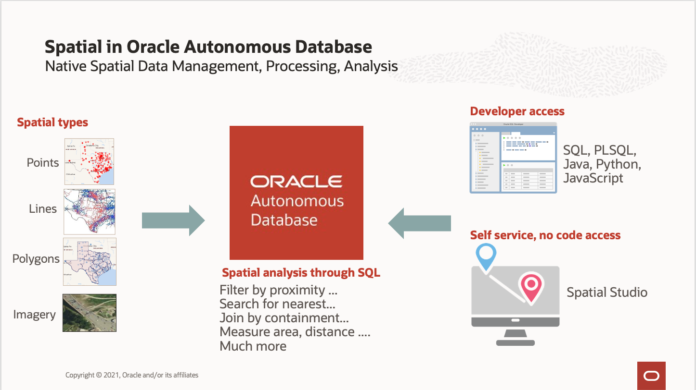

For a hands-on general introduction, you are encouraged to review **[Introduction to Oracle Spatial Workshop] (https://livelabs.oracle.com/pls/apex/dbpm/r/livelabs/view-workshop?wid=736)**


### Objectives

In this lab, you will:
- Perform spatial queries to identify the nearest pizza location to customers


### Prerequisites

- This lab requires completion of Labs 1&ndash;2 in the Contents menu on the left.

## Task 1: Open a SQL Worksheet

In this lab you will run a series of SQL queries as the MOVIESTREAM user. You concluded Lab 2 by running a script in a SQL Worksheet to load data as the MOVIESTREAM user. You may return to that SQL Worksheet to perform this Lab. If that Worksheet was closed then open a new SQL Worksheet.

1. Navigate to the Details page of the Autonomous Database you provisioned in the "Provision an ADW Instance" lab. In this example, the database name is "My Quick Start ADW." Click the **Database Actions** button.

    

2. Enter MOVIESTREAM for the username and click **Next**. On the next form, enter the MOVIESTREAM password - which is the one you entered when creating your MOVIESTREAM user. Click **Sign in**.

    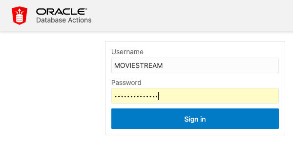

3. In the Development section of the Database Actions page, click the SQL card to open a new SQL worksheet:

    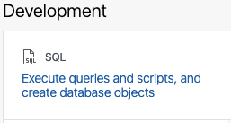

4. Enter your commands in the worksheet. You can use the shortcuts [Control-Enter] or [Command-Enter] to run the command and view the Query Result (tabular format). Clear your worksheet by clicking the trash:

    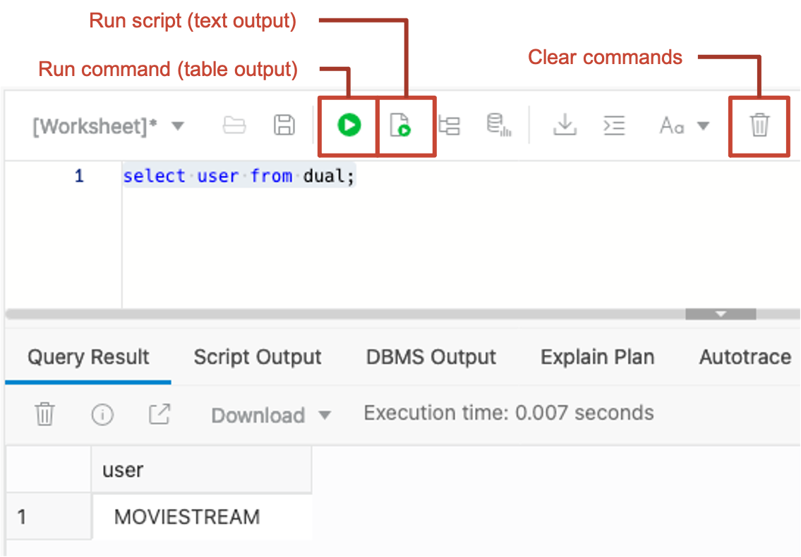

You are now ready to find the closest pizza shops to MovieStream customers using SQL.


## Task 2: Run spatial queries

Oracle Autonomous Database provides an extensive SQL API for spatial analysis. This includes spatial relationships, measurements, aggregations, transformations, and more. In this lab you focus on one of those spatial analysis operations, "nearest neighbor" analysis. Nearest neighbor analysis refers to identifying which item(s) are nearest to a location.

The nearest neighbor SQL operator is called ```sdo_nn( )``` and it has the general form:

```
sdo_nn(
geometry1, --geometry in a table
geometry2, --geometry in a table or dynamically defined
parameters --how many nearest neighbors to return
)
```
and returns the item(s) in ```geometry1``` that are nearest to ```geometry2```.

In this lab, instead of creating geometry columns you are using your ```latlon_to_geometry( )``` function to return geometries, so that function will be used to feed geometry to the ```sdo_nn( )``` operator.

There are 2 scenarios for a nearest neighbor query: search all items for nearest neighbor(s), or search only a subset of items. Using pizza locations as an example for these scenarios:

- Scenario 1: Search for nearest pizza location where every pizza location is a candidate for the result.

- Scenario 2: Search for nearest pizza location that offers gluten-free, where availability of gluten-free at pizza locations is identified using a SQL predicate such as gluten\_free\_available='yes'.

This lab is based on scenario 1. Scenario 2 requires a slightly different syntax for the nearest neighbor SQL operator and adds some complexity to queries at the end of this section. For details on the distinction between these scenarios and the associated syntax, please see the **[nearest neighbor documentation](https://docs.oracle.com/en/database/oracle/oracle-database/19/spatl/spatial-operators-reference.html#GUID-41E6B1FA-1A03-480B-996F-830E8566661D)**.


1. Begin with a **nearest neighbor query**, which returns item(s) nearest to a specific location. Run the following query to identify the pizza location nearest to customer 1029765.

    ```
    <copy>
    SELECT b.chain, b.address, b.city, b.state
    FROM customer_contact a, pizza_location b
    WHERE a.cust_id = 1029765
    AND sdo_nn(
         latlon_to_geometry(b.lat, b.lon),
         latlon_to_geometry(a.loc_lat, a.loc_long),
         'sdo_num_res=1') = 'TRUE';
    </copy>
    ```

    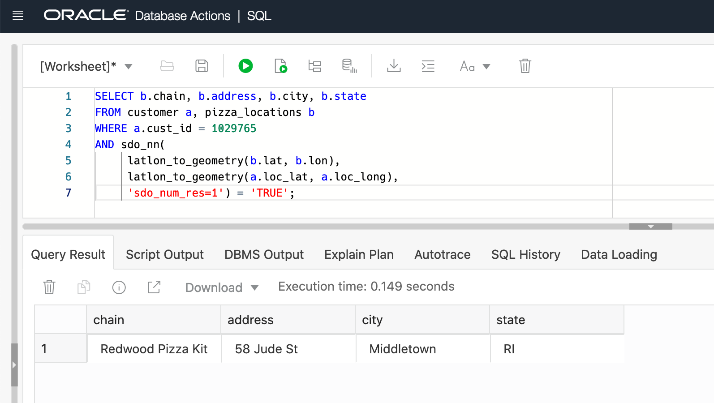

2. To return the 5 nearest pizza locations, update the sdo\_num\_res parameter from 1 to 5 and re-run.

    ```
    <copy>
    SELECT b.chain, b.address, b.city, b.state
    FROM customer_contact a, pizza_location b
    WHERE a.cust_id = 1029765
    AND sdo_nn(
         latlon_to_geometry(b.lat, b.lon),
         latlon_to_geometry(a.loc_lat, a.loc_long),
         'sdo_num_res=5') = 'TRUE';
    </copy>
    ```

    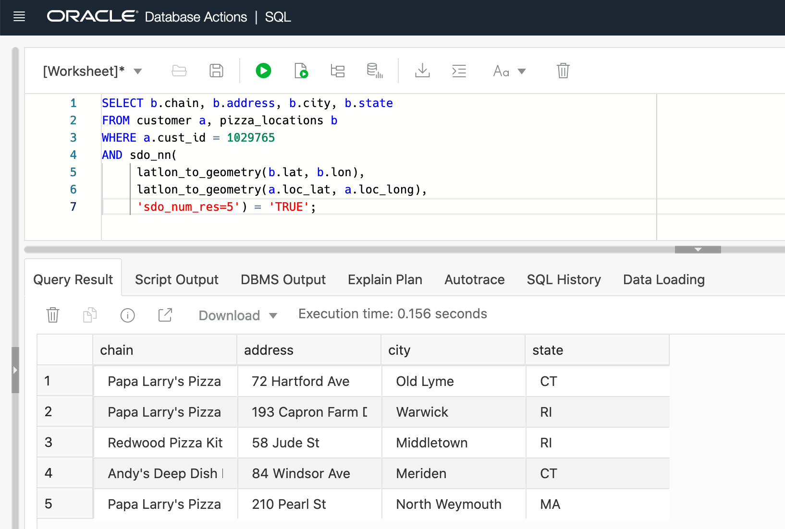

3. A **nearest neighbor with distance** query augments the nearest locations with their distance. A numeric placeholder value is added as a final parameter to sdo\_nn, and the same placeholder value is used as the parameter to sdo\_nn\_distance( ) in the select list. Run the following query to identify the pizza location nearest to customer 1029765 along with its distance (rounded to 1 decimal place).

    ```
    <copy>
    SELECT b.chain, b.address, b.city, b.state,
           round( sdo_nn_distance(1), 1 ) distance_km
    FROM customer_contact a, pizza_location  b
    WHERE a.cust_id = 1029765
    AND sdo_nn(
         latlon_to_geometry(b.lat, b.lon),
         latlon_to_geometry(a.loc_lat, a.loc_long),
         'sdo_num_res=1 unit=KM',
         1 ) = 'TRUE';
    </copy>
    ```

    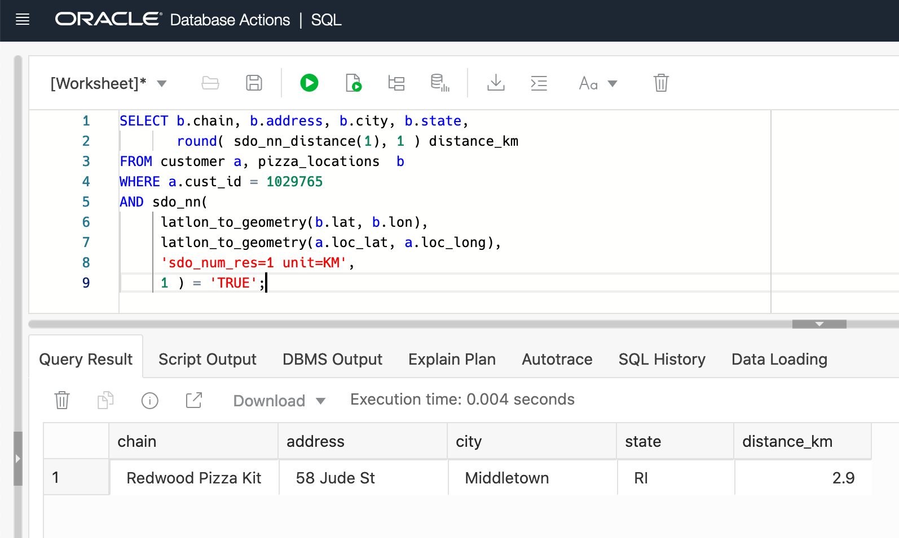

4. To return the 5 nearest pizza locations with distance, update the sdo\_num\_res parameter from 1 to 5 and re-run. Notice the addition of ORDER BY to order results by distance.

    ```
    <copy>
    SELECT b.chain, b.address, b.city, b.state,
           round( sdo_nn_distance(1), 1 ) distance_km
    FROM customer_contact a, pizza_location  b
    WHERE a.cust_id = 1029765
    AND sdo_nn(
         latlon_to_geometry(b.lat, b.lon),
         latlon_to_geometry(a.loc_lat, a.loc_long),
         'sdo_num_res=5 unit=KM',
         1 ) = 'TRUE'
    ORDER BY distance_km;
    </copy>
    ```

    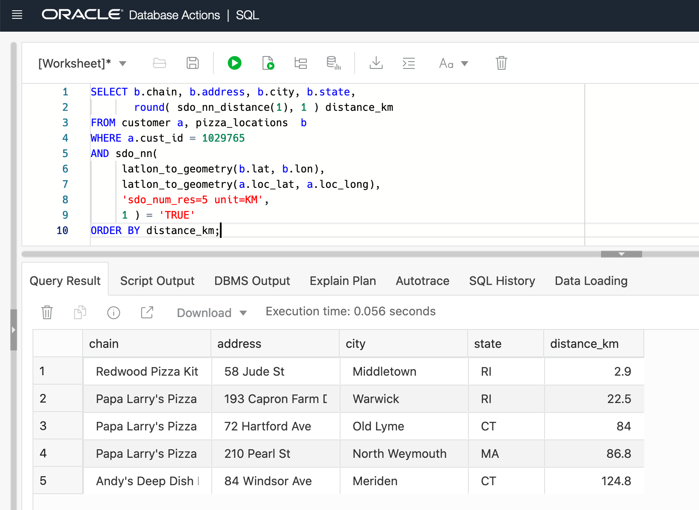


5. The previous queries identified pizza locations nearest to a single customer location (that is, customer 1019429). You can also use the sdo_nn( ) operator to identify the nearest pizza location for a set of customer locations. This is a **nearest neighbor join**, where pizza and customer locations are joined based on the nearest neighbor relationship. Run the following query to identify the nearest pizza location for all customers in Rhode Island.

    ```
    <copy>
    SELECT a.cust_id, b.chain, b.address, b.city, b.state,
           round( sdo_nn_distance(1), 1 ) distance_km
    FROM customer_contact a, pizza_location b
    WHERE a.state_province = 'Rhode Island'
    AND sdo_nn(
         latlon_to_geometry(b.lat, b.lon),
         latlon_to_geometry(a.loc_lat, a.loc_long),
         'sdo_num_res=1 unit=KM',
         1 ) = 'TRUE';
    </copy>
    ```

    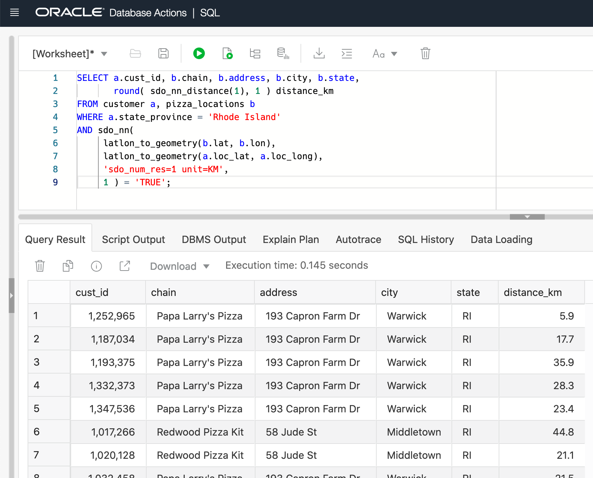

6. An important feature of the sdo\_nn( ) operator is the ability to set a maximum distance threshold. Nearest neighbors are not computed if they are beyond the distance threshold. With customers located across the globe and pizza partner locations only in the eastern United States, it is important to avoid unnecessary computations for customers too far from the nearest pizza location. Run the following query which sets a maximum distance threshold of 3km.

    ```
    <copy>
    SELECT a.cust_id, b.chain, b.address, b.city, b.state,
          round( sdo_nn_distance(1), 1
          ) distance_km
    FROM customer_contact a, pizza_location b
    WHERE a.state_province = 'Rhode Island'
    AND sdo_nn(
         latlon_to_geometry(b.lat, b.lon),
         latlon_to_geometry(a.loc_lat, a.loc_long),
         'sdo_num_res=1 distance=3 unit=KM',
         1 ) = 'TRUE';
    </copy>
    ```

    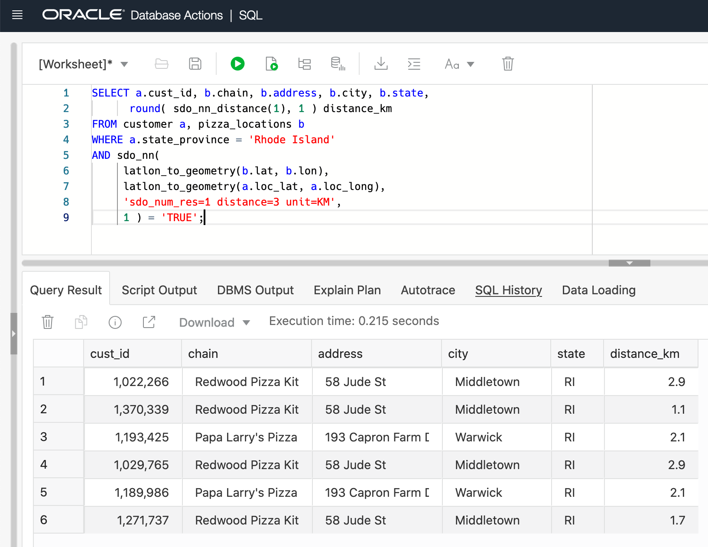

    In the above query, supplying a maximum distance parameter is preferred over adding a predicate on ```distance_km```. This is because the distance parameter specifies no search for nearest items beyond the distance threshold, while a distance predicate searches all for nearest items, calculates distances, and then filters.

7. Adjust the maximum distance threshold from 3km to 10km and observe the results change.

    ```
    <copy>
    SELECT a.cust_id, b.chain, b.address, b.city, b.state,
           round( sdo_nn_distance(1), 1 ) distance_km
    FROM customer_contact a, pizza_location b
    WHERE a.state_province = 'Rhode Island'
    AND sdo_nn(
         latlon_to_geometry(b.lat, b.lon),
         latlon_to_geometry(a.loc_lat, a.loc_long),
         'sdo_num_res=1 distance=10 unit=KM',
         1 ) = 'TRUE';
    </copy>
    ```

    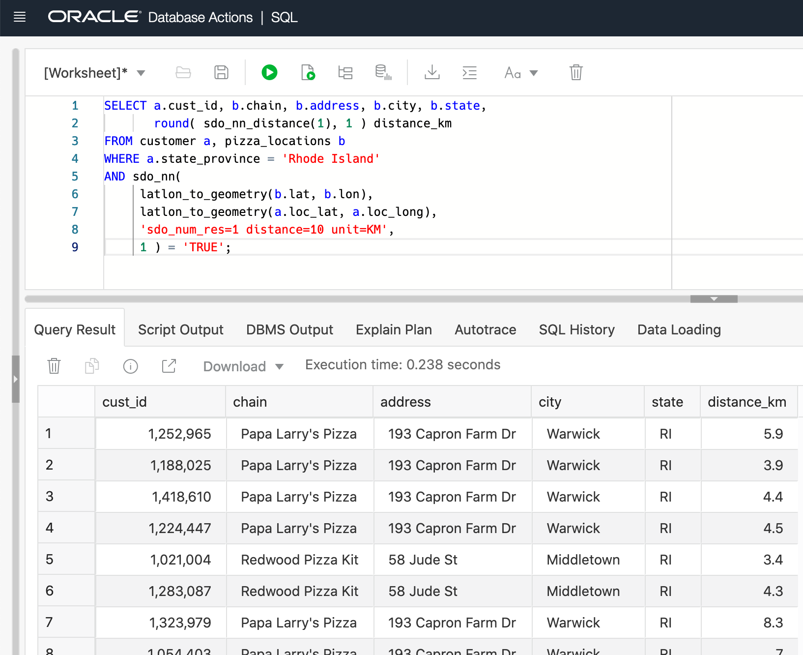

8. You are now ready to identify the nearest pizza partner location for all customers. This promotion is designed to be run as a national campaign in the United States, so the pizza locations we're using in this exercise are restricted to that market. Run the following query to identify the nearest pizza locations using a maximum search distance of 10km.

    ```
    <copy>
    SELECT a.cust_id, b.chain, b.address, b.city, b.state,
           round( sdo_nn_distance(1), 1 ) distance_km
    FROM customer_contact a, pizza_location b
    WHERE a.country = 'United States'
    AND sdo_nn(
         latlon_to_geometry(b.lat, b.lon),
         latlon_to_geometry(a.loc_lat, a.loc_long),
         'sdo_num_res=1 distance=10 unit=KM',
         1 ) = 'TRUE';
    </copy>
    ```

    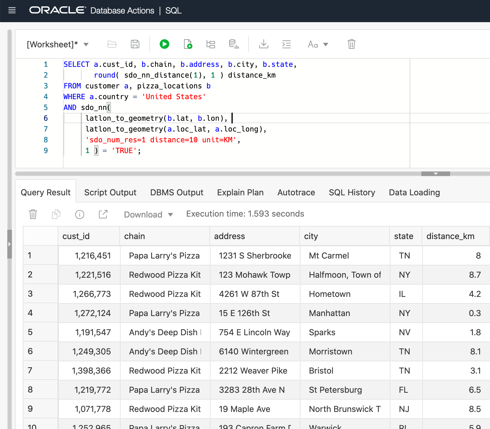

9. Create a table from this result so that it can be joined with Machine Learning churn predictions. From this combination of results, a promotion can be created.

    ```
    <copy>
    CREATE TABLE customer_nearest_pizza
    AS
    SELECT a.cust_id, b.chain, b.address, b.city, b.state,
           round( sdo_nn_distance(1), 1 ) distance_km
    FROM customer_contact a, pizza_location b
    WHERE a.country = 'United States'
    AND sdo_nn(
         latlon_to_geometry(b.lat, b.lon),
         latlon_to_geometry(a.loc_lat, a.loc_long),
         'sdo_num_res=1 distance=10 unit=KM',
         1 ) = 'TRUE';
    </copy>
    ```

###Performance and scaling
Parallel processing is a powerful capability of Oracle Database for high performance and scalability. Parallelized operations are spread across database server processors, where performance generally increases linearly with the "degree of parallelism" (DOP). DOP can be thought of as the number of processors that the operation is spread over. Many spatial operations of Oracle database support parallel processing, including nearest neighbor.

In customer-managed (non-Autonomous) Oracle Database, the degree of parallelism is set using optimizer hints. In Oracle Autonomous Database, parallelism is ... you guessed it... autonomous. A feature called "Auto DOP" controls parallelism based on available processing resources for the database session. Those available processing resources are in turn based on; 1) the service used for the current session: (service)\_LOW, (service)\_MEDIUM, or (service)\_HIGH, and 2) the shape (total OCPUs) of the Autonomous Database. Changing your connection from LOW to MEDIUM to HIGH  will increase the degree of parallelism and consume more of the overall processing resources for other operations. So a balance must be reached between optimal performance and sufficient resources for all workloads. Details can be found in the [**documentation**](https://docs.oracle.com/en/cloud/paas/autonomous-database/adbsa/manage-priorities.html#GUID-19175472-D200-445F-897A-F39801B0E953).


Please *proceed to the next lab*.

## Learn more
* [Spatial product portal](https://www.oracle.com/database/spatial/)
* [Spatial documention](https://docs.oracle.com/en/database/oracle/oracle-database/21/spatl/index.html)
* [Spatial blogs](https://blogs.oracle.com/oraclespatial/)
* [Performing spatial analyses on Latitude, Longitude data in Oracle Database](https://blogs.oracle.com/oraclespatial/performing-spatial-analyses-on-latitude-longitude-data-in-oracle-database)
* [Tips on tuning SDO_NN (nearest neighbor) queries](https://blogs.oracle.com/oraclespatial/tips-on-tuning-sdonn-nearest-neighbor-queries)

## Acknowledgements
* **Author** - David Lapp, Oracle Database Product Management, Oracle
* **Contributors** -  Marty Gubar, Rick Green
* **Last Updated By/Date** - David Lapp, October 2021
