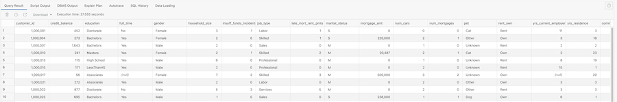
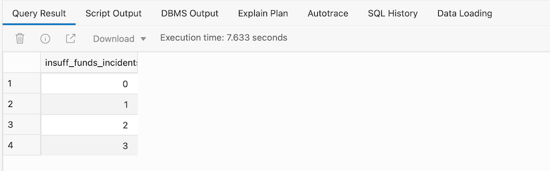
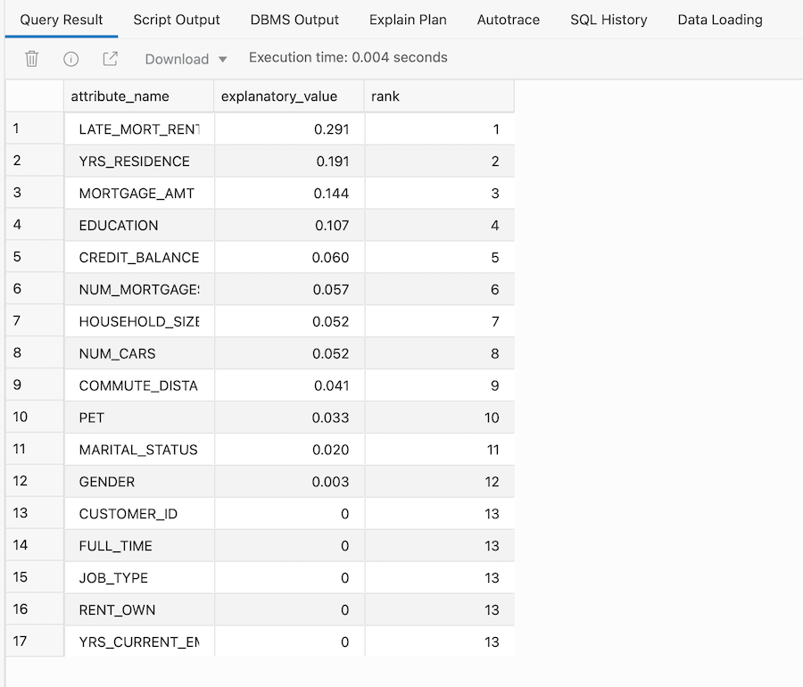
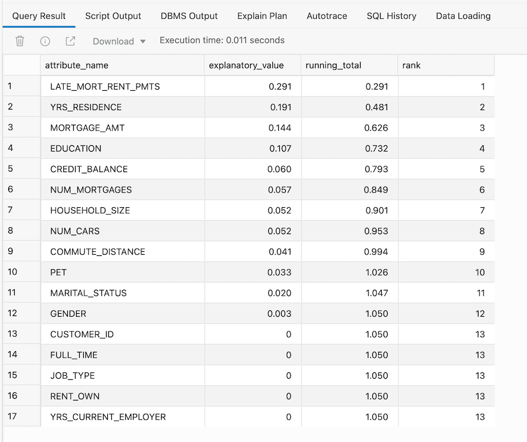

# Apply machine learning to customer demographics

## Introduction

Autonomous Data Warehouse has built-in machine learning algorithms. The aim of this lab is to give a simple introduction into using machine learning models to solve common business problems. There are many other workshops in LiveLabs that will help you explore machine learning in more detail: [see these workshops](https://livelabs.oracle.com/pls/apex/dbpm/r/livelabs/livelabs-workshop-cards?c=y&p100_focus_area=27&p100_product=131).

Estimated Lab Time: 10 minutes

### Objectives

- Learn how to use the  `DBMS_PREDICTIVE_ANALYTICS.EXPLAIN` procedure

- Learn how to interpret the results that are automatically generated

### Prerequisites
- This lab requires completion of the previous labs in the Contents menu on the left.
- You can complete the prerequisite labs in two ways:

    a. Manually run through the labs.

    b. Provision your Autonomous Database and then go to the **Initializing Labs** section in the contents menu on the left. Initialize Labs will create the MOVIESTREAM user plus the required database objects.

### Overview

Autonomous Data Warehouse has built-in machine learning algorithms. There is a separate workshop that can guide you through creating machine learning models to solve common business problems. In this short lab, the goal is to use one of these built-in algorithms to help us understand the demographic factors that can explain why a customer triggers an "insufficient funds" event against their account. If we can find a way to identify the key demographic attributes associated with this type of event, we can target customers to help them better manage their account and therefore have a better experience on MovieStream.

To do this analysis, we are going to use a package called **`DBMS_PREDICTIVE_ANALYTICS`**. This package has routines that perform an automated form of machine learning known as **predictive analytics**. With predictive analytics, we do not need to be aware of typical machine learning steps such as model building or model scoring. All machine learning activities are handled internally by the procedure. This makes it very easy for everyone to benefit from the power of machine learning-driven analytics.

In this example we are going to use the EXPLAIN procedure to identifies the attributes that are important in explaining the variation in values of a target column. Our input data contains some records where the target value is known (not NULL) and also unknown (NULL). The records where the target value is known are used by the procedure to train a model that calculates the attribute importance. The EXPLAIN procedure creates a result table that lists the attributes in order of their explanatory power.

## Task 1: Prepare our customer data set

1. The firsts step is to create a view which summarizes the main customer demographic attributes. This means removing the time attributes, transaction attributes and movie attributes from our movie sales data. Copy and paste the following code into the SQL worksheet window:

    ```
    <copy>CREATE OR REPLACE VIEW vw_cust_funds AS
    SELECT DISTINCT
    m.customer_id,
    c.credit_balance,
    c.education,
    c.full_time,
    c.gender,
    c.household_size,
    c.insuff_funds_incidents,
    c.job_type,
    c.late_mort_rent_pmts,
    c.marital_status,
    c.mortgage_amt,
    c.num_cars,
    c.num_mortgages,
    c.pet,
    c.rent_own,
    c.yrs_current_employer,
    c.yrs_residence,
    c.commute_distance
    FROM vw_movie_sales_fact m, customer c
    WHERE m.customer_id = c.cust_id;
    </copy>
    ```

2. You should get a message in the log window saying "View VW\_CUST\_FUNDS created." Check the number of rows returned by the above query/view, by running the following query, which should show that there are 4,845 unique customers:

    ```
    <copy>SELECT COUNT(*) FROM vw_cust_funds;</copy>
    ```

    You should see that there are 148,129 unique customer rows.

3. What does the data set in our table actually look like? Let's run another simple query:

    ```
    <copy>SELECT *
    FROM vw_cust_funds
    ORDER BY 1;</copy>
    ```

4. This will return something like the following output:

    

    > **Note:** Unlike the movie sales data, we now have a single row per customer and you can see that in the column **insufficient\_funds\_incidents** there are single numeric values determining the status of this column.

5. Run the following query to show that the column has only four values:

    ```
    <copy>SELECT
    DISTINCT insuff_funds_incidents
    FROM vw_cust_funds
    order by 1;</copy>
    ```

    

    Obviously we are interested in all the values in this column, not just the non-zero values. From a machine learning perspective, it is important for this type of analysis to have situations where an event did occur, as well as situations where an event does not occur - we need data to cover both sides of the story. Now that we know we have the right data set in place, we can proceed to building our model.

## Task 2: Build the model

### Overview

In this case, we will use the **EXPLAIN** procedure to help us understand which demographic attributes can explain the likelihood of a customer incurring an insufficient funds event. The EXPLAIN procedure uses an Attribute importance that computes a Minimum Description Length algorithm to determine the relative importance of attributes in predicting the column to be explained.

To run this analysis we need to provide the following information:

- Name of the input table - our customer demographic view

- Name of the column to be explained - the column for insufficient funds events

- Name of the output table - this gets created automatically by the procedure so just needs a name of table that doesn't exist

> **Note:**  The input table contains the column `CUSTOMER_ID` to make the data easier to validate once we get a final result. However, under normal circumstances this column would not be included as an input to the machine learning model, since every row is unique. Fortunately, the machine learning features in Autonomous Data Warehouse are smart enough to automatically ignore these types of columns and focus on the other more "interesting" columns.

1. Now that we understand the required inputs, let's run the model:

    ```
    <copy>EXEC DBMS_PREDICTIVE_ANALYTICS.EXPLAIN('vw_cust_funds', 'insuff_funds_incidents', 'customer_explain_result');</copy>
    ```

2. The package will return a "PL/SQL procedure successfully completed" message to the log window once it has finished processing.

## Task 3: Review the output

1. To view the results from our model, we simply need to view the result table: customer\_explain\_result:

    ```
    <copy>SELECT
    attribute_name,
    explanatory_value,
    rank
    FROM customer_explain_result;</copy>
    ```

2. This should return the following results:

    

What do the above columns mean?

### Explanatory value

This column contains a value that indicates how useful the column is for determining the value of the explained column (insufficient funds). Higher values indicate greater explanatory power. Value can range from 0 to 1.

An individual column's explanatory value is independent of other columns in the input table. The values are based on how strong each individual column correlates with the explained column. The value is affected by the number of records in the input table, and the relations of the values of the column to the values of the explain column.

An explanatory power value of 0 implies there is no useful correlation between the column's values and the explain column's values. An explanatory power of 1 implies perfect correlation; such columns should be eliminated from consideration for PREDICT. In practice, an explanatory power equal to 1 is rarely returned.

### Rank

Simply shows the ranking of explanatory power. Rows with equal values for explanatory_value have the same rank. Rank values are not skipped in the event of ties.

## Task 4: Interpret the results

1. Let's use some of the techniques from earlier parts of this workshop to enhance the output:

    ```
    <copy>SELECT
    attribute_name,
    round(explanatory_value, 6) explanatory_value,
    round(sum(explanatory_value) over (order BY rank), 4) running_total,
    rank
    FROM customer_explain_result
    ORDER BY RANK;</copy>
    ```

2. The output from the above query should look something like this:

    

What do the results tell us? An explanatory value of 0 implies there is no useful correlation between the column's values and the explain column's values which in this case is *insufficient funds*. An explanatory power of 1 implies perfect correlation in terms of explaining situations where insufficient funds occur.

The above results tell us that to understand why an insufficient funds event occurs, we need to examine the occurrence of late mortgage payments by a customer, their years residence, mortgage amount and education. Note that the analysis doesn't focus on specific attribute values. The analysis shows that by using the top four attributes we could get a better understanding of why an insufficient funds event occurs.

Conversely, we can say that demographic attributes such as job\_type, marital\_status and renting or owning a property have little to no impact on whether a customer is likely to incur an insufficient funds event.

## Recap

This lab has introduced you to the built-in capabilities of machine learning within Autonomous Data Warehouse. There are additional workshops in this series that will take you deeper into these unique capabilities.

Within this lab we examined:

- How to use the `DBMS_PREDICTIVE_ANALYTICS.EXPLAIN` procedure and how to interpret the results that are automatically generated.
- How this built-in feature helps us understand the demographic factors that can explain why a customer might trigger an "insufficient funds" event.

Now that we identified these key demographic attributes, we can do more analysis using SQL to go deeper. This type of analysis can enable us to identify and guide customers in better ways to manage their account and, therefore, have a better experience on our MovieStream platform.

Please *proceed to the next lab*.

## **Acknowledgements**

- **Author** - Keith Laker, Oracle Autonomous Database Product Management
- **Adapted for Cloud by** - Richard Green, Principal Developer, Database User Assistance
- **Last Updated By/Date** - Keith Laker, August 2021
