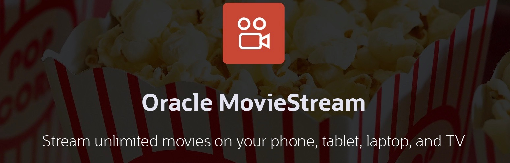

# Introduction

## About this Workshop

#### Video Preview

Most workshops focus on teaching you about a cloud service or performing a series of tasks. This workshop is different. You will learn how to deliver high value solutions using Oracle Cloud data platform services. And, the workshop will do this in the context of a company that we all can relate to and understand.

There are two versions of this workshop:
* [**Produce Your Company's Best Picture with Converged Database Analytics (Epic)**](https://apexapps.oracle.com/pls/apex/dbpm/r/livelabs/view-workshop?wid=865&clear=180&session=12485882445561) - dives into details of setting up the solution and analyzing data. Will take several hours to complete.
* **Produce Your Company's Best Picture with Converged Database Analytics** - this workshop!  A one hour version that performs much of the setup for you.

<if type="odbw">If you would like to watch us do the workshop, click [here](https://youtu.be/z2Er2yTP2BU).</if>

There are also other workshops that focus on specific feature areas that also use the same business scenario.

Oracle MovieStream is a fictitious movie streaming service - similar to those that you currently subscribe to. They face challenges that are typical to many organizations across industries. MovieStream must:
* Gain a better understanding of their customers to ensure that they love the service  
* Offer the right products to the right customers at the right price  
* Grow the business to become a dominant player in the streaming business
* and much, much more

Oracle Cloud provides an amazing platform to productively deliver secure, insightful, scalable and performant solutions. MovieStream designed their solution leveraging the world class Oracle Autonomous Database and Oracle Cloud Infrastructure (OCI) Data Lake services. Their data architecture is following the Oracle Reference Architecture [Enterprise Data Warehousing - an Integrated Data Lake](https://docs.oracle.com/en/solutions/oci-curated-analysis/index.html#GUID-7FF7A024-5EB0-414B-A1A5-4718929DC7F2) - which is used by Oracle customers around the world. It's worthwhile to review the architecture so you can understand the value of integrating the data lake and data warehouse - as it enables you to answer more complex questions using all your data.

In this workshop, we'll start with two key components of MovieStream's architecture. MovieStream is storing their data across Oracle Object Storage and Autonomous Database. Data is captured from various sources into a landing zone in object storage. This data is then processed (cleansed, transformed and optimized) and stored in a gold zone on object storage. Once the data is curated, it is loaded into an Autonomous Database where it is analyzed by many (and varied) members of the user community.

You will learn how they built their solution and performed sophisticated analytics through a series of labs that highlight the following:

### Objectives
* Deploy an Autonomous Database instance
* Integrate Autonomous Database with the Data Lake
* Use advanced SQL to uncover issues and possibilities
* Predict customer churn using Machine Learning
* Use spatial analyses to help provide localized promotions
* Offer recommendations based on graph relationships

### What's next
The workshop will continue to evolve and highlight more capabilities that will has allowed MovieStream to improve their operations and profitability. Keep an eye on this space!

## Learn more

* [Enterprise Data Warehousing - an Integrated Data Lake](https://docs.oracle.com/en/solutions/oci-curated-analysis/index.html#GUID-7FF7A024-5EB0-414B-A1A5-4718929DC7F2)
* [Autonomous Database Workshops](https://apexapps.oracle.com/pls/apex/dbpm/r/livelabs/livelabs-workshop-cards?p100_product=82&me=65&clear=100)
*[Autonomous Database web site](https://www.oracle.com/autonomous-database/)
* [Autonmous Data Warehouse Videos](https://docs.oracle.com/en/cloud/paas/autonomous-data-warehouse-cloud/videos.html)

## Acknowledgements
* **Author** - Marty Gubar, Product Manager
* **Last Updated By/Date** - Richard Green, Database User Assistance, November 2021

Data about movies in this workshop were sourced from **Wikipedia**.

Copyright (C)  Oracle Corporation.

Permission is granted to copy, distribute and/or modify this document
under the terms of the GNU Free Documentation License, Version 1.3
or any later version published by the Free Software Foundation;
with no Invariant Sections, no Front-Cover Texts, and no Back-Cover Texts.
A copy of the license is included in the section entitled [GNU Free Documentation License](files/gnu-free-documentation-license.txt)
