# Load data with an AI Assist

## Introduction
Autonomous Database provides the Data Studio tools for integrating and analyzing data. One really interesting capability is the ability to derive meaning from text data. MovieStream collects customer feedback, let's now find out what people are talking about!

In this lab, you will load user comments from an object storage bucket and derive both sentiment and key phrases from text. Sentiment and key phrases are derived using Data Studio's built-in integration with OCI Language Service.

### Objectives

- Load data from Oracle Object Storage
- Use Data Studio's integration with OCI Language Service to automatically derive sentiment and key phrases 


### Prerequisites
- This lab requires completion of Lab 1 in the Contents menu on the left.

## Task 1: Go to the Data Studio database tool
1. If you are not already in the Database Tools, navigate to it using the steps from [Lab 2, Task 1](/adb/movie-stream-story-lite/workshops/tenancy/index.html?lab=query-with-sql#Task1:LogintotheSQLWorksheet). Make sure you are logged in as the **MOVIESTREAM** user.

2. Click the top left hamburger menu and select **Data Studio -> Data Load**
    
    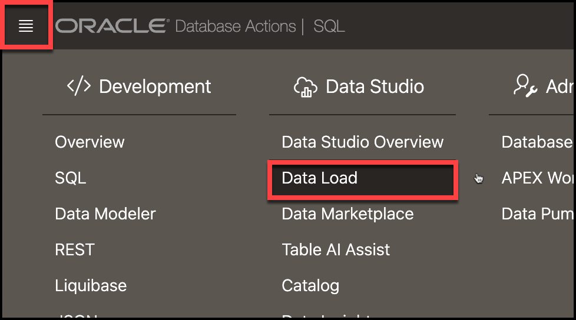

## Task 2: Set up Data Studio to use OCI Language Services
Configure access to OCI Language Services. 
1. Go to Data Studio Settings by clicking the **Settings** tab on the bottom left of the Data Load page

    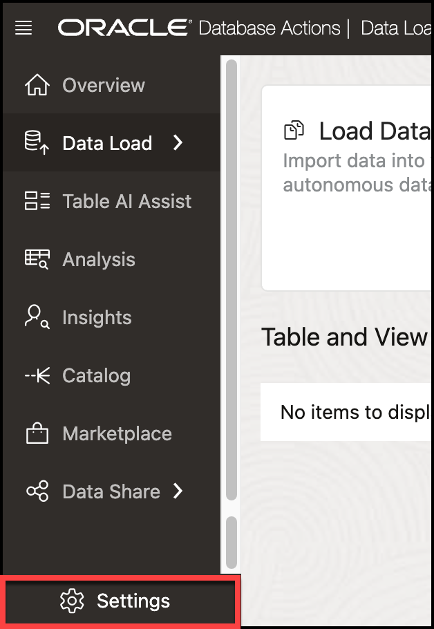

2. Go to the **Cloud Services** tab. Ensure the **OCI Credential** is set to `OCI$RESOURCE_PRINCIPAL` and the **Cloud Service Provider for AI** is set to `Oracle Cloud Infrastructure (OCI)`:
    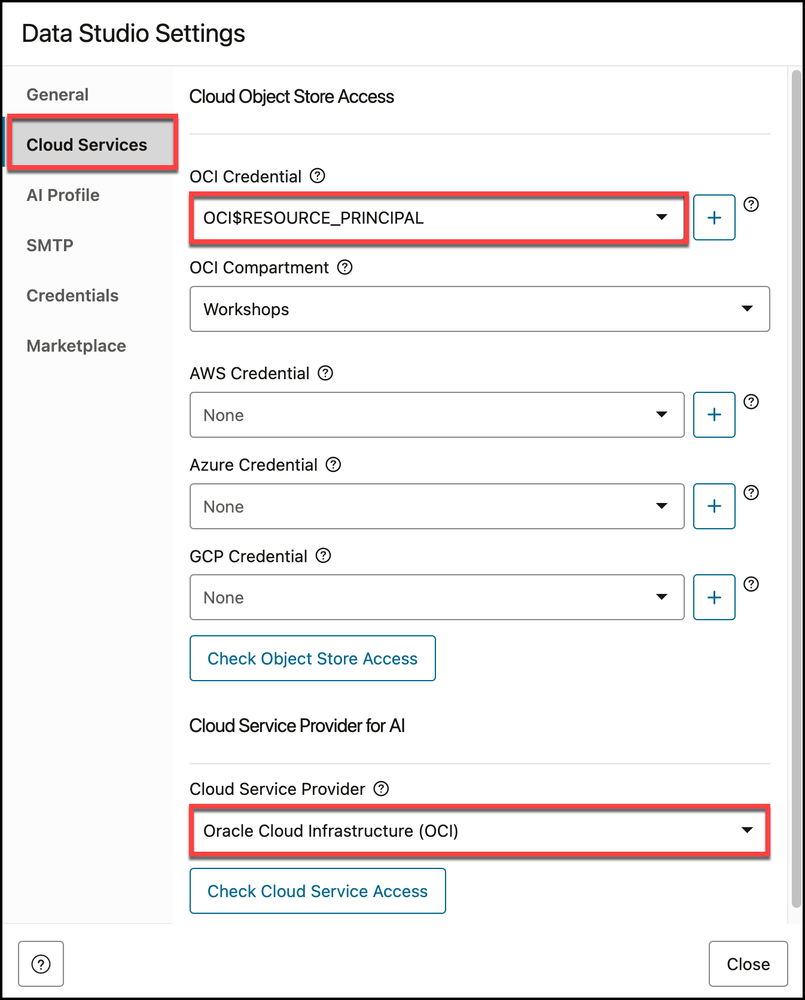

3. Go to the **AI Profile** tab and select **AI Profile** `MOVIESTREAM_ANALYTICS`. Then, click **Close**.
    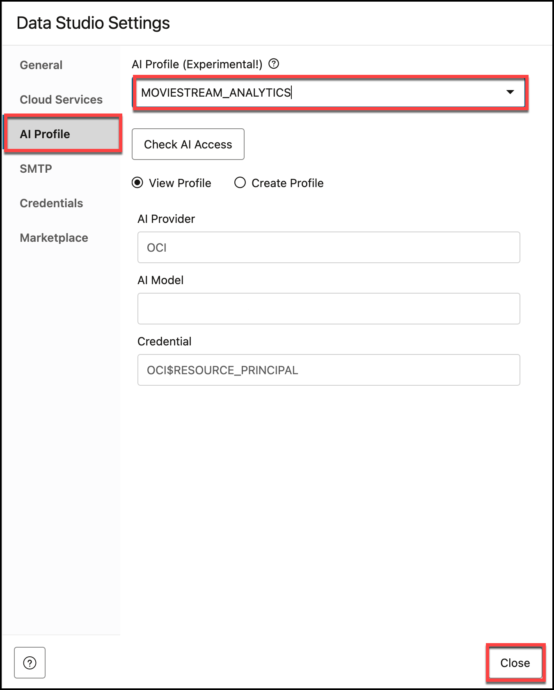

## Task 3: Load comment data from OCI Object Storage
Use the Data Studio Data Load tool to create a table and import comment data from an object storage bucket. As part of the import process, both sentiment and key phrases will be derived from the comment field.
1. From the **Data Load** home, click **Load Data**:
    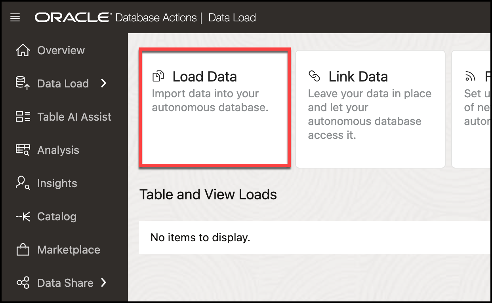

2. The data is sourced in an OCI Object Storage bucket. Click tab **Cloud Store**:
    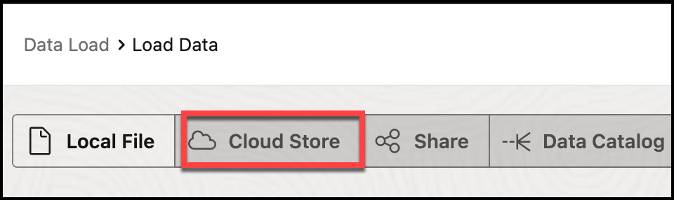

3. Specify the following bucket as the Cloud Store Location. Copy/paste the URL into the location field and hit **Enter**:

    ```
    <copy>
    https://objectstorage.us-ashburn-1.oraclecloud.com/n/c4u04/b/moviestream_landing/o
    </copy>
    ```
    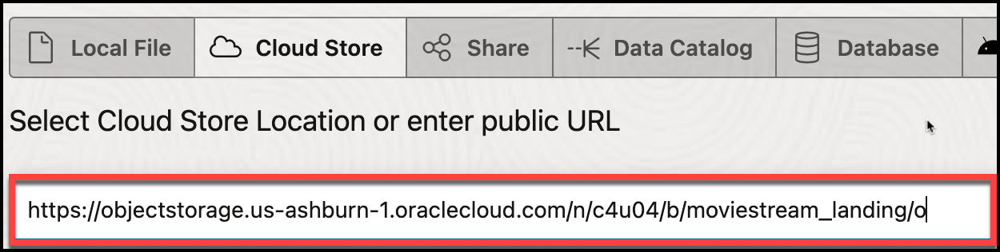

4. You will see a list of object storage folders. Select **customer_feedback** and drag it to the loading area. Click **Yes** when asked to **Load to Single Target Table**:
    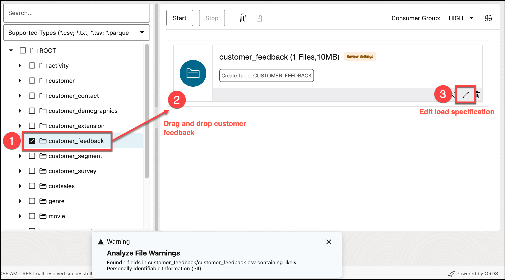


    Notice that a warning appeared indicating that Data Studio detected the file likely contains **Personally Identifiable Information**.

5. Click the pencil icon (see **3** above) to edit the data load specification. Notice the loader is going to create a new table called `Customer Feedback`:
    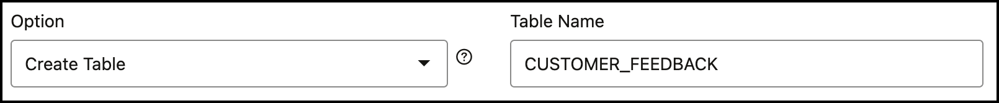

6. You can see the column mappings at the bottom. Expand the **Mapping** section to see all the columns:
    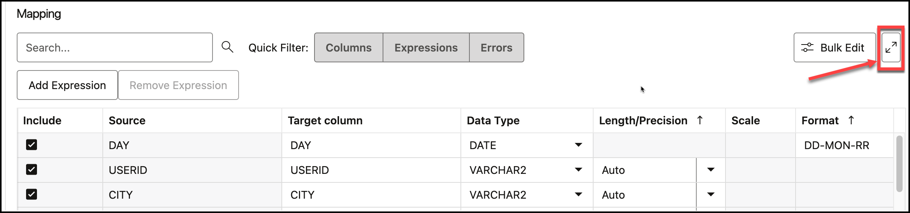

7. Add a sentiment expression. Click **Add Expression**
    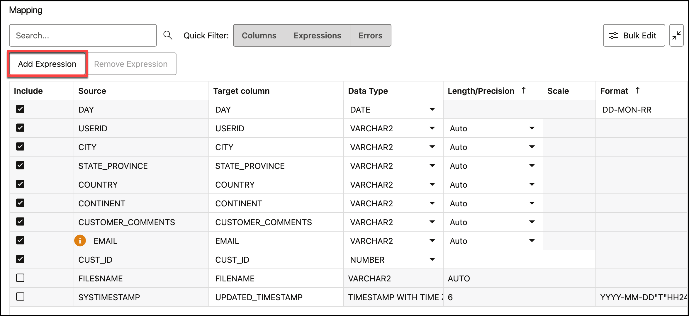

    - Select **Sentiment Analysis** as the **Expression Type**. 
    - Select **CUSTOMER_COMMENTS** as the **Input Column**
    - Name the new **Target column** `SENTIMENT`

    The completed dialog should look like the following:
    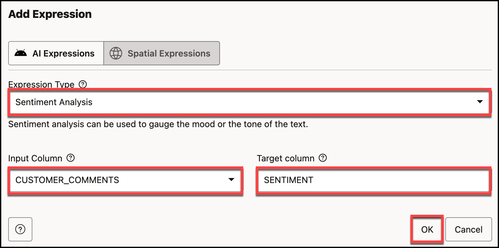

    Click **OK** when complete.

8. Add a second key phrase extraction expression. Click **Add Expression**
    

    - Select **Key Phrase Extraction** as the **Expression Type**. 
    - Select **CUSTOMER_COMMENTS** as the **Input Column**
    - Name the new **Target column** `KEY_PHRASES`

    The completed dialog should look like the following:
    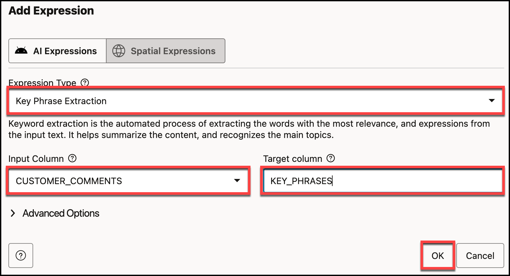

    Click **OK** when complete.

9. Close the data loading specification and start the import by clicking the **Start** button. Click **Run** when prompted:
    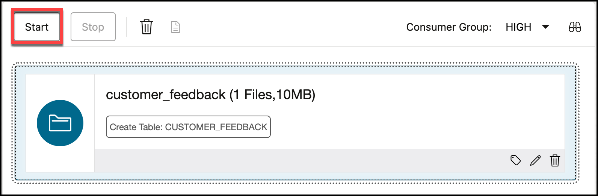

## Task 4: What do people think of our service?
We can now find out what people are talking about. What parts of our service are receiving postive reviews? And, what needs some work?

1. You will see a list of jobs in the Data Load page. After the CUSTOMER_FEEDBACK data load is complete, click the Query button to see the results:
    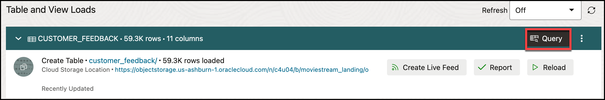

2. The report shows all the customer comments, derived sentiment and key phrases. Scroll to the right to see the data:
    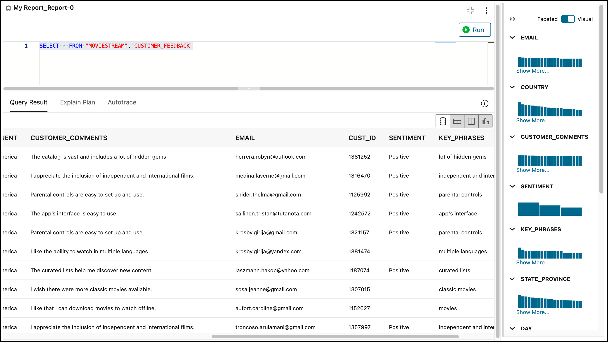   

3. Let's start with the good news. What do people like about our service? Let's find the top 10 items. Update the query in the report with the following and then click **Run**:
    ```
    <copy>
    SELECT 
        key_phrases,
        count(*) as number_comments
    FROM "MOVIESTREAM"."CUSTOMER_FEEDBACK"
    WHERE sentiment = 'Positive'
    GROUP BY key_phrases
    ORDER BY number_comments desc
    FETCH FIRST 10 ROWS ONLY;
    </copy>
    ```
    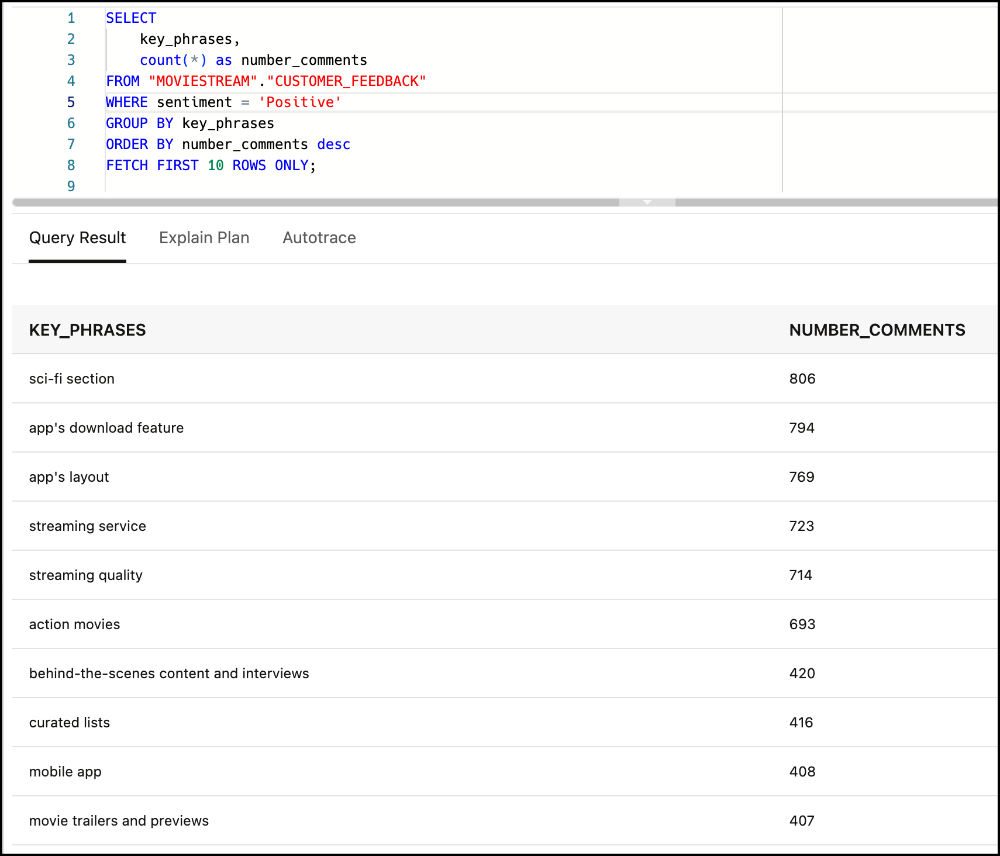

4. Now let's find what we need to work on. Update the query in the report with the following and then click **Run**:
    ```
    <copy>
    SELECT 
        key_phrases,
        count(*) as number_comments
    FROM "MOVIESTREAM"."CUSTOMER_FEEDBACK"
    WHERE sentiment = 'Negative'
    GROUP BY key_phrases
    ORDER BY number_comments desc
    FETCH FIRST 10 ROWS ONLY;
    </copy>
    ```
    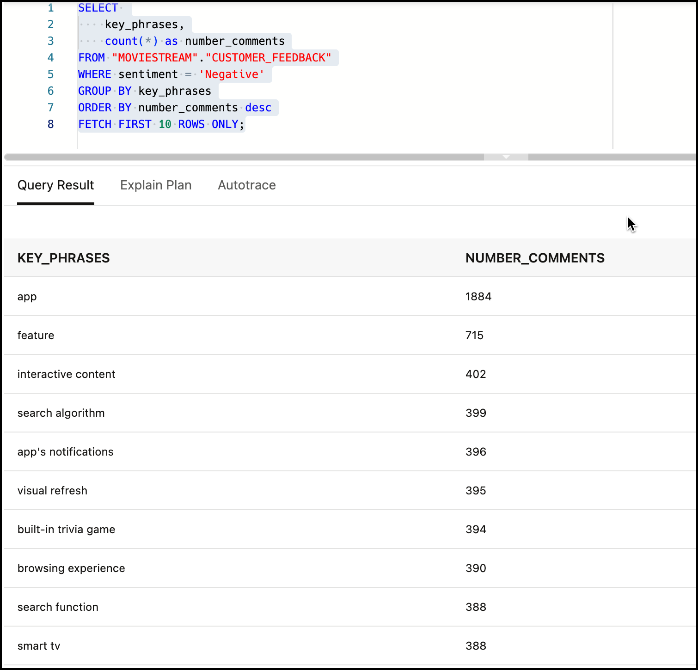

## Acknowledgements
  * **Authors:** 
    * Marty Gubar, Product Management
* **Last Updated By/Date:** Marty Gubar, April 2025

Data about movies in this workshop were sourced from **Wikipedia**.

Copyright (c) 2025 Oracle Corporation.